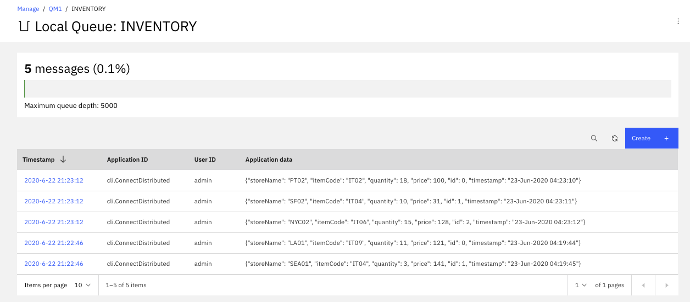
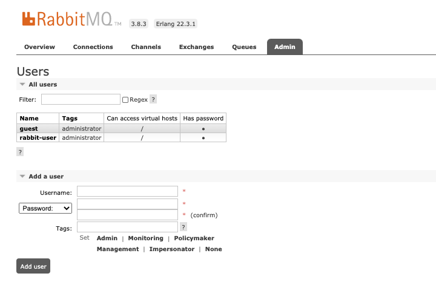
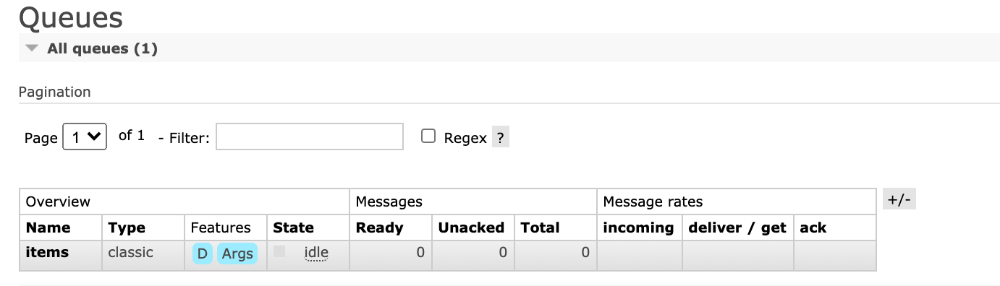
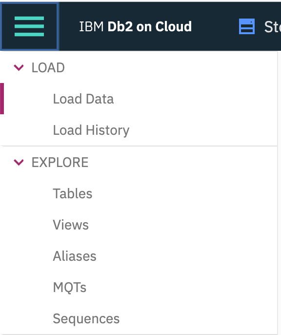
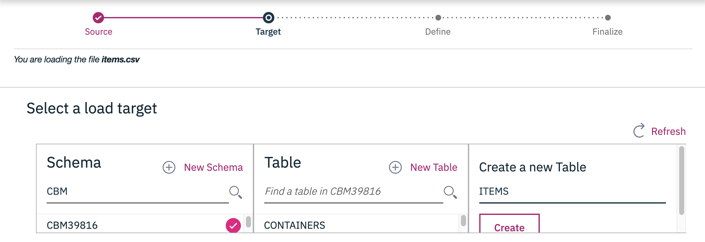
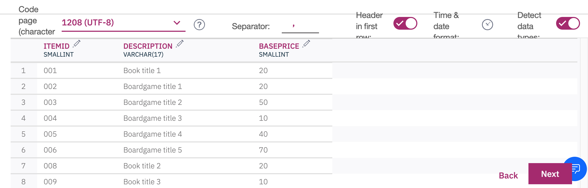
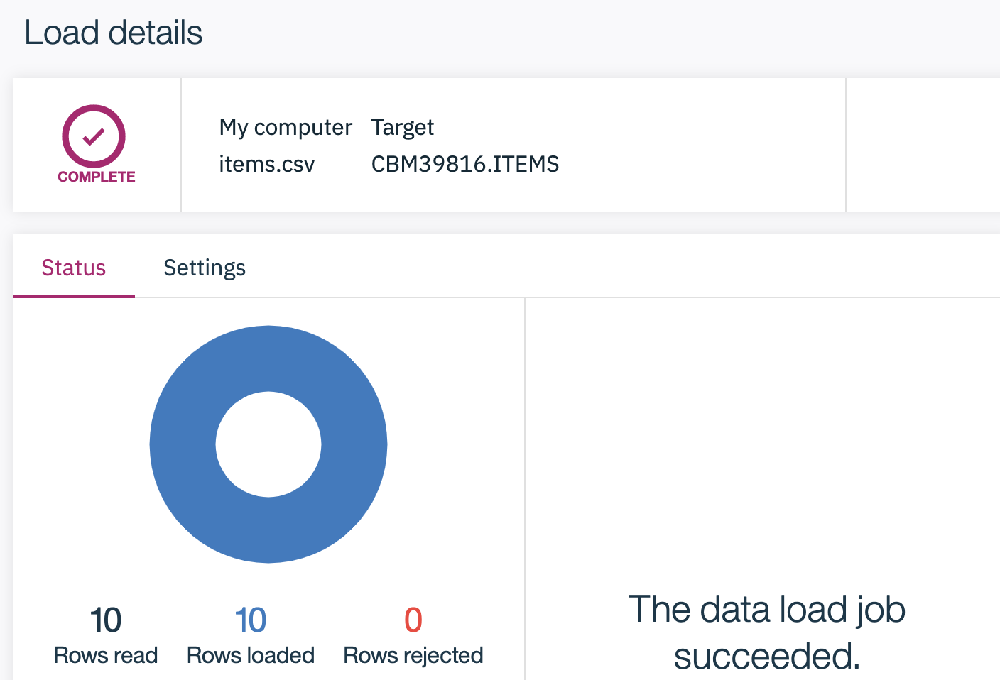

  
<AnchorLinks>
  <AnchorLink>Overview</AnchorLink>
  <AnchorLink>Solution anatomy</AnchorLink>
  <AnchorLink>General pre-requisites</AnchorLink>
  <AnchorLink>Scenario setup</AnchorLink>
  <AnchorLink>Scenario 1: Event Streams on Cloud to MQ on premise via MQ connector sink</AnchorLink>
  <AnchorLink>Scenario 2: Deploying Kafka Connector MQ Sink to OpenShift</AnchorLink>
  <AnchorLink>Scenario 3: Rabbitmq on premise to Event Streams on Cloud via RabbitMQ connector source</AnchorLink>
  <AnchorLink>Scenario 4: Event Streams on Cloud to DB2 on premise via JDBC Sink connector</AnchorLink>
 </AnchorLinks>

## Overview

This lab will address multiple scenarios that aim to build an end to end data pipeline, as depicted by the following figure, using Event Streams on Cloud. At the high level Kafka connect is used to integrate external systems into the Kafka ecosystem. For example external system can inject message to queue manager, from which a first Kafka source connector will get the message to a Kafka topic, which then will be processed by a series of event driven microservices down to a final topic, that will be use by Sink connectors.


To support this lab we are reusing a classical business use case where stores are sending their transactions to a central messaging platform, based on queues, and with the adoption of loosely coupled microservice, real time analytics and complex event processing, Kafka is added to the legacy environment. Adopting Kafka connect lets integrate with existing applications without any changes.

## Solution anatomy

The lab is divided into scenarios that can be combined to support the real time inventory data pipeline as illustrated in the figure below:


1. The store application, is a Quarkus based app, generating item sales to RabbitMQ `items` queue. The code of this application is under the `store-sale-producer` folder, in the [lab repository](https://github.com/jbcodeforce/eda-kconnect-lab/). We will address how to get this code in the pre-requisite section.

    * RabbitMQ runs in docker image started locally via docker compose. The messages are in the `items` queue.
    * The lab, focusing on the injection to Kafka, is documented in the [scenario 2](#scenario-2:-rabbitmq-on-premise-to-event-streams-on-cloud-via-rabbitmq-connector-source).
    * [A] The Sink connector description is in the [kconnect](https://github.com/jbcodeforce/eda-kconnect-lab/tree/master/kconnect) folder.
    * Kafka backbone is Event Streams on Cloud.
1. The inventory MS is a Kafka Stream application, done with Reactive Messaging and Kafka Stream API. The folder is
For example the scenario illustrate JDBC Sink connector to save to existing data base.
1. The mock up Inventory mainframe application is not implemented and we will use the MQ tools to view the message in the `inventory` queue

    * The MQ Sink connector [B] configuration is defined in the [kconnect](https://github.com/jbcodeforce/eda-kconnect-lab/tree/master/kconnect) folder.
    * MQ broker runs in docker container started with docker-compose
    * The lab scenario is [the number 1](#scenario-1:-event-streams-on-cloud-to-mq-on-premise-via-mq-connector-sink)
1. The Inventory Application, using DB2 as datasource is a quarkus app using hibernate with panache, defined in the [nventory-app](https://github.com/jbcodeforce/eda-kconnect-lab/tree/master/inventory-app) folder

    * The JDBC Sink connector [C] configuration is defined in the [kconnect](https://github.com/jbcodeforce/eda-kconnect-lab/tree/master/kconnect) folder.
    * The [scenario 3](#scenario-3:-event-streams-on-cloud-to-db2-on-premise-via-jdbc-sink-connector) lab goes over how the Kafka Connect JDBC sink works.
1. The [scenario 4](#scenario-4:-run-the-solution-components-end-to-end-on-kubernetes) addresses the end to end solution, which is basically an end to end demonstration of a simple data pipeline for a real time view of an inventory solution.

<InlineNotification kind="info">You need to decide what your 'on-premise' environment is for this lab. You can run with docker compose, or deploy on a premise cluster. We propose to run the components with docker compose for the scenario 1,2,3 and scenario 4 is for a deployment of the components on a kubernetes cluster that could run on premise or on any cloud provider using Openshift. If you do not want to build all the components, we have each of them available in docker hub and the docker compose file should run them automatically.
</InlineNotification>

## General pre-requisites

We need the following IBM Cloud services created and tools to run the lab. We try to use docker images as much as possible to do not impact your local laptop.

* [Docker](https://docs.docker.com/) and docker compose to run the solution locally.
* Event Streams instance, may be reuse the one created in [this lab](/technology/event-streams/es-cloud/).
* [IBM Cloud CLI](https://cloud.ibm.com/docs/cli?topic=cli-getting-started).
* If you want to run locally you need to get [docker compose](https://docs.docker.com/compose/).
* [git CLI](https://git-scm.com/downloads).
* [Maven](https://maven.apache.org/install.html).

For the on-premise environment, we will not use VMs, but simply run some of the components on IBM premise Service platform or Openshift. The point is that the workload is packaged as container images and can run anywhere.

## Scenario setup

1. Login to the cloud via CLI: `ibmcloud login`
1. Initialize the Event Streams CLI and select the target Event Streams cluster: `ibmcloud es init`
1. Define connect topics: When running in distributed mode, the connectors need three topics as presented in the `create topics` table [here](https://ibm.github.io/event-streams/connecting/setting-up-connectors/).

    * **connect-configs**: This topic will store the connector and task configurations.
    * **connect-offsets**: This topic is used to store offsets for Kafka Connect.
    * **connect-status**: This topic will store status updates of connectors and tasks.

    Using IBM Event Streams CLI, the topics are created via the commands like:

    ```shell
    # log to the kubernetes cluster:
    ibmcloud login -a https://icp-console.apps.green.ocp.csplab.local
    # initialize the event streams CLI plugin
    ibmcloud es init
    # Create the Kafka topics for Kafka connect
    ibmcloud es topic-create -n connect-configs -p 1 -r 3 -c cleanup.policy=compact
    ibmcloud es topic-create -n connect-offsets -p 25 -r 3 -c cleanup.policy=compact
    ibmcloud es topic-create -n connect-status -p 5 -r 3 -c cleanup.policy=compact
    # Create the topic for the scenarios
    ibmcloud es topic-create inventory
    ibmcloud es topic-create items
    ibmcloud es topics
    ```
1. Create API KEY with a manager-level access.
1. Clone the lab repository: `git clone https://github.com/jbcodeforce/eda-kconnect-lab && cd eda-kconnect-lab`.
1. Prepare the script to set the environment variables used by all the components of the solution, like the Kafka broker URLs and APIKEy.

    * First rename the `scripts/setenv-TMP.sh` to `scripts/setenv.sh`
    * Then modify the KAFKA_BROKERS and KAFKA_APIKEY with the respecting values as defined in the Event Streams credentials.

  ```json
  {
    "api_key": "bA ... Qp",
    "apikey": "bA ... Qp",
    "iam_apikey_description": "Auto-generated for key 4d ... c6",
    "iam_apikey_name": "es-mgr-creds",
    "iam_role_crn": "crn:v1:bluemix:public:iam::::serviceRole:Manager",
    "iam_serviceid_crn": "crn:v1:bluemix:public:iam-identity::a/db ... f2::serviceid:ServiceId-7a ... 6d",
    "instance_id": "29 ... 15",
    "kafka_admin_url": "https://70 ... 1g.svc01.us-east.eventstreams.cloud.ibm.com",
    "kafka_brokers_sasl": [
      "broker-1- ... kafka.svc01.us-east.eventstreams.cloud.ibm.com:9093",
      "broker-0- ... kafka.svc01.us-east.eventstreams.cloud.ibm.com:9093",
      "broker-4- ... kafka.svc01.us-east.eventstreams.cloud.ibm.com:9093",
      "broker-2- ... kafka.svc01.us-east.eventstreams.cloud.ibm.com:9093",
      "broker-5- ... kafka.svc01.us-east.eventstreams.cloud.ibm.com:9093",
      "broker-3- ... kafka.svc01.us-east.eventstreams.cloud.ibm.com:9093"
    ],
    "kafka_http_url": "https://70 ... 1g.svc01.us-east.eventstreams.cloud.ibm.com",
    "password": "bA ... Qp",
    "user": "token"
  }
  ```

1. Prepare the Kafka Connect environment, as we need to use three connectors. Therefore we need to clone the source, build and get the jars file in the connectors. In fact we have developed scripts to automate those tedious steps:

  * Under the `kconnect` folder run `./setupConnectors.sh` script and get the three connectors downloaded and built.
  * Build a docker image for the connector: this is also done by running a second script: `./createOrStartKconnect.sh build`.

<InlineNotification kind="info">You need to decide what 'on-premise' environment is for this lab. You can run with docker compose, or deploy on a premise cluster. We propose to run the components with docker compose for the scenario 1,2,3 and do a deployment of the components on premise as a service on scenario 4.
</InlineNotification>

## Scenario 1: Event Streams on Cloud to MQ on premise via MQ connector sink

This scenario uses the [IBM Kafka Connect sink connector for IBM MQ](https://github.com/ibm-messaging/kafka-connect-mq-sink) to pull streaming data into a local MQ queue.  In this example we are using IBM Event Streams on IBM Cloud as the Kafka data source and a dockerized instance of MQ as the destination. We could have used MQ broker as part of Cloud Pak for integration or [as a service in IBM Cloud](https://cloud.ibm.com/docs/mqcloud/index.html).

### Pre-requisites

We assume that you have an instance of Event Streams already running on IBM Cloud with at least on manager-level credentials created.  The credentials will come in the form of a JSON document as seen in the previous section.
You will need the `kafka_brokers_sasl` and `password` atribute to configure the sink connector.

This scenario uses the `inventory` topic created in the Scenario Setup in previous section.

### Create Local IBM MQ Instance

Here we will use Docker to create a local MQ instance.  First create a data directory to mount in the container.

`mkdir qm1data`

Then create the container.

```shell
docker run                     \
  --name mq                    \
  --detach                     \
  --publish 1414:1414          \
  --publish 9443:9443          \
  --publish 9157:9157          \
  --volume qm1data:/mnt/mqm    \
  --env LICENSE=accept         \
  --env MQ_QMGR_NAME=QM1       \
  --env MQ_APP_PASSWORD=admin  \
  --env MQ_ENABLE_METRICS=true \
  ibmcom/mq
```

You should be able to log into the MQ server on port 9443 with default user `admin` and password `passw0rd`.

Connect to the running MQ instance to create a Channel and Queue as described on the [Using IBM MQ with Kafka Connect](https://github.com/ibm-messaging/kafka-connect-mq-sink/blob/master/UsingMQwithKafkaConnect.md) page.

```shell
docker exec -ti mq bash
strmqm QM1
runmqsc QM1
DEFINE CHANNEL(KAFKA.CHANNEL) CHLTYPE(SVRCONN)
SET CHLAUTH(KAFKA.CHANNEL) TYPE(BLOCKUSER) USERLIST('nobody')
SET CHLAUTH('*') TYPE(ADDRESSMAP) ADDRESS('*') USERSRC(NOACCESS)
SET CHLAUTH(KAFKA.CHANNEL) TYPE(ADDRESSMAP) ADDRESS('*') USERSRC(CHANNEL) CHCKCLNT(REQUIRED)
ALTER AUTHINFO(SYSTEM.DEFAULT.AUTHINFO.IDPWOS) AUTHTYPE(IDPWOS) ADOPTCTX(YES)
REFRESH SECURITY TYPE(CONNAUTH)
DEFINE QLOCAL(INVENTORY)
SET AUTHREC OBJTYPE(QMGR) PRINCIPAL('admin') AUTHADD(CONNECT,INQ)
SET AUTHREC PROFILE(INVENTORY) OBJTYPE(QUEUE) PRINCIPAL('admin') AUTHADD(ALLMQI)
END
```

Exit the session and continue on to create the MQ Connector Sink.

### Create MQ Kafka Connector Sink

The MQ Connector Sink can be downloaded from [Github](https://github.com/ibm-messaging/kafka-connect-mq-sink).  The Github site includes exhaustive instructions and an abridged version follows.

Clone the repository with the following command:

`git clone https://github.com/ibm-messaging/kafka-connect-mq-sink.git`

Change directory into the kafka-connect-mq-sink directory:

`cd kafka-connect-mq-sink`

Build the connector using Maven:

`mvn clean package`

Next, create a directory to contain the Kafka Connector configuration.

`mkdir config && cd config`

Create a configuration file called `connect-distributed.properties` for Kafka Connect based on the template below.

```properties
# A list of host/port pairs to use for establishing the initial connection to the Kafka cluster.
bootstrap.servers=broker-1- ... kafka.svc01.us-east.eventstreams.cloud.ibm.com:9093,broker-0- ... kafka.svc01.us-east.eventstreams.cloud.ibm.com:9093,broker-4- ... kafka.svc01.us-east.eventstreams.cloud.ibm.com:9093,broker-2- ... kafka.svc01.us-east.eventstreams.cloud.ibm.com:9093,broker-5- ... kafka.svc01.us-east.eventstreams.cloud.ibm.com:9093,broker-3- ... kafka.svc01.us-east.eventstreams.cloud.ibm.com:9093
ssl.enabled.protocols=TLSv1.2
ssl.protocol=TLS
security.protocol=SASL_SSL
sasl.mechanism=PLAIN
sasl.jaas.config=org.apache.kafka.common.security.plain.PlainLoginModule required username="token" password="bA ... Qp";

# Consumer side configuration
consumer.bootstrap.servers=broker-1- ... kafka.svc01.us-east.eventstreams.cloud.ibm.com:9093,broker-0- ... kafka.svc01.us-east.eventstreams.cloud.ibm.com:9093,broker-4- ... kafka.svc01.us-east.eventstreams.cloud.ibm.com:9093,broker-2- ... kafka.svc01.us-east.eventstreams.cloud.ibm.com:9093,broker-5- ... kafka.svc01.us-east.eventstreams.cloud.ibm.com:9093,broker-3- ... kafka.svc01.us-east.eventstreams.cloud.ibm.com:9093
consumer.security.protocol=SASL_SSL
consumer.ssl.protocol=TLSv1.2
consumer.sasl.mechanism=PLAIN
consumer.sasl.jaas.config=org.apache.kafka.common.security.plain.PlainLoginModule required username="token" password="bA ... Qp";

# Producer Side
producer.security.protocol=SASL_SSL
producer.ssl.protocol=TLSv1.2
producer.sasl.mechanism=PLAIN
producer.sasl.jaas.config=org.apache.kafka.common.security.plain.PlainLoginModule required username="token" password="bA ... Qp";
producer.bootstrap.servers=broker-1- ... kafka.svc01.us-east.eventstreams.cloud.ibm.com:9093,broker-0- ... kafka.svc01.us-east.eventstreams.cloud.ibm.com:9093,broker-4- ... kafka.svc01.us-east.eventstreams.cloud.ibm.com:9093,broker-2- ... kafka.svc01.us-east.eventstreams.cloud.ibm.com:9093,broker-5- ... kafka.svc01.us-east.eventstreams.cloud.ibm.com:9093,broker-3- ... kafka.svc01.us-east.eventstreams.cloud.ibm.com:9093


plugin.path=/opt/kafka/libs

# unique name for the cluster, used in forming the Connect cluster group. Note that this must not conflict with consumer group IDs
group.id=mq-sink-cluster

# The converters specify the format of data in Kafka and how to translate it into Connect data. Every Connect user will
# need to configure these based on the format they want their data in when loaded from or stored into Kafka
key.converter=org.apache.kafka.connect.json.JsonConverter
value.converter=org.apache.kafka.connect.json.JsonConverter
# Converter-specific settings can be passed in by prefixing the Converter's setting with the converter we want to apply
# it to
key.converter.schemas.enable=true
value.converter.schemas.enable=true

# Topic to use for storing offsets. T
offset.storage.topic=connect-offsets
offset.storage.replication.factor=3
#offset.storage.partitions=25

# Topic to use for storing connector and task configurations; note that this should be a single partition, highly replicated, and compacted topic.
config.storage.topic=connect-configs
config.storage.replication.factor=3

# Topic to use for storing statuses. This topic can have multiple partitions and should be replicated and compacted.
status.storage.topic=connect-status
status.storage.replication.factor=3
status.storage.partitions=5

# Flush much faster than normal, which is useful for testing/debugging
offset.flush.interval.ms=10000
```

Save this file in the `config` directory.

Next, create a log4j configuration file named `connect-log4j.properties` based on the template below.

```properties
log4j.rootLogger=DEBUG, stdout

log4j.appender.stdout=org.apache.log4j.ConsoleAppender
log4j.appender.stdout.layout=org.apache.log4j.PatternLayout
log4j.appender.stdout.layout.ConversionPattern=[%d] %p %m (%c:%L)%n

log4j.logger.org.apache.kafka=INFO
```

Save this file to the `config` directory as well.

Finally, create a JSON configuraiton file for the MQ sink.  This can be stored anywhere but it can be conveniently created in the `config` directory.  We name this file `mq-sink.json`.

```json
{
    "name": "mq-sink",
    "config":
    {
        "connector.class": "com.ibm.eventstreams.connect.mqsink.MQSinkConnector",
        "tasks.max": "1",
        "topics": "inventory",

        "key.converter": "org.apache.kafka.connect.storage.StringConverter",
        "value.converter": "org.apache.kafka.connect.storage.StringConverter",

        "mq.queue.manager": "QM1",
        "mq.connection.name.list": "mq(1414)",
        "mq.user.name": "admin",
        "mq.password": "passw0rd",
        "mq.user.authentication.mqcsp": true,
        "mq.channel.name": "KAFKA.CHANNEL",
        "mq.queue": "INVENTORY",
        "mq.message.builder": "com.ibm.eventstreams.connect.mqsink.builders.DefaultMessageBuilder"
    }
}
```

Back out one directory to the `kafka-connect-mq-sink` directory.

`cd ..`

Build docker image
`docker build -t kafkaconnect-with-mq-sink:1.3.0 .`

Finally, run the Kafka Connect MQ Sink container.

```
docker run                                 \
  --name mq-sink                           \
  --detach                                 \
  --volume $(pwd)/config:/opt/kafka/config \
  --publish 8083:8083                      \
  --link mq:mq                             \
  kafkaconnect-with-mq-sink:1.3.0
```

You should now have a working MQ sink.

As an alternate approach, when you have a Kafka Connect isntance up and running, with the dependant jar files, it is possible to configure the connector with a POST operation like:

```Shell
curl -X POST -H "Content-Type: application/json" http://localhost:8083/connectors   --data "@./mq-sink.json"

# The response returns the metadata about the connector
{"name":"mq-sink","config":{"connector.class":"com.ibm.eventstreams.connect.mqsink.MQSinkConnector","tasks.max":"1","topics":"inventory","key.converter":"org.apache.kafka.connect.storage.StringConverter","value.converter":"org.apache.kafka.connect.storage.StringConverter","mq.queue.manager":"QM1","mq.connection.name.list":"ibmmq(1414)","mq.user.name":"admin","mq.password":"passw0rd","mq.user.authentication.mqcsp":"true","mq.channel.name":"KAFKA.CHANNEL","mq.queue":"INVENTORY","mq.message.builder":"com.ibm.eventstreams.connect.mqsink.builders.DefaultMessageBuilder","name":"mq-sink"},"tasks":[{"connector":"mq-sink","task":0}],"type":"sink"}
```

Once the connector is up and running, we can use some tool to send inventory message. In the `integration-tests` folder we have some python code to produce message. If you have a python environment with kafka api you can use yours, or we have also provided a Dockerfile to prepare a local python environment, which will not impact yours.

```shell
# if you change the name of the image
docker build -t ibmcase/python37 .
# ... then update the script ./startPython.sh
./startPython.sh
# Now in the new bash session you should see ProduceInventoryEvent.py,... start it by sending 2 events
python ProduceInventoryEvent.py --size 2
# Events are random but use stores and items known by the database downstream.
 sending -> {'storeName': 'NYC01', 'itemCode': 'IT06', 'quantity': 15, 'price': 163, 'id': 1, 'timestamp': '23-Jun-2020 04:32:38'}
# the following trace demonstrates Kafka received the message
[KafkaProducer] - Message delivered to inventory [0]
sending -> {'storeName': 'SC01', 'itemCode': 'IT06', 'quantity': 15, 'price': 178, 'id': 2, 'timestamp': '23-Jun-2020 04:32:38'}
[KafkaProducer] - Message delivered to inventory [0]
```

In the Kafka Connect trace we can see:

```shell
kconnect_1  | [2020-06-23 04:23:16,270] INFO WorkerSinkTask{id=mq-sink-0} Committing offsets asynchronously using sequence number 26: {inventory-0=OffsetAndMetadata{offset=44, leaderEpoch=null, metadata=''}} (org.apache.kafka.connect.runtime.WorkerSinkTask:349)
kconnect_1  | [2020-06-23 04:32:46,382] INFO WorkerSinkTask{id=mq-sink-0} Committing offsets asynchronously using sequence number 83: {inventory-0=OffsetAndMetadata{offset=48, leaderEpoch=null, metadata=''}} (org.apache.kafka.connect.runtime.WorkerSinkTask:349)
```

And in the IBM MQ Console, under the Local Queue: Inventory we can see the messages:



To remove the connector do the following command. Do this specially if you go to scenario 2 next.

```shell
curl -X DELETE http://localhost:8083/connectors/mq-sink
```

## Scenario 2: Deploying Kafka Connector MQ Sink to OpenShift

### Prerequisites

We are assuming you already have an instance of IBM EventStreams running on IBM Cloud from previous scenarios.  Also, we assume you have a running instance of OpenShift with a project created to run the MQ Sink.  Finally, we assume you're familia with OpenShift and Kubernetes and will know how to work with the configuration files provided below.

### MQ on OpenShift

Strictly speaking you don't need to move the instance of MQ previously used onto OpenShift for the MQ Sink to work however the configuration to do so is provided.  Note that this is not a production configuration and is intended for POC purposes only.

Create a ConfigMap on OpenShift with the following definition:

```yaml
kind: ConfigMap
apiVersion: v1
metadata:
  name: mq-config
  namespace: mq-demo
data:
    LICENSE: accept
    MQ_QMGR_NAME: QM1
    MQ_APP_PASSWORD: admin
    MQ_ENABLE_METRICS: "true"
```

This will make it easier to update the MQ configuration if needed without editing everything in the Pod definition.

Next, create the MQ Pod with the following definition:

```yaml
apiVersion: v1
kind: Pod
metadata:
  name: ibm-mq
  labels:
    app: mq-kafka-sink-demo-app
  namespace: mq-demo
spec:
  containers:
    - name: ibm-mq
      image: ibmcom/mq
      ports:
        - containerPort: 1414
          protocol: TCP
        - containerPort: 9443
          protocol: TCP
        - containerPort: 9157
          protocol: TCP
      envFrom:
        - configMapRef:
            name: mq-config
```

Next, define a Service to point to the MQ Pod.

```yaml
apiVersion: v1
kind: Service
metadata:
  name: mq-service
  namespace: mq-demo
spec:
  selector:
    app: mq-kafka-sink-demo-app
  ports:
    - name: mq-port
      protocol: TCP
      port: 1414
      targetPort: 1414
    - name: mq-portal
      protocol: TCP
      port: 9443
      targetPort: 9443
    - name: mq-dunno
      protocol: TCP
      port: 9157
      targetPort: 9157
```

Finally, define a Route to be able to access the admin UI.

```yaml
kind: Route
apiVersion: route.openshift.io/v1
metadata:
  name: mq-route
  namespace: mq-demo
spec:
  host: ibmmq.bnpp.apps.openshift.proxmox.lab
  to:
    kind: Service
    name: mq-service
    weight: 100
  port:
    targetPort: mq-portal
  tls:
    termination: passthrough
    insecureEdgeTerminationPolicy: Redirect
  wildcardPolicy: None
```

You will want to connect to the container and run the setup commands as described in a previous scenario.  At this point, IBM MQ should be running and available on OpenShift.

To run the Kafka Connect MQ Sink on OpenShift or any container platform, you will need to build a container that has Kafka installed as well as the MQ Sink and proper configuration.  Typically we would use the Strimzi containerized Kafka solution to run on OpenShift, but in this case to illustrate all the components we are building a container from scratch.  The following is the Dockerfile:

```Dockerfile
FROM ubuntu:20.04

ADD https://mirrors.koehn.com/apache/kafka/2.5.0/kafka_2.12-2.5.0.tgz /tmp/

RUN apt update                                                                                                     && \
    apt install -y curl git maven                                                                                  && \
    tar -C /opt -xvf /tmp/kafka_2.12-2.5.0.tgz                                                                     && \
    rm -f /tmp/kafka_2.12-2.5.0.tgz                                                                                && \
    ln -s /opt/kafka_2.12-2.5.0 /opt/kafka                                                                         && \
    mv -f /opt/kafka/config/connect-distributed.properties /opt/kafka/config/connect-distributed.properties.bak    && \
    cd /opt                                                                                                        && \
    git clone https://github.com/ibm-messaging/kafka-connect-mq-sink.git                                           && \
    cd /opt/kafka-connect-mq-sink                                                                                  && \
    mvn clean package                                                                                              && \
    ln -s /opt/kafka-connect-mq-sink/target/kafka-connect-mq-sink-1.3.0-jar-with-dependencies.jar /opt/kafka/libs/ && \
    mv -f /opt/kafka-connect-mq-sink/config/mq-sink.json /opt/kafka-connect-mq-sink/config/mq-sink.json.bak

COPY connect-distributed.properties /opt/kafka/config/connect-distributed.properties
COPY mq-sink-connector-config.json /opt/kafka-connect-mq-sink/config/mq-sink.json
COPY entrypoint.sh /entrypoint.sh

ENTRYPOINT ["/entrypoint.sh"]
```

We start with a vanilla Linux container, install the binary distribution of Kafka for Linux, clone the MQ Sink repository from Github, build the MQ Sink, and finally copy in some template files.  Finally the container runs a custom entrypoint script as shown below:

```shell
#!/bin/sh

set -x

sed -i "s/KAFKA_BOOTSTRAP_SERVERS/${KAFKA_BOOTSTRAP_SERVERS}/g" /opt/kafka/config/connect-distributed.properties
sed -i "s/KAFKA_API_KEY/${KAFKA_API_KEY}/g"                     /opt/kafka/config/connect-distributed.properties


sed -i "s/KAFKA_TOPICS/${KAFKA_TOPICS}/g"         /opt/kafka-connect-mq-sink/config/mq-sink.json
sed -i "s/MQ_QUEUE_MANAGER/${MQ_QUEUE_MANAGER}/g" /opt/kafka-connect-mq-sink/config/mq-sink.json
sed -i "s/MQ_HOST/${MQ_HOST}/g"                   /opt/kafka-connect-mq-sink/config/mq-sink.json
sed -i "s/MQ_PORT/${MQ_PORT}/g"                   /opt/kafka-connect-mq-sink/config/mq-sink.json
sed -i "s/MQ_USER/${MQ_USER}/g"                   /opt/kafka-connect-mq-sink/config/mq-sink.json
sed -i "s/MQ_PASSWORD/${MQ_PASSWORD}/g"           /opt/kafka-connect-mq-sink/config/mq-sink.json
sed -i "s/MQ_CHANNEL/${MQ_CHANNEL}/g"             /opt/kafka-connect-mq-sink/config/mq-sink.json
sed -i "s/MQ_QUEUE/${MQ_QUEUE}/g"                 /opt/kafka-connect-mq-sink/config/mq-sink.json

/opt/kafka/bin/connect-distributed.sh /opt/kafka/config/connect-distributed.properties &

sleep 60
curl -X DELETE -H "Content-Type: application/json" http://localhost:8083/connectors/mq-sink-connector
curl -X POST -H "Content-Type: application/json" http://localhost:8083/connectors --data "@/opt/kafka-connect-mq-sink/config/mq-sink.json"

tail -f /dev/null
```

Again this is not a production-ready entrypoint container script; it's intended for POC purposes.  The script updates the template files copied into the container with values from the environment (either `--env` using Docker, or from a `ConfigMap` in OpenShift) and then starts Kafka Connect in distributed mode.  It pauses the script for 1 minute to let Kafka Connect start, then finally activates the MQ Sink by POSTing the MQ Sink configuration using `cURL`.

The two template configuration files that are copied into the container are shown below.

### connect-distributed.properties:

```shell
# A list of host/port pairs to use for establishing the initial connection to the Kafka cluster.
bootstrap.servers=KAFKA_BOOTSTRAP_SERVERS
ssl.enabled.protocols=TLSv1.2
ssl.protocol=TLS
security.protocol=SASL_SSL
sasl.mechanism=PLAIN
sasl.jaas.config=org.apache.kafka.common.security.plain.PlainLoginModule required username="token" password="KAFKA_API_KEY";

# Consumer side configuration
consumer.bootstrap.servers=KAFKA_BOOTSTRAP_SERVERS
consumer.security.protocol=SASL_SSL
consumer.ssl.protocol=TLSv1.2
consumer.sasl.mechanism=PLAIN
consumer.sasl.jaas.config=org.apache.kafka.common.security.plain.PlainLoginModule required username="token" password="KAFKA_API_KEY";

# Producer Side
producer.bootstrap.servers=KAFKA_BOOTSTRAP_SERVERS
producer.security.protocol=SASL_SSL
producer.ssl.protocol=TLSv1.2
producer.sasl.mechanism=PLAIN
producer.sasl.jaas.config=org.apache.kafka.common.security.plain.PlainLoginModule required username="token" password="KAFKA_API_KEY";

plugin.path=/opt/kafka/libs

# unique name for the cluster, used in forming the Connect cluster group. Note that this must not conflict with consumer group IDs
group.id=mq-sink-cluster

# The converters specify the format of data in Kafka and how to translate it into Connect data. Every Connect user will
# need to configure these based on the format they want their data in when loaded from or stored into Kafka
key.converter=org.apache.kafka.connect.json.JsonConverter
value.converter=org.apache.kafka.connect.json.JsonConverter
# Converter-specific settings can be passed in by prefixing the Converter's setting with the converter we want to apply
# it to
key.converter.schemas.enable=true
value.converter.schemas.enable=true

# Topic to use for storing offsets. This topic should have many partitions and be replicated and compacted.
# Kafka Connect will attempt to create the topic automatically when needed, but you can always manually create
# the topic before starting Kafka Connect if a specific topic configuration is needed.
# Most users will want to use the built-in default replication factor of 3 or in some cases even specify a larger value.
# Since this means there must be at least as many brokers as the maximum replication factor used, we'd like to be able
# to run this example on a single-broker cluster and so here we instead set the replication factor to 1.
offset.storage.topic=connect-offsets
offset.storage.replication.factor=3
#offset.storage.partitions=25

# Topic to use for storing connector and task configurations; note that this should be a single partition, highly replicated,
# and compacted topic. Kafka Connect will attempt to create the topic automatically when needed, but you can always manually create
# the topic before starting Kafka Connect if a specific topic configuration is needed.
# Most users will want to use the built-in default replication factor of 3 or in some cases even specify a larger value.
# Since this means there must be at least as many brokers as the maximum replication factor used, we'd like to be able
# to run this example on a single-broker cluster and so here we instead set the replication factor to 1.
config.storage.topic=connect-configs
config.storage.replication.factor=3

# Topic to use for storing statuses. This topic can have multiple partitions and should be replicated and compacted.
# Kafka Connect will attempt to create the topic automatically when needed, but you can always manually create
# the topic before starting Kafka Connect if a specific topic configuration is needed.
# Most users will want to use the built-in default replication factor of 3 or in some cases even specify a larger value.
# Since this means there must be at least as many brokers as the maximum replication factor used, we'd like to be able
# to run this example on a single-broker cluster and so here we instead set the replication factor to 1.
status.storage.topic=connect-status
status.storage.replication.factor=3

#status.storage.partitions=5

# Flush much faster than normal, which is useful for testing/debugging
offset.flush.interval.ms=10000
```

### mq-sink-connector-config.json:

```json
{
  "name": "mq-sink-connector",
  "config":
  {
      "connector.class": "com.ibm.eventstreams.connect.mqsink.MQSinkConnector",
      "tasks.max": "1",
      "topics": "KAFKA_TOPICS",

      "key.converter": "org.apache.kafka.connect.storage.StringConverter",
      "value.converter": "org.apache.kafka.connect.storage.StringConverter",

      "mq.queue.manager": "MQ_QUEUE_MANAGER",
      "mq.connection.name.list": "MQ_HOST(MQ_PORT)",
      "mq.user.name": "MQ_USER",
      "mq.password": "MQ_PASSWORD",
      "mq.user.authentication.mqcsp": true,
      "mq.channel.name": "MQ_CHANNEL",
      "mq.queue": "MQ_QUEUE",
      "mq.message.builder": "com.ibm.eventstreams.connect.mqsink.builders.DefaultMessageBuilder"
  }
}
```

Notice in these two files there are several capitalized variables which are replaced by the entrypoint.sh script at container startup.

To deploy the container on OpenShift, we create a `ConfigMap` with information about the IBM EventStreams on IBM Cloud instance as well as the local instance of MQ on OpenShift.

```yaml
kind: ConfigMap
apiVersion: v1
metadata:
  name: mq-kafka-sink-demo-config
  namespace: mq-demo
data:
  KAFKA_API_KEY: bA ... Qp
  KAFKA_BOOTSTRAP_SERVERS: >-
    broker-1- ... eventstreams.cloud.ibm.com:9093,broker-0- ... eventstreams.cloud.ibm.com:9093,broker-4- ... eventstreams.cloud.ibm.com:9093,broker-2- ... eventstreams.cloud.ibm.com:9093,broker-5- ... eventstreams.cloud.ibm.com:9093,broker-3- ... eventstreams.cloud.ibm.com:9093
  KAFKA_TOPICS: inventory
  MQ_HOST: mq-service
  MQ_PORT: "1414"
  MQ_USER: admin
  MQ_QUEUE_MANAGER: QM1
  MQ_PASSWORD: passw0rd
  MQ_CHANNEL: KAFKA.CHANNEL
  MQ_QUEUE: INVENTORY
```

Finally to deploy the MQ Sink container, we create a Pod definition on OpenShift:

```yaml
apiVersion: v1
kind: Pod
metadata:
  name: mq-kafka-sink-demo
  labels:
    app: mq-kafka-sink-demo-app
  namespace: mq-demo
spec:
  containers:
    - name: mq-kafka-sink-demo
      image: registry/mq-kafka-sink-demo:0.0.1
      envFrom:
        - configMapRef:
            name: mq-kafka-sink-demo-config
```

With the correct credentials for IBM EventStreams and IBM MQ, Kafka Connect should connect to both services and pull data from the EventStreams topic configured to the MQ Queue configured.  You will see signs of success in the container output (via oc logs, or in the UI):

```shell
+ curl -X POST -H Content-Type: application/json http://localhost:8083/connectors --data @/opt/kafka-connect-mq-sink/config/mq-sink.json
...
{"name":"mq-sink-connector","config":{"connector.class":"com.ibm.eventstreams.connect.mqsink.MQSinkConnector","tasks.max":"1","topics":"inventory","key.converter":"org.apache.kafka.connect.storage.StringConverter","value.converter":"org.apache.kafka.connect.storage.StringConverter","mq.queue.manager":"QM1","mq.connection.name.list":"mq-service(1414)","mq.user.name":"admin","mq.password":"passw0rd","mq.user.authentication.mqcsp":"true","mq.channel.name":"KAFKA.CHANNEL","mq.queue":"INVENTORY","mq.message.builder":"com.ibm.eventstreams.connect.mqsink.builders.DefaultMessageBuilder","name":"mq-sink-connector"},"tasks":[{"connector":"mq-sink-connector","task":0}],"type":"sink"}
...
[2020-06-23 04:26:26,054] INFO Creating task mq-sink-connector-0 (org.apache.kafka.connect.runtime.Worker:419)
...[2020-06-23 04:26:26,449] INFO Connection to MQ established (com.ibm.eventstreams.connect.mqsink.JMSWriter:229)
[2020-06-23 04:26:26,449] INFO WorkerSinkTask{id=mq-sink-connector-0} Sink task finished initialization and start (org.apache.kafka.connect.runtime.WorkerSinkTask:306)
```

You should now have the Kafka Connector MQ Sink running on OpenShift.

## Scenario 3: Rabbitmq on premise to Event Streams on Cloud via RabbitMQ connector source

In this scenario we are using the [IBM messaging github: source connector for RabbitMQ](https://github.com/ibm-messaging/kafka-connect-rabbitmq-source). The configuration for this connector is also done using Json config file, with a POST to the Kafka connectors URL.

The [lab repository](https://github.com/jbcodeforce/eda-kconnect-lab) includes a docker compose file (`RabbitMQ-Kconnect-compose.yaml`) under the `infrastructure` folder to run Rabbit MQ and Kconnect together on your local computer.

In scenario 1, we were using the official IBM MQ Connector docker image, but in this scenario we have to define a Kafka connect image that includes the RabbitMQ and JDBC connectors. Which means we needs to get the different connector jar files, and build a docker image. Those steps were described in [previous section](#scenario-setup).

### Pre-requisites

To send message to RabbitMQ, we have implemented a simple simulator, to send item sale messages for one of the stores. The code is under `store-sale-producer` folder and we have also uploaded the image into dockerhub. If you need to rebuild the image the following commands may be done:

```shell
./mvnw clean package -Dquarkus.container-image.build=true -Dquarkus.container-image.group=ibmcase -Dquarkus.container-image.tag=1.0.0
```

### Start the backend environment

In this section we start RabbitMQ, Kafka Connect and the Store Item Sale generator app. This app exposes a REST api to generate items sale operations that happen in a predefined set of stores.

Under the infrastructure folder use the command: `docker-compose -f RabbitMQ-Kconnect-compose.yaml up`.

The trace includes RabbitMQ, storeSaleGenerator_1 and Kafka connect logs. Here is a small extract of important messages:

```shell
rabbitmq_1            | 2020-06-17 06:12:58.293 [info] <0.9.0> Server startup complete; 4 plugins started.
rabbitmq_1            |  * rabbitmq_management
rabbitmq_1            |  * rabbitmq_web_dispatch
rabbitmq_1            |  * rabbitmq_management_agent
rabbitmq_1            |  * rabbitmq_amqp1_0
rabbitmq_1            |  completed with 4 plugins.
....
storeSaleGenerator_1  | 2020-06-17 06:12:44,056 INFO  [io.quarkus] (main) Profile prod activated.
storeSaleGenerator_1  | 2020-06-17 06:12:44,057 INFO  [io.quarkus] (main) Installed features: [cdi, mutiny, resteasy, resteasy-jsonb, smallrye-openapi, smallrye-reactive-messaging, smallrye-reactive-messaging-amqp, vertx]
```

### Verify the RabbitMQ settings

In a Web Browser go to [http://localhost:1567/](http://localhost:1567/) using the guest/guest login.

You should reach this console:


If in the Admin tab you do not see **rabbit-user** listed do the following:

* Add a new admin user: **rabbit-user/rabbit-pass** using the Admin tab. Enable the virtual host to be '/'.




Go to the Queue tab and add `items` queue with default parameters:


With the following result




### Configure the kafka connector for Rabbitmq source

The `rabbitmq-source.json` define the connector and the RabbitMQ connection parameters:

```json
{
    "name": "RabbitMQSourceConnector",
    "config": {
        "connector.class": "com.ibm.eventstreams.connect.rabbitmqsource.RabbitMQSourceConnector",
        "tasks.max": "1",
        "kafka.topic" : "items",
        "rabbitmq.host": "rabbitmq",
        "rabbitmq.queue" : "items",
        "rabbitmq.prefetch.count" : "500",
        "rabbitmq.automatic.recovery.enabled" : "true",
        "rabbitmq.network.recovery.interval.ms" : "10000",
        "rabbitmq.topology.recovery.enabled" : "true"
    }
}
```

This file is uploaded to Kafka Connect via a PORT operation:

```shell
curl -X POST -H "Content-Type: application/json" http://localhost:8083/connectors   --data "@./rabbitmq-source.json"
```

To verify use: `curl -X GET http://localhost:8083/connectors`.

In Kafka connect trace you should see:

```shell
[Worker clientId=connect-1, groupId=eda-kconnect] Connector RabbitMQSourceConnector config updated
...
Starting connector RabbitMQSourceConnector
...
 Starting task RabbitMQSourceConnector-0

```

And Rabbitmq that get the connection from Kafka Connect.

```shell
rabbitmq_1  [info] <0.1766.0> accepting AMQP connection <0.1766.0> (172.19.0.3:33040 -> 172.19.0.2:5672)
kconnect_1  INFO Creating Channel (com.ibm.eventstreams.connect.rabbitmqsource.RabbitMQSourceTask:61)
rabbitmq_1  connection <0.1766.0> (172.19.0.3:33040 -> 172.19.0.2:5672): user 'rabbit-user' authenticated and granted access to vhost '/'
```

### Generate sale messages

The Store application has an OpenAPI [http://localhost:8080/swagger-ui/](http://localhost:8080/swagger-ui/) definition to send messages:  `/stores/start/2` api:


Or use `curl -X POST http://localhost:8080/stores/start/2`

In the trace you should see something like:

```shell
storeSaleGenerator_1  INFO  [ibm.gse.eda.sto.inf.ItemSaleGenerator] (executor-thread-1) {"id":0,"storeName":"SF02","itemCode":"IT07","quantity":7,"price":46.79320631709398}
storeSaleGenerator_1  INFO  [ibm.gse.eda.sto.inf.ItemSaleGenerator] (executor-thread-1) {"id":1,"storeName":"NYC01","itemCode":"IT00","quantity":7,"price":0.7764381649099172}
```
### Verify messages arrived in Kafka items topic

We can use the Kafdrop tool to go to the `items` topic as illustrated below. The tool can be started via the `./startKafdrop.sh` command under the `infrastructure` folder after setting a `kakfa.properties` file as:

```properties
security.protocol=SASL_SSL
ssl.protocol=TLSv1.2
ssl.enabled.protocols=TLSv1.2
ssl.endpoint.identification.algorithm=HTTPS
sasl.mechanism=PLAIN
sasl.jaas.config=org.apache.kafka.common.security.plain.PlainLoginModule required username="token" password="APIKEY";
```


## Scenario 4: Event Streams on Cloud to DB2 on premise via JDBC Sink connector

This scenario is using the [IBM Kafka Connect sink connector for JDBC](https://github.com/ibm-messaging/kafka-connect-jdbc-sink) to get data from the `inventory topic` and write records to the `inventory` table in DB2. This lab explain the definition of the connector and how to run an integration test that sends data to the inventory topic.

### Pre-requisites

As a pre-requisite you need to have a [DB2 instance on cloud](https://cloud.ibm.com/docs/Db2onCloud?topic=Db2onCloud-getting-started) up and running with defined credentials. From the credentials you need the username, password and the `ssljdbcurl` parameter. Something like "jdbc:db2://dashdb-tx....net:50001/BLUDB:sslConnection=true;".

1. Build and deploy the `inventory-app`. This application is a simple Java microprofile 3.3 app exposing a set of end points for cRUD operations on stores, items and inventory. It is based on [Quarkus](https:quarkus.io). The instructions to build, and deploy this app is in the [README](https://github.com/jbcodeforce/eda-kconnect-lab/tree/master/inventory-app) under the `inventory-app` folder of [this repository](https://github.com/jbcodeforce/eda-kconnect-lab). At the application starts stores and items records are uploaded to the database.

1. Verify the stores and items records are loaded

  * If you deploy the `inventory-app` from previous step, then you will have the database created and populated with some stores and items automatically. If you want to drop the data use [the drop sql script](https://raw.githubusercontent.com/jbcodeforce/eda-kconnect-lab/master/inventory-app/src/main/resources/drop.sql) and then reload them the [insert sql script](https://raw.githubusercontent.com/jbcodeforce/eda-kconnect-lab/master/inventory-app/src/main/resources/import.sql) from `inventory-app/src/main/resources` folder. For that you can use the `Run sql` menu in the DB2 console:

  

  Select the database schema matching the username used as credential, and then open the SQL editor:

  

  Verify the items with `select * from items;`

   

  Verify the stores with `select * from stores;`

  

  The inventory has one record to illustrate the relationship between store, item and inventory.

### Run the Kafka Connector in distributed mode

The docker image built in the [setup](#scenario-setup) has the configuration for kafka connect distributed cluster, we need in this scenario to start the connector and upload the DB2 Sink connector definition. To start it, run the script `./createOrStartKconnect.sh start` under `kconnect` folder.

### Upload the DB2 sink definition

Rename the file `db2-sink-config-TMPL.json` as `db2-sink-config.json` and modify the DB2 server URL, DB2 username and password. The DB schema matches the user name, so update this setting for the `table.name.format`.

```json
  "name": "jdbc-sink-connector",
  "config": {
    "connector.class": "com.ibm.eventstreams.connect.jdbcsink.JDBCSinkConnector",
    "tasks.max": "1",
    "topics": "inventory",
    "connection.url": "jdbc:db2://....services.dal.bluemix.net:50001/BLUDB:sslConnection=true;",
    "connection.user": "<username>",
    "connection.password": "<password>",
    "connection.ds.pool.size": "1",
    "insert.mode.databaselevel": "true",
    "table.name.format": "<username>.INVENTORY"
  }
```

Once done, you can run the `./sendJdbcSinkConfig.sh url-kafka-connect` to upload the above definition to the Kafka connect controller. When running locally the command is `./sendJdbcSinkConfig.sh localhodt:8083`. This script delete previously define connector with the same name, and then perform a POST operation on the `/connectors` end point.

The connector trace should have something like:

```logs
connector.class = com.ibm.eventstreams.connect.jdbcsink.JDBCSinkConnector
 	errors.log.enable = false
 	errors.log.include.messages = false
 	errors.retry.delay.max.ms = 60000
 	errors.retry.timeout = 0
 	errors.tolerance = none
 	header.converter = null
 	key.converter = null
 	name = jdbc-sink-connector
 	tasks.max = 1
 	transforms = []
 	value.converter = null

```

### Generate some records

The `integration-tests` folder includes a set of python code to load some records to the expected topic.

1. Start a python environment with `./startPython.sh`
1. Within the bash, start python to execute the  `ProduceInventoryEvent.py` script, and specify the number of records to send via the --size argument.

```
python ProduceInventoryEvent.py --size 2
```
1. The trace should have something like

```
Produce to the topic inventory
[KafkaProducer] - This is the configuration for the producer:
[KafkaProducer] - {'bootstrap.servers': 'broker-0-qnprtqnp7hnkssdz.kafka.svc01.us-east.eventstreams.cloud.ibm.com:9093,broker-1-qnprtqnp7hnkssdz.kafka.svc01.us-east.eventstreams.cloud.ibm.com:9093,broker-2-qnprtqnp7hnkssdz.kafka.svc01.us-east.eventstreams.cloud.ibm.com:9093,broker-3-qnprtqnp7hnkssdz.kafka.svc01.us-east.eventstreams.cloud.ibm.com:9093,broker-4-qnprtqnp7hnkssdz.kafka.svc01.us-east.eventstreams.cloud.ibm.com:9093,broker-5-qnprtqnp7hnkssdz.kafka.svc01.us-east.eventstreams.cloud.ibm.com:9093', 'group.id': 'ProducerInventory', 'acks': 0, 'request.timeout.ms': 10000, 'security.protocol': 'SASL_SSL', 'sasl.mechanisms': 'PLAIN', 'sasl.username': 'token', 'sasl.password': 'am_rbb9e794mMwhE-KGPYo0hhW3h91e28OhT8IlruFe5'}
sending -> {'storeName': 'LA02', 'itemCode': 'IT09', 'id': 0, 'timestamp': 1591211295.617515}
[KafkaProducer] - Message delivered to inventory [0]
sending -> {'storeName': 'PT02', 'itemCode': 'IT00', 'id': 1, 'timestamp': 1591211296.7727954}
[KafkaProducer] - Message delivered to inventory [0]

```

### Verify records are uploaded into the Inventory database

Using the DB2 console, use the `select * from inventory;` SQL query to get the last records.
