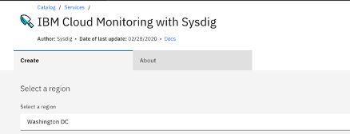
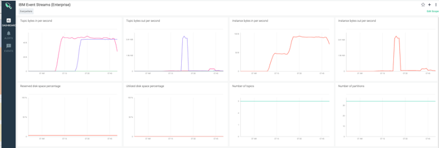
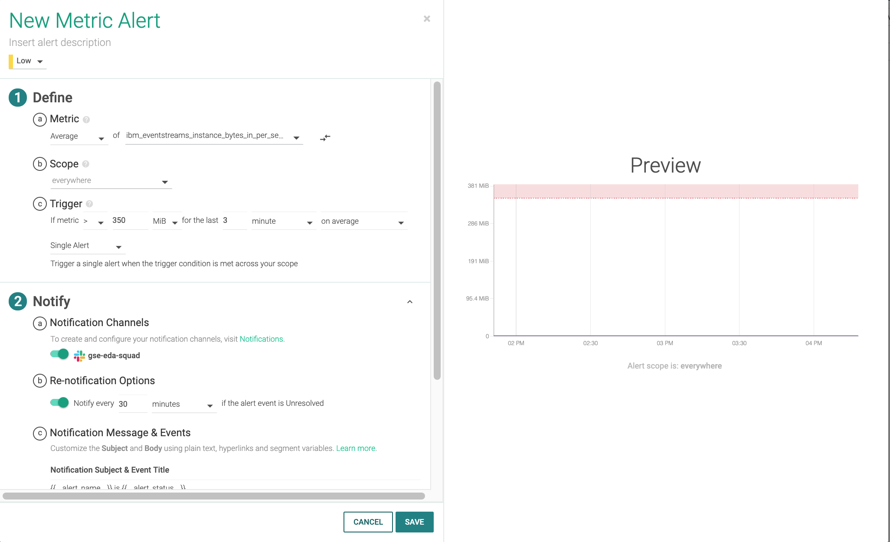
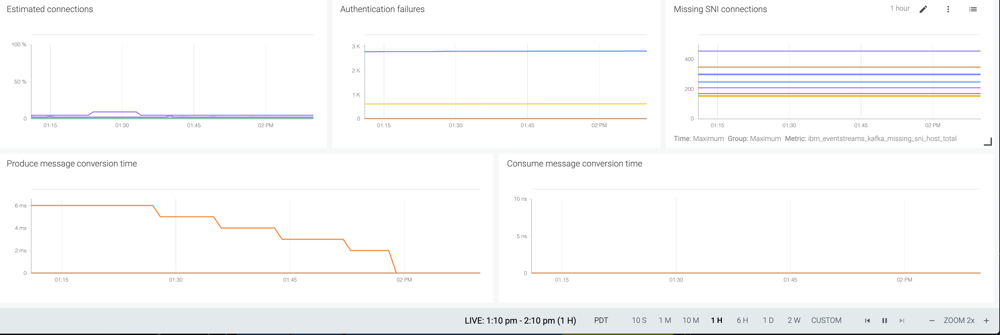

<AnchorLinks>
  <AnchorLink>General monitoring practices</AnchorLink>
  <AnchorLink>Monitoring with SYSDIG</AnchorLink>
  <AnchorLink>Event Streams Monitoring</AnchorLink>
</AnchorLinks>

## General monitoring practices

We have documented in [this note](/technology/kafka-monitoring/) the major tools for monitoring a Kafka cluster. like prometheus and Grafana.

## Monitoring with SYSDIG

With Event Streams on cloud, the monitoring capability is supported by Sysdig. To enable monitoring approach includes the following steps:

* Create a IBM Cloud monitoring with Sysdig service.

Enter name,

resource group and enable platform monitoring, if you want to combine Event Streams and Cluster monitoring:

You may want to do the [Sysdig getting started tutorial](https://cloud.ibm.com/docs/Monitoring-with-Sysdig?topic=Monitoring-with-Sysdig-getting-started#getting-started) to understand the different features of this product.

* Enable Event Streams to be monitored and select the monitoring service.

* Link to an existing sysdig instance:

## Event Streams Monitoring

Now open the Event Streams dashboard in Sysdig. This can be done from the Event Streams Dashboard ->

The available metrics are discribed in [this product documentation page](https://cloud.ibm.com/docs/EventStreams?topic=EventStreams-metrics#metrics-available-by-service-plan).

The following present the network throughput derived by aggregating cross brokers bytes per second.

For example the enterprise plan is described [here](https://cloud.ibm.com/docs/EventStreams?topic=EventStreams-kafka_quotas#limits_enterprise), so it is possible to define an alert when the
instance byte in and out per second are going over a given threshold (35MB?).

Here is an example of such alert:

Other interesting gauges are related to consumer groups, where it can be interesting to alert on inactive consumer groups, and the number of rebalancing consumer groups (something may be linked to the state of the consumers within the group or the brokers themselves).

Here are other reported interesting gauges:

* **Authentication failures** will help to assess if API keys expired or some security attack.
* **Producer or consumer conversion time** are metrics to assess if some codes are using older API version and some time is consumed by doing conversion. This need to be at zero.
