This documentation aims to be a introductory hands-on lab for the security feature of IBM Event Streams.

## IAM Concept Summary

To undertand the Identity and access management you can read [this article](https://cloud.ibm.com/docs/iam?topic=iam-iamoverview). 

To summarize:

* Account represents the billable entity, and can have multiple users.
* Users are given access to resource groups.
* _ Identity_ concept consists of user identities, service and app identities, API keys, and resources.
* Applications and IBM Cloud Services are identified with a service ID.
* To restrict permissions for using specific services, you can assign specific access policies to the service ID and user ID
* Resource groups are here to organize any type of resources (services, clusters, VMs...) that are managed by  Identity and Access Management (IAM).
* Resource groups are not scoped by location.
* API keys can be use to authenticate user or a service / application.
* To control access three components are used: access groups, resources and access policies.
	* Access group are used to organize a set of users and service IDs into a single entity and easily assign permissions via _access policies_
	* _Policies_ give permission to access account resources. Policies include a subject (user, service, access group), target (resource), and role. 
	* Policy can be set to all resources in a resource group
	* There are two types of access _roles_: platform management and service access.

Here is the main page for the IAM service on IBM Cloud where an account owner can manage the different components of the security control:

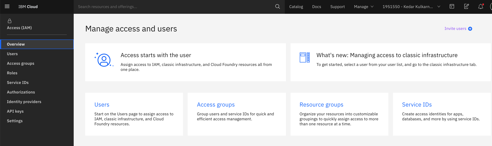

## Event Streams access management

This section is a quick overview of the [Managing access to your Event Streams resources](https://cloud.ibm.com/docs/services/EventStreams?topic=eventstreams-security) article.

### Roles

Users perform only specific tasks when they are assigned the different roles. The roles defined for Event Streams are Reader, writer and manager.

* _Reader_ for an application, can only consume records
* _Writer_ applications can produce and consumer records
* _Manager_ access administration to the Event Streams instance.

### Assign access

The type of Kafka resources that may be secured are *cluster, topic, group, or txnid*. Specifying a type is optional. 
If you do not specify a type, the policy then applies to all resources in the service instance


## Add access group to the account

The goal of this step is to create an access group to access Event Streams services as administrator.

1. From the IBM Cloud main page, go to the Manage > IAM 

	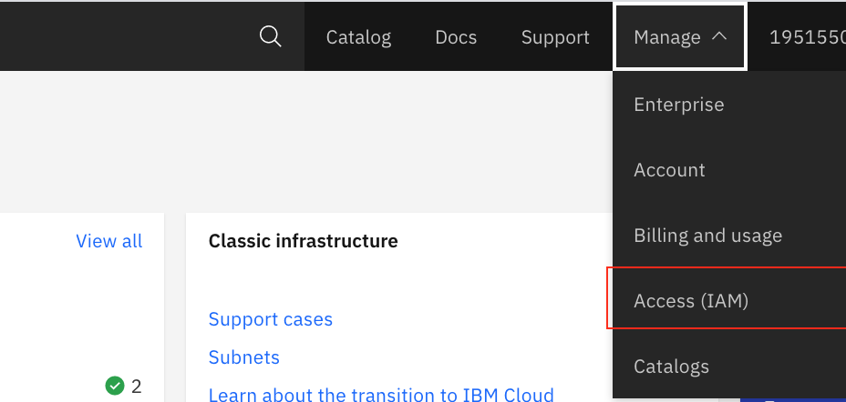

	This should lead you to the main IAM page as illustrated in previous figure.

1. Under the Access Group, we can create a new group:

	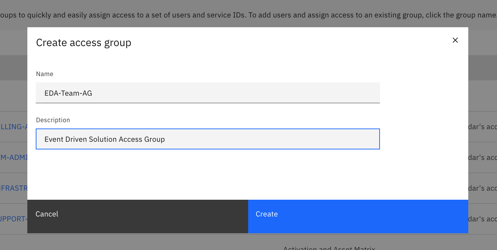

1. Then add users to the group, by selecting user from the available list, (those users were invited to join the account) and Click on `Add to group` link.

	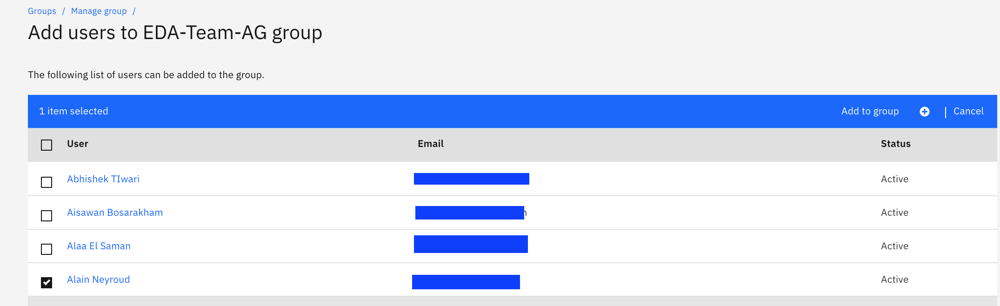

1. Finally add Access Policies, click Assign access button:

	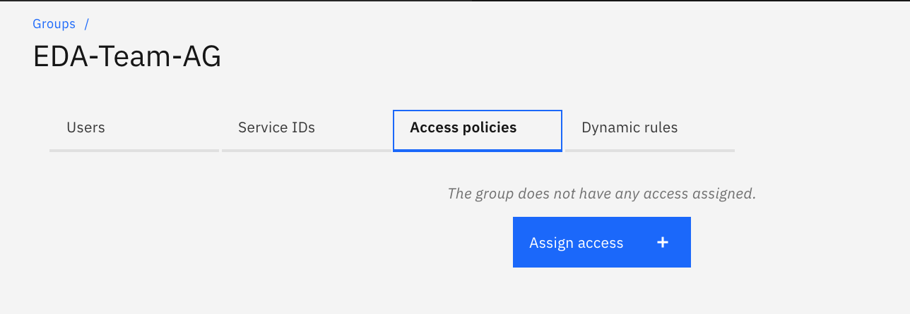

1. Then the type of resource (Event Streams) you want to define the access policy to include all instances of a service type.:

	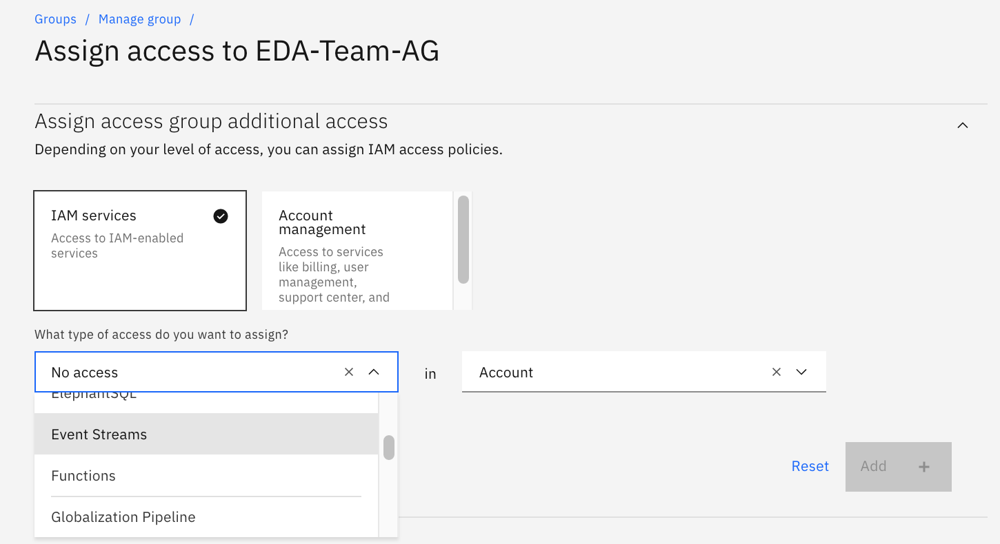

1. Then specify the access role for the Event Streams service:

	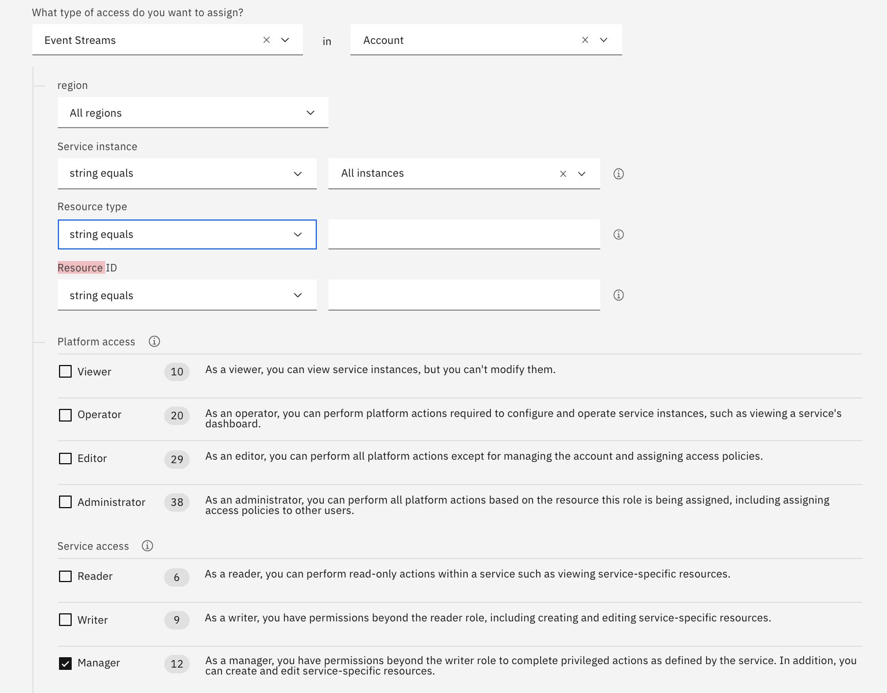

1. Add the policy and assign it to the group. You could stay in the same panel to add more target to the policy.

	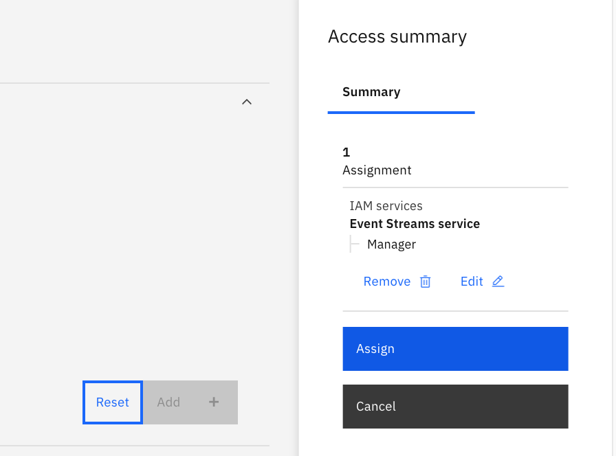

1. The access policies for administer / manage any Event Streams service is now listed in the access group:

	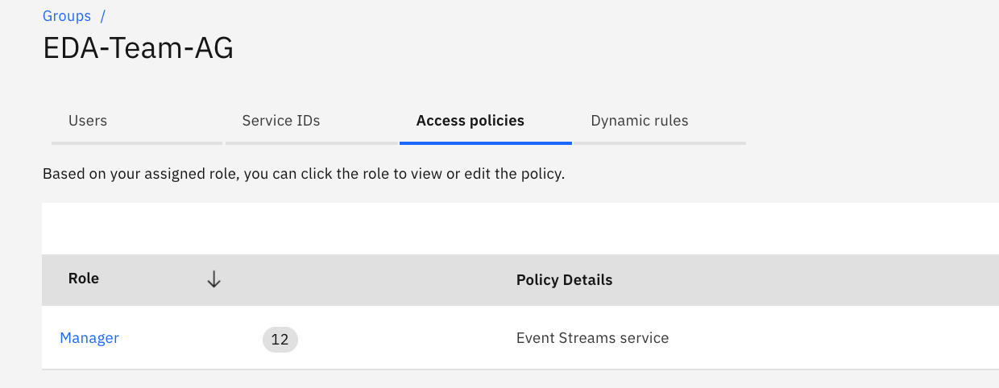

Any user who has a manager role for either 'All' services or 'All' Event Streams service instances' in the same account also has full access.

## Limiting topic access to group of users

The product document illustrates some access control common scenarios in [this section](https://cloud.ibm.com/docs/services/EventStreams?topic=eventstreams-security#security_scenarios). 
In this step we are implementing one of the classical scenario: suppose we have a line of business that will create topics by applying a naming convention where topic name starts 
with a prefix like: `bn-lob1-*`.  We want users and service ID to  get read / write access to only those topics matching those prefix.
To do that you need to:

1. Add an access group to include member of the line of business: `bn-lob1-group`
1. Define an access policy with the following criterias:
	* Event streams as resourc type
	* All regions
	* Specifying one of the Event Streams resource instance
	* Select the service instance that hosts the target cluster
	* Specify the resource type to be topic 
	* And the resource ID to matches `bn-lob1-*`

	

	* Then add a second rule to do read access at the cluster level:

	

	* Accept the two rules
	
	

	* The group has the two access policies:

	


## API Keys

To let an application to remotly authenticate itself, Event Streams uses APIkeys. 
So now, we want to create an API key for other applications, tools, scripts to interact with our IBM Event Streams instance.

1. In your IBM Event Streams instance service page, click on _Service credentials_ on the left hand side menu:

	

1. Observe, there is no service credentials yet and click on the _New credential_ button on the top right corner:

	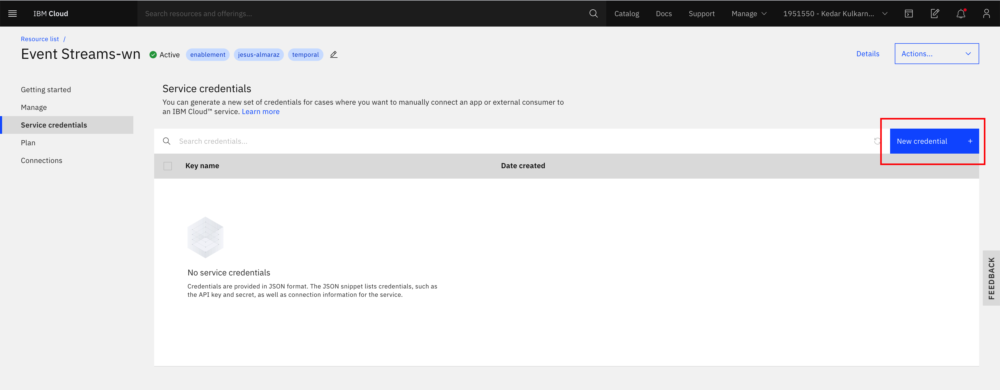

1. Enter a name for your service, choose _Manager_ role for now and click on _Add_:

	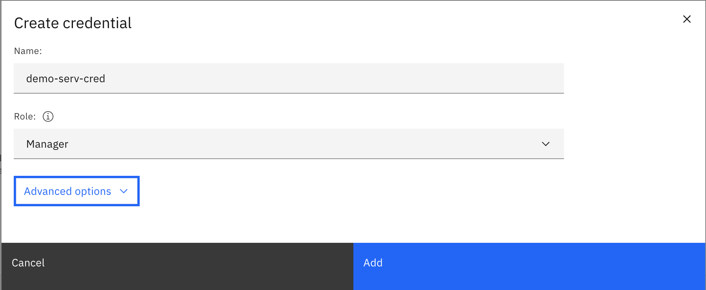

1. You should now see your new service credential and be able to inspect its details if you click on its dropdown arrow on it left:

	

### Adding Keys with CLI

We could create the service credentials using the CLI, so we will add reader and write role API Keys:

1. First we can explore the service credentials created previously, using the CLI with `$ ibmcloud resource service-key <service_credentials_name>`:

	```shell
	$ ibmcloud resource service-key demo-serv-cred
	Retrieving service key demo-serv-cred in all resource groups under account bill's Account as A......

	Name:          demo-serv-cred
	ID:            crn:v1:bluemix:public:messagehub:eu-de:a/b636d1d8.....8cfa:b05be932-2....02e687a:resource-key:4ba348d2-...-360e983d99c5
	Created At:    Tue May 12 10:53:02 UTC 2020
	State:         active
	Credentials:
				api_key:                  *****
				apikey:                   *****
				iam_apikey_description:   Auto-generated for key 4ba348d2-5fcf-4c13-a265-360e983d99c5
				iam_apikey_name:          demo-serv-cred
				iam_role_crn:             crn:v1:bluemix:public:iam::::serviceRole:Manager
				iam_serviceid_crn:        crn:v1:bluemix:public:iam-identity::a/b636d1d83e34d7ae7e904591ac248cfa::serviceid:ServiceId-380e866c-5914-4e01-85c4-d80bd1b8a899
				instance_id:              b05be932-2a60-4315-951d-a6dd902e687a
				kafka_admin_url:          https://mh-tcqsppdpzlrkdmkbgmgl-4c201a12d7add7c99d2b22e361c6f175-0000.eu-de.containers.appdomain.cloud
				kafka_brokers_sasl:       [kafka-2.mh-tcqsppdpzlrkdmkbgmgl-4c201a12d7add7c99d2b22e361c6f175-0000.eu-de.containers.appdomain.cloud:9093 kafka-0.mh-tcqsppdpzlrkdmkbgmgl-4c201a12d7add7c99d2b22e361c6f175-0000.eu-de.containers.appdomain.cloud:9093 kafka-1.mh-tcqsppdpzlrkdmkbgmgl-4c201a12d7add7c99d2b22e361c6f175-0000.eu-de.containers.appdomain.cloud:9093]
				kafka_http_url:           https://mh-tcqsppdpzlrkdmkbgmgl-4c201a12d7add7c99d2b22e361c6f175-0000.eu-de.containers.appdomain.cloud
				password:                 *****
				user:                     token
	```
1. Add a `Reader` role API key:

	```shell
	ibmcloud resource service-key-create bn-lob1-reader Reader --instance-name "Event Streams-wn"

	OK
	Service key crn:v1:bluemix:public:messagehub:eu-de:a/b6...248cfa:b05...e687a:resource-key:7ee00.....15a2 was created.
					
	Name:          bn-lob1-reader   
	ID:            crn:v1:bluemix:public:messagehub:eu-de:a/b636d..fa:b05b..7a:resource-key:7ee0042.....b15a2   
	Created At:    Wed May 13 00:33:49 UTC 2020   
	State:         active   
	Credentials:                                   
				api_key:                  xrvMI4PQYmdOcUwPRUJXy6Xlo9UCY9xywNUPiU3jjpKH      
				apikey:                   xrvMI4PQYmdOcUwPRUJXy6Xlo9UCY9xywNUPiU3jjpKH      
				iam_apikey_description:   Auto-generated for key 7ee0042f-572b-46f6-b9cc-912cc63b15a2      
				iam_apikey_name:          bn-lob1-reader      
				iam_role_crn:             crn:v1:bluemix:public:iam::::serviceRole:Reader      
				iam_serviceid_crn:        crn:v1:bluemix:public:iam-identity::a/b636d1....48cfa::serviceid:ServiceId-b4d3....18af1      
				instance_id:              b05....687a      
				kafka_admin_url:          https://mh-tcqsppdpzlrkdmkbgmgl-4c201a...1c6f175-0000.eu-de.containers.appdomain.cloud      
				kafka_brokers_sasl:       [kafka-0.mh-tcqsppdpzlrkdmkbgmgl-4c2...175-0000.eu-de.containers.appdomain.cloud:9093....]      
				kafka_http_url:           https://mh-tcqsppdpzlrkdmkbgmgl-4c20...-0000.eu-de.containers.appdomain.cloud      
				password:                 xr......KH      
				user:                     token      
	```
1. Using the same approach add a `Writer` role named `bn-lob1-writer`: `ibmcloud resource service-key-create bn-lob1-writer Writer --instance-name "Event Streams-wn"`

## Control applications access

The last step of this lab is to link any future applications to a group so that producer and consumer codes using the Writer role API key as defined previously
can read and write to specific topic as defined by a access policy.

We want to give this Writer role API key to the `bn-lob1` team, so they can only create topics and R/W on those topics with the name `bn-lob1-*`. 
To do so, we have to add in the Access Group ``,  the service ID that maps the Key created above:

1. In IAM Access groups select the service IDs tab and click on add service id button:

	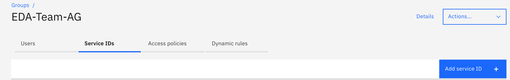

1. Search for the key name: `bn-lob1-writer` and  

	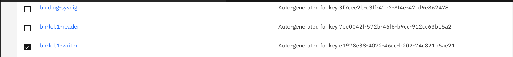

1. You should get this result:

	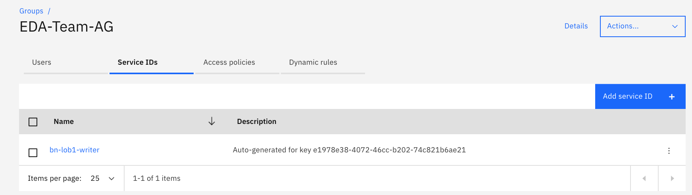

## Kafka Streams specifics

A lot of Kafka implementations use Kafka Streams API, in this case the applications need to have `Manager` role on topic resource,
and Reader role for cluster and group with a Manager API Key. 