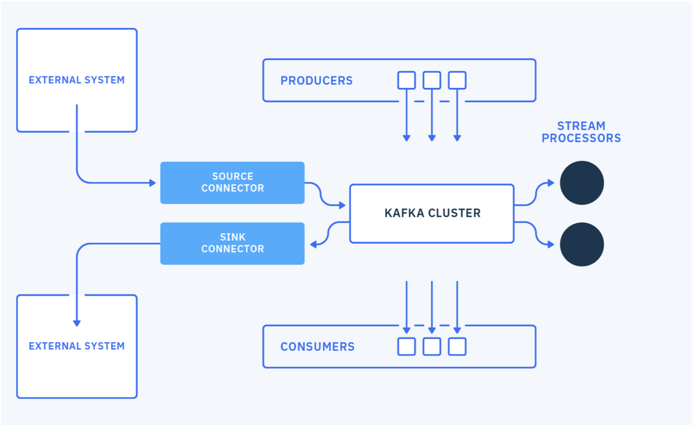
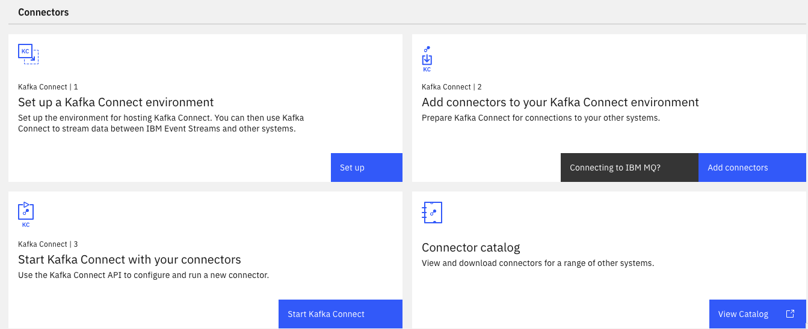

[Kafka connect](https://kafka.apache.org/documentation/#connect) is an open source component 
for easily integrate external systems with Kafka. It works with any Kafka product like IBM Event Streams, Strimzi, AMQ Streams, Confluent. 
It uses the concepts of source and sink connectors to ingest or deliver data to / from  Kafka topics.



The general concepts are detailed in the [IBM Event streams product documentation](https://ibm.github.io/event-streams/connecting/connectors/), and [Robin Moffatt's video](https://talks.rmoff.net/DQkDj3). Here is a quick summary:

* **Connector** represents a logical job to move data from / to kafka  to / from external systems. A lot of [existing connectors](https://ibm.github.io/event-streams/connectors/), [Apache Camel Kafka connectors](https://camel.apache.org/camel-kafka-connector/1.0.x/index.html) can be reused, or you can [implement your own](https://kafka.apache.org/documentation/#connect_development).
* **Workers** are JVMs running the connectors. For production deployment workers run in cluster or "distributed mode", and leverage the Kafka consumer group management protocol to scale tasks horizontally.
* **Tasks**: each worker coordinates a set of tasks to copy data. In distributed mode, task states are saved in Kafka topics. They can be started, stopped at any time to support resilience, and scalable data pipeline.
* **REST API** to configure the connectors and monitors the tasks.

The following figure illustrates a classical 'distributed' deployment of a Kafka Connect cluster. 
Workers are the running processes to execute connectors and tasks.  
Each Connector is responsible for defining and updating a set of Tasks that actually copy the data. Tasks are threads in a JVM. 
For fault tolerance and offset management, Kafka Connect uses Kafka topics (suffix name as `-offsets, -config, -status`) to persist its states.
When a connector is first submitted to the cluster, the workers rebalance the full set of connectors
 in the cluster with their tasks so that each worker has approximately the same amount of work. 


* Connector and tasks are not guaranteed to run on the same instance in the cluster, 
especially if you have multiple tasks and multiple instances in your kafka connect cluster.
* The connector may be configured to add `Converters` (code used to translate data between Connect and the system sending or receiving data), 
and `Transforms`: simple logic to alter each message produced by or sent to a connector.

Connector keeps state into three topics, which may be created when the connectors start are:

* **connect-configs**: This topic stores the connector and task configurations.
* **connect-offsets**: This topic stores offsets for Kafka Connect.
* **connect-status**: This topic stores status updates of connectors and tasks.


## Characteristics

* Copy vast quantity of data from source to kafka: work at the datasource level. So when the source is a database, it uses JDBC API for example.
* Support streaming and batch.
* Scale from standalone, mono connector approach to start small, to run in parallel on distributed cluster.
* Copy data, externalizing transformation in other framework.
* Kafka Connect defines three models: data model, worker model and connector model. Worker model allows Kafka Connect to scale the application.
Kafka Connect cluster can serve multiple applications and so may be organized as a service.

## Connector cluster configuration

The following configurations are important to review:

* `group.id`: one per connect cluster. It is ised by source connectors only.
* `heartbeat.interval.ms`: The expected time between heartbeats to the group coordinator when using Kafka’s group management facilities.

## Fault tolerance

When a worker fails: 


Tasks allocated in the failed worker are reallocated to existing workers, and the task's state, read offsets, source record mapping to offset are reloaded from the different topics.


Both figure above are illustrating a MongoDB sink connector.

## MQ Source connector

The [source code is in this repo](https://github.com/ibm-messaging/kafka-connect-mq-source) and uses JMS as protocol to integrate with MQ.
When the connector encounters a message that it cannot process, it stops rather than throwing the message away. 
The MQ source connector does not currently make much use of message keys. It is possible to use CorrelationID as a key
by defining MQ source `mq.record.builder.key.header` property:

```
    key.converter: org.apache.kafka.connect.storage.StringConverter
    value.converter: org.apache.kafka.connect.converters.ByteArrayConverter
    mq.record.builder: com.ibm.eventstreams.connect.mqsource.builders.DefaultRecordBuilder
    mq.connection.mode: client
    mq.message.body.jms: true
    mq.record.builder.key.header: JMSCorrelationID
```

The record builder helps to transform the input message to a kafka record, using or not a schema.

Always keep the coherence between body.jms, record builder and data converter. 

The MQ source task starts a unique JMS Reader that will read n messages from the queue. The `poll() function 
returns the list of MQ source records, and will commit to JMS if the number of message read match the batch size or
if there is no more records. Once the Kafka Producer gets acknowledge that records are received by Brokers then use callback on the source
task to commit MQ transaction for example. 

Any producer configuration can be modified in the source connector configuration:

```yaml
producer.override.acks: 1
```

## Installation

The  Kafka connect framework fits well into a kubernetes deployment. 
In 2021 we have different options for that deployment: the [Strimzi Kafka connect operator](https://strimzi.io/docs/0.22.0/#kafka-connect-str), 
IBM [Event Streams Connector](https://ibm.github.io/event-streams/connecting/setting-up-connectors/),
Red Hat [AMQ Streams (2021.Q3) connector](https://access.redhat.com/documentation/en-us/red_hat_amq/2021.q3/html/using_amq_streams_on_openshift/assembly-deployment-configuration-str#assembly-kafka-connect-str)
or one of the [Confluent connector](https://www.confluent.io/hub/).

### IBM Event Streams Cloud Pak for Integration

If you are using IBM Event Streams 2021.x on Cloud Pak for Integration, the connectors setup is part of the user admin console toolbox:



*Deploying connectors against an IBM Event Streams cluster, you need to have a Kafka user with Manager role, to be able to create topic, produce and consume messages for all topics.*

As an extendable framework, Kafka Connect, can have new connector plugins. To deploy new connector, you need to use the kafka docker 
image which needs to be updated with the connector jars and redeployed to kubernetes cluster 
or to other environment. With IBM Event Streams on Openshift, the toolbox includes a 
kafka connect environment packaging, that defines a Dockerfile and configuration files 
to build your own image with the connectors jar files you need. The configuration files 
defines the properties to connect to Event Streams kafka brokers using API keys and SASL.

The following [public IBM messaging github account](https://github.com/ibm-messaging) includes 
supported, open sourced, connectors (search for `connector`).

Here is the [list of supported connectors](https://ibm.github.io/event-streams/connectors/) for IBM Event Streams.

Event Stream Kafka connector use custom resource definition defined by Strimzi. So configuration for Strimzi works for
Event Streams.

Normally you define one Kafka connect cluster, with a custom docker image which has all the necessary
jars file for any connector you want to use. Then you configure each connector so they can start
processing events or producing events.
A Kafka connect cluster is identified with a group.id and then it saves its states in topics. The example
below are for the configuration in cluster, also named distributed.

```yaml
  config:
    group.id: connect-cluster
    offset.storage.topic: connect-cluster-offsets
    config.storage.topic: connect-cluster-configs
    status.storage.topic: connect-cluster-status
```

The [real-time inventory gitops repository](https://github.com/ibm-cloud-architecture/eda-rt-inventory-gitops) includes a MQ Source connector to push message to Kafka. It uses
ArgoCD to maintain states of Kafka Cluster, topics, users, and Kafka connector.

Once the connector pods are running we need to start the connector tasks. 

### Strimzi

[KafkaConnector resources](https://strimzi.io/docs/operators/latest/using.html#proc-kafka-connect-config-str) allow you to create and manage connector instances for Kafka Connect in a Kubernetes-native way.
To manage connectors, you can use the Kafka Connect REST API, or use KafkaConnector custom resources.
In case of GitOps methodology we will define connector cluster and connector instance as yamls.
Connector configuration is passed to Kafka Connect as part of an HTTP request and stored within Kafka itself.

## Further Readings

* [Apache Kafka connect documentation](https://kafka.apache.org/documentation/#connect)
* [Confluent Connector Documentation](https://docs.confluent.io/current/connect/index.html)
* [IBM Event Streams Connectors](https://ibm.github.io/event-streams/connecting/connectors/) 
* [List of supported connectors by Event Streams](https://ibm.github.io/event-streams/connectors/)
* [MongoDB Connector for Apache Kafka](https://github.com/mongodb/mongo-kafka)
