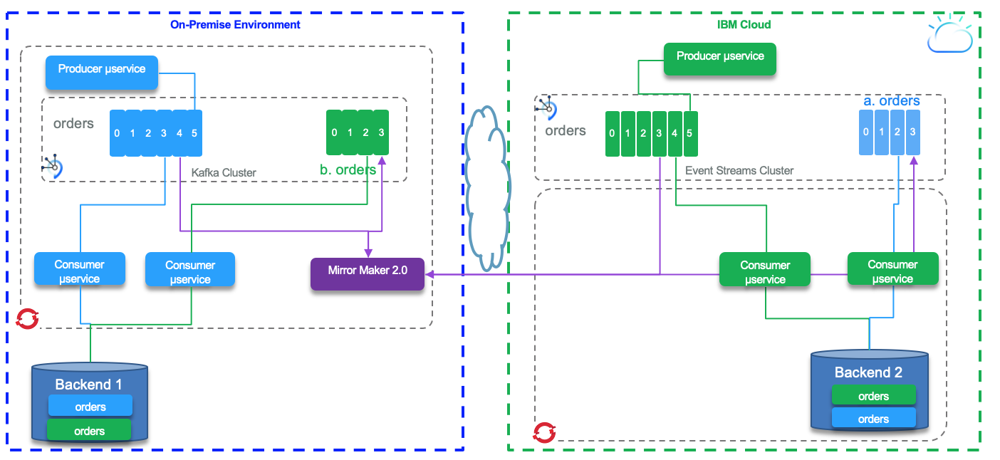

This section introduces **Mirror Maker 2.0**, the new replication feature of Kafka 2.4, and how it can be used, along with best practices, for data replication between two Kafka clusters. Mirror Maker 2.0 was defined as part of the Kafka Improvement Process - [KIP 382](https://cwiki.apache.org/confluence/display/KAFKA/KIP-382%3A+MirrorMaker+2.0).
<AnchorLinks>
  <AnchorLink>Overview</AnchorLink>
  <AnchorLink>Mirror Maker 2 components</AnchorLink>
  <AnchorLink>Deployment examples</AnchorLink>
  <AnchorLink>Replication considerations</AnchorLink>
  <AnchorLink> MM2 topology</AnchorLink>
  <AnchorLink>Capacity planning</AnchorLink>
  <AnchorLink>Version migration</AnchorLink>
</AnchorLinks>

## Overview

Topic mirroring is used for disaster recovery, with a active - passive model, so it will be easier to get target cluster and consumers / producers up and runnning in case of disaster on the source cluster.

 

Mirror Maker 2 can be used to replicate data over multiple clusters with a more active - active deployment:

 

In active - active mode the clusters get continuous local data injected in local cluster and replicated data injected from remote cluster. The topic names are prefixed from the original cluster name. In the figure below, the cluster on the right has green local producers and consumers, topics are replicated to the left, the blue cluster.

 

Consumers on both sides are getting data from the 'order' topics (local and replicated) to get a clear view of all the orders. If there is a failure on one of the side, the data are transparently available. A read model query will return the good result on both side.

In replication, data in topic, topic states and metadata are replicated.

IBM Event Streams release 10.0 is supporting Mirror Maker 2 as part of the [geo-replication feature](https://ibm.github.io/event-streams/georeplication/about/).

## Mirror Maker 2 components

[Mirror maker 2.0](https://strimzi.io/docs/master/#con-configuring-mirror-maker-deployment-configuration-kafka-mirror-maker) is the new solution to replicate data in topics from one Kafka cluster to another. It uses the [Kafka Connect](../kafka-connect/) framework to simplify configuration, parallel execution and horizontal scaling.

The figure below illustrates the MirrorMaker 2.0 internal components running within Kafka Connect.


MirrorMaker 2 uses the cluster name or identifier as prefix for topic, and uses the concept of source topic and target topic. It runs in standalone mode, which can be used for development and test purpose, or in distributed mode (cluster) for production deployment. With distribution mode, MirrorMaker 2.0 creates the following topics on the cluster it is connected to (See later the property `connectCluster`):

* *...-configs.source.internal*: This topic is used to store the connector and task configuration.
* *...-offsets.source.internal*: This topic is used to store offsets for Kafka Connect.
* *...-status.source.internal*: This topic is used to store status updates of connectors and tasks.
* *source.heartbeats*: to check that the remote cluster is available and the clusters are connected
* *source.checkpoints.internal*: MirrorCheckpointConnector tracks and maps offsets for specified consumer groups using an offset sync topic and checkpoint topic.

A typical MirrorMaker 2.0 configuration is done via a property file and defines the replication source and target clusters with their connection properties and the replication flow definition. Here is a simple example for a local cluster replicating to a remote IBM Event Streams cluster using TLS v1.2 for connection encryption and SASL authentication protocol.  The IBM Event Streams instance runs on the Cloud.

```properties
clusters=source, target
source.bootstrap.servers=${KAFKA_SOURCE_BROKERS}
target.bootstrap.servers=${KAFKA_TARGET_BROKERS}
target.security.protocol=SASL_SSL
target.ssl.protocol=TLSv1.2
target.ssl.endpoint.identification.algorithm=https
target.sasl.mechanism=PLAIN
target.sasl.jaas.config=org.apache.kafka.common.security.plain.PlainLoginModule required username="token" password=${KAFKA_TARGET_APIKEY};
# enable and configure individual replication flows
source->target.enabled=true
source->target.topics=products
tasks.max=10
```

* Topics to be replicated are configured via a _whitelist_ that may include regular expression for pattern matching on the topic name. So if you use naming convention for your topic, you could do fine grained selection of the replicated topic. It is possible to specify topics you do not want to replicate via the _blacklist_ property.
* White listed topics are set with the `source->target.topics` attribute of the replication flow and uses [Java regular expression](https://www.vogella.com/tutorials/JavaRegularExpressions/article.html) syntax.
* The default blacklisted topics:

```properties
blacklist = [follower\.replication\.throttled\.replicas, leader\.replication\.throttled\.replicas, message\.timestamp\.difference\.max\.ms, message\.timestamp\.type, unclean\.leader\.election\.enable, min\.insync\.replicas]
```

We can also define the _blacklist_ with the properties: `topics.blacklist`. Comma-separated lists and Java Regular Expressions are supported.

Internally, `MirrorSourceConnector` and `MirrorCheckpointConnector` will create multiple Kafka tasks (up to the value of `tasks.max` property), and `MirrorHeartbeatConnector` creates an additional task. `MirrorSourceConnector` will have one task per topic-partition combination to replicate, while `MirrorCheckpointConnector` will have one task per consumer group. The Kafka Connect framework uses the coordinator API, with the `assign()` API, so there is no consumer group used while fetching data from source topics. There is no call to `commit()` either; rebalancing occurs only when there is a new topic created that matches the _whitelist_ pattern.

Mirror Maker 2 can run on VM, bare metal or within containers deployed on kubernetes cluster.

### Why replicating?

The classical needs for replication between clusters can be bullet listed as:

* Disaster recovery when one secondary cluster is passive while the producer and consumers are on the active cluster in the primary data center: The [following article](https://cloud.ibm.com/docs/EventStreams?topic=EventStreams-disaster_recovery_scenario) goes over those principals.
* Active-active cluster mirroring for inter services communication: consumers and producers are on both sides and consume or produce to their local cluster.
* Moving data to a read only cluster as a front door to data lake, or to do cross data centers aggregation on the different event streams: Fan-in to get holistic data view.
* GDPR compliance to isolate data in country and geography
* Hybrid cloud operations to share data between on-premise cluster and managed service clusters.

## Deployment examples

We encourage you to go over our [Mirror maker 2 labs](/use-cases/kafka-mm2/) which addresses different replication scenarios. The `Connect` column defines where the Mirror Maker 2 runs.


| Scenario | Source                 | Target                 | Connect | Lab |
|-------------|------------------------|------------------------|:-------:|:---:|
| Lab 1  | Event Streams on Cloud  | Local Kafka | Local on localhost   | [Kafka Mirror Maker 2 - Lab 1](/use-cases/kafka-mm2/lab-1/)|
| Lab 2 | Using Mirror Maker 2 from Event Streams on premise to Event stream on cloud | On OCP | OCP | [Kafka Mirror Maker 2 - Lab 2](/use-cases/kafka-mm2/lab-2/) |


## Replication considerations

### Topic metadata replication

It is possible to disable the topic metadata replication. We do not encourage to do so. Per design topic can be added dynamically, specially when developing with Kafka Streams where intermediate topics are created by the stream topology semantic, and topic configuration can be altered to increase the number of partitions. Changes to the source topic are dynamically propagated to the target avoiding maintenance nightmare.
By synchronizing configuration properties, the need for rebalancing is reduced.

When doing manual configuration, even if the initial topic configuration was duplicated, any dynamic changes to the topic properties are not going to be automatically propagated and the administrator needs to change the target topic. If the throughput on the source topic has increased and the number of partition was increased to support the load, then the target cluster will not have the same downstream capability which may lead to overloading (disk space or memory capacity).

Also if the consumer of a partition is expecting to process the events in order within the partition, then changing the number of partitions between source and target will make the ordering not valid any more.

If the replication factor are set differently between the two clusters then the availability guarantees of the replicated data may be impacted and bad settings with broker failure will lead to data lost.

Finally, it is important to consider that changes to topic configuration triggers a consumer rebalance which stalls the mirroring process and creates a backlog in the pipeline and increases the end to end latency observed by the downstream application.

### Naming convention

Mirror maker 2 sets the prefix for the name of the replicated topic with the name of the source cluster. This is an important and simple solution to avoid infinite loop when doing bi-directional mirroring. At the consumer side the `subscribe()` function supports regular expression for topic name. So a code like:

```java
kafkaConsumer.subscribe("^.*accounts")
```

will listen to all the topics in the cluster having cluster name prefixed topics and the local `accounts` topic. This could be useful when we want to aggregate data from different data centers / clusters.

### Offset management

Mirror maker 2 tracks offset per consumer group. There are two topics created on the target cluster to manage the offset mapping between the source and target clusters and the checkpoints of the last committed offset in the source topic/partitions/consumer group. When a producer sends its records, it gets the offsets in the partition the records were created.

In the diagram below we have a source topic A/partition 1 with the last write offset done by a producer to be  5, and the last read committed offset by the consumer assigned to partition 1 being 3. The last replicated offset 3 is mapped as downstream offset 12 in the target partition. Offset numbers do not match between replicated partitions.
So if the blue consumer needs to reconnect to the green target cluster it will read from the last committed offset which is 12 in this environment. This information is saved in the `checkpoint` topic.


Offset synch are emitted at the beginning of the replication and when there is a situation which leads that the numbering sequencing diverges. For example, the normal behavior is to increase the offset by one 2,3,4,5,6,7, which is mapped to 12,13,14,15,16,... on target cluster. If the write operation for offset 20 at the source is a 17 on the target then MM 2 emits a new offset synch records to the `offset-synch` topic.

The `checkpoint` and `offset_synch` topics enable replication to be fully restored from the correct offset position on failover. On the following diagram, once the cluster source is down, the consumers on the target cluster are restarted, and they will start from the last committed offset of the source, which was offset 3 that is in fact offset 12 on target replicated topic. No record skipped.


### Record duplication

Exactly-once delivery is difficult to achieve in distributed system. In the case of Kafka, producer, brokers, and consumers are working together to ensure only one message is processed end to end. With coding practice and configuration settings, within a unique cluster, Kafka can guarantee exactly once processing. No duplicated records between producer and broker, and committed reads, on consumer side, are not reprocessed in case of consumer restarts.

But for cross cluster replications, the semantic is based on at least once approach. Duplicates can happen when the mirror maker source task stops before committing its offset to the source topic. A restart will load records from the last committed offset which can generate duplicates. The following diagram illustrate this case, record offset 26 on target topic is a duplicate of record 25.


Also Mirror Maker 2 is a generic topic consumer, it will not participate to the "read-committed" process, if the topic includes duplicate messages it will propagate them to the target.

In the future MM2 will be able to support exactly once by using the `checkpoint` topic on the target cluster to keep the state of the committed offset from the consumer side, and write with an atomic transaction between the target topic and the checkpoint topic, and commit the source read offset as part of the same transaction.

## MM2 topology

In this section we want to address horizontal scalability and how to organize the MirrorMaker 2 topology for multi-tenancy. The simplest approach is to use one Mirror Maker instance per family of topics: the classification of family of topic can be anything, from line of business, to team, to application. Suppose an application is using 1000 topic - partitions, for data replication it may make sense to have one MM2 instance for this application. The configuration will define the groupId to match the application name for example.

The following diagram illustrates this kind of topology by using regular expression on the topic white list selection, there are three Mirror Maker 2 instances mirroring the different topics with name starting with `topic-name-A*, topic-name-B*, topic-name-C*,` respectively.


Each connect instance is a JVM workers that replicate the topic/partitions and has different group.id.

For Bi-directional replication for the same topic name, Mirror Maker 2 will use the cluster name as prefix. With MM2 we do not need to have 2 clusters but only one and bidirectional definitions. The following example is showing the configuration for a MM2 bidirectional settings, with `accounts` topic to be replicated on both cluster:

```
apiVersion: kafka.strimzi.io/v1alpha1
kind: KafkaMirrorMaker2
...
 mirrors:
  - sourceCluster: "event-streams-wdc"
    targetCluster: "kafka-on-premise"
    ...
    topicsPattern: "accounts,orders"
  - sourceCluster: "kafka-on-premise"
    targetCluster: "event-streams-wdc"
    ...
    topicsPattern: "accounts,customers"
```


### Consumer coding

We recommend to review the [producer implementation best practices](../kafka-producers-consumers/#kafka-producers) and the [consumer considerations](../kafka-producers-consumers/#kafka-consumers).

## Capacity planning


For platform sizing, the main metric to assess, is the number of partitions in the cluster to replicate. The number of partitions and number of brokers are somehow connected as getting a high number of partitions involves increasing the number of brokers. For Mirror Maker 2, as it is based on Kafka connect, there is a unique cluster and each partition mirroring is supported by a task within the JVM so the first constraint is the memory allocated to the container and the heap size.

To address capacity planning, we need to review some characteristic of the Kafka Connect framework: For each topic/partition there will be a task running. We can see in the trace that tasks are mapped to threads inside the JVM. So the parallelism will be bound by the number of CPUs the JVM runs on. The parameters `max.tasks` specifies the max parallel processing we can have per JVM. So for each Topic we need to assess the number of partitions to be replicated. Each task is using the consumer API and is part of the same consumer group, the partition within a group are balanced by an internal controller. With Kafka connect any changes to the topic topology triggers a partition rebalancing. In MM2 each consumer / task is assigned a partition by the controller. So the rebalancing is done internally. Still adding a broker node into the cluster will generate rebalancing.

The task processing is stateless, consume - produce wait for acknowledge,  commit offset. In this case the CPU and network are key. For platform tuning activity we need to monitor operating system performance metrics. If the CPU becomes the bottleneck, we can allocate more CPU or start to scale horizontally by adding more Mirror Maker 2 instances. If the network at the server level is the bottleneck, then adding more servers will help. Kafka will automatically balance the load among all the tasks running on all the machines. The size of the message impacts also the throughput as with small message the throughput is CPU bounded. With 100 bytes messages or more we can observe network saturation.

The parameters to consider for sizing are the following:

| Parameter | Description |Impact|
| --- | --- | --- |
| Number of topic/ partition | Each task processes one partition | For pure parallel processing max.tasks is the number of CPU |
| Record size | Size of the message in each partition in average | Memory usage and Throughput: the # of records/s decrease when size increase, while MB/s throughput increases in logarithmic|
| Expected input throughput | The producer writing to the source topic throughput | Be sure the consumers inside MM2 absorb the demand |
| Network latency | | This is where positioning MM2 close to the target cluster may help improve latency|

## Version migration

Once the Mirror Maker cluster is up and running, it may be needed to update the underlying code when a new product version is released. Based on Kafka Connect distributed mode multiple workers JVM coordinate the topic / partition repartition among themselves.  If a worker process dies, the cluster is rebalanced to distribute the work fairly over the remaining workers.
If a new worker starts work, a rebalance ensures it takes over some work from the existing workers.

Using the REST API it is possible to stop and restart a connector. As of now the recommendation is to start a new MirrorMaker instance with the new version and the same groupId as the existing workers you want to migrate. Then stop the existing version. As each MirrorMaker workers are part of the same group, the internal worker controller will coordinate with the other workers the  'consumer' task to partition assignment.

We have presented a similar approach in [this section](/technology/kafka-mirrormaker/vm-provisioning), where we tested that each instance of MirrorMaker 2 could assume the replication.  First we will stop the Node 1 instance, upgrade it to the latest version, then start it again.  Then we’ll repeat the same procedure on Node 2.  We’ll continue to watch the Consumer VM window to note that replication should not stop at any point.


We’ve now upgraded to Kafka 2.5 including the latest MirrorMaker 2.  Meanwhile, replication was uninterrupted due to the second instance of MirrorMaker 2:


Now we’ll restart the Node 1 instance of MirrorMaker 2, stop the Node 2 instance, we can still see replication occurring on the upgraded Node 1 instance of MirrorMaker 2.


We upgrade Node 2’s instance of MirrorMaker 2 exactly as on Node 1, and start it again, and once again, replication is still going.


When using Strimzi, if the update applies to the MM2 Custom Resource Definition, just reapplying the CRD should be enough.

Be sure to verify the product documentation as new version may enforce to have new topics. It was the case when Kafka connect added the config topic in a recent version.
