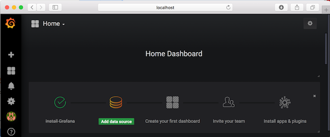

<AnchorLinks>
  <AnchorLink>Overview</AnchorLink>
  <AnchorLink>What to monitor</AnchorLink>
</AnchorLinks>

Updated 01/08/2021

## Overview

A comprehensive Kafka monitoring plan should collect metrics from the following components:

* Kafka Broker(s)
* ZooKeeper metrics as Kafka relies on it to maintain its state
* Producer(s) / Consumer(s), in general sense, which includes Kafka Connector cluster

Kafka Broker, Zookeeper and Java clients (producer/consumer) expose metrics via JMX (Java Management Extensions) 
and can be configured to report stats back to Prometheus using the [JMX exporter](https://github.com/prometheus/jmx_exporter) 
maintained by Prometheus.  There is also a number of exporters maintained by the community to explore. 
Some of them can be used in addition to the JMX export. To monitor Kafka, for example, the JMX exporter 
is often used to provide broker level metrics, while community exporters claim to provide more accurate cluster level 
metrics (e.g. [Kafka exporter](https://github.com/danielqsj/kafka_exporter), [Kafka Zookeeper Exporter by CloudFlare](https://github.com/cloudflare/kafka_zookeeper_exporter), and others). 
Alternatively, you can consider [writing your own custom exporter](https://prometheus.io/docs/instrumenting/writing_exporters/).

## What to monitor

A long list of metrics is made available by Kafka ([here](https://kafka.apache.org/documentation/#monitoring)) and Zookeeper ([here](https://zookeeper.apache.org/doc/current/zookeeperJMX.html)). 
The easiest way to see the available metrics is to fire up *jconsole* and point it at a running kafka client or Kafka/Prometheus server; 
this will allow browsing all metrics with JMX. But you are still left to figure out which ones you want to actively monitor and the ones 
that you want to be actively alerted.

An simple way to get started would be to start with the [Grafana’s sample dashboards](https://grafana.com/dashboards) for the Prometheus exporters you chose to use and then modify 
them as you learn more about the available metrics and/or your environment. The [Monitoring Kafka metrics](https://www.datadoghq.com/blog/monitoring-kafka-performance-metrics/) article by *DataDog* 
and [How to monitor Kafka](https://support.serverdensity.com/hc/en-us/articles/360001083446-Monitoring-Kafka) by *Server Density* provides  guidance on key Kafka and Prometheus metrics, 
reasoning to why you should care about them and suggestions on thresholds to trigger alerts. 
In the next section, we will demonstrate exactly that; we will start with sample dashboards and make few modifications to exemplify 
how to configure key Kafka metrics to display in the dashboard.

Here are a set of helpful links for Event Streams monitoring:

* [Monitoring deployment health](https://ibm.github.io/event-streams/administering/deployment-health/) using User Interface, or OpenShift CLI
* [Cluster health](https://ibm.github.io/event-streams/administering/cluster-health/): Event Streams has a preconfigured monitoring dashboard, but other tools could be used as it exports a set of metrics via standard like JMX.


#### Prometheus Server and scrape jobs

Prometheus uses a configuration file in YAML format to define the [scraping jobs and their instances](https://prometheus.io/docs/concepts/jobs_instances/). You can also use the configuration file to define [recording rules](https://prometheus.io/docs/prometheus/latest/configuration/recording_rules/) and [alerting rules](https://prometheus.io/docs/prometheus/latest/configuration/alerting_rules/):

* **Recording rules** allow you to precompute frequently needed or computationally expensive expressions and save their result as a new set of time series. Querying the precomputed result will then often be much faster than executing the original expression every time it is needed. This is especially useful for dashboards, which need to query the same expression repeatedly every time they refresh.

* **Alerting rules** allow you to define alert conditions based on Prometheus expression language expressions and to send notifications about firing alerts to an external service. Alerting rules in Prometheus servers send alerts to an Alertmanager. The [Alertmanager](https://prometheus.io/docs/alerting/alertmanager/) then manages those alerts, including silencing, inhibition, aggregation and sending out notifications via methods such as email, PagerDuty and others.

Below, we will go through the steps to stand-up a local Prometheus server as a Docker container and to modify the configuration file to scrape Kafka metrics:

* Create/run a docker container using Prometheus official image from DockerHub

   ```shell
   docker run -d -p 9090:9090 prom/prometheus
   ```

* Obtain the IP address of the Kafka container

   ```shell
   docker inspect kafka_c | grep IPAddress
   ```

* Edit the prometheus.yml to add Kafka as a target

   ```shell
   docker exec -it prometheus_c \sh
   vi /etc/prometheus/prometheus.yml
   ```

* Locate the scrape_configs section in the properties file and add the lines below to define the Kafka job,
where the IP should be the IP of the kafka container

   ```yaml
   - job_name: 'kafka'
     static_configs:
     - targets: ['172.17.0.4:7071']
   ```

* Reload the configuration file

   ```shell
   ps -ef
   kill -HUP <prometheus PID>
   ```

* You can now verify that Kafka is listed as a target job in Prometheus. On a Browser, open the <http://localhost:9090/targets> URL.

   

#### Grafana Server and dashboards

We will use Grafana for visualization of the metrics scraped by Prometheus for that, we will need to:

* Stand-up a local Grafana server as a Docker container
* Configure Prometheus as a data source in Grafana
* Import sample dashboards provided by Grafana and/or community
* Modify the sample dashboards as we see fit

Let’s get started:

* Create a docker container using Prometheus official image from DockerHub

   ```shell
   docker run -d --name=grafana_c -p 3000:3000 grafana/grafana
   ```

* On a Browser, open the <http://localhost:3000> URL.

* Login as **admin/admin**. You will be prompted to change the password.

* Once logged in, Grafana provides visual guidance on what the next steps are: a) Add data sources b) Create first dashboard and others

   

* Configure Prometheus as a data source:

  * Enter a **Name** for the data source (e.g. Prometheus)
  * Select **Prometheus** as **Type**
  * Enter **<http://localhost:9090>** for **HTTP URL**
  * In our simple server configuration, select **Browser** for **HTTP Access**  
  * Click **Save and Test** to validate configuration

    

* Back to Home, click Dashboards -> Manage to import sample dashboards

  * Click the **+Import** button and paste this URL **<https://grafana.com/dashboards/721>**
  * Make sure to select **Prometheus** as the data source.

***NOTE:*** You can also explore other sample dashboard options at <https://grafana.com/dashboards>. For instance, there is a [Kubernetes Kafka resource metrics](https://grafana.com/dashboards/762) sample dashboard that you could use instead as the starting point when configuring Kafka monitoring on ICP.


The six graphs displayed in the dashboard are configured as follows:

***NOTE:*** You might want to go back to your Kafka Docker container and push messages into the topics you have created above to see changes to the graph. Or, if you have already pushed messages, you can change the Quick Range from last *5 minutes* to something else (e.g. *last 6 hours*) on the top right hand corner of the dashboard.

Graph          | Formula  | Format As  
:------------- | :--------|:-----------
CPU Usage      | rate(process\_cpu\_seconds\_total{job="kafka"}[1m]) | Time Series
JVM Memory Used  | sum without(area)(jvm\_memory\_bytes\_used{job="kafka"}) | Time Series
Time spent in GC | sum without(gc)(rate(jvm\_gc\_collection\_seconds\_sum{job="kafka"}[5m])) | Time Series
Messages In per Topic | sum without(instance)(rate(kafka\_server\_brokertopicmetrics\_messagesin\_total{job="kafka",topic!=""}[5m])) | Time Series
Bytes In per Topic | sum without(instance)(rate(kafka\_server\_brokertopicmetrics\_bytesin\_total{job="kafka",topic!=""}[5m])) | Time Series
Bytes Out per Topic | sum without(instance)(rate(kafka\_server\_brokertopicmetrics\_bytesout\_total{job="kafka",topic!=""}[5m])) | Time Series

Prometheus provides a functional expression language that lets the user select and aggregate time series data in real time. Before proceeding review the information on these pages to gain basic understanding of:

* Prometheus Expression language - <http://docs.grafana.org/features/datasources/prometheus/>
* Grafana Query Editor - <http://docs.grafana.org/features/datasources/prometheus/>

As you make modifications to the dashboard it is also important to understand the data returned by the scrape jobs in the first place. For two of the metrics above, this is what the Kafka JMX exporter returns. You can go to <https://localhost:7071/metrics> to inspect others returned in /metrics endpoint response:

* Messages in Per Topic


* Time spent in GC


