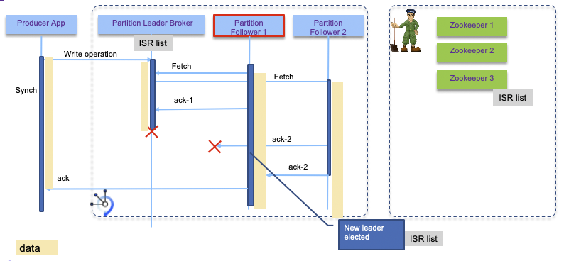

<AnchorLinks>
  <AnchorLink>High Availability</AnchorLink>
  <AnchorLink>Performance Considerations</AnchorLink>
  <AnchorLink>Disaster Recovery</AnchorLink>
  <AnchorLink>Solution Considerations</AnchorLink>
</AnchorLinks>


# High Availability

As a distributed cluster, kafka brokers ensure high availability to process new events. Topic has replication factor to support not loosing data in case of broker failure. You need at least 3 brokers to ensure availability and a replication factor set to 3 for each topic, so no data should be lost.
In production it is recommended to use 5 brokers cluster to ensure the quorum is always set, but replica factor can still be set to 3.

The brokers need to run on separate physical machines, and when cluster extends over multiple availability zone, a rack awareness configuration can be defined.

Partition enables data locality, elasticity, scalability, high performance, parallelism, and fault tolerance. Each partition is replicated at least 3 times and allocated in different brokers. One replicas is the **leader**. In the case of broker failure (broker 1 in figure below), one of the existing partition in the remaining running brokers will take the leader role (e.g. red partition in broker 3):


## Replication and partition leadership

The keys in the data record determine the partitioning of data in **Kafka**. The records with the same key will be in the same partition.

As kafka is keeping its cluster states in [Apache Zookeeper](http://zookeeper.apache.org/), you also need to have at least a three node cluster for zookeeper.
Writes to Zookeeper are only be performed on changes to the membership of consumer groups or on changes to the Kafka cluster itself.
Assuming you are using the most recent kafka version (after 0.9), it is possible to have a unique zookeeper cluster for multiple
kafka clusters. But the latency between Kafka and zookeeper needs to be under few milliseconds (< 15ms) anyway.
Zookeepers and Brokers should have high availability communication via dual network, and each broker and node allocated on different racks and blades.


Consumers and producers are using a list of bootstrap server names (also named advertiser.listeners) to contact the cluster.
The list is used for cluster discovery, it does not need to keep the full set of server names or ip addresses.
A Kafka cluster has exactly one broker that acts as the controller.

Per design Kafka aims to run within a single data center. But it is still recommended to use multiple racks connected with low latency dual networks.
With multiple racks you will have better fault tolerance, as one rack failure will impact only one broker. There is a configuration property
 to assign kafka broker using rack awareness. (See [this configuration](https://kafka.apache.org/documentation/#brokerconfigs) from the product documentation).

As introduced on the topic section above, data are replicated between brokers. The following diagram illustrates the best case scenario where followers fetch data from
the partition leader, acknowledge the replications:


Usually replicas is done in-sync, and the configuration settings specify the number of replicas in-sync needed: for example, a replicas 3 can have a minimum in-sync of 2,
to tolerate 1 out of sync replica (1 broker outage).

The leader maintains a set of in-sync-replicas (ISR) brokers: all the nodes which are up-to-date with the leader’s log, and actively acknowledging new writes.
Every write goes through the leader and is propagated to every node in the In Sync Replica set, or ISR.

Followers consume messages from the leader just as a normal Kafka consumer would and apply them to their own log.
Having the followers pull from the leader has the nice property of allowing the follower to naturally batch together
log entries they are applying to their log.

Once all nodes in the ISR have acknowledged the request, the leader considers it committed, and can acknowledge to the client.

A message is considered committed when all in-sync replicas for that partition have applied it to their log.

If a leader fails, followers elect a new one. The leadership of partitions is dynamic and changes as servers come and go.
Applications do not need to take specific actions to handle the change in the leadership of a partition. The Kafka client library automatically reconnects to the new leader, although you will see increased latency while the cluster settles.
Any replica in the ISR is eligible to be elected leader.



When a leader waits to get acknowledge before committing a message there will be more potential leaders. With (#failure + 1) replicas there is no data lost.
But there is a risk of having the single broker separated from the zookeeper cluster when network partition occurs. To tolerate f failures, both the majority
 vote and the ISR approach will wait for the same number of replicas to acknowledge before committing a message.

Having higher replicas number like 5, will duplicate 5 times the data (more disk used) and impact throughput as data is sent 1+4 times over the network.

Another important design distinction is that Kafka does not require that crashed nodes recover with all their data intact. 
Kafka protocol for allowing a replica to rejoin the ISR ensures that before rejoining, it must fully re-sync again even if
it lost unflushed data in its crash.

When a producer sends message, it can control how to get the response from the committed message: wait for all replicas to succeed, wait for one acknowledge, fire and forget.
Consumers receive only committed messages.

Always assess the latency requirements and consumers needs. Throughput is linked to the number of partitions within a topic and having more consumers running in parallel.
Consumers and producers should better run on separate servers than the brokers nodes. Running in parallel, also means the order of event arrivals will be lost.
Most of the time, consumers are processing events from a unique partition and Kafka record to partition assignment will guarantee that records with the same key hashcode will be in the same partition. So orders are preserved within a partition. But if consumer needs to read from multiple partitions then if ordered records is needed, the consumer needs to rebuild the order with some complex logic.

For high availability assess any potential single point of failure, such as server, rack, network, power supply... We recommend reading [this event stream article](https://ibm.github.io/event-streams/installing/planning/) for planning your kafka on Kubernetes installation.

For the consumers code update, the recreation of the consumer instance within the consumer group will trigger the partition rebalancing. This includes all the state of the aggregated data calculations that were persisted on disk. Until this process is finished real-time events are not processed. It is possible to limit this impact by setting the `group.initial.rebalance.delay.ms` to delay the rebalancing process one one instance of the consumer dies. Nevertheless the rebalancing will still occur when the updated consumer will rejoin the consumer group. When consumers are stream processing using Kafka streams, it is important to note that during the rollover the downstream processing will see a lag in event arrival: the time for the consumer to reread from the last committed offset. So if end to end timing is becoming important, we need to setup a standby consumer cluster (cluster B). This consumer group has different name, but does the same processing logic, and is consuming the same events from the same topic as the active consumer group cluster (cluster A). The difference is that they do not send events to the downstream topic until they are set up active. So to process the release cluster B is set active while cluster A is set inactive. The downstream will not be that much impacted.
Finally to be exhaustive, the control of the segment size for the change log topic, may be considered to avoid having the stream processing doing a lot of computation to reload its state when it restarts.

To add new broker, you can deploy the runtime to a new server / rack / blade, and give it a unique ID. Broker will process new topic, but it is possible to use tool to migrate some existing topic/ partitions to the new server. The tool is used to reassign partitions across brokers. An ideal partition distribution would ensure even data load and partition sizes across all brokers.

## High Availability in the context of Kubernetes deployment

The combination of kafka with Kubernetes seems to be a sound approach, but it is not that easy to achieve. Kubernetes workloads prefer to be stateless,
Kafka is a stateful platform and manages its own brokers, and replications across known servers. It knows the underlying infrastructure.
In Kubernetes, nodes and pods may change dynamically. Clients need to be able to access each of the broker directly once they get the connection metadata.
Having a service which will round robin across all brokers in the cluster will not work with Kafka.

The figure below illustrates a Kubernetes deployment, where zookeeper and kafka brokers are allocated to 3 worker nodes, with some event driven microservices deployed
in separate worker nodes. Those microservices are consumers and producers of events from one to many topics.


The advantages of deploying Kafka on Kubernetes cluster is to facilitate the management of stateful sets, by scheduling both the persistence volume and broker pods in a clean rolling rehydration. Services add a logical name to access brokers for any deployed workload within the cluster. The virtual network also enables transparent TLS communication between components.

For any Kubernetes deployment real high availability is constrained by the application / workload deployed on it. The Kubernetes platform supports high availability by having at least the following configuration:

* At least three master nodes (always an odd number of nodes). One is active at master, the others are in standby. The election of the master is using the quorum algorithm.
* Three proxy nodes.
* At least three worker nodes, but with zookeeper and Kafka clusters, we may need to have at least three more nodes as we do not want to have zookeeper and Kafka brokers sharing the same host as other pods if the Kakfa traffic is supposed to grow.
* Externalize the management stack to three manager nodes
* Shared storage outside of the cluster to support private image registry, audit logs, and statefulset data persistence (like the Kakfa broker file systems).
* Use `etcd` cluster: See recommendations [from this article](https://github.com/coreos/etcd/blob/master/Documentation/op-guide/clustering.md). The virtual IP manager assigns virtual IP addresses to master and proxy nodes and monitors the health of the cluster. It leverages `etcd` for storing information, so it is important that `etcd` is high available too and connected to low latency network below 10ms.

Traditionally disaster recovery and high availability were always consider separated subjects. Now active/active deployment where workloads are deployed in different data centers, is becoming a common request.

For sure, you need multiple Kafka Brokers, which will connect to the same ZooKeeper Ensemble running at least five nodes (you can tolerate the loss of one server during the planned maintenance of another server).
One Zookeeper server acts as a lead and the two others as stand-by.

The diagram above illustrates a simple deployment where zookeeper servers and kafka brokers are running in pods, in different worker nodes.
It is a viable solution to start deploying solution on top of kafka. When you have bigger cluster, it may be interesting to separate Zookeeper from **Kafka** nodes
to limit the risk of failover, as zookeeper keeps state of the **Kafka** cluster topology and metadata. You will limit to have both the zookeeper leader and
one kafka broker dying at the same time. We use Kubernetes [anti-affinity](https://kubernetes.io/docs/concepts/configuration/assign-pod-node/#affinity-and-anti-affinity)
to ensure they are scheduled onto separate worker nodes that the ones used by zookeeper. It uses the labels on pods with a rule like:
`**Kafka** pod should not run on same node as zookeeper pods`.

Here is an example of such spec:

```yaml
apiVersion: v1
kind: Pod
metadata:
  name: with-pod-affinity
spec:
  affinity:
    podAntiAffinity:
          requiredDuringSchedulingIgnoredDuringExecution:
            labelSelector:
            matchExpressions:
            - key: name
              operator: In
              values:
              - gc-zookeeper
          topologyKey: kubernetes.io/hostname
```

We recommend reading the ["running zookeeper in k8s tutorial"](https://kubernetes.io/docs/tutorials/stateful-application/zookeeper) for understanding such configuration.

For optimum performance, provision a **fast storage class** for persistence volume.

**Kafka** uses the `log.dirs` property to configure the driver to persist logs. So you need to define multiple volumes/ drives to support `log.dirs`.

Zookeeper should not be used by other applications deployed in k8s cluster, it has to be dedicated for one **Kafka** cluster only.

In a multi-cluster configuration being used for disaster recovery purposes, messages sent between clusters will have different offsets in the two clusters. It is usual to use timestamps for position information when restarting applications for recovery after a disaster.

For **Kafka** streaming with stateful processing like joins, event aggregation and correlation coming from multiple partitions, it is not easy to achieve high availability cross clusters: in the strictest case every event must be processed by the streaming service exactly once. Which means:

* producer emits data to different sites and be able to re-emit in case of failure. Brokers are known by producer via a list of hostnames and port numbers.
* communications between zookeepers and cluster nodes are redundant and safe for data losses
* consumers ensure idempotence... They have to tolerate data duplication and manage data integrity in their persistence layer.

Within Kafka's boundary, data will not be lost, when doing proper configuration, also to support high availability the complexity moves to the producer and the consumer implementation.

**Kafka** configuration is an art and you need to tune the parameters by use case:

* Partition replication for at least 3 replicas. Recall that in case of node failure,  coordination of partition re-assignments is provided with ZooKeeper.
* End to end latency needs to be measured from producer (when a message is sent) to consumer (when it is read). A consumer is able to get a message when the brokers finish replicating to all in-synch replicas.
* Use the producer buffering capability to pace the message to the broker. Can use memory or time based threshold via producer properties.
* Define the number of partitions to drive consumer parallelism. More consumers running in parallel the higher is the throughput. When using multiple partitions the global ordering of message is lost.
* Assess the retention hours to control when old messages in topic can be deleted. It is possible to keep messages forever, and for some application it makes fully sense.
* Control the maximum message size the server can receive.

Zookeeper is not CPU intensive and each server should have a least 2 GB of heap space and 4GB reserved. Two CPUs per server should be sufficient. Servers keep their entire state machine in memory, and write every mutation to a durable WAL (Write Ahead Log) on persistent storage. To prevent the WAL from growing without bound, ZooKeeper servers periodically snapshot their in memory state to storage. Use fast and dynamically provisioned persistence storage for both WAL and snapshot.

# Performance Considerations

Performance will vary depending of the current kafka broker nodes load: in Kubernetes deployment, with small production topology, nodes may shared with other pods. It is recommended to control the environment with dedicated nodes for Kafka to achieve higher throughput.  Performance will always depend on
numerous factors including message throughput, message size, hardware, configuration settings, ...

Performance may be linked to different focuses:

* Resilience: ensuring replication and not loosing data
* Throughput: ensuring message processing performance
* Payload size: support larger message

## Resilience

When defining a topic, we need to specify the replicas factor to match the be at least 3 and then set the minimum number of in-sync replicas that specifies how may replicas must acknowledge a write to satisfy a producer that requests acknowledgments from all replicas. (`min.insync.replicas`).

The replication of message data between brokers can consume a lot of network bandwidth so isolating replication traffic from application traffic can benefit performance. To achieve this, all replication traffic is configured to flow on a dedicated internal network.

## Throughput

To achieve higher throughput the messages are not replicated across brokers and the acknowledgement can be set to only one broker. Expose resiliency to failures.

The number of producers and consumers are aligned, and the number of partitions matches the number of consumers. All consumers are in the same consumer group. Measurement has to be done from the producer code.
With 12 producers on a 3 brokers cluster and small payload (128 bytes), with 24 consumers the measured throughput is around 2.3 M messages / second.

## Payload size

From measurement tests done using Kafka producer performance tool, there is a 1/log(s) curve, where below 10k bytes the performances are correct and then slowly degrade from 3000 msg /s (10k bytes msg) to 65 msg/s (515kb msg).

To do performance test the [event-streams-sample-producer](https://github.com/IBM/event-streams-sample-producer) github provides producer tool in Java, using a group of threads to run in multi cores machine. This project can be dockerized, and deployed in k8s. It uses the kafka tool named: `ProducerPerformance.java` in the jar:

```xml
<dependency>
  <groupId>org.apache.kafka</groupId>
  <artifactId>kafka-tools</artifactId>
</dependency>
```

## Parameter considerations

There are a lot of factors and parameters that needs to be tuned to improve performance at the brokers threading level (`num.replica.fetchers, num.io.threads, num.network.threads, log.cleaner.threads` ) and the pod resources constraints. See [configuration documentation](https://kafka.apache.org/documentation/#configuration).

## Openshift specifics

When exposing the kafka broker via Routes, the traffic is encrypted with TLS, so client needs to deal with TLS certificates and encryption. Routes are exposed via DNS and HAProxy router. The router will act as middleman between kafka clients and brokers, adding latency, and it can become bottleneck. The traffic generated by client needs to be sized and in case of the router needs to be scaled up, and even isolate the routing by adding a separate router for the kafka routes.

# Disaster Recovery

With the current implementation it is recommended to have one cluster per data center / availability zone. Consumers and producers are co-located to the brokers cluster. When there are needs to keep some part of the data replicated in both data center, you need to assess what kind of data can be aggregated, and if Kafka mirroring tool can be used. The tool consumes from a source cluster, from a given topic, and produces to a destination cluster with the same named topic. It keeps the message key for partitioning, so order is preserved.


The above diagram is using Kafka MirrorMaker with a master to slave deployment. Within the data center 2, the brokers are here to manage the topics and events. When there is no consumer running, nothing happen. Consumers and producers can be started when DC1 fails. This is the active/passive model. In fact, we could have consumers within the DC2 processing topics to manage a read-only model, keeping in memory their projection view, as presented in the [CQRS pattern](../../patterns/cqrs/).

The second solution is to use one mirror maker in each site, for each topic. This is an active - active topology: consumers and producers are on both sites. But to avoid infinite loop, we need to use naming convention for the topic, or only produce in the cluster of the main topic. Consumers consume from the replicated topic.


When you want to deploy solution that spreads over multiple regions to support global streaming, you need to address the following challenges:

* How do you make data available to applications across multiple data centers?
* How to serve data closer to the geography?
* How to be compliant on regulations, like GDPR?
* How to address no duplication of records?

[Kafka 2.4](https://www.confluent.io/blog/apache-kafka-2-4-latest-version-updates/) introduces the capability for a consumer to read messages from the closest replica using some rack-id and specific algorithm. This capability will help to extend the cluster to multiple data center and avoid having consumers going over WAN communication.

# Solution Considerations

There are a set of design considerations to assess for each **Kafka** solution:

## Topics

Performance is more a function of number of partitions than topics. Expect that each topic has at least one partition. When considering latency you should aim for limiting to hundreds of topic-partition per broker node.

What of the most important question is what topics to use?. What is an event type? Should we use one topic to support multiple event types?
Let define that an event type is linked to a main business entity like an Order, a ship, a FridgeredContainer. OrderCreated, OrderCancelled, OrderUpdated, OrderClosed are events linked to the states of the Order. The order of those events matter. So the natural approach is to use one topic per data type or schema, specially when using the topic as Event Sourcing where event order is important to build the audit log. You will use a unique partition to support that. The orderID is the partition key and all events related to the order are in the same topic.

The important requirement to consider is the sequencing or event order. When event order is very important then use a unique partition, and use the entity unique identifier as key. Ordering is not preserved across partitions.

When dealing with entity, independent entities may be in separate topics, when strongly related one may stay together.

Other best practices:

* When event order is important use the same topic and use the entity unique identifier as partition key.
* When two entities are related together by containment relationship then they can be in the same topic.
* Different entities are separated to different topics.
* It is possible to group topics in coarse grained one when we discover that several consumers are listening to the same topics.
* Clearly define the partition key as it could be an compound key based on multiple entities.

With **Kafka** stream, state store or KTable, you should separate the changelog topic from the others.

## Producers

When developing a record producer you need to assess the following:

* What is the expected throughput to send events? Event size * average throughput combined with the expected latency help to compute buffer size.
* Can the producer batch events together to send them in batch over one send operation?
* Is there a risk for loosing communication? Tune the RETRIES_CONFIG and buffer size
* Assess *once to exactly once* delivery requirement. Look at idempotent producer.

See [implementation considerations discussion](../../kafka-producers/)

## Consumers

From the consumer point of view a set of items need to be addressed during design phase:

* Do you need to group consumers for parallel consumption of events?
* What is the processing done once the record is processed out of the topic? And how a record is supposed to be consumed?.
* How to persist consumer committed position? (the last offset that has been stored securely)
* Assess if offsets need to be persisted outside of Kafka?. From version 0.9 offset management is more efficient, and synchronous or asynchronous operations can be done from the consumer code.
* Does record time sensitive, and it is possible that consumers fall behind, so when a consumer restarts he can bypass missed records?
* Do the consumer needs to perform joins, aggregations between multiple partitions?

See [implementation considerations discussion](../../kafka-consumers/)
