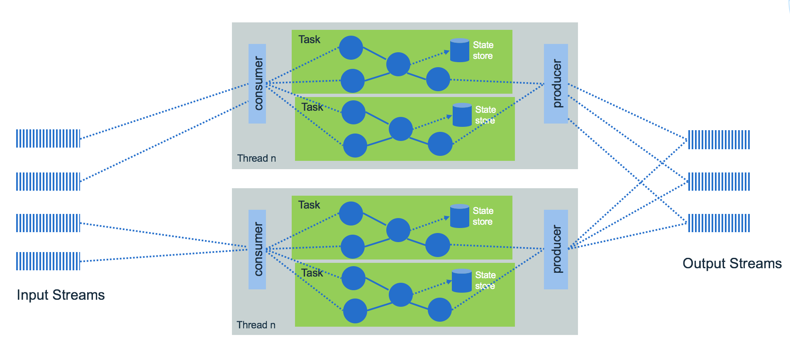

Kafka Streams is a graph of processing nodes to implement the logic to process event streams. The logic is implemented via one topology that represents the graph.  Each node within the grapth, processes events from the parent node. We recommend reading this excellent introduction [Kafka stream made simple](https://www.confluent.io/blog/introducing-kafka-streams-stream-processing-made-simple/) from Jay Kreps from Confluent to get a good understanding of why Kafka stream was created.

To summarize, **Kafka Stream** has the following capabilities:

* Stream processing is helpful for handling out-of-order data, *reprocessing* input as code changes, and performing stateful computations, like real time analytics. It uses producer / consumer APIs, stateful storage and consumer groups. It treats both past and future data the same way.
* Kafka Stream is an embedded library to integrate in your Java application. No need for separate processing cluster.
* It integrates tables for state persistence combined streams of events. Tables are saved in kafka topic too and are queryables.
* Topology consumes continuous real time flows of records and publishes new flows to one or more topics.
* It can scale vertically, by increasing the number of threads for each Kafka Streams application on a single machine, and horizontally by adding additional machines.  Each deployed instance use the same value for the `application.id` kafka stream property.
* It supports exactly-once processing semantics to guarantee that each record is processed once and only once even when there is a failure.
* Stream APIs transform, aggregate and enrich data, per record with milli second latency, from one topic to another one.
* Supports stateful and windowing operations by processing one record at a time.



* An application's processor topology is scaled by breaking it into multiple tasks.
* Tasks can then instantiate their own processor topology based on the assigned partitions.

In general the code for processing event does the following:

* Set a properties object to specify which brokers to connect to and what kind of serialization to use.
* Define a stream client: if you want to get the stream of records use **KStream**, if you want a changelog with the last value of a given, key use **KTable** (Example of using KTable is to keep a user profile with userid as key).
* Create a topology of input source and sink target and the set of actions to perform in between.
* Start the stream client to consume records.

Programming with KStream and Ktable is not easy at first, as there are a lot of concepts for data manipulations, serialization and operations chaining.

A stateful operator uses the streaming Domain Specific Language, with constructs for aggregation, join and time window operations. Stateful transformations require a state store associated with the stream processor.

## Simple example

The code below comes from Kafka examples and is counting word occurrence in text:

```java
final StreamsBuilder builder = new StreamsBuilder();
// pattern to extract word
final Pattern pattern = Pattern.compile("\\W+");
// source is a kafka topic
KStream<String, String> textLines = builder.stream(source);

KTable<String, Long> wordCounts = textLines
    .flatMapValues(textLine -> Arrays.asList(pattern.split(textLine.toLowerCase())))
    .print(Printed.toSysOut())
    .groupBy((key, word) -> word)
    .count(Materialized.<String, Long, KeyValueStore<Bytes, byte[]>>as("counts-store"));
// sink is another kafka topic. Produce for each word the number of occurrence in the given doc
wordCounts.toStream().to(sink, Produced.with(Serdes.String(), Serdes.Long()));

KafkaStreams streams = new KafkaStreams(builder.build(), props);
streams.start();
```

* [KStream](https://kafka.apache.org/25/javadoc/org/apache/kafka/streams/kstream/KStream.html) represents KeyValue records coming as event stream from the topic.
* `flatMapValues()` transforms the value of each record in "this" stream into zero or more values with the same key in a new KStream (in memory). So here the text line is split into words. The parameter is a [ValueMapper](https://kafka.apache.org/25/javadoc/org/apache/kafka/streams/kstream/ValueMapper.html) which applies transformation on values but keeps the key. Another important transformation is the [KeyValueMapper](https://kafka.apache.org/25/javadoc/org/apache/kafka/streams/kstream/KeyValueMapper.html).
* `groupBy()` Group the records of this KStream on a new key that is selected using the provided KeyValueMapper. So here it creates new KStream with the extracted word as key.
* `count()` counts the number of records in this stream by the grouped key. `Materialized` is an class to define a "store" to persist state and data. So here the state store is "counts-store". As store is a in-memory table, but it could also be persisted in external database. Could be the Facebook's [RocksDB key value persistence](https://rocksdb.org/) or a log-compacted topic in Kafka.
* Produced defines how to provide the optional parameter types when producing to new topics.
* KTable is an abstraction of a changelog stream from a primary-keyed table.

Important: map, flatMapValues and mapValues ... functions don’t modify the object or value presented as a parameter.

See [this article from Confluent](https://docs.confluent.io/current/streams/architecture.html) for deeper kafka stream architecture presentation.

### Example to run the Word Count application

1. Be sure to create the needed different topics once the Kafka broker is started (test-topic, streams-wordcount-output):

    ```shell
    docker exec -ti Kafka /bin/bash
    cd /scripts
    ./createtopics.sh
    ```

1. Start a terminal window and execute the command to be ready to send message.

    ```shell
    $ docker exec -ti Kafka /bin/bash
    # can use the /scripts/openProducer.sh or...
    root> /opt/Kafka_2.11-0.10.1.0/bin/Kafka-console-producer.sh --broker-list localhost:9092 --topic streams-plaintext-input
    ```

1. Start another terminal to listen to the output topic:

    ```shell
    $ docker exec -ti Kafka /bin/bash
    # can use the /scripts/consumeWordCount.sh or...
    root> /opt/Kafka_2.11-0.10.1.0/bin/Kafka-console-consumer.sh --bootstrap-server localhost:9092 --topic streams-wordcount-output --from-beginning --formatter Kafka.tools.DefaultMessageFormatter --property print.key=true --property print.value=true --property key.deserializer=org.apache.Kafka.common.serialization.StringDeserializer --property value.deserializer=org.apache.Kafka.common.serialization.LongDeserializer
    ```

1. Start the stream client to count word in the entered lines

    ```shell
    mvn exec:java -Dexec.mainClass=ibm.cte.Kafka.play.WordCount
    ```

Outputs of the WordCount application is actually a continuous stream of updates, where each output record is an updated count of a single word. A KTable is counting the occurrence of word, and a KStream send the output message with updated count.

## Some other examples

See [this work in progress repository](https://github.com/jbcodeforce/kafka-streams-samples) where we implement some topology for some common patterns.

* For example map values to from Item to a new type (inventory):

```java
private JsonbSerde<Item> itemSerde = new JsonbSerde<>(Item.class);
...
builder.stream(inTopicName, Consumed.with(Serdes.String(), itemSerde))
        .mapValues( v ->  {
            Inventory ivt = new Inventory();
            ivt.itemID = v.itemCode;
            ivt.quantity = v.quantity;
            return   ivt;})
        .to(resultTopicName, Produced.with(Serdes.String(), inventorySerde));
```

* Extract values from input to create other object: (Example from KStreams in Action book chapter 3)

```java
KStream<String, PurchasePattern> patternKStream =
     purchaseKStream.mapValues(purchase -> PurchasePattern.builder(purchase).build());

patternKStream.to("patterns", Produced.with(Serdes.String(),new JSONSerde<Purchase>())));
```

* Map key by using KeyValueMapper: For example to filter low level transaction and generate a stream with a key = to a time:

```java
KeyValueMapper<String, Purchase, Long> purchaseDateAsKey = (key, purchase) -> purchase.getPurchaseDate().getTime();

KStream<Long, Purchase> filteredKStream = purchaseKStream.filter((key, purchase) -> purchase.getPrice() > 5.00).selectKey(purchaseDateAsKey);
```

## Some design considerations

* Partitions are assigned to a StreamTask, and each StreamTask has its own state store. So important to be sure to have key and kafka will assign records with same key to same partition so lookup inside state store will work.
* Avoid external database lookup as part of the stream: As kafka can handle million of records per second, so a lookup to an external database to do a join between a primary key that is in the event and a table in the database to do a data enrichment, for example is a bad practice. The approach will be to use Ktable, with state store and perform a join in memory.
* Reference data can be loaded inside a Ktable for event stream enrichment.

### Join streams Examples

We recommend reading [this deep dive article](https://www.confluent.io/blog/crossing-streams-joins-apache-kafka/) on joining streams and stream with table. The important points from this article:

* kstream - kstream joins are windowed to control the size of data to keep in memory to search for the matching records.

## Faust: a python library to do kafka streaming

[Faust](https://faust.readthedocs.io/en/latest/index.html) is a python library to support stream processing. It does not have its own DSL as Kafka streams in Java has, but just python functions.

It uses rocksdb to support tables.

For the installation, in your python environment do a `pipenv run pip install faust`, or `pip install faust`. Then use faust as a CLI. So to start an agent as worker use:

```shell
faust -A nameofthepythoncode -l info
```

Multiple instances of a Faust worker can be started independently to distribute stream processing across machines and CPU cores.

## Further reading

* The API and [product documentation](https://kafka.apache.org/21/documentation/streams/developer-guide/).
* [Deep dive explanation for the differences between KStream and KTable from Michael Noll](https://www.michael-noll.com/blog/2018/04/05/of-stream-and-tables-in-kafka-and-stream-processing-part1/)
* [Our set of samples to getting started in coding kafka streams](https://github.com/jbcodeforce/kafka-streams-samples) 
* [Distributed, Real-time Joins and Aggregations using Kafka Stream, from Michael Noll at Confluent](https://www.confluent.io/blog/distributed-real-time-joins-and-aggregations-on-user-activity-events-using-kafka-streams/)
