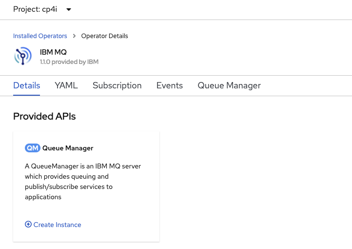
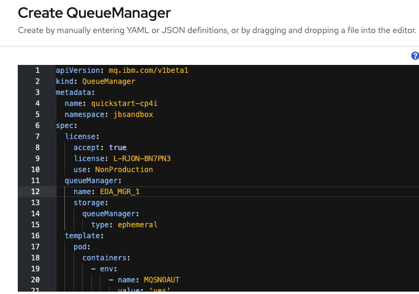

<InlineNotification kind="warning">
<strong>TODO</strong> - Work in progress
</InlineNotification>


[IBM MQ](https://www.ibm.com/support/knowledgecenter/en/SSFKSJ_9.2.0/com.ibm.mq.pro.doc/q001020_.htm) is the enterprise solution to exchange message over queues. 
As it supports loosely coupling communication between applications, via asynchronous protocol, it is part of the event driven architecture product portfolio and makes senses to continue to include it as part of modern cloud native solutions. 

This note is to summarize for architect the technology fits into EDA and gives pointers to important documentations, articles, and code repositories for using MQ.

We already addressed the [difference between event and messaging](../../concepts/events-versus-messages) systems, and we can affirm that real production plaform needs to include both. This site includes a lot on Kafka as the backbone to support EDA, but MQ delivers a very important missing element is the transactional support to write message to queue to ensure message delivery. 

MQ queue managers are the main component to define queue and where applications connect to. They can be organized in network to deliver messages between applications and locations. Managers can be organized in cluster to increase high availability and scaling.

 

We encourage to read the [article from Richard Coppen's: 'IBM MQ fundamentals'](https://developer.ibm.com/components/ibm-mq/articles/mq-fundamentals).

## Major benefits in EDA

* **MQ provides assured delivery of data**: No data loss and no duplication, strong support of exactly once.
* **MQ is horizontally scalable**: As the workload for a single queue manager increases, it is easy to add more queue managers to share tasks and distribute the messages across them. 
* **Highly available**
* Integrate well with Mainframe to propagate transaction to eventual consistenty world of cloud native distributed applications. Writing to database and MQ queue is part of the same transaction, which simplifies the injection into event backbone like Kafka, via MQ connector.
* Containerized to run on modern kubernetes platform.

## Installation with Cloud Pak for Integration

Starting with release 2020.2, MQ can be installed via Kubernetes Operator on Openshift platform. From the operator catalog search for MQ. See the [product documentation installation guide](https://www.ibm.com/support/knowledgecenter/SSFKSJ_9.2.0/com.ibm.mq.ctr.doc/ctr_installing_ui.htm) for up to date details.

You can verify your installation with the following CLI, and get the IBM catalogs accessible:

```shell
oc project openshift-marketplace
oc get CatalogSource
NAME                   DISPLAY                TYPE      PUBLISHER     AGE
certified-operators    Certified Operators    grpc      Red Hat       42d
community-operators    Community Operators    grpc      Red Hat       42d
ibm-operator-catalog   ibm-operator-catalog   grpc      IBM Content   39d
opencloud-operators    IBMCS Operators        grpc      IBM           39d
redhat-marketplace     Red Hat Marketplace    grpc      Red Hat       42d
redhat-operators       Red Hat Operators      grpc      Red Hat       42d
```

Once everything is set up, create an operator. The IBM MQ operator can be installed scoped to a single namespace or all namespaces.  
 
 </img>

Verify your environment fits the deployment. [Prepare your Red Hat OpenShift Container Platform for MQ](https://www.ibm.com/support/knowledgecenter/SSFKSJ_9.2.0/com.ibm.mq.ctr.doc/ctr_prepare_project_ui.htm)
Then once the operator is installed (it could take up to a minute), go to the operator page and create a MQ Manager instance. For example be sure to have defined an ibm-entitlement-key in the project you are planning to use to deploy MQ manager

 </img>

Then update the Yaml file for name, license and persistence.

 </img>

As an alternate define a QueueManager manifest / yaml file.

 ```yaml
apiVersion: mq.ibm.com/v1beta1
kind: QueueManager
metadata:
  name: eda-mq-lab
spec:
  version: 9.2.0.0-r1
  license:
    accept: true
    license: L-RJON-BN7PN3
    use: NonProduction
  web:
    enabled: true
  queueManager:
    name: "EDAQMGR1"
    storage:
      queueManager:
        type: ephemeral
  template:
    pod:
      containers:
       - name: qmgr
         env:
         - name: MQSNOAUT
           value: "yes"
 ```

 Then create the QueueManager resource: 

 ```shell
 oc apply -f mq-manager.yaml 
 # Get the UI route 
 oc describe queuemanager eda-mq-lab
 ```

 You should get the console from this URL:
 
 

## Getting access to the MQ manager

## Important readings

* [MQ family page](https://www.ibm.com/support/knowledgecenter/en/SSFKSJ/com.ibm.mq.helphome.doc/product_welcome_wmq.htm)
* [Cloud Pack for Integration product documentation](https://www.ibm.com/support/knowledgecenter/en/SSGT7J_20.2/overview.html)
* [MQ 9.2 product documentation](https://www.ibm.com/support/knowledgecenter/en/SSFKSJ_9.2.0/com.ibm.mq.helphome.v92.doc/WelcomePagev9r1.htm)
* [Article for developer from Richard Coppen's: 'IBM MQ fundamentals'](https://developer.ibm.com/components/ibm-mq/articles/mq-fundamentals)
* [MQ on Container](https://developer.ibm.com/tutorials/mq-connect-app-queue-manager-containers/)

## Code repositories

* []()