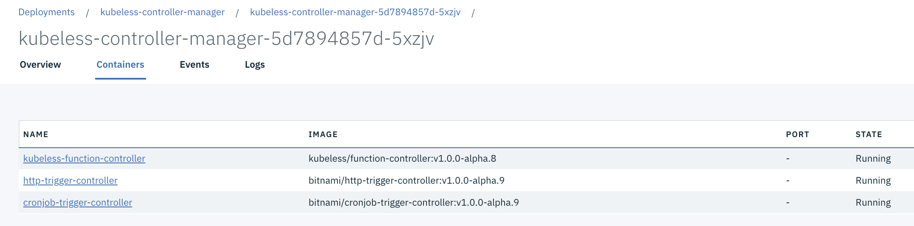

## Kubeless
To install kubeless on ICP we first connect to the cluster and then use the command below:

```
$ kubectl create namespace kubeless
$ kubectl create -f https://github.com/kubeless/kubeless/releases/download/v1.0.0-alpha.8/kubeless-v1.0.0-alpha.8.yaml -n kubeless
```
The image is using RBAC:

The deployment creates one pod with 3 containers inside:


We need to have the `kubeless` CLI install:
```
$ export OS=$(uname -s| tr '[:upper:]' '[:lower:]')
$ curl -OL https://github.com/kubeless/kubeless/releases/download/$RELEASE/kubeless_$OS-amd64.zip && \
  unzip kubeless_$OS-amd64.zip && \
  sudo mv bundles/kubeless_$OS-amd64/kubeless /usr/local/bin/
```

### To deploy a simple hello
The code for this function is under [this repository](https://github.com/ibm-cloud-architecture/refarch-cognitive-analytics/tree/master/src/functions)
but it is a simple python function implementing the serverless 'interface':
```python3
def hello(event, context):
  print(event)
  return event['data']
```
To deploy we can use the command:
```
$ kubeless function deploy hellojb --runtime python3.6  --trigger-http --from-file functionHello.py --handler functionHello.hello
INFO[0000] Deploying function...
INFO[0001] Function hellojb submitted for deployment
INFO[0001] Check the deployment status executing 'kubeless function ls hellojb'
```

To see the functions deployed
```
$ kubectl get functions
```
or
```
$ kubeless function ls
NAME   	NAMESPACE   	HANDLER   	RUNTIME  	DEPENDENCIES	STATUS
hellojb	greencompute	test.hello	python3.6	            	1/1 READY
```

The deployment of a function creates automatically a pod:
```
$ kubectl describe pod hellojb
...
Containers:
  hellojb:
    Container ID:   docker://53ca1131747e5b18bfeb67609b4e7bb2400cf45202ade2c03274b9df1eff9bc2
    Image:          kubeless/python@sha256:0c9f8f727d42625a4e25230cfe612df7488b65f283e7972f84108d87e7443d72
    Image ID:       docker-pullable://kubeless/python@sha256:0c9f8f727d42625a4e25230cfe612df7488b65f283e7972f84108d87e7443d72
    Port:           8080/TCP
    Host Port:      0/TCP
    State:          Running
      Started:      Thu, 06 Sep 2018 17:12:52 -0700
    Ready:          True
    Restart Count:  0
    Liveness:       http-get http://:8080/healthz delay=3s timeout=1s period=30s #success=1 #failure=3
    Environment:
      FUNC_HANDLER:       hello
      MOD_NAME:           test
      FUNC_TIMEOUT:       180
      FUNC_RUNTIME:       python3.6
      FUNC_MEMORY_LIMIT:  0
      FUNC_PORT:          8080
      PYTHONPATH:         /kubeless/lib/python3.6/site-packages:/kubeless
    Mounts:
      /kubeless from hellojb (rw)
      /var/run/secrets/kubernetes.io/serviceaccount from default-token-9nw2z (ro)
```
and kubeless create service for each function:
```
$ kubectl describe svc hellojb
Name:              hellojb
Namespace:         greencompute
Labels:            created-by=kubeless
                   function=hellojb
Annotations:       <none>
Selector:          created-by=kubeless,function=hellojb
Type:              ClusterIP
IP:                10.10.10.41
Port:              http-function-port  8080/TCP
TargetPort:        8080/TCP
Endpoints:         192.168.130.101:8080
Session Affinity:  None
Events:            <none>
```

* Remove the function
```
kubeless delete
```
### Calling the function
The quickest way is to proxy the server and then call the local URL:
```
$ kubectl proxy -p 8080 &
$ kubeless function call hellojb --data 'Hello Bill!'
```

A second way is to test using HTTP client.

## Developing a predictive scoring function
In [this project](https://github.com/ibm-cloud-architecture/refarch-asset-analytics/tree/master/asset-predictive-scoring) we are addressing how to develop a scoring service using Python, sklearn and serveless to deploy the model as function.

## Compendium
* [Excellent article from Martin Fowler](https://martinfowler.com/articles/serverless.html)
* [Serverless framework](https://serverless.com/): The Framework uses new event-driven compute services, like AWS Lambda, Google Cloud Functions, and more. It's a command-line tool, providing scaffolding, workflow automation and best practices for developing and deploying your serverless architecture.
* [Apache OpenWhisk](https://openwhisk.apache.org/)
* [Claudia to deploy nodejs on AWS lambda](https://github.com/claudiajs/claudia)
* [Zappa](https://github.com/Miserlou/Zappa): Zappa makes it super easy to build and deploy server-less, event-driven Python applications on AWS Lambda + API Gateway.
* [Serverless conf: operational best practices](https://charity.wtf/2016/05/31/operational-best-practices-serverless/)
* [Evaluating cost for FaaS](http://www.doc.ic.ac.uk/~rbc/papers/fse-serverless-17.pdf)
