<AnchorLinks>
  <AnchorLink>Overview</AnchorLink>
  <AnchorLink>Scenario Prerequisites</AnchorLink>
  <AnchorLink>Creating Event Streams Topics</AnchorLink>
  <AnchorLink>Event Streams Security: API Key, Credentials and Certificates</AnchorLink>
  <AnchorLink>Creating the Quarkus with MicroProfile Reactive Messaging Application</AnchorLink>
  <AnchorLink>Setting up the Kafka Strimzi Operator</AnchorLink>
  <AnchorLink>Setting up the Kafka Connect Cluster</AnchorLink>
  <AnchorLink>Building and Applying IBM COS Sink Connector</AnchorLink>
  <AnchorLink>Event Streams v10 Addendum</AnchorLink>
  <AnchorLink>Test the Entire Flow</AnchorLink>
</AnchorLinks>

## Overview
- Now that you have an Event Streams instance installed on Cloud Pak for Integration on top of OpenShift Container Platform the goal of this story is to show a possible use case that we can use with this technology.
- With IBM Event Streams we have access to the powerful capabilities of Kafka in addition to all the monitoring and logging capabilities that IBM provides on top of that with Event Streams.
- We will create a simple Quarkus (a super sonic and sub-atomic Kubernetes native framework for Java) application that utilizes MicroProfile Reactive Messaging in order for us to send a stream of data to our Event Streams/Kafka topic.
- We will then create a Kafka Connect cluster using the Strimzi Operator.
- Lastly we'll send messages to an Event Streams topic from our Quarkus application which then triggers the IBM COS Connector to grab messages and place into an IBM COS Bucket.

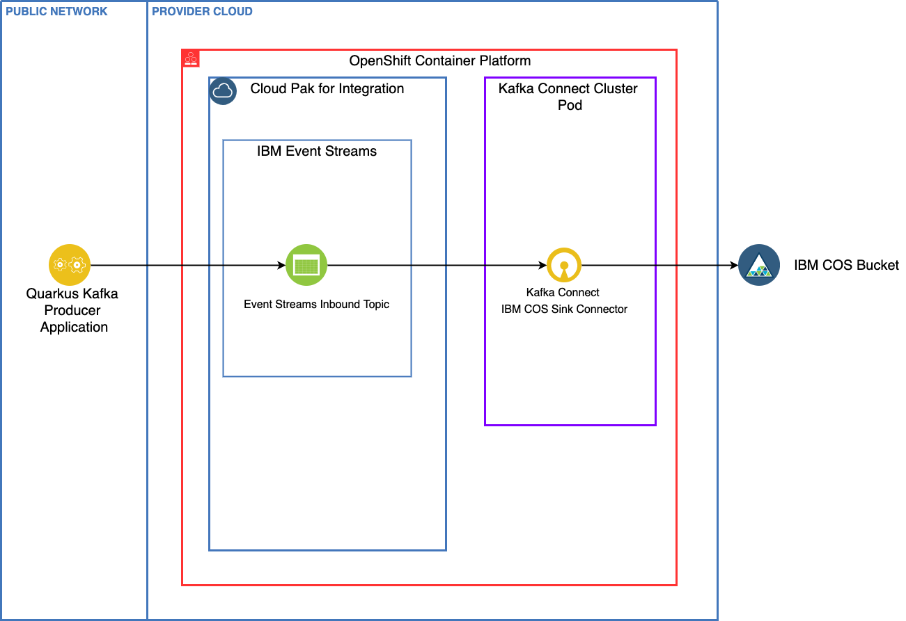


## Scenario Prerequisites
**OpenShift Container Platform Cluster** 
  - This scenario will assume you have a 4.x Cluster as we will make use of Operators, though this one is 4.3 specifically.
  
**Cloud Pak for Integration**
  - This will assume you have probably at least a 2019.4.1 or 2020.x.x release of the Cloud Pak for Integration installed on OpenShift. This story will also assume you have followed the installation instructions for Event Streams outlined here from the [Cloud Pak Playbook](https://cloudpak8s.io/integration/cp4i-deploy-eventstreams/) and have a working Event Streams instance.
  
**Java**
  - Java Development Kit (JDK) v1.8+ (Java 8+)

**Maven**
  - The scenario uses Maven v3.6.3

**Gradle**
  - Ideally v4.0+ (Note - the gradle shadowJar command might not work on Java 13)

**An IDE of your choice**
  - Visual Studio Code is used in this scenario.

**Git**
  - We will need to clone repositories.

**An IBM Cloud Account (free)**
  - A free (Lite) IBM Cloud Object Storage trial Service account [IBM Cloud Object Storage](https://cloud.ibm.com/catalog/services/cloud-object-storage)


## Creating Event Streams Topics
- Navigate to the Cloud Pak for Integration Platform Navigator. 

- Click View Instances and click the Event Streams instance that you have created.

- Click `Connect to this Cluster` in the top right.
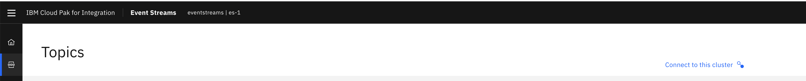

- Click the Topics option on the left. Create the INBOUND topic.

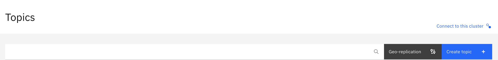

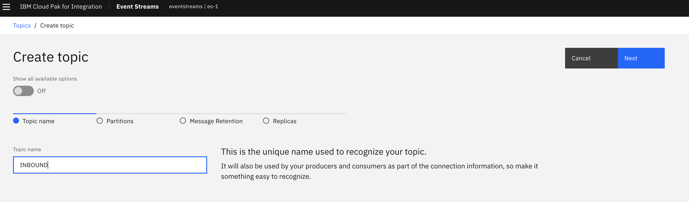

- Leave Partitions at 1.

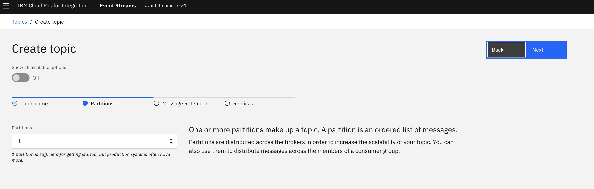

- Depending on how long you want messages to persist you can change this.

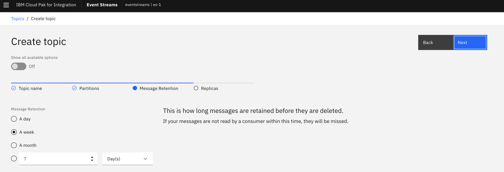

- You can leave Replication Factor at the default 3.

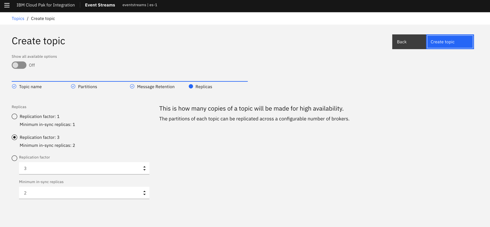

- Click Create.


## Event Streams Security: API Key, Credentials and Certificates

- To connect to our Event Streams Instance we will need to follow a few steps to properly connect to it.

- While viewing our Event Streams Instance, navigate to the Topics menu from the left. Click Connect to this Cluster - 

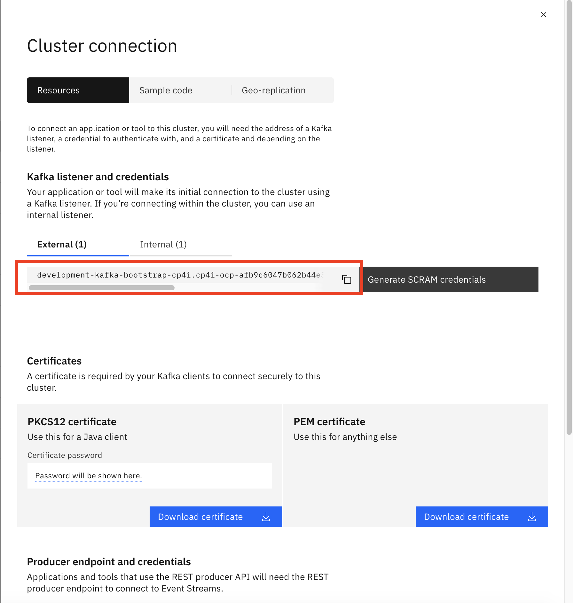

- Make sure that you're on **External Connection** as we will need to test/connect from an application on a local machine. Keep note of your **Bootstrap Server Address**. Save this somewhere as we will need this later to configure our Quarkus Application's connection to the Event Streams instance.


- Generate your **SCRAM Credentials**. Click the `Generate SCRAM Credentials` button.

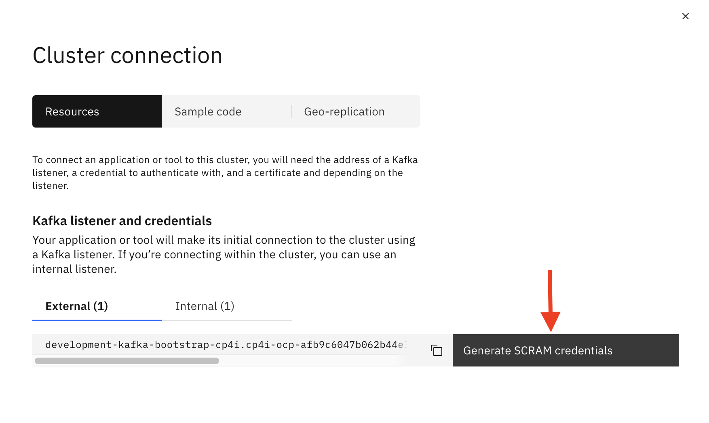

- Select a name for your secret and make sure you rmeember/take note of it as we will need this later. Also choose the Produce, Consume, Create Topics and Schema Option.

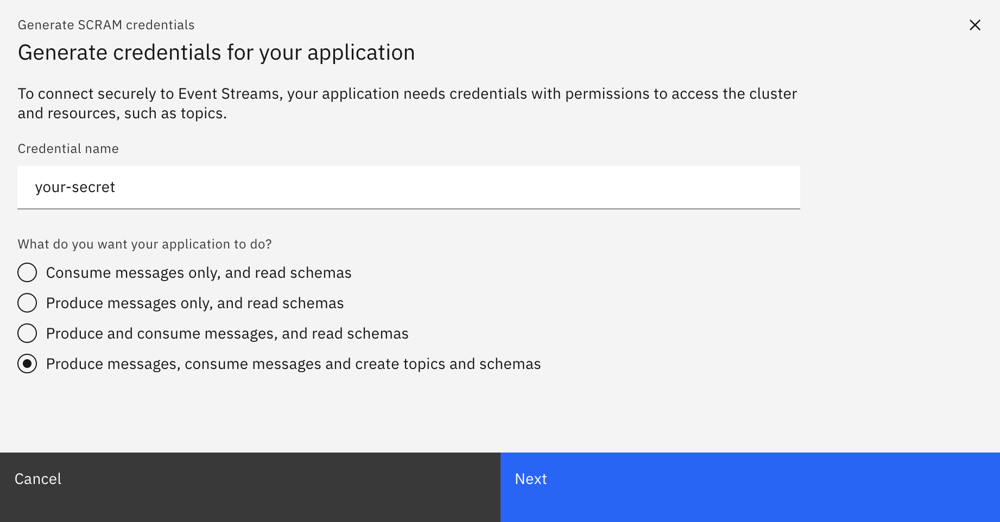

- Select `All Topics` and then click Next.


- Leave it with `All Consumer Groups` and click Next.


- Leave it on `All Transactional IDs`


- You may occassionally see this error in the UI. The reason this occurs is that the KafkaUser Custom Resource that gets created also houses our Secret. However the secret itself will sometimes only be created after the KafkaUser due to a timeout. 


- If this error occurs, log into your OpenShift cluster and go to the project/namespace that your Event Streams v10 instance is installed in. If you run these commands you will see your secret.

`oc get kafkauser`


`oc get secrets`

- Your `SCRAM Username` that we will need for later is the name of your secret. The `SCRAM Password` can be either obtained by going to your OpenShift Console Web UI and revealing the password through the secrets menu or through the CLI. Run the following commands to see the value of the password.

`oc get secret your-secret -o yaml | grep password`

- This will return you a base64 encoded value. Decode this like so

`echo "dWpPN3ZSSEF1clRK" | base64 -d`

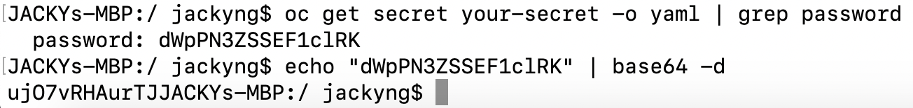


- Lastly download the PKCS12 truststore .pkcs12 certificate. Once you hit the Download button the password to the truststore will be revealed. **Copy this down** as we will need it.


**Summary** 
- We now have the bootstrap server address, API Key, .jks truststore certificate, and the truststore password associated with that certificate to allow us the ability to connect to our Event Streams instance.


## Creating the Quarkus with MicroProfile Reactive Messaging Application 
- Create the Quarkus project. You can replace {} and the contents inside of {} with whatever you would like.

```bash
mvn io.quarkus:quarkus-maven-plugin:1.6.0.Final:create \
    -DprojectGroupId={org.acme} \
    -DprojectArtifactId={quarkus-kafka} \
    -Dextensions="kafka"
```

- Open the project in your IDE of choice. 

- Create the following folder structure and then create the Producer.java file.

```bash
src/main/java/org/acme/kafka/producer/Producer.java
```

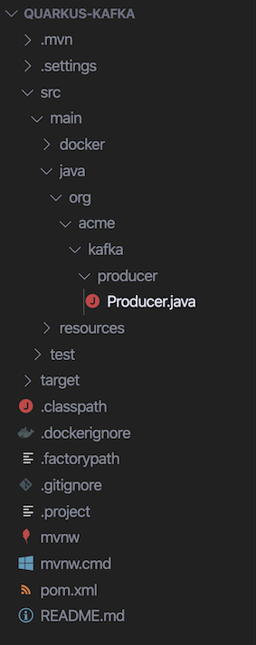


- Within your Producer.java file add the following code - 

```java
package org.acme.kafka.producer;

import io.reactivex.Flowable;
import io.smallrye.reactive.messaging.kafka.KafkaRecord;

import org.eclipse.microprofile.reactive.messaging.Outgoing;

import javax.enterprise.context.ApplicationScoped;
import java.util.Random;
import java.util.concurrent.TimeUnit;

/**
 * This class produces a message every 5 seconds.
 * The Kafka configuration is specified in the application.properties file.
*/
@ApplicationScoped
public class Producer {

    private Random random = new Random();

    @Outgoing("{TOPIC-NAME}")      
    public Flowable<KafkaRecord<Integer, String>> generate() {
        return Flowable.interval(5, TimeUnit.SECONDS)    
                .onBackpressureDrop()
                .map(tick -> {      
                    return KafkaRecord.of(random.nextInt(100), String.valueOf(random.nextInt(100)));
                });
    }                  
}

```

Take note on the line that says @Outgoing("{TOPIC-NAME}"). For the purposes of this story we will use the INBOUND topic name that we created in the Event Streams Topic step earlier. Replace whatever is inside the quotation marks.

```java
@Outgoing("INBOUND")
```

The @Outgoing annotation is for specifying the name of the Channel, but it will default to that Channel's name if a topic name is not provided in the application.properties file. We will address that a little bit later.


* What does this Producer.java code do? 
   - The @Outgoing annotation indicates that we're sending to a Channel (or Topic) and we're not expecting any data.
   - The generate() function returns an [RX Java 2 Flowable Object](https://www.baeldung.com/rxjava-2-flowable) emmitted every 5 seconds. 
   - The Flowable object returns a KafkaRecord of type key type Integer and value type String.
   
   
- We will now need to update our applications.properties file that was automatically generated when the Quarkus project was created located here - 

```bash
src/main/resources/application.properties
```

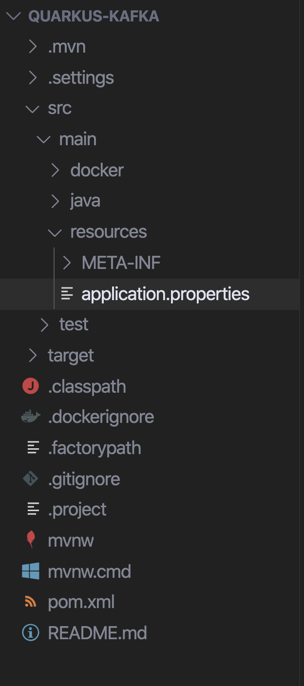

- Copy and paste the following into your application.properties file - 

```properties
# Event Streams Connection details
mp.messaging.connector.smallrye-kafka.bootstrap.servers=${BOOTSTRAP_SERVERS}
mp.messaging.connector.smallrye-kafka.security.protocol=SASL_SSL
mp.messaging.connector.smallrye-kafka.ssl.protocol=TLSv1.2
mp.messaging.connector.smallrye-kafka.sasl.mechanism=PLAIN
mp.messaging.connector.smallrye-kafka.sasl.jaas.config=org.apache.kafka.common.security.scram.PlainLoginModule required \
                username="token" \
                password=${APIKey};
mp.messaging.connector.smallrye-kafka.ssl.truststore.location=${CERT_LOCATION}
mp.messaging.connector.smallrye-kafka.ssl.truststore.password=password


# Initial mock JSON message producer configuration
mp.messaging.outgoing.INBOUND.connector=smallrye-kafka
mp.messaging.outgoing.INBOUND.topic=${TOPIC_NAME}
mp.messaging.outgoing.INBOUND.value.serializer=io.quarkus.kafka.client.serialization.JsonbSerializer
```

*Note* - These values that we are configuring can be used with environmental variables. We will export them, or you can choose to hardcode them.
   
```shell
export BOOTSTRAP_SERVERS={your-bootstrap-server-address} \
export TOPIC_NAME=INBOUND \ 
export CERT_LOCATION={your-path-to-es-cert}/es-cert.jks \
export APIKey={your-api-key}
```

- Replace the values and export the following environment variables. Note that while `TOPIC_NAME` is INBOUND in this case, if we omit this configuration property `mp.messaging.outgoing.INBOUND.topic=${TOPIC_NAME}`, it will default to the channel name as the topic. In this case it will default to `INBOUND`. You can choose to specify a different topic name from the `INBOUND` topic if you so choose. 

- Great! We now have our simple Quarkus Kafka Producer with our Event Streams credentials. We can now test the connection.

- Run the producer code by running the following command 

```bash
./mvnw quarkus:dev
```

- Since the code sends a message every 5 seconds, you can leave it on for a bit or you can change it to send it more frequently. Check out the Event Streams instance in the browser UI topic for messages. You can click the message under "Indexed Timestamp" to see the contents and details of the message.

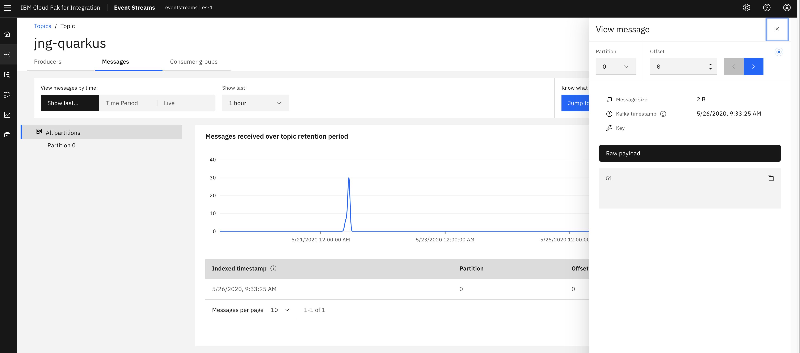


## Creating an IBM COS Service and COS Bucket for your IBM Cloud Account

This story assumes that you already have an IBM Cloud account already, and if not you can sign up for one here at [IBM Cloud](https://cloud.ibm.com).

- Once inside your IBM Cloud account, traverse to the `Catalog` section.

- In the search type in `IBM Cloud Object Storage`

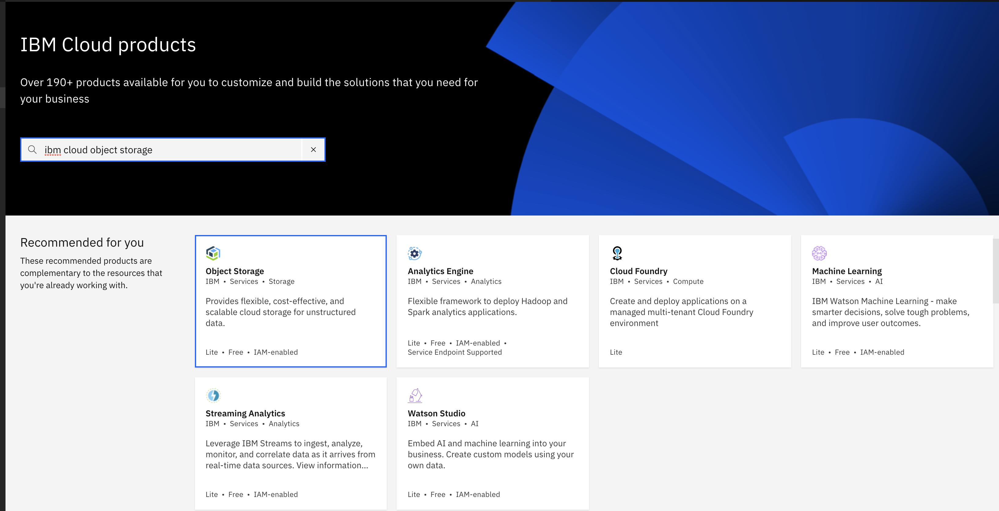

- Name your IBM COS Service with something unique. Since this is a free account we can stick with the Lite Plan.

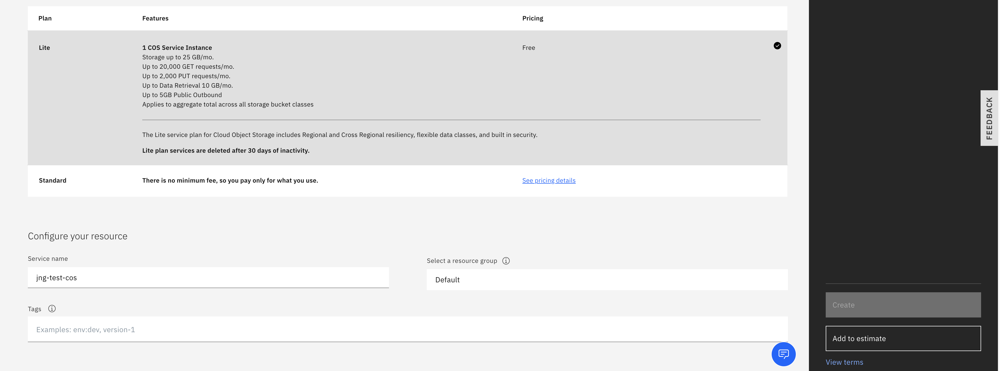

- Now that the IBM Cloud Object Storage Service is created, traverse to it and let's create a new bucket. 


- On the `Create Bucket` screen pick `Custom Bucket`.

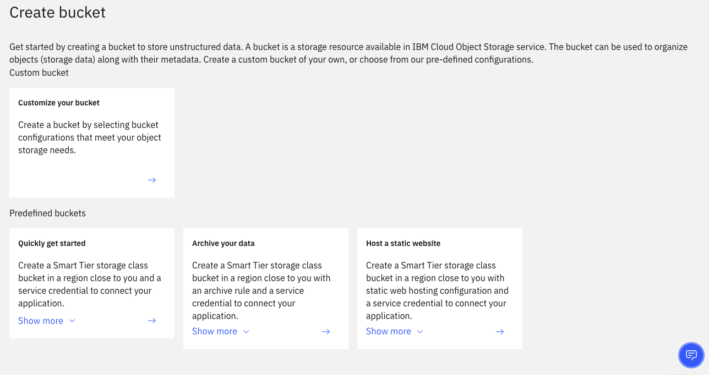

- When selecting options for the bucket, name your bucket something unique. For `Resiliency` let's select `Regional`. For location select an area from the drop-down that you want. (IMPORTANT) For `Storage Class` select `Standard`. The IBM COS Sink connector seems to not play well with buckets that are created with the `Smart Tier` Storage Class. Leave everything else as-is and hit `Create Bucket`.

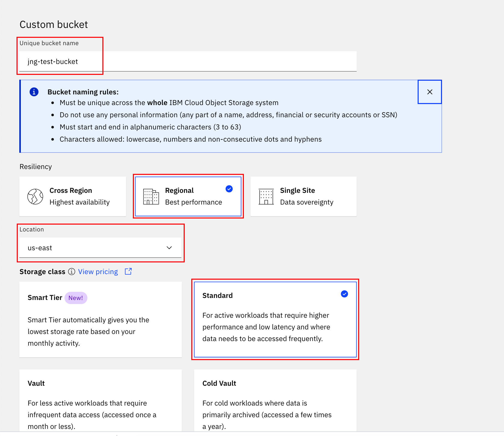


## Creating IBM Cloud Service Credentials

Now that we have created our IBM Cloud Object Storage Service and bucket we now need to create the Service Credential so that we can connect to it.

- Inside your IBM COS Service, select `Service Credentials` and then click the `New Credential` button.


- Name your credential and select `Manager` from the `Role:` drop-down menu and click `Add`.

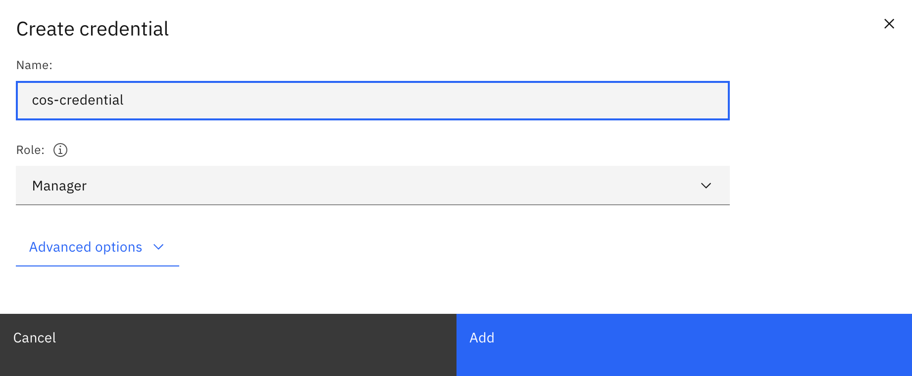

- Expand your newly created Service Credential and write down the values for `"apikey"` and `"resource_instance_id"`.

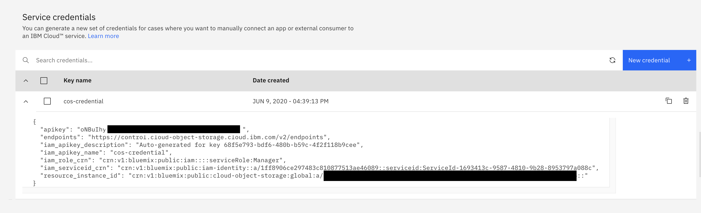


### Summary

We've created the IBM COS Service, created a COS Bucket, and created our Service Credentials. Here are the following items we need to configure our IBM COS connector.


- IBM COS Bucket name
- IBM COS Bucket location
- IBM COS Resiliency (regional)
- IBM COS Service CRN (resource_instance_id)
- IBM COS API Key


## Setting up the Kafka Strimzi Operator

*Note* - This scenario uses an OCP 4.3 cluster, CP4I2020.1.1 and Event Streams v2019.4.2 so this Strimzi installation step
may not be necessary if you are on OCP 4.4, CP4I2020.2.1 as well as Event Streams v10 (which is operator based and built on top of Strimzi)

- As part of the pre-requisites this assumes that you have a 4.x OpenShift Container Platform cluster we will use the Strimzi Operator to deploy our Kafka cluster. 

- In your OpenShift Web Console, in the "ADMINISTRATOR" view. This is in the top left most portion of the menu. Go to "Operators" > "OperatorHub".

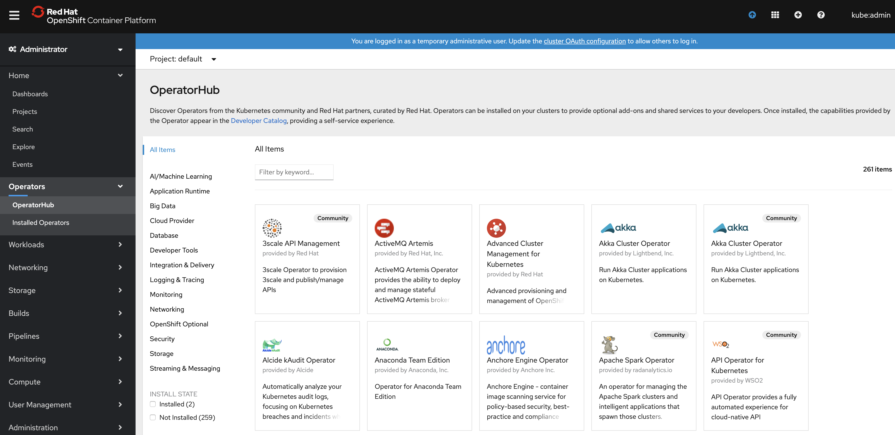

- Type "Strimzi" into the Search Bar.

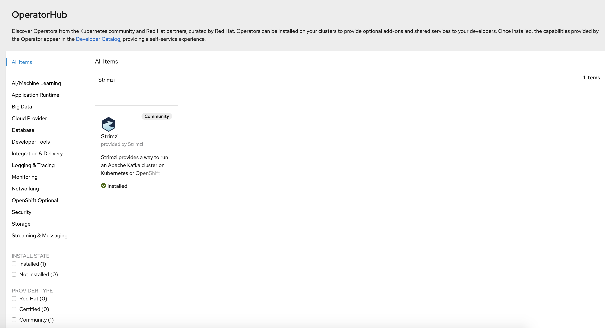

- Click on the Strimzi Operator and then click "Install".

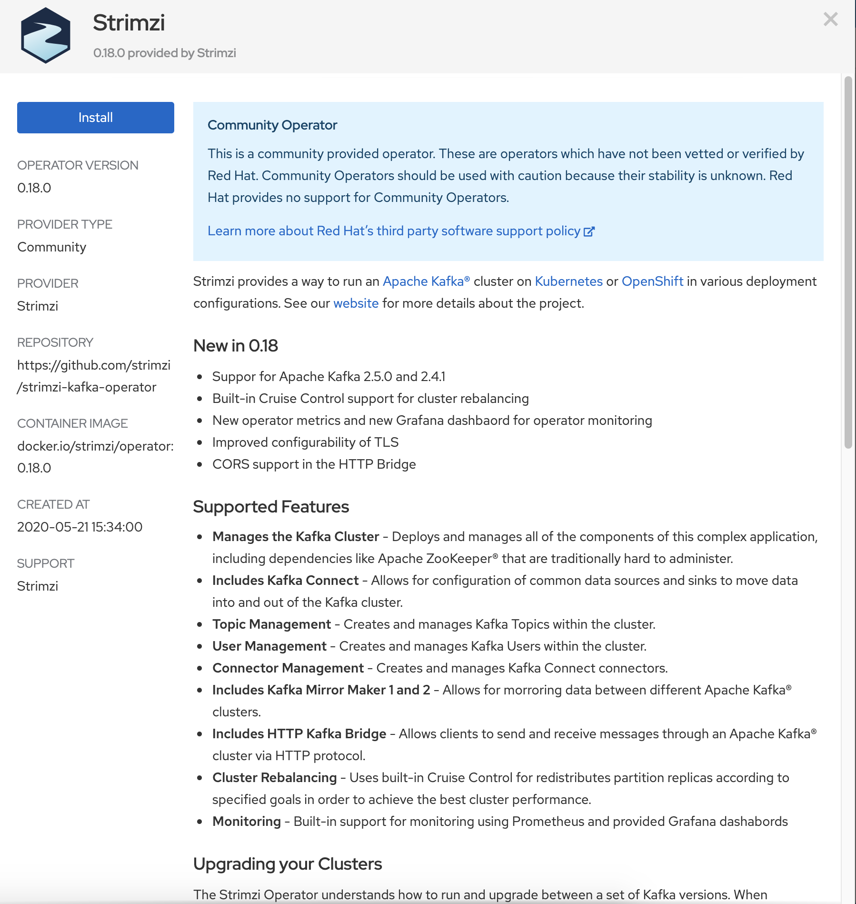

- Make sure that the option to have "All namespaces on the cluster (default)" is checked.

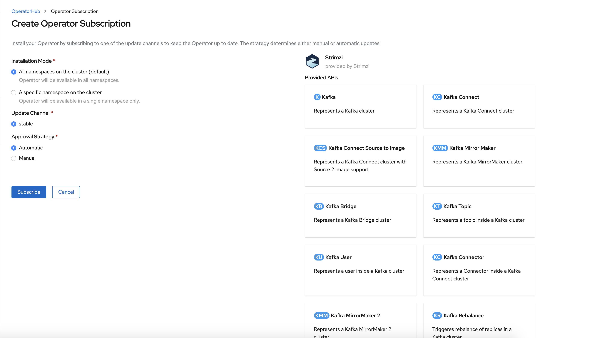

- Tail the status of your Strimzi operator install either through the web console or doing while logged in through OpenShift through your terminal. 

```bash
oc get pods -n openshift-operators
```

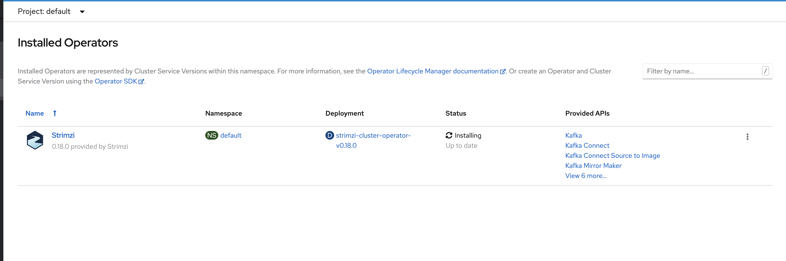


7. When the Strimzi Operator finally says Succeeded in the "Installed Operators" section in the Web console or 1/1 Running in the Pod status we may proceed.


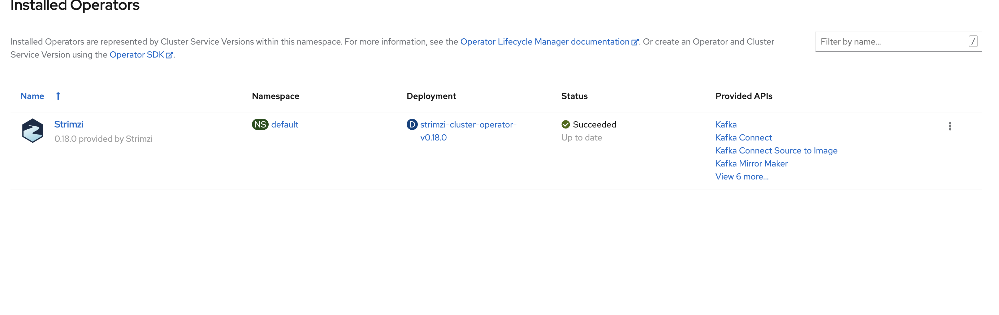

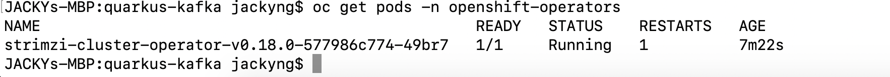


## Setting up the Kafka Connect Cluster

*Note* - As stated in the pre-requisites section we will be mirroring the steps followed here at [Kafka Connect to S3 Sink & Source](https://ibm-cloud-architecture.github.io/refarch-eda/scenarios/connect-s3/) for more granular information and reading.

- Now that we have our Strimzi Kafka Operator installed we need the secrets and appropriate credentials set up.

- You will need to be logged into your OpenShift Cluster through the terminal. You can do this by going to the OpenShift Web UI and going to the top right and hitting the User (likely kube:admin in this case) and then "Copy Login command" and then "Display Token". Copy and paste the "Log in with this token" command into your terminal.

- I would advise you to create a new Project/Namespace to separate secrets and logic but that's up to you.

```bash
oc new-project es-cos-test
```

- We now need to create a secret for our Event Streams API Key that we gathered from the "Event Streams Security: API Key, Credentials and Certificates" Section earlier. This secret will be injected into the KafkaConnect cluster at run time as well. Replace {eventstreams_api_key} with your API key. This should also be in the `es-api-key.json` file earlier if you chose the "Download as JSON" option.

```bash
oc create secret generic eventstreams-apikey --from-literal=password={eventstreams_api_key}
```

- We will now create/generate the proper certificate for use with the Kafka Connect cluster. By default our Event Streams certificate is a .jks file but we need to convert this to a .crt file. Run the following commands. These commands convert the .jks file to a new es-cert.crt file and then creates a Kubernetes/OpenShift secret for use with the KafkaConnect cluster.

```bash
keytool -importkeystore -srckeystore es-cert.jks -destkeystore es-cert.p12 -deststoretype PKCS12
openssl pkcs12 -in es-cert.p12 -nokeys -out es-cert.crt
oc create secret generic eventstreams-truststore-cert --from-file=es-cert.crt
```


```bash
vi log4j.properties
```

```properties
# Do not change this generated file. Logging can be configured in the corresponding kubernetes/openshift resource.
log4j.appender.CONSOLE=org.apache.log4j.ConsoleAppender
log4j.appender.CONSOLE.layout=org.apache.log4j.PatternLayout
log4j.appender.CONSOLE.layout.ConversionPattern=%d{ISO8601} %p %m (%c) [%t]%n
connect.root.logger.level=INFO
log4j.rootLogger=${connect.root.logger.level}, CONSOLE
log4j.logger.org.apache.zookeeper=ERROR
log4j.logger.org.I0Itec.zkclient=ERROR
log4j.logger.org.reflections=ERROR

```

- (OPTIONAL) We can now create the ConfigMap from the newly created properties file.

```bash
oc create configmap custom-connect-log4j --from-file=log4j.properties
```

- We will now deploy the base KafkaConnect Cluster using KafkaConnectS2I (Source to Image) custom resource. Create a new `kafka-connect.yaml` file and paste the following. 

```bash
vi kafka-connect.yaml
```

```yaml
apiVersion: kafka.strimzi.io/v1alpha1
kind: KafkaConnectS2I
metadata:
  name: connect-cluster-101
  annotations:
    strimzi.io/use-connector-resources: "true"
spec:
  #logging:
  #  type: external
  #  name: custom-connect-log4j
  replicas: 1
  bootstrapServers: {your-bootstrap-server-address:443}
  tls:
    trustedCertificates:
      - certificate: es-cert.crt
        secretName: eventstreams-truststore-cert
  authentication:
    passwordSecret:
      secretName: eventstreams-apikey
      password: password
    username: token
    type: plain
  config:
    group.id: connect-cluster-101
    config.providers: file
    config.providers.file.class: org.apache.kafka.common.config.provider.FileConfigProvider
    key.converter: org.apache.kafka.connect.json.JsonConverter
    value.converter: org.apache.kafka.connect.json.JsonConverter
    key.converter.schemas.enable: false
    value.converter.schemas.enable: false
    offset.storage.topic: connect-cluster-101-offsets
    config.storage.topic: connect-cluster-101-configs
    status.storage.topic: connect-cluster-101-status
 ```
 
 NOTE - The following options are things we need to take note of/configure. 
 
 - (OPTIONAL)`spec.logging.name`: The name of the previously configured log4j ConfigMap. You can uncomment those previous three lines if you opted to create the ConfigMap.
 - `spec.bootstrapServers`: Replace `{your-bootstrap-server-address:443}` with your Event Streams instance bootstrap server address.
 - `spec.tls.trustedCertificates[0].secretName`: The name of the OpenShift secret created for your Event Streams certificate
 - `spec.authentication.passwordSecret.secretName`: The name of the OpenShift secret created from the Event Streams API Key
 - `spec.config['group.id']`: This should be a unique ID for connecting to the same set of Kafka brokers. If we do not specify a name, multiple KafkaConnect instances will end up using the default id and end up in a race condition as they all try to vie for access.
 - `spec.config['*.storage.topic']`: As noted in the .yaml file we have `offset.storage.topic`, `config.storage.topic`, and `status.storage.topic`. The name of these topics will need to be created in your Event Streams instance to store the metadata. See the "Creating Event Streams Topics" section for a refresher on creating Event Streams topics. 
 
 
 - Make sure the `kafka-connect.yaml` files values are correctly configured and save it. From the terminal run the following

```bash
oc apply -f kafka-connect.yaml
``` 
 
- You can check the status of the pods by running `oc get pods`. When they're all Running we can proceed.
 
 

## Building and Applying IBM COS Sink Connector

The IBM COS Source Connector source code is availabe at this repository [here](https://github.com/ibm-messaging/kafka-connect-ibmcos-sink). 

(IMPORTANT) The Strimzi Kafka Connect Cluster uses a Java 8 runtime so make sure you're actively using the Java 8 JRE.

- Clone the Kafka Connect IBM COS Source Connector repository and then change your folder.
```shell
git clone https://github.com/ibm-messaging/kafka-connect-ibmcos-sink.git
cd kafka-connect-ibmcos-sink/
```

- We now need to build the connector binaries for use with our Kafka Connect cluster. Like stated earlier, make sure that you're using Java 8 to build the connector.

```shell
gradle shadowJar
```

- The newly built connector binaries are in the `build/libs/` folder. Let's move it into another folder for ease of use.

```shell
cp build/libs/kafka-connect-ibmcos-sink-*-all.jar connectors/
```

- Now that we have the connector in the `connectors/` folder let's start a new `oc start-build` command. What this command does is build a new image with your provided connectors/plugins and triggers a new deployment for your Kafka Connect clusters. 

```shell
oc start-build connect-cluster-101-connect --from-dir ./connectors/ --follow
```

- Since this creates a new deployment this will kick off a new Kafka Connect pod. Previously we'd have a pod with a name similar to `connect-101-cluster-connect-1-{random-suffix}`. This will create something similar to `connect-101-cluster-connect-2-{random-suffix}. Trail the output and wait for the pod to be `Running 1/1`

```shell
oc get pods -w
```

- Once the new pod is up and running we can proceed. Create a new file named kafka-cos-sink-connector.yaml

```shell
vi kafka-cos-sink-connector.yaml
```

- Paste the following contents into the newly created yaml file.

```yaml
apiVersion: kafka.strimzi.io/v1alpha1
kind: KafkaConnector
metadata:
  name: cos-sink-connector
  labels:
    strimzi.io/cluster: connect-cluster-101
spec:
  class: com.ibm.eventstreams.connect.cossink.COSSinkConnector
  tasksMax: 1
  config:
    key.converter: org.apache.kafka.connect.storage.StringConverter
    value.converter: org.apache.kafka.connect.storage.StringConverter
    topics: {topic-name}
    cos.api.key: {ibm-cos-api-key}
    cos.bucket.location:{<ibm-cos-bucket-location}
    cos.bucket.name: {your-ibm-cos-bucket-name}
    cos.bucket.resiliency: {your-resiliency}
    cos.service.crn: "{your-ibm-cos-service-crn}"
    cos.object.records: 5
    cos.object.deadline.seconds: 5
    cos.object.interval.seconds: 5
```

In the yaml there are a few things we need to configure.

- `spec.config.topics`: Replace `{topic-name}` with the name of your created Event Streams topic. For the purposes of this story we'll assume the `INBOUND` topic for instance.
- `spec.config.cos.api.key`: Replace `{ibm-cos-api-key}` with your `apikey` that we received/took down when we created our `Service Credential` earlier. 
- `spec.config.cos.bucket.location`: Replace `{ibm-cos-bucket-location}` with your created IBM COS bucket's location. It's usually in the form of something like `us-east` or `eu-gb` for example.
- `spec.config.cos.bucket.resiliency`: Replace `{your-resiliency}` with your chosen Bucket resiliency selection. For the purposes of this scenario we assumed `regional`.
- `spec.config.cos.service.crn`: Replace `{your-ibm-cos-service-crn}` with the CRN of your IBM COS Service. This usually ends with a double `::` at the end of it. *Note* - you might need to retain the double quotation marks here as the crn has colons in it. This ends up looking like something this - `cos.service.crn: "crn:v1:bluemix:public:cloud-object-storage:global:a/123151fhtr324fd13:h6a12345f-ba23-1ab1-ab1f-12345678::"`
- The last three options can be configured to your liking. You can read more about configuring that [here](https://github.com/ibm-messaging/kafka-connect-ibmcos-sink#combining-multiple-kafka-records-into-an-object)

- Save the yaml and apply this yaml to initiate the KafkaConnnector Custom Resource. 
```shell
oc apply -f kafka-cos-sink-connector.yaml
```

- The initialization of the connector can take a minute or two. You can check the logs of the connector to see if everything connected succesfully.
```shell
oc describe kafkaconnector cos-sink-connector
```

- When the IBM COS Sink connector is successfully up and running you should see something similar to the below.

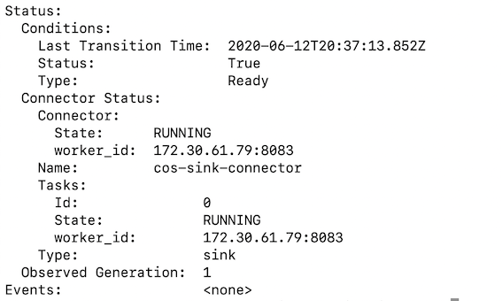


## Event Streams v10 Addendum

*A couple of things of note*
- Most of these steps are the same as the last two (Setting up the Kafka Connect Cluster and IBM COS Sink Connector) besides a change to the YAML files.
- Event Streams v10 is still rather new so these are subject to change. 
- Like previously mentioned in the Strimzi setup section, Event Streams v10 is built ontop of the Strimzi operator so we don't need to install those.


*Quarkus Application application.properties*
- Due to the changes to security with Event Streams v10, it has moved from plain text SASL to SCRAM credentials.
- By default the certificate you download from the ESv10 is now a PKCS12 file and not a JKS. Also it now has an actual password associated now instead of just "password" previously.
- As such we need to change our `application.properties` file for our Quarkus application to reflect that.

```properties
quarkus.http.port=8080
quarkus.log.console.enable=true
quarkus.log.console.level=INFO

# Base ES Connection Details
mp.messaging.connector.smallrye-kafka.bootstrap.servers=${BOOTSTRAP_SERVERS}
mp.messaging.connector.smallrye-kafka.security.protocol=SASL_SSL
mp.messaging.connector.smallrye-kafka.ssl.protocol=TLSv1.2
mp.messaging.connector.smallrye-kafka.sasl.mechanism=SCRAM-SHA-512
mp.messaging.connector.smallrye-kafka.sasl.jaas.config=org.apache.kafka.common.security.scram.ScramLoginModule required \
                username=${SCRAM_USERNAME} \
                password=${SCRAM_PASSWORD};
mp.messaging.connector.smallrye-kafka.ssl.truststore.location=${CERT_LOCATION}
mp.messaging.connector.smallrye-kafka.ssl.truststore.password=${CERT_PASSWORD}
mp.messaging.connector.smallrye-kafka.ssl.truststore.type=PKCS12


# Initial mock JSON message producer configuration
mp.messaging.outgoing.INBOUND.connector=smallrye-kafka
mp.messaging.outgoing.INBOUND.topic=${TOPIC_NAME}
mp.messaging.outgoing.INBOUND.value.serializer=io.quarkus.kafka.client.serialization.JsonbSerializer
```

As you can see there are a few more extra environment variables that we need to setup compared to when we connected to the previous version. This no longer uses an API Key.

```shell
export BOOTSTRAP_SERVERS=your-bootstrap-server-address:443 \
export TOPIC_NAME=name-of-topic-to-produce-to \
export CERT_LOCATION=/path-to-pkcs12-cert/es-cert.p12 \
export CERT_PASSWORD=certificate-password \
export SCRAM_USERNAME=your-scram-username \
export SCRAM_PASSWORD=your-scram-password \
```


*KafkaConnectS2I Yaml*

```yaml
apiVersion: eventstreams.ibm.com/v1beta1
kind: KafkaConnectS2I
metadata:
  name: connect-cluster-101
  annotations:
    eventstreams.ibm.com/use-connector-resources: "true"
spec:
  logging:
    type: external
    name: custom-connect-log4j
  version: 2.5.0
  replicas: 1
  bootstrapServers: {your-internal-bootstrap-server-address}
  template:
    pod:
      imagePullSecrets: []
      metadata:
        annotations:
          eventstreams.production.type: CloudPakForIntegrationNonProduction
          productID: xxxx
          productName: IBM Event Streams for Non Production
          productVersion: 10.0.0
          productMetric: VIRTUAL_PROCESSOR_CORE
          productChargedContainers: jng-connect
          cloudpakId: xxxx
          cloudpakName: IBM Cloud Pak for Integration
          cloudpakVersion: 2020.2.1
          productCloudpakRatio: "2:1"
  tls:
      trustedCertificates:
        - secretName: {your-es-isntance-name}-ca-cert
          certificate: ca.crt
  authentication:
    type: tls
    certificateAndKey:
      certificate: user.crt
      key: user.key
      secretName: {your-secret-name}
  config:
    group.id: connect-cluster-101
    config.providers: file
    config.providers.file.class: org.apache.kafka.common.config.provider.FileConfigProvider
    key.converter: org.apache.kafka.connect.json.JsonConverter
    value.converter: org.apache.kafka.connect.json.JsonConverter
    key.converter.schemas.enable: false
    value.converter.schemas.enable: false
    offset.storage.topic: connect-cluster-101-offsets
    config.storage.topic: connect-cluster-101-configs
    status.storage.topic: connect-cluster-101-status
    config.storage.replication.factor: 1
    offset.storage.replication.factor: 1
    status.storage.replication.factor: 1

```

Things of note that were changed.

- `spec.bootstrapservers`: This bootstrap server address is found under the `Internal Connection` option rather than `External` in the ESv10 UI when choosing to `Connect to this Cluster`.
- `spec.tls.trustedCertificates.secretName`: This will be the autogenerated certificate. It should be prefix'd with your Event Streams instance name. If your ES instance name is ES10 then this secret should be named `ES10-ca-cert`. Ideally this secret will be in the project/namespace of where you installed ESv10. 
- `spec.authentication.secretName`: This secretname will be the name you enter of your secret when you select `Generate TLS Credentials` with internal connection. ESv10 will automatically create a secret within the same OpenShift namespace/project. That generated secret will have various details in it like `user.cert` and `user.key`. 


*IBM COS Sink Connector YAML*

```yaml
apiVersion: eventstreams.ibm.com/v1alpha1
kind: KafkaConnector
metadata:
  name: cos-sink-connector
  labels:
     eventstreams.ibm.com/cluster: jng-connect-cluster-101
spec:
  class: com.ibm.eventstreams.connect.cossink.COSSinkConnector
  tasksMax: 1
  config:
    key.converter: org.apache.kafka.connect.storage.StringConverter
    value.converter: org.apache.kafka.connect.storage.StringConverter
    topics: {topic-name}
    cos.api.key: {ibm-cos-api-key}
    cos.bucket.location: {ibm-cos-bucket-location}
    cos.bucket.name: {your-ibm-cos-bucket-name}
    cos.bucket.resiliency: {your-resiliency}
    cos.service.crn: "{your-ibm-cos-service-crn}"
    cos.object.records: 5
    cos.object.deadline.seconds: 5
    cos.object.interval.seconds: 5
```

- Not too many differences from the Strimzi/ESv2019.4.2 version. 
  - Mainly the changing of `apiVersion: eventstreams.ibm.com/v1alpha1`. Not sure why the KafkaConnectS2I is beta and this is alpha. 
  - `metadata.labels.eventstreams.ibm.com/cluster:` instead of `strimzi.io/cluster`
  
- Besides these few changes to the YAMLs this should behave as it did previously.


## Test the Entire Flow

- Now that we have all the previous steps setup we can now test the entire flow.

- Start our Quarkus Kafka Producer application to send messages to the Event Streams INBOUND topic.

```bash
./mvnw quarkus:dev
```

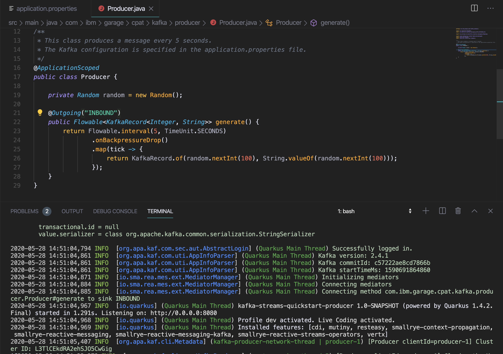

- Go to your Event Streams instance on Cloud Pak for Integration. Traverse to the Topics menu and select your `INBOUND` topic and then go to "Messages". Choose the "Live" option to see an up-to-date stream of your incoming messages.

- Your messages should be propagating the your created IBM COS Bucket automatically.

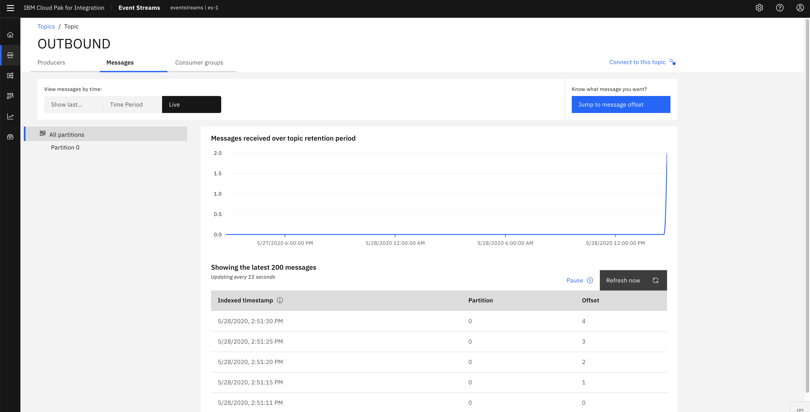

- The name of the file inside the bucket has starting offset and ending offset. You can download one of these object files to make sure that the value inside matches the value inside your `INBOUND` topic.


