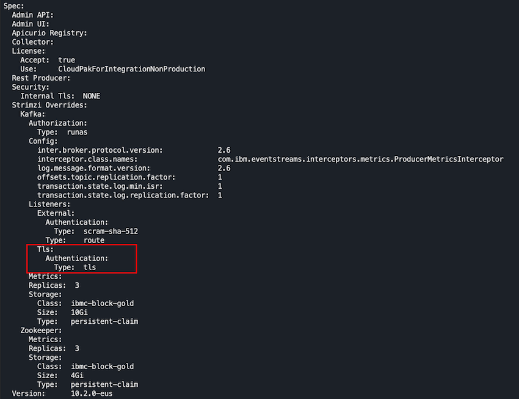
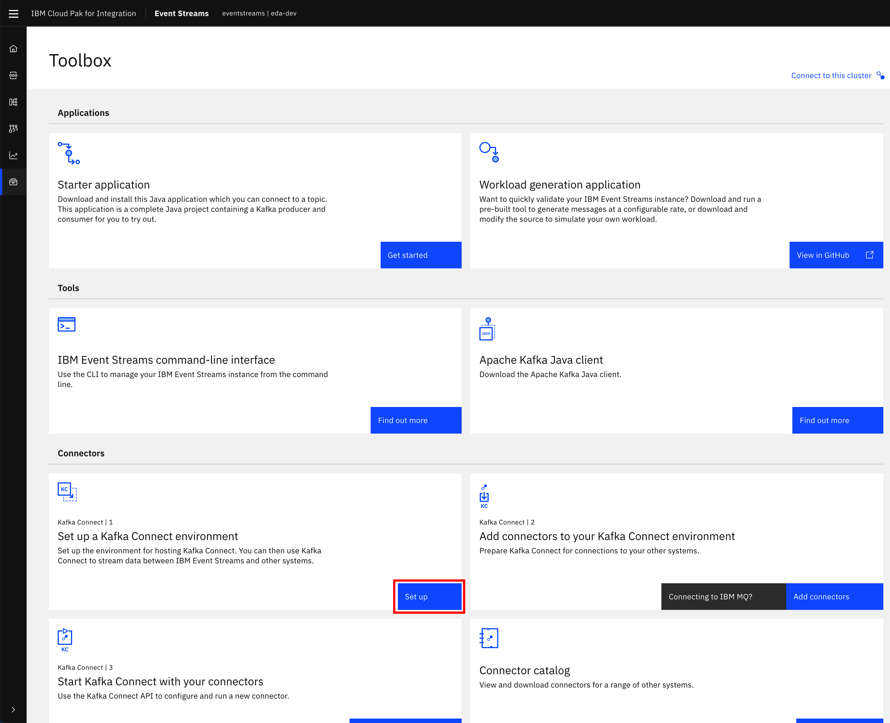
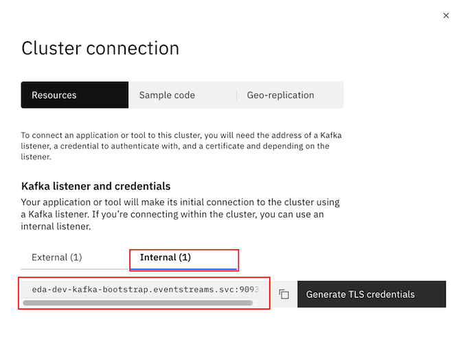
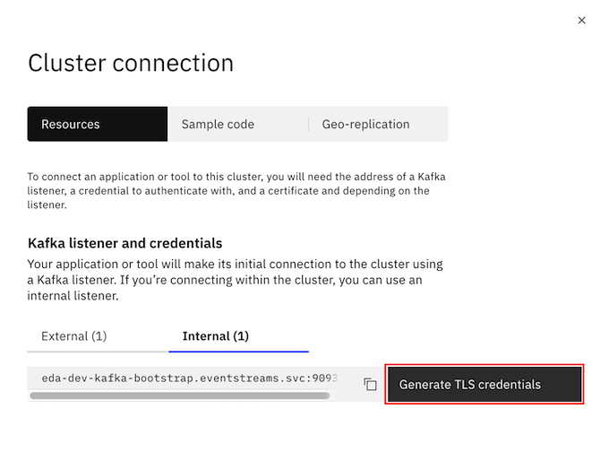

## Set up the Kafka Connect Cluster

In this section, we are going to see how to deploy a [Kafka Connect](https://kafka.apache.org/documentation/#connect) cluster on OpenShift which will be the engine running the source and sink connector we decide to use for our use case. **IMPORTANT:** We assume you have deployed your IBM Event Streams instance with an **internal TLS secured listener** which your Kafka Connect cluster will use to connect. For more detail about listeners, check the IBM Event Streams documentation [here](https://ibm.github.io/event-streams/installing/configuring/#kafka-access).

If you inspect your IBM Event Streams instance by executing the following command:

```shell
oc get EventStreams YOUR_IBM_EVENT_STREAMS_INSTANCE_NAME -o yaml
```

You should see a `TlS` listener:



Now, follow the next steps in order to get your Kafka Connect cluster deployed:

1. Go to you IBM Event Streams dashboard, click on the `Find more on the toolbox` option.

  

1. Click on the `Set up` button for the `Set up a Kafka Connect environment` option.

  

1. Click on `Download Kafka Connect ZIP` button.

  

1. The above downloads a zip file which contains a `kafka-connect-s2i.yaml` file. Open that yaml file and take note of the `productID` and `cloudpakId` values as you will need these in the following step.

  

1. Instead of using the previous yaml file, create a new `kafka-connect-s2i.yaml` file with the following contents:

  ```yaml
  apiVersion: eventstreams.ibm.com/v1beta1
  kind: KafkaConnectS2I
  metadata:
    name: YOUR_KAFKA_CONNECT_CLUSTER_NAME
    annotations:
      eventstreams.ibm.com/use-connector-resources: "true"
  spec:
    logging:
      type: external
      name: custom-connect-log4j
    version: 2.6.0
    replicas: 1
    bootstrapServers: YOUR_INTERNAL_BOOTSTRAP_ADDRESS
    template:
      pod:
        imagePullSecrets: []
        metadata:
          annotations:
            eventstreams.production.type: CloudPakForIntegrationNonProduction
            productID: YOUR_PRODUCT_ID
            productName: IBM Event Streams for Non Production
            productVersion: 10.2.0
            productMetric: VIRTUAL_PROCESSOR_CORE
            productChargedContainers: YOUR_KAFKA_CONNECT_CLUSTER_NAME
            cloudpakId: YOUR_CLOUDPAK_ID
            cloudpakName: IBM Cloud Pak for Integration
            cloudpakVersion: 2020.4.1
            productCloudpakRatio: "2:1"
    tls:
        trustedCertificates:
          - secretName: YOUR_CLUSTER_TLS_CERTIFICATE_SECRET
            certificate: ca.crt
    authentication:
      type: tls
      certificateAndKey:
        certificate: user.crt
        key: user.key
        secretName: YOUR_TLS_CREDENTIALS_SECRET
    config:
      group.id: YOUR_KAFKA_CONNECT_CLUSTER_NAME
      key.converter: org.apache.kafka.connect.json.JsonConverter
      value.converter: org.apache.kafka.connect.json.JsonConverter
      key.converter.schemas.enable: false
      value.converter.schemas.enable: false
      offset.storage.topic: YOUR_KAFKA_CONNECT_CLUSTER_NAME-offsets
      config.storage.topic: YOUR_KAFKA_CONNECT_CLUSTER_NAME-configs
      status.storage.topic: YOUR_KAFKA_CONNECT_CLUSTER_NAME-status
      config.storage.replication.factor: 1
      offset.storage.replication.factor: 1
      status.storage.replication.factor: 1
  ```

  where you will need to replace the following placeholders with the appropriate values for you IBM Event Streams cluster and service credentials:
   * `YOUR_KAFKA_CONNECT_CLUSTER_NAME`: A name you want to provide your Kafka Connect cluster and resources with.
   * `YOUR_INTERNAL_BOOTSTRAP_ADDRESS`: This is the internal bootstrap address of your IBM Event Streams instance. You can review how to find this url [here](/use-cases/overview/pre-requisites#get-kafka-bootstrap-url). Use the **internal** bootstrap address which should be in the form of `YOUR_IBM_EVENT_STREAMS_INSTANCE_NAME-kafka-bootstrap.eventstreams.svc:9093`:
   
   * `YOUR_TLS_CREDENTIALS_SECRET`: This is the name you give to your TLS credentials for your internal IBM Event Streams listener when you click on `Generate TLS credentials`:
   
   * `YOUR_CLUSTER_TLS_CERTIFICATE_SECRET`: This is the secret name where IBM Event Streams stores the TLS certificate for establishing secure communications. This secret name is in the form of `YOUR_IBM_EVENT_STREAMS_INSTANCE_NAME-cluster-ca-cert`. You can always use `oc get secrets` to list all the secrets.
   * `YOUR_PRODUCT_ID`: This is the `productID` value you noted down earlier.
   * `YOUR_CLOUDPAK_ID`: This is the `cloudpakID` value you noted earlier.  

1. Deploy your Kafka Connect cluster by executing

  ```shell
  oc apply -f kafkaconnect-s2i.yaml 
  ```

1. If you list the pods, you should see three new pods: one for the Kafka Connect build task, another for the Kafka Connect deploy task and the actual Kafka Connect cluster pod.

  ```shell
  oc get pods

  NAME                                                 READY   STATUS      RESTARTS   AGE
  YOUR_KAFKA_CONNECT_CLUSTER_NAME-connect-1-build      0/1     Completed   0          18m
  YOUR_KAFKA_CONNECT_CLUSTER_NAME-connect-1-deploy     0/1     Completed   0          17m
  YOUR_KAFKA_CONNECT_CLUSTER_NAME-connect-1-xxxxx      1/1     Running     0          17m
  ```

  ## Build and Inject IBM COS Sink Connector

The IBM COS Sink Connector source code is availabe at this repository [here](https://github.com/ibm-messaging/kafka-connect-ibmcos-sink).

**IMPORTANT:** Make sure you have **Java 8** installed on your workstation and that is the default Java version of your system since the IBM COS Sink Connector can only be built with that version of Java.


1. Clone the Kafka Connect IBM COS Source Connector repository and then change your folder.

  ```shell
  git clone https://github.com/ibm-messaging/kafka-connect-ibmcos-sink.git
  cd kafka-connect-ibmcos-sink/
  ```
  
**IMPORTANT Part Two:** Depending on your Gradle version you have installed on your machine you will need to update the connector's gradle build file. For example Gradle v7.x the `build.gradle` file should look something like this as the `compile()` method is deprecated in newer versions. You can downgrade your Gradle version if you so choose. This is the [shadowJar repository](https://github.com/johnrengelman/shadow) for versioning information.

```
/*
 * Copyright 2019 IBM Corporation
 *
 * Licensed under the Apache License, Version 2.0 (the "License");
 * you may not use this file except in compliance with the License.
 * You may obtain a copy of the License at
 *
 *    http://www.apache.org/licenses/LICENSE-2.0
 *
 *  Unless required by applicable law or agreed to in writing, software
 *  distributed under the License is distributed on an "AS IS" BASIS,
 *  WITHOUT WARRANTIES OR CONDITIONS OF ANY KIND, either express or implied.
 *  See the License for the specific language governing permissions and
 *  limitations under the License.
 */
plugins {
  id 'com.github.johnrengelman.shadow' version '4.0.3'
  id 'java'
  id 'eclipse'
}

repositories {
   mavenCentral()
}

dependencies {
  implementation 'com.eclipsesource.minimal-json:minimal-json:0.9.5'
  implementation 'com.ibm.cos:ibm-cos-java-sdk:2.4.5'
  implementation 'org.apache.kafka:connect-api:2.2.1'

  testImplementation 'org.mockito:mockito-all:1.10.19'
  testImplementation 'junit:junit:4.12'
  testImplementation 'com.squareup.okhttp3:mockwebserver:3.9.+'
}

eclipse.project {
  natures 'org.springsource.ide.eclipse.gradle.core.nature'
}

shadowJar {
   classifier = 'all'
   version = '7.0.0'
}

```


1. Build the connect using `Gradle`.

  ```shell
  gradle shadowJar
  ```

1. The newly built connector binaries are in the `build/libs/` folder. Move it into a `connectors` folder for ease of use.

  ```shell
  mkdir connectors
  cp build/libs/kafka-connect-ibmcos-sink-*-all.jar connectors/
  ```

1. Now that we have the connector in the `connectors/` folder, we somehow need embed it into our Kakfa Connect cluster. For that, we need to trigger another build for our Kafka Connect cluster but this time specifying the files we want to get embedded. What the followin command does is it builds a new image with your provided connectors/plugins and triggers a new deployment for your Kafka Connect cluster.

  ```shell
  oc start-build connect-cluster-101-connect --from-dir ./connectors/ --follow
  ```

1. Since the last commands triggers a new build, we should now see three new pods for the build task, the deploy task and the resulting Kafka Connect cluster. Also, we should see the previous Kafka Connect cluster pod if gone.

  ```shell
  oc get pods

  NAME                                                 READY   STATUS      RESTARTS   AGE
  YOUR_KAFKA_CONNECT_CLUSTER_NAME-connect-1-build      0/1     Completed   0          31m
  YOUR_KAFKA_CONNECT_CLUSTER_NAME-connect-1-deploy     0/1     Completed   0          31m
  YOUR_KAFKA_CONNECT_CLUSTER_NAME-connect-2-build      0/1     Completed   0          18m
  YOUR_KAFKA_CONNECT_CLUSTER_NAME-connect-2-deploy     0/1     Completed   0          17m
  YOUR_KAFKA_CONNECT_CLUSTER_NAME-connect-2-xxxxx      1/1     Running     0          17m
  ```


## Connect with mTLS 

Update the `applications.properties` file if you are not connecting to Event Streams via PLAINTEXT security protocol.

  ```properties

  quarkus.http.port=8080
  quarkus.log.console.enable=true
  quarkus.log.console.level=INFO

  # Event Streams Connection details
  mp.messaging.connector.smallrye-kafka.bootstrap.servers=REPLACE_WITH_YOUR_BOOTSTRAP_URL
  mp.messaging.connector.smallrye-kafka.security.protocol=SASL_SSL
  mp.messaging.connector.smallrye-kafka.ssl.protocol=TLSv1.2
  mp.messaging.connector.smallrye-kafka.sasl.mechanism=SCRAM-SHA-512
  mp.messaging.connector.smallrye-kafka.sasl.jaas.config=org.apache.kafka.common.security.scram.ScramLoginModule required \
                  username=REPLACE_WITH_YOUR_SCRAM_USERNAME \
                  password=REPLACE_WITH_YOUR_SCRAM_PASSWORD;
  mp.messaging.connector.smallrye-kafka.ssl.truststore.location=REPLACE_WITH_YOUR_PKCS12_CERTIFICATE_LOCATION
  mp.messaging.connector.smallrye-kafka.ssl.truststore.password=REPLACE_WITH_YOUR_PKCS12_CERTIFICATE_PASSWORD

  # Initial mock JSON message producer configuration
  mp.messaging.outgoing.INBOUND.connector=smallrye-kafka
  mp.messaging.outgoing.INBOUND.topic=REPLACE_WITH_YOUR_TOPIC
  mp.messaging.outgoing.INBOUND.value.serializer=io.quarkus.kafka.client.serialization.JsonbSerializer
  mp.messaging.outgoing.INBOUND.key.serializer=io.quarkus.kafka.client.serialization.JsonbSerializer
  ```

    * `REPLACE_WITH_YOUR_BOOTSTRAP_URL`: Your IBM Event Streams bootstrap url.
    * `REPLACE_WITH_YOUR_PKCS12_CERTIFICATE_LOCATION`: The location where you downloaded your PCKS12 TLS certificate to.
    * `REPLACE_WITH_YOUR_PKCS12_CERTIFICATE_PASSWORD`: Your PCKS12 TLS certificate password.
    * `REPLACE_WITH_YOUR_SCRAM_USERNAME`: Your SCRAM service credentials username.
    * `REPLACE_WITH_YOUR_SCRAM_PASSWORD`: Your SCRAM service credentials password.
    * `REPLACE_WITH_YOUR_TOPIC`: Name of the topic you created above.
  
  Review the [Common pre-requisites](/use-cases/overview/pre-requisites/) instructions if you don't know how to find out any of the config properties above. 

