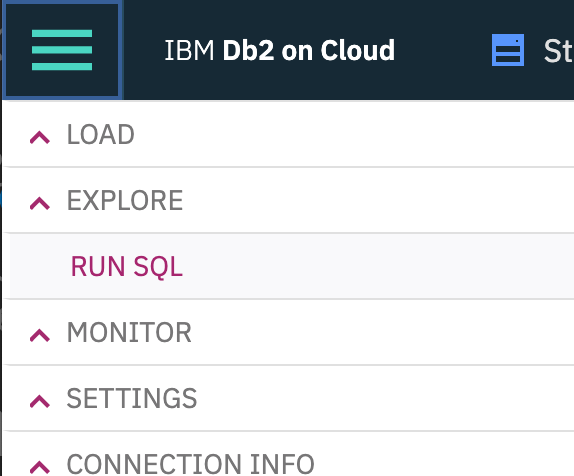
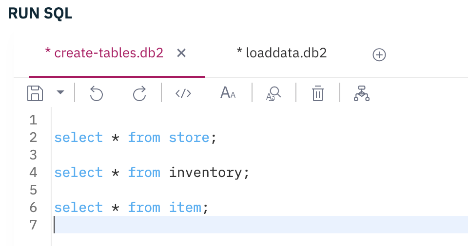
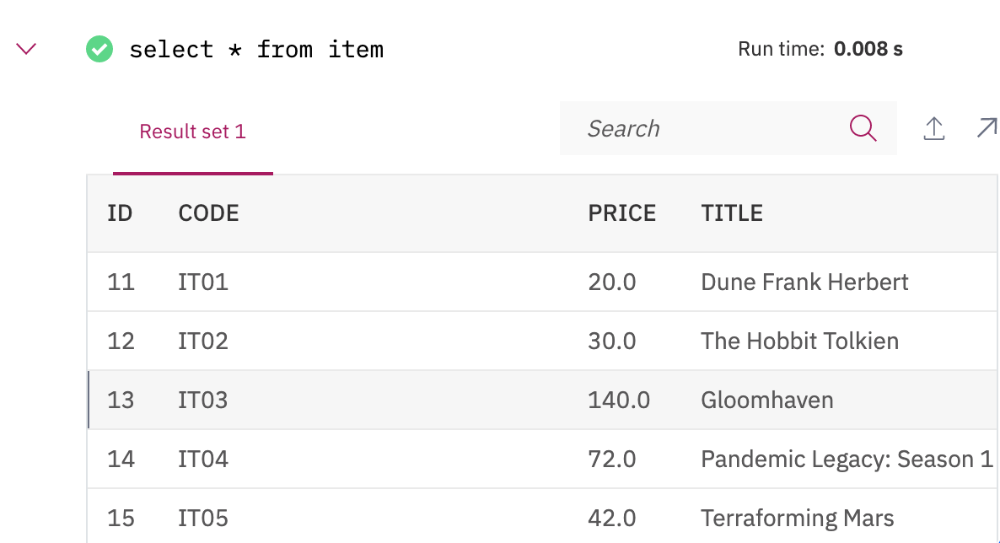
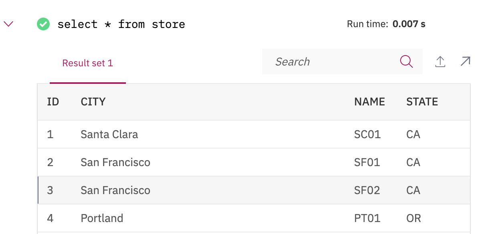

<InlineNotification kind="warning">
<strong>TODO</strong> - Work in progress
</InlineNotification>

<AnchorLinks>
<AnchorLink>Pre-requisites</AnchorLink>
<AnchorLink>Run the Kafka Connector in distributed mode</AnchorLink>
<AnchorLink>Upload the DB2 sink definition</AnchorLink>
<AnchorLink>Generate some records</AnchorLink>
<AnchorLink>Verify records are uploaded into the Inventory database</AnchorLink>
</AnchorLinks>

This scenario is using the [IBM Kafka Connect sink connector for JDBC](https://github.com/ibm-messaging/kafka-connect-jdbc-sink) to get data from the `inventory topic` and write records to the `inventory` table in DB2. This lab explain the definition of the connector and how to run an integration test that sends data to the inventory topic.

## Pre-requisites

<InlineNotification kind="warning"><strong>TODO</strong></InlineNotification>

_Pull in necessary pre-req context from [Realtime Inventory Pre-reqs](/scenarios/realtime-inventory/#general-pre-requisites)._

As a pre-requisite you need to have a [DB2 instance on cloud](https://cloud.ibm.com/docs/Db2onCloud?topic=Db2onCloud-getting-started) up and running with defined credentials. From the credentials you need the username, password and the `ssljdbcurl` parameter. Something like "jdbc:db2://dashdb-tx....net:50001/BLUDB:sslConnection=true;".

1. Build and deploy the `inventory-app`. This application is a simple Java microprofile 3.3 app exposing a set of end points for cRUD operations on stores, items and inventory. It is based on [Quarkus](https:quarkus.io). The instructions to build, and deploy this app is in the [README](https://github.com/jbcodeforce/eda-kconnect-lab/tree/master/inventory-app) under the `inventory-app` folder of [this repository](https://github.com/jbcodeforce/eda-kconnect-lab). At the application starts stores and items records are uploaded to the database.

1. Verify the stores and items records are loaded

  * If you deploy the `inventory-app` from previous step, then you will have the database created and populated with some stores and items automatically. If you want to drop the data use [the drop sql script](https://raw.githubusercontent.com/jbcodeforce/eda-kconnect-lab/master/inventory-app/src/main/resources/drop.sql) and then reload them the [insert sql script](https://raw.githubusercontent.com/jbcodeforce/eda-kconnect-lab/master/inventory-app/src/main/resources/import.sql) from `inventory-app/src/main/resources` folder. For that you can use the `Run sql` menu in the DB2 console:

  

  Select the database schema matching the username used as credential, and then open the SQL editor:

  

  Verify the items with `select * from items;`

   

  Verify the stores with `select * from stores;`

  

  The inventory has one record to illustrate the relationship between store, item and inventory.

## Run the Kafka Connector in distributed mode

The docker image built in the [setup](#scenario-setup) has the configuration for kafka connect distributed cluster, we need in this scenario to start the connector and upload the DB2 Sink connector definition. To start it, run the script `./createOrStartKconnect.sh start` under `kconnect` folder.

## Upload the DB2 sink definition

Rename the file `db2-sink-config-TMPL.json` as `db2-sink-config.json` and modify the DB2 server URL, DB2 username and password. The DB schema matches the user name, so update this setting for the `table.name.format`.

```json
  "name": "jdbc-sink-connector",
  "config": {
    "connector.class": "com.ibm.eventstreams.connect.jdbcsink.JDBCSinkConnector",
    "tasks.max": "1",
    "topics": "inventory",
    "connection.url": "jdbc:db2://....services.dal.bluemix.net:50001/BLUDB:sslConnection=true;",
    "connection.user": "<username>",
    "connection.password": "<password>",
    "connection.ds.pool.size": "1",
    "insert.mode.databaselevel": "true",
    "table.name.format": "<username>.INVENTORY"
  }
```

Once done, you can run the `./sendJdbcSinkConfig.sh url-kafka-connect` to upload the above definition to the Kafka connect controller. When running locally the command is `./sendJdbcSinkConfig.sh localhodt:8083`. This script delete previously define connector with the same name, and then perform a POST operation on the `/connectors` end point.

The connector trace should have something like:

```logs
connector.class = com.ibm.eventstreams.connect.jdbcsink.JDBCSinkConnector
 	errors.log.enable = false
 	errors.log.include.messages = false
 	errors.retry.delay.max.ms = 60000
 	errors.retry.timeout = 0
 	errors.tolerance = none
 	header.converter = null
 	key.converter = null
 	name = jdbc-sink-connector
 	tasks.max = 1
 	transforms = []
 	value.converter = null

```

## Generate some records

The `integration-tests` folder includes a set of python code to load some records to the expected topic.

1. Start a python environment with `./startPython.sh`
1. Within the bash, start python to execute the  `ProduceInventoryEvent.py` script, and specify the number of records to send via the --size argument.

```
python ProduceInventoryEvent.py --size 2
```
1. The trace should have something like

```
Produce to the topic inventory
[KafkaProducer] - This is the configuration for the producer:
[KafkaProducer] - {'bootstrap.servers': 'broker-0-qnprtqnp7hnkssdz.kafka.svc01.us-east.eventstreams.cloud.ibm.com:9093,broker-1-qnprtqnp7hnkssdz.kafka.svc01.us-east.eventstreams.cloud.ibm.com:9093,broker-2-qnprtqnp7hnkssdz.kafka.svc01.us-east.eventstreams.cloud.ibm.com:9093,broker-3-qnprtqnp7hnkssdz.kafka.svc01.us-east.eventstreams.cloud.ibm.com:9093,broker-4-qnprtqnp7hnkssdz.kafka.svc01.us-east.eventstreams.cloud.ibm.com:9093,broker-5-qnprtqnp7hnkssdz.kafka.svc01.us-east.eventstreams.cloud.ibm.com:9093', 'group.id': 'ProducerInventory', 'acks': 0, 'request.timeout.ms': 10000, 'security.protocol': 'SASL_SSL', 'sasl.mechanisms': 'PLAIN', 'sasl.username': 'token', 'sasl.password': 'am_rbb9e794mMwhE-KGPYo0hhW3h91e28OhT8IlruFe5'}
sending -> {'storeName': 'LA02', 'itemCode': 'IT09', 'id': 0, 'timestamp': 1591211295.617515}
[KafkaProducer] - Message delivered to inventory [0]
sending -> {'storeName': 'PT02', 'itemCode': 'IT00', 'id': 1, 'timestamp': 1591211296.7727954}
[KafkaProducer] - Message delivered to inventory [0]

```

## Verify records are uploaded into the Inventory database

Using the DB2 console, use the `select * from inventory;` SQL query to get the last records.
