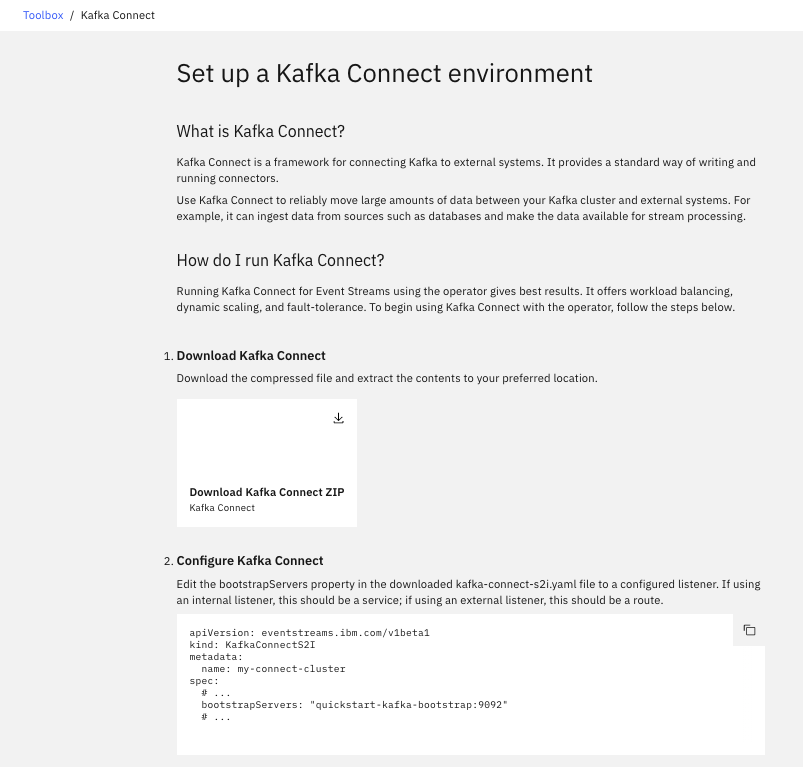
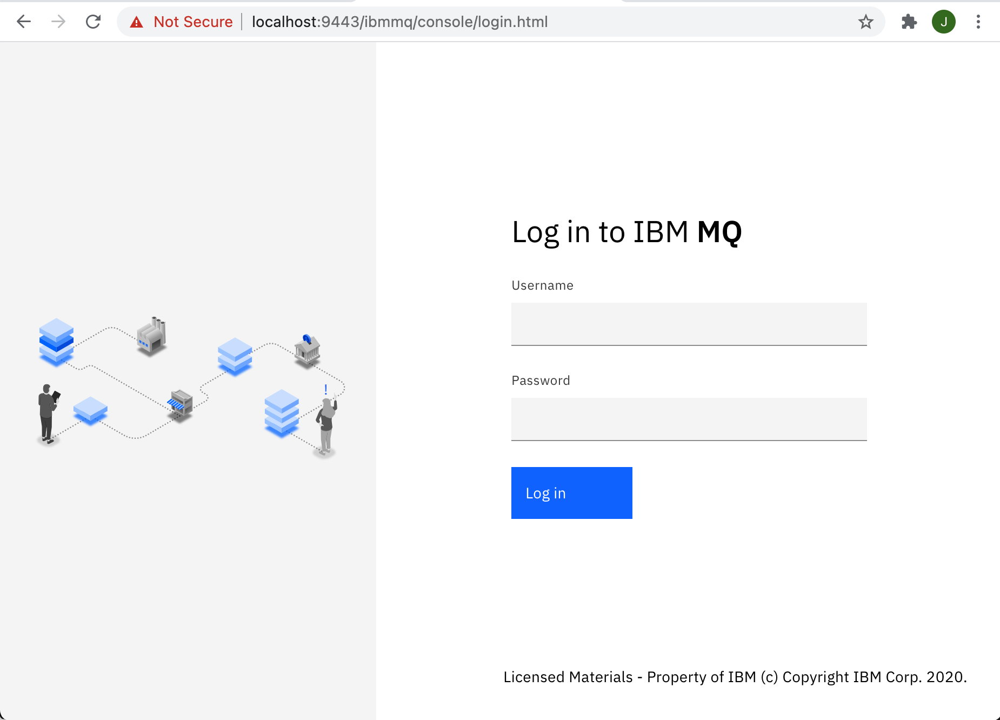
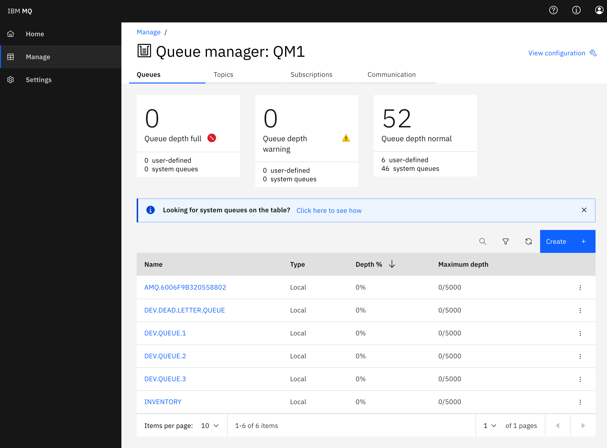
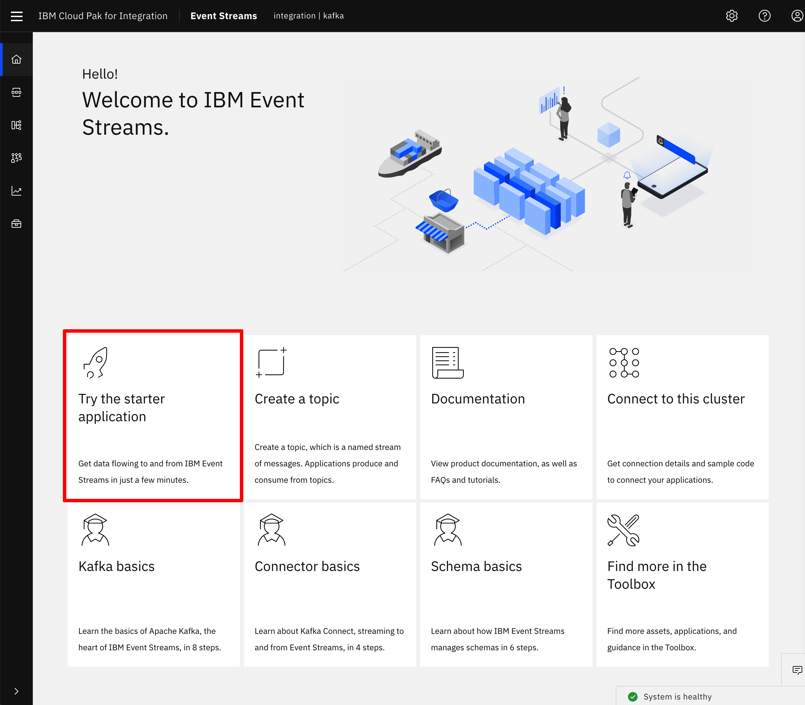
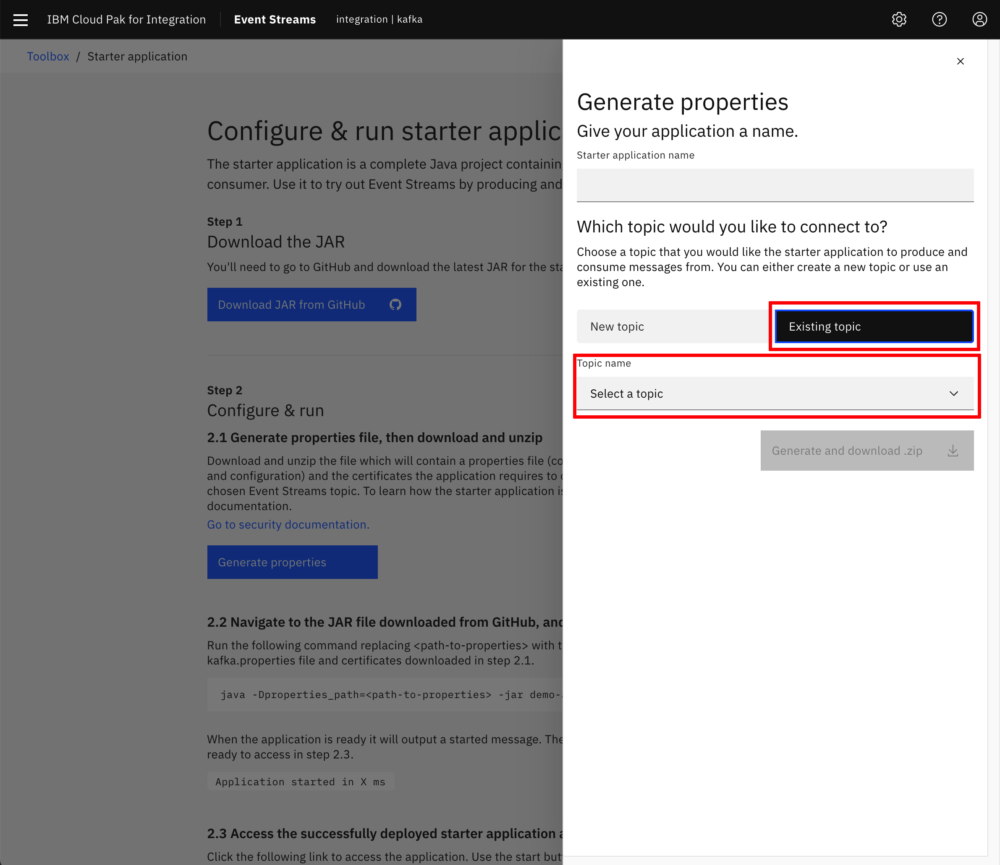
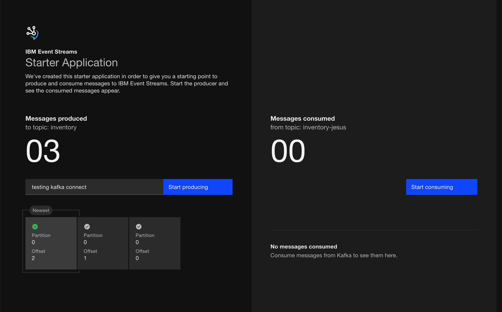
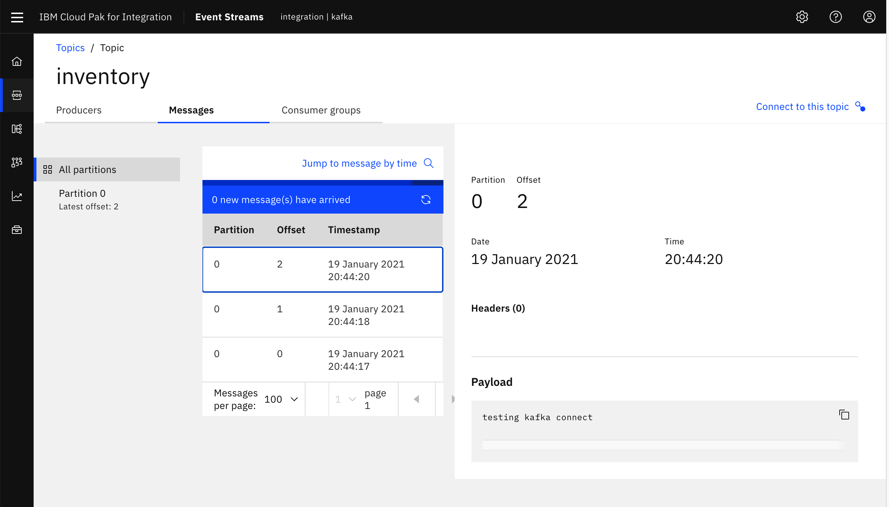
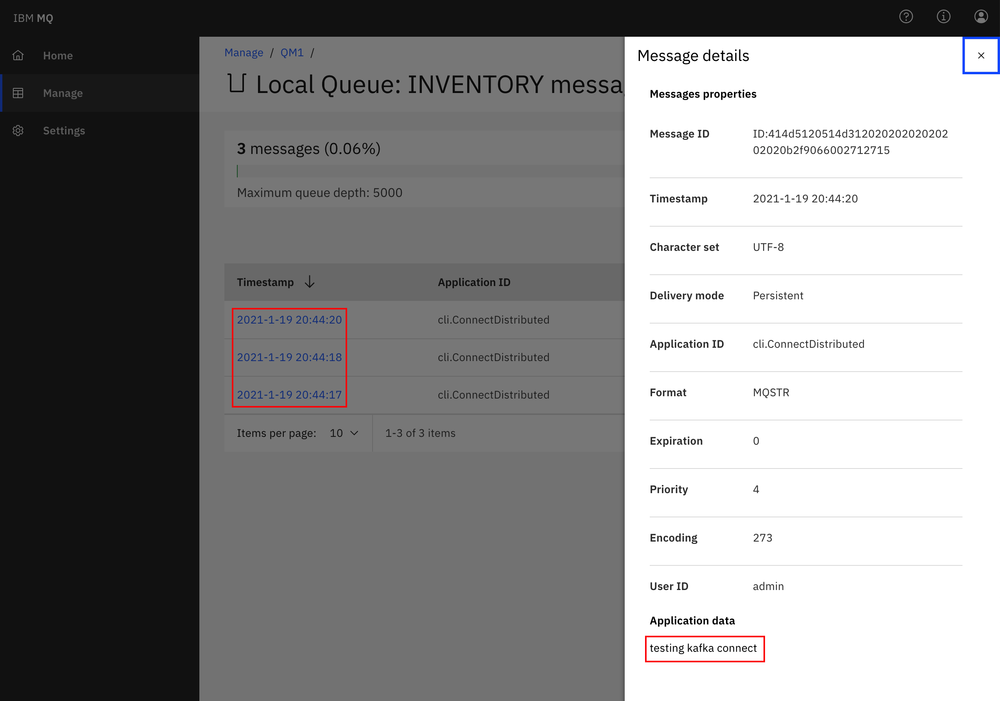

This extended scenario supports different labs going from simple to more complex and addresses how to integrate between IBM MQ and Kafka. It uses Kafka Confluent or Open Source Strimzi, IBM MQ as part of Cloud Pak for Integration and Kafka connect with MQ connectors.

This Lab focuses on using Strimzi 2.7. To run the same Lab with Kafka Confluent see the [ibm-cloud-architecture/eda-lab-mq-to-kafka readme file.](https://github.com/ibm-cloud-architecture/eda-lab-mq-to-kafka)

<AnchorLinks>
<AnchorLink>Pre-requisites to all labs</AnchorLink>
<AnchorLink>Lab 1: MQ source to Kafka</AnchorLink>
<AnchorLink>Lab 2: MQ Sink from Kafka</AnchorLink>
</AnchorLinks>

## Pre-requisites to all labs

* Clone the lab git repository

 ```shell
 git clone https://github.com/ibm-cloud-architecture/eda-lab-mq-to-kafka
 ```
* Get access to a Cloud Pak for Integration installation, MQ deployed.
* Get access to the OpenShift Console


## Lab 1: MQ source to Kafka

The following figure illustrates what we will do:


* The Sell Store simulator is a separate application available in [public github](https://github.com/ibm-cloud-architecture/refarch-eda-store-simulator) and in the [quay.io registry](https://quay.io/repository/ibmcase/eda-store-simulator) or the [docker hub one]().

* Login to the OpenShift Console and get access token to use `oc cli`
* Create new project with a command like: `oc new-project mq-to-k-lab`
* Deploy Strimzi operator and create one Strimzi cluster. This is done by using the following commands under the `eda-lab-mq-to-kafka` folder:

```shell
./scripts/deployStrimziOperator.sh
# Wait one or two minutes to get an lab-kafka-entity-operator- pod running.
```

* Deploy a sinple Kafka cluster with the name `lab-kafka`. 

```shell
oc apply -k kustomize/environment/strimzi
```

At this stage a `oc get pods` should return 3 zookeepers and 3 kafka broker pods:

```
lab-kafka-cruise-control-d94ffbcb5-7g7h2     2/2     Running   0          75s
lab-kafka-entity-operator-65fc8644c6-hlpn2   3/3     Running   0          117s
lab-kafka-kafka-0                            1/1     Running   0          2m30s
lab-kafka-kafka-1                            1/1     Running   0          2m30s
lab-kafka-kafka-2                            1/1     Running   0          2m30s
lab-kafka-zookeeper-0                        1/1     Running   0          3m24s
lab-kafka-zookeeper-1                        1/1     Running   0          3m24s
lab-kafka-zookeeper-2                        1/1     Running   0          3m24s
```

* Get MQ connection characteristics

## Lab 2: MQ Sink from Kafka

The target deployment looks like in the following diagram:

 

Kafka is runnning in its own namespace, and we are using Event Streams from Cloud Pack for Integration.

### Pre-requisites

We assume that you have an instance of Event Streams already running on OpenShift, with a TLS authentication user type. See [those instructions](../../use-cases/overview/pre-requisites#getting-scram-authentication-from-event-streams-on-openshift) to get those credentials.

The MQ broker is running on OpenShift and was created using kubernetes operators: we have documented a simple how to guide in [this MQ summary](../../technology/mq#installation-with-cloud-pak-for-integration). The instance is exposed via a Route so we can access the administration console using the admin credentials of Cloud Pak for Integration.

### Setup MQ Channel

Open a shell on the remote container or use the user interface to define the communication channel to use for the Kafka Connection.

* Using CLI: Change the name of the Q manager to reflect what you defined in MQ configuration.

```shell
runmqsc EDAQMGR1
# Define a app channel using server connection
DEFINE CHANNEL(KAFKA.CHANNEL) CHLTYPE(SVRCONN)
# Set the channel authentication rules to accept connections requiring userid and password
SET CHLAUTH(KAFKA.CHANNEL) TYPE(BLOCKUSER) USERLIST('nobody')
SET CHLAUTH('*') TYPE(ADDRESSMAP) ADDRESS('*') USERSRC(NOACCESS)
SET CHLAUTH(KAFKA.CHANNEL) TYPE(ADDRESSMAP) ADDRESS('*') USERSRC(CHANNEL) CHCKCLNT(REQUIRED)
# Set identity of the client connections
ALTER AUTHINFO(SYSTEM.DEFAULT.AUTHINFO.IDPWOS) AUTHTYPE(IDPWOS) ADOPTCTX(YES)

REFRESH SECURITY TYPE(CONNAUTH)
# Define inventory queue
DEFINE QLOCAL(INVENTORY)
# Authorize the IBM MQ user ID to connect to and inquire the queue manager
SET AUTHREC OBJTYPE(QMGR) PRINCIPAL('admin') AUTHADD(CONNECT,INQ)
# Authorize the IBM MQ user ID to use the queue:
SET AUTHREC PROFILE(INVENTORY) OBJTYPE(QUEUE) PRINCIPAL('admin') AUTHADD(ALLMQI)
# done
END
```

* As an alternate you can use the MQ administration console.

TBD

### Setup Kafka Connect Cluster

Connectors can be added to a Kafka Connect environment using OpenShift CLI commands and the source to image customer resource. We will use the Event Streams admin console to setup kafka connect environment which is based on OpenShift operator. The [Event Streams product documentation](https://ibm.github.io/event-streams/connecting/connectors/) presents the deployment process within the admin console, the `Setup a kafka connect environment` tile guides developer thru those steps:

 

 

Once you downloaded the zip file, which is a yaml manifest, define the configuration for a KafkaConnectS2I instance. The major configuration settings are the server certificate settings and the authentication using Mutual TLS authentication, something like:

```yaml
spec:
  bootstrapServers: sandbox-rp-kafka-bootstrap.eventstreams.svc:9093
  tls:
    trustedCertificates:
    - secretName: sandbox-rp-cluster-ca-cert
      certificate: ca.crt
  authentication:
    type: tls
    certificate: user.crt
    key: user.key
    secretName: sandbox-rp-tls-cred
```

If you change the name of the connect cluster in the metadata, modify also the name: `spec.template.pod.metadata.annotations. productChargedContainers` accordingly.

The secrets used above, need to be accessible from the project where the connector is deployed. The simple way to do so is to copy the source certificates from the Event streams project to your current project with the commands like:

```shell
oc get secret  sandbox-rp-cluster-ca-cert  -n eventstreams --export -o yaml | oc apply -f -
oc get secret  sandbox-rp-tls-cred  -n eventstreams --export -o yaml | oc apply -f -
```

If you do not have a TLS client certificate from a TLS user, use [this note](../../overview/pre-requisites#getting-tls-authentication-from-event-streams-on-openshift) to create one.

* Deploy the connector cluster

```shell
oc apply -f kafka-connect-s2i.yaml 
```

An instance of this custom resource represents a Kafka Connect distributed worker cluster. In this mode, workload balancing is automatic, scaling is dynamic, and tasks and data are fault-tolerant. Each connector is represented by another custom resource called KafkaConnector.

```shell
oc describe kafkaconnects2i eda-connect-cluster
```

### Add the mq-sink connector  

The [product documentation](https://ibm.github.io/event-streams/connecting/mq/) details the available MQ connectors and the configuration process. Using the event streams console, the process is quite simple to get a connector configuration as json file. Here is an example of the final form to generate the json file:

 

* Once the json is downloaded, complete the settings

```json
{
  "name": "mq-sink",
  "config":
  {
      "connector.class": "com.ibm.eventstreams.connect.mqsink.MQSinkConnector",
      "tasks.max": "1",
      "topics": "inventory",
      "key.converter": "org.apache.kafka.connect.storage.StringConverter",
      "value.converter": "org.apache.kafka.connect.storage.StringConverter",
      "mq.queue.manager": "EDAQMGR1",
      "mq.connection.name.list": "eda-mq-lab-ibm-mq(1414)",
      "mq.user.name": "admin",
      "mq.password": "passw0rd",
      "mq.user.authentication.mqcsp": true,
      "mq.channel.name": "KAFKA.CHANNEL",
      "mq.queue": "INVENTORY",
      "mq.message.builder": "com.ibm.eventstreams.connect.mqsink.builders.DefaultMessageBuilder"
  }
}
```

* To run the connector within the cluster, we need to connector jar. You can download this jar file from the Event Stream adming console `> Toolkit > Add connector to your Kafka Connect environment > Add Connector > IBM MQ Connectors`,

 

or as an alternate, we [cloned the mq-sink code](https://github.com/ibm-messaging/kafka-connect-mq-sink.git), so a `mvn package` command under `kafka-connect-mq-sink` folder will build the jar. Copy this jar under `cp4i/my-plugins` folder. 
* Build the connector with source to image component.


With the correct credentials for IBM EventStreams and IBM MQ, Kafka Connect should connect to both services and pull data from the EventStreams topic configured to the MQ Queue configured.  You will see signs of success in the container output (via oc logs, or in the UI):

```shell
+ curl -X POST -H Content-Type: application/json http://localhost:8083/connectors --data @/opt/kafka-connect-mq-sink/config/mq-sink.json
...
{"name":"mq-sink-connector","config":{"connector.class":"com.ibm.eventstreams.connect.mqsink.MQSinkConnector","tasks.max":"1","topics":"inventory","key.converter":"org.apache.kafka.connect.storage.StringConverter","value.converter":"org.apache.kafka.connect.storage.StringConverter","mq.queue.manager":"QM1","mq.connection.name.list":"mq-service(1414)","mq.user.name":"admin","mq.password":"passw0rd","mq.user.authentication.mqcsp":"true","mq.channel.name":"KAFKA.CHANNEL","mq.queue":"INVENTORY","mq.message.builder":"com.ibm.eventstreams.connect.mqsink.builders.DefaultMessageBuilder","name":"mq-sink-connector"},"tasks":[{"connector":"mq-sink-connector","task":0}],"type":"sink"}
...
[2020-06-23 04:26:26,054] INFO Creating task mq-sink-connector-0 (org.apache.kafka.connect.runtime.Worker:419)
...[2020-06-23 04:26:26,449] INFO Connection to MQ established (com.ibm.eventstreams.connect.mqsink.JMSWriter:229)
[2020-06-23 04:26:26,449] INFO WorkerSinkTask{id=mq-sink-connector-0} Sink task finished initialization and start (org.apache.kafka.connect.runtime.WorkerSinkTask:306)
```

You should now have the Kafka Connector MQ Sink running on OpenShift.


## MQ Sink Connector on virtual or baremetal server, MQ and Event Streams on IBM Cloud

In this second option, we are using our own laptop for the baremetal dedployment, but the current solution will work the same on virtual server.

 

### Pre-requisites

We assume that you have an instance of IBM Event Streams already running on IBM Cloud or on OpenShift with at least administrator credentials created. The credentials will be needed later on for configuring the Kafka Connect framework to be able to connect and work with your IBM Event Streams instance. Also, this scenario requires a topic called `inventory` in your IBM Event Streams instance. For gathering the credentials and creating the topic required for this scenario, please review the [Common pre-requisites](/use-cases/overview/pre-requisites/). **IMPORTANT:** if you are sharing your IBM Event Streams instance, append some unique identifier to the topic you create in IBM Event Streams.

### Create Local IBM MQ Instance

In this section we are going to use Docker to create a local IBM MQ instance to simulate an IBM MQ instance somewhere in our datacenter.

1. Create a data directory to mount onto the container.

  ```shell
  mkdir qm1data
  ```

1. Run the IBM MQ official Docker image by execting the following command.

  ```shell
  docker run                     \
    --name mq                    \
    --detach                     \
    --publish 1414:1414          \
    --publish 9443:9443          \
    --publish 9157:9157          \
    --volume qm1data:/mnt/mqm    \
    --env LICENSE=accept         \
    --env MQ_QMGR_NAME=QM1       \
    --env MQ_APP_PASSWORD=admin  \
    --env MQ_ENABLE_METRICS=true \
    ibmcom/mq
  ```
  where we can see that out container will be called `mq`, it will run in `detached` mode (i.e. in the background), it will expose the ports IBM MQ uses for communication and the image we are actually running `ibmcom/mq`.

1. You could make sure your IBM MQ Docker image is running by listing the Docker containers in your workstation.

  ```shell
  $ docker ps
  CONTAINER ID   IMAGE       COMMAND            CREATED         STATUS         PORTS                                                                    NAMES
  a7b2a115a3c6   ibmcom/mq   "runmqdevserver"   6 minutes ago   Up 6 minutes   0.0.0.0:1414->1414/tcp, 0.0.0.0:9157->9157/tcp, 0.0.0.0:9443->9443/tcp   mq
  ```

1. You should also be able to log into the MQ server on port 9443 (<https://localhost:9443>) with default user `admin` and password `passw0rd`.

  

Now, we need to configure our local IBM MQ instance Queue Manager in order to define a server connection (`KAFKA.CHANNEL`) with authentication (user `admin`, password `admin`) and the queue (`INVENTORY`) where our messages from Kafka will be sinked to. And we are going to so it using the IBM MQ CLI.

1. Get into the IBM MQ Docker container we have started above by executing the following command that will give us a `bash` interactive terminal:

  ```shell
  docker exec -ti mq bash
  ```

1. Now that we are in the container, start the queue manager `QM1` by executing:

  ```shell
  strmqm QM1
  ```

1. Start the `runmqsc` tool to configure the queue manager by executing:

  ```shell
  runmqsc QM1
  ```

1. Create a server-connection channel called `KAFKA.CHANNEL` by executing:

  ```shell
  DEFINE CHANNEL(KAFKA.CHANNEL) CHLTYPE(SVRCONN)
  ```

1. Set the channel authentication rules to accept connections requiring userid and password by executing:

  ```shell
  SET CHLAUTH(KAFKA.CHANNEL) TYPE(BLOCKUSER) USERLIST('nobody')
  SET CHLAUTH('*') TYPE(ADDRESSMAP) ADDRESS('*') USERSRC(NOACCESS)
  SET CHLAUTH(KAFKA.CHANNEL) TYPE(ADDRESSMAP) ADDRESS('*') USERSRC(CHANNEL) CHCKCLNT(REQUIRED)
  ```

1. Set the identity of the client connections based on the supplied context, the user ID by executing:

  ```shell
  ALTER AUTHINFO(SYSTEM.DEFAULT.AUTHINFO.IDPWOS) AUTHTYPE(IDPWOS) ADOPTCTX(YES)
  ```

1. Refresh the connection authentication information by executing:

  ```shell
  REFRESH SECURITY TYPE(CONNAUTH)
  ```

1. Create the `INVENTORY` queue for the connector to use by executing:

  ```shell
  DEFINE QLOCAL(INVENTORY)
  ```

1. Authorize `admin` to connect to and inquire the queue manager by executing:

  ```shell
  SET AUTHREC OBJTYPE(QMGR) PRINCIPAL('admin') AUTHADD(CONNECT,INQ)
  ```

1. Finally authorize `admin` to use the queue by executing:

  ```shell
  SET AUTHREC PROFILE(INVENTORY) OBJTYPE(QUEUE) PRINCIPAL('admin') AUTHADD(ALLMQI)
  ```

1. End `runmqsc` by executing:

  ```shell
  END
  ```

You should see the following output:

```shell
9 MQSC commands read.
No commands have a syntax error.
One valid MQSC command could not be processed.
```

Exit the container by executing:

```shell
exit
```

If you check your IBM MQ dashboard you should see your newly created `INVENTORY` queue:

  

### Create MQ Kafka Connector Sink

The MQ Connector Sink can be downloaded from this [Github](https://github.com/ibm-messaging/kafka-connect-mq-sink). The Github site includes exhaustive instructions for further detail on this connector and its usage.

1. Clone the repository with the following command:

  ```shell
  git clone https://github.com/ibm-messaging/kafka-connect-mq-sink.git
  ```

1. Change directory into the `kafka-connect-mq-sink` directory:

  ```shell
  cd kafka-connect-mq-sink
  ```

1. Build the connector using Maven:

  ```shell
  mvn clean package
  ```

1. Create a directory (if it does not exist yet) to contain the Kafka Connect framework configuration and cd into it.

  ```shell
  mkdir config
  cd config
  ```

1. Create a configuration file called `connect-distributed.properties` for the Kafka Connect framework with the following properties in it:

  ```properties
  # A list of host/port pairs to use for establishing the initial connection to the Kafka cluster.
  bootstrap.servers=REPLACE_WITH_YOUR_BOOTSTRAP_URL
  ssl.enabled.protocols=TLSv1.2
  ssl.protocol=TLS
  ssl.truststore.location=/opt/kafka/config/es-cert.p12
  ssl.truststore.password=REPLACE_WITH_YOUR_PKCS12_CERTIFICATE_PASSWORD
  ssl.truststore.type=PKCS12
  security.protocol=SASL_SSL
  sasl.mechanism=SCRAM-SHA-512
  sasl.jaas.config=org.apache.kafka.common.security.scram.ScramLoginModule required username="REPLACE_WITH_YOUR_SCRAM_USERNAME" password="REPLACE_WITH_YOUR_SCRAM_PASSWORD";

  # Consumer side configuration
  consumer.bootstrap.servers=REPLACE_WITH_YOUR_BOOTSTRAP_URL
  consumer.security.protocol=SASL_SSL
  consumer.ssl.protocol=TLSv1.2
  consumer.ssl.truststore.location=/opt/kafka/config/es-cert.p12
  consumer.ssl.truststore.password=REPLACE_WITH_YOUR_PKCS12_CERTIFICATE_PASSWORD
  consumer.ssl.truststore.type=PKCS12
  consumer.sasl.mechanism=SCRAM-SHA-512
  consumer.sasl.jaas.config=org.apache.kafka.common.security.scram.ScramLoginModule required username="REPLACE_WITH_YOUR_SCRAM_USERNAME" password="REPLACE_WITH_YOUR_SCRAM_PASSWORD";

  # Producer Side
  producer.bootstrap.servers=REPLACE_WITH_YOUR_BOOTSTRAP_URL
  producer.security.protocol=SASL_SSL
  producer.ssl.protocol=TLSv1.2
  producer.ssl.truststore.location=/opt/kafka/config/es-cert.p12
  producer.ssl.truststore.password=REPLACE_WITH_YOUR_PKCS12_CERTIFICATE_PASSWORD
  producer.ssl.truststore.type=PKCS12
  producer.sasl.mechanism=SCRAM-SHA-512
  producer.sasl.jaas.config=org.apache.kafka.common.security.scram.ScramLoginModule required username="REPLACE_WITH_YOUR_SCRAM_USERNAME" password="REPLACE_WITH_YOUR_SCRAM_PASSWORD";

  plugin.path=/opt/kafka/libs

  # unique name for the cluster, used in forming the Connect cluster group. Note that this must not conflict with consumer group IDs
  group.id=mq-sink-cluster-REPLACE_WITH_UNIQUE_IDENTIFIER

  # The converters specify the format of data in Kafka and how to translate it into Connect data. Every Connect user will
  # need to configure these based on the format they want their data in when loaded from or stored into Kafka
  key.converter=org.apache.kafka.connect.json.JsonConverter
  value.converter=org.apache.kafka.connect.json.JsonConverter
  # Converter-specific settings can be passed in by prefixing the Converter's setting with the converter we want to apply
  # it to
  key.converter.schemas.enable=true
  value.converter.schemas.enable=true

  # Topic to use for storing offsets.
  offset.storage.topic=connect-offsets-REPLACE_WITH_UNIQUE_IDENTIFIER
  offset.storage.replication.factor=3
  #offset.storage.partitions=25

  # Topic to use for storing connector and task configurations; note that this should be a single partition, highly replicated, and compacted topic.
  config.storage.topic=connect-configs-REPLACE_WITH_UNIQUE_IDENTIFIER
  config.storage.replication.factor=3

  # Topic to use for storing statuses. This topic can have multiple partitions and should be replicated and compacted.
  status.storage.topic=connect-status-REPLACE_WITH_UNIQUE_IDENTIFIER
  status.storage.replication.factor=3
  status.storage.partitions=5

  # Flush much faster than normal, which is useful for testing/debugging
  offset.flush.interval.ms=10000
  ```

  **IMPORTANT:** You must replace **all occurences** of the following placeholders in the properties file above with the appropriate values for the Kafka Connect framework to work with your IBM Event Streams instance:
    * `REPLACE_WITH_YOUR_BOOTSTRAP_URL`: Your IBM Event Streams bootstrap url.
    * `REPLACE_WITH_YOUR_PKCS12_CERTIFICATE_PASSWORD`: Your PCKS12 TLS certificate password.
    * `REPLACE_WITH_YOUR_SCRAM_USERNAME`: Your SCRAM service credentials username.
    * `REPLACE_WITH_YOUR_SCRAM_PASSWORD`: Your SCRAM service credentials password.
    * `REPLACE_WITH_UNIQUE_IDENTIFIER`: A unique identifier so that the resources your kafka connect cluster will create on your IBM Event Streams instance don't collide with other users' resources _(Note: there are 4 placeholders of this type. Replace them all)._ 
    
  
  Review the [Common pre-requisites](/use-cases/overview/pre-requisites/) instructions if you don't know how to find out any of the config properties above. 

1. Download the IBM Event Streams TLS certificate so that your Kafka Connect framework local instance can establish secure communication with your IBM Event Streams instance. **IMPORTANT:** download the PKCS12 certificate. How to get the certificate in the [Common pre-requisites](/use-cases/overview/pre-requisites/) section. 

1. Create a log4j configuration file named `connect-log4j.properties` based on the template below.

  ```properties
  log4j.rootLogger=DEBUG, stdout

  log4j.appender.stdout=org.apache.log4j.ConsoleAppender
  log4j.appender.stdout.layout=org.apache.log4j.PatternLayout
  log4j.appender.stdout.layout.ConversionPattern=[%d] %p %m (%c:%L)%n

  log4j.logger.org.apache.kafka=INFO
  ```

1. Back out of the `config` directory to the `kafka-connect-mq-sink` directory:

  ```shell
  cd ..
  ```

2. Build the Docker image for your Kafka Connect framework that will contain the IBM MQ Sink connector and all the properties files you have created and tailored earlier so that your Kafka Connect framework can work with your IBM Event Streams instance we have set up previously in this exercise (_mind the dot at the end of the command. It is necessary_):

  ```shell
  docker build -t kafkaconnect-with-mq-sink:1.3.0 .
  ```

1. Run the Kafka Connect MQ Sink container.

  ```
  docker run                                 \
    --name mq-sink                           \
    --detach                                 \
    --volume $(pwd)/config:/opt/kafka/config \
    --publish 8083:8083                      \
    --link mq:mq                             \
    kafkaconnect-with-mq-sink:1.3.0
  ```

1. Now that we have a Kafka Connect framework running with the configuration to connect to our IBM Event Streams instance and the IBM MQ Sink Connector jar file in it, is to create a JSON file called `mq-sink.json` to startup an instance of the IBM MQ Sink connector in our Kafka Connect framework with the appropriate config to work read messages from the IBM Event Streams topic we desire and sink those to the IBM MQ instance we have running locally. **IMPORTANT:** If you are sharing your IBM Event Streams instance and followed the instructions on this readme, you should have appended a unique identifier to the name of the topic (`inventory`) that you are meant to create in IBM Event Streams. As a result, modify the line `"topics": "inventory"` in the following JSON object accordignly.

   ```json
   {
      "name": "mq-sink",
      "config":
      {
          "connector.class": "com.ibm.eventstreams.connect.mqsink.MQSinkConnector",
          "tasks.max": "1",
          "topics": "inventory",

          "key.converter": "org.apache.kafka.connect.storage.StringConverter",
          "value.converter": "org.apache.kafka.connect.storage.StringConverter",

          "mq.queue.manager": "QM1",
          "mq.connection.name.list": "mq(1414)",
          "mq.user.name": "admin",
          "mq.password": "passw0rd",
          "mq.user.authentication.mqcsp": true,
          "mq.channel.name": "KAFKA.CHANNEL",
          "mq.queue": "INVENTORY",
          "mq.message.builder": "com.ibm.eventstreams.connect.mqsink.builders.DefaultMessageBuilder"
      }
   }
   ```

1. Last piece of the puzzle is to tell our Kafka Connect framework to create and startup the IBM MQ Sink connector based on the configuration we have in the previous json file. To do so, execute the following `POST` request.

  ```Shell
  curl -X POST -H "Content-Type: application/json" http://localhost:8083/connectors   --data "@./mq-sink.json"

  # The response returns the metadata about the connector
  {"name":"mq-sink","config":{"connector.class":"com.ibm.eventstreams.connect.mqsink.MQSinkConnector","tasks.max":"1","topics":"inventory","key.converter":"org.apache.kafka.connect.storage.StringConverter","value.converter":"org.apache.kafka.connect.storage.StringConverter","mq.queue.manager":"QM1","mq.connection.name.list":"ibmmq(1414)","mq.user.name":"admin","mq.password":"passw0rd","mq.user.authentication.mqcsp":"true","mq.channel.name":"KAFKA.CHANNEL","mq.queue":"INVENTORY","mq.message.builder":"com.ibm.eventstreams.connect.mqsink.builders.DefaultMessageBuilder","name":"mq-sink"},"tasks":[{"connector":"mq-sink","task":0}],"type":"sink"}
  ```

1. You can query your Kafka Connect framework to make sure of this. Execute the following command that should return all the connectors up and running in your Kafka Connect cluster.

  ```shell
  curl localhost:8083/connectors
  ["mq-sink"]
  ```

You should now have a working MQ Sink connector getting messages from your topic in IBM Event Streams and sending these to your local IBM MQ instance. In order to check that out working, we first need to send few messages to that IBM Event Streams topic and then check out our `INVENTORY` queue in our local IBM MQ instance.

1. In order to send messages to IBM Event Streams, we are going to use the IBM Event Streams Starter application. You can find the instruction either in the IBM Event Streams official documentation [here] or on the IBM Event Streams dashboard:

  

1. Follow the instructions to run the IBM Event Streams starter application from your workstation. **IMPORTANT:** When generating the properties for your IBM Event Streams starter application, please choose to connect to an existing topic and select the topic you created previously as part of this exercise so that the messages we send into IBM Event Streams end up in the appropriate topic that is being monitored by your IBM MQ Sink connector runnning on the Kafka Connect framework.

  

1. Once you have your application running, open it up in your web browser, click on `Start producing`, let the application produce a couple of messages and then click on `Stop producing`

  

1. Check out your those messages got into the Kafka topic

  

1. Check out your messages in the Kafka topic have already reached your `INVENTORY` queue in your local IBM MQ instance

  


1. You could also inspect the logs of your Kafka Connect Docker container running on your workstation:

  ```shell
  docker logs mq-sink
  ...
  [2021-01-19 19:44:17,110] DEBUG Putting record for topic inventory, partition 0 and offset 0 (com.ibm.eventstreams.connect.mqsink.MQSinkTask:89)
  [2021-01-19 19:44:17,110] DEBUG Value schema Schema{STRING} (com.ibm.eventstreams.connect.mqsink.builders.DefaultMessageBuilder:60)
  [2021-01-19 19:44:18,292] DEBUG Flushing up to topic inventory, partition 0 and offset 1 (com.ibm.eventstreams.connect.mqsink.MQSinkTask:110)
  [2021-01-19 19:44:18,292] INFO WorkerSinkTask{id=mq-sink-0} Committing offsets asynchronously using sequence number 636: {inventory-0=OffsetAndMetadata{offset=1, leaderEpoch=null, metadata=''}} (org.apache.kafka.connect.runtime.WorkerSinkTask:346)
  [2021-01-19 19:44:18,711] DEBUG Putting record for topic inventory, partition 0 and offset 1 (com.ibm.eventstreams.connect.mqsink.MQSinkTask:89)
  [2021-01-19 19:44:18,711] DEBUG Value schema Schema{STRING} (com.ibm.eventstreams.connect.mqsink.builders.DefaultMessageBuilder:60)
  [2021-01-19 19:44:20,674] DEBUG Putting record for topic inventory, partition 0 and offset 2 (com.ibm.eventstreams.connect.mqsink.MQSinkTask:89)
  [2021-01-19 19:44:20,675] DEBUG Value schema Schema{STRING} (com.ibm.eventstreams.connect.mqsink.builders.DefaultMessageBuilder:60)
  [2021-01-19 19:44:28,293] DEBUG Flushing up to topic inventory, partition 0 and offset 3 (com.ibm.eventstreams.connect.mqsink.MQSinkTask:110)
  [2021-01-19 19:44:28,293] INFO WorkerSinkTask{id=mq-sink-0} Committing offsets asynchronously using sequence number 637: {inventory-0=OffsetAndMetadata{offset=3, leaderEpoch=null, metadata=''}} (org.apache.kafka.connect.runtime.WorkerSinkTask:346)
  [2021-01-19 19:44:38,296] DEBUG Flushing up to topic inventory, partition 0 and offset 3 (com.ibm.eventstreams.connect.mqsink.MQSinkTask:110)
  ```

To cleanup your environment, you can do

1. Remove the connector from your Kafka Connect framework instance (this isn't really needed if you are going to stop and remove the Kafka Connect Docker container)

  ```shell
  curl -X DELETE http://localhost:8083/connectors/mq-sink
  ```

1. Stop both IBM MQ and Kakfa Connect Docker containers running on your workstation

  ```shell
  docker stop mq mq-sink
  ```

1. Remove both IBM MQ and Kakfa Connect Docker containers from your workstation

  ```shell
  docker rm mq mq-sink
  ```