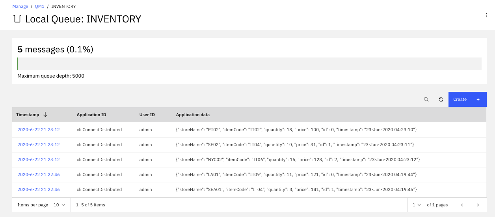

<InlineNotification kind="warning">
<strong>Work in progress</strong> - MQ Sink Connector on virtual or baremetal server, MQ and Event Streams on IBM Cloud not completed...
</InlineNotification>

This scenario uses the [IBM Kafka Connect sink connector for IBM MQ](https://github.com/ibm-messaging/kafka-connect-mq-sink) to pull streaming data from Kafka topic into a MQ queue. We can have multiple deployment combinations but we will limit to two patterns:

<AnchorLinks>
<AnchorLink>MQ Sink Connector, MQ,and Kafka on OpenShift</AnchorLink>
<AnchorLink>MQ Sink Connector on virtual or baremetal server, MQ and Event Streams on IBM Cloud</AnchorLink>
</AnchorLinks>

## Pre-requisites

**Get a Git client**

**Clone the MQ Sink connector** using the command:

```shell
git clone https://github.com/ibm-messaging/kafka-connect-mq-sink.git
```

**Clone the Lab repository** to get configuration files. This lab is under [labs/mq-sink-lab/](https://github.com/ibm-cloud-architecture/refarch-eda-tools/tree/master/labs/mq-sink-lab/) folder.

```shell
git clone https://github.com/ibm-cloud-architecture/refarch-eda-tools.git
```

## MQ Sink Connector, MQ, Kafka on OpenShift

The target deployment looks like in the following diagram:

 

Kafka is runnning in its own namespace, and we are using Event Streams from Cloud Pack for Integration.

### Pre-requisites

We assume that you have an instance of Event Streams already running on OpenShift, with a TLS authentication user type. See [those instructions](../../use-cases/overview/pre-requisites#getting-scram-authentication-from-event-streams-on-openshift) to get those credentials.

The MQ broker is running on OpenShift and was created using kubernetes operators: we have documented a simple how to guide in [this MQ summary](../../technology/mq#installation-with-cloud-pak-for-integration). The instance is exposed via a Route so we can access the administration console using the admin credentials of Cloud Pak for Integration.

### Setup MQ Channel

Open a shell on the remote container or use the user interface to define the communication channel to use for the Kafka Connection.

* Using CLI: Change the name of the Q manager to reflect what you defined in MQ configuration.

```shell
runmqsc EDAQMGR1
# Define a app channel using server connection
DEFINE CHANNEL(KAFKA.CHANNEL) CHLTYPE(SVRCONN)
# Set the channel authentication rules to accept connections requiring userid and password
SET CHLAUTH(KAFKA.CHANNEL) TYPE(BLOCKUSER) USERLIST('nobody')
SET CHLAUTH('*') TYPE(ADDRESSMAP) ADDRESS('*') USERSRC(NOACCESS)
SET CHLAUTH(KAFKA.CHANNEL) TYPE(ADDRESSMAP) ADDRESS('*') USERSRC(CHANNEL) CHCKCLNT(REQUIRED)
# Set identity of the client connections
ALTER AUTHINFO(SYSTEM.DEFAULT.AUTHINFO.IDPWOS) AUTHTYPE(IDPWOS) ADOPTCTX(YES)

REFRESH SECURITY TYPE(CONNAUTH)
# Define inventory queue
DEFINE QLOCAL(INVENTORY)
# Authorize the IBM MQ user ID to connect to and inquire the queue manager
SET AUTHREC OBJTYPE(QMGR) PRINCIPAL('admin') AUTHADD(CONNECT,INQ)
# Authorize the IBM MQ user ID to use the queue:
SET AUTHREC PROFILE(INVENTORY) OBJTYPE(QUEUE) PRINCIPAL('admin') AUTHADD(ALLMQI)
# done
END
```

* As an alternate you can use the MQ administration console.

TBD

### Setup Kafka Connect Cluster

Connectors can be added to a Kafka Connect environment using OpenShift CLI commands and the source to image customer resource. We will use the Event Streams admin console to setup kafka connect environment which is based on OpenShift operator. The [Event Streams product documentation](https://ibm.github.io/event-streams/connecting/connectors/) presents the deployment process within the admin console, the `Setup a kafka connect environment` tile guides developer thru those steps:

 

 

Once you downloaded the zip file, which is a yaml manifest, define the configuration for a KafkaConnectS2I instance. The major configuration settings are the server certificate settings and the authentication using Mutual TLS authentication, something like:

```yaml
spec:
  bootstrapServers: sandbox-rp-kafka-bootstrap.eventstreams.svc:9093
  tls:
    trustedCertificates:
    - secretName: sandbox-rp-cluster-ca-cert
      certificate: ca.crt
  authentication:
    type: tls
    certificate: user.crt
    key: user.key
    secretName: sandbox-rp-tls-cred
```

If you change the name of the connect cluster in the metadata, modify also the name: `spec.template.pod.metadata.annotations. productChargedContainers` accordingly.

The secrets used above, need to be accessible from the project where the connector is deployed. The simple way to do so is to copy the source certificates from the Event streams project to your current project with the commands like:

```shell
oc get secret  sandbox-rp-cluster-ca-cert  -n eventstreams --export -o yaml | oc apply -f -
oc get secret  sandbox-rp-tls-cred  -n eventstreams --export -o yaml | oc apply -f -
```

If you do not have a TLS client certificate from a TLS user, use [this note](../../overview/pre-requisites#getting-tls-authentication-from-event-streams-on-openshift) to create one.

* Deploy the connector cluster

```shell
oc apply -f kafka-connect-s2i.yaml 
```

An instance of this custom resource represents a Kafka Connect distributed worker cluster. In this mode, workload balancing is automatic, scaling is dynamic, and tasks and data are fault-tolerant. Each connector is represented by another custom resource called KafkaConnector.

```shell
oc describe kafkaconnects2i eda-connect-cluster
```

### Add the mq-sink connector  

The [product documentation](https://ibm.github.io/event-streams/connecting/mq/) details the available MQ connectors and the configuration process. Using the event streams console, the process is quite simple to get a connector configuration as json file. Here is an example of the final form to generate the json file:

 

* Once the json is downloaded, complete the settings

```json
{
  "name": "mq-sink",
  "config":
  {
      "connector.class": "com.ibm.eventstreams.connect.mqsink.MQSinkConnector",
      "tasks.max": "1",
      "topics": "inventory",
      "key.converter": "org.apache.kafka.connect.storage.StringConverter",
      "value.converter": "org.apache.kafka.connect.storage.StringConverter",
      "mq.queue.manager": "EDAQMGR1",
      "mq.connection.name.list": "eda-mq-lab-ibm-mq(1414)",
      "mq.user.name": "admin",
      "mq.password": "passw0rd",
      "mq.user.authentication.mqcsp": true,
      "mq.channel.name": "KAFKA.CHANNEL",
      "mq.queue": "INVENTORY",
      "mq.message.builder": "com.ibm.eventstreams.connect.mqsink.builders.DefaultMessageBuilder"
  }
}
```

* To run the connector within the cluster, we need to connector jar. You can download this jar file from the Event Stream adming console `> Toolkit > Add connector to your Kafka Connect environment > Add Connector > IBM MQ Connectors`,

 

or as an alternate, we [cloned the mq-sink code](https://github.com/ibm-messaging/kafka-connect-mq-sink.git), so a `mvn package` command under `kafka-connect-mq-sink` folder will build the jar. Copy this jar under `cp4i/my-plugins` folder. 
* Build the connector with source to image component.

```
```


With the correct credentials for IBM EventStreams and IBM MQ, Kafka Connect should connect to both services and pull data from the EventStreams topic configured to the MQ Queue configured.  You will see signs of success in the container output (via oc logs, or in the UI):

```shell
+ curl -X POST -H Content-Type: application/json http://localhost:8083/connectors --data @/opt/kafka-connect-mq-sink/config/mq-sink.json
...
{"name":"mq-sink-connector","config":{"connector.class":"com.ibm.eventstreams.connect.mqsink.MQSinkConnector","tasks.max":"1","topics":"inventory","key.converter":"org.apache.kafka.connect.storage.StringConverter","value.converter":"org.apache.kafka.connect.storage.StringConverter","mq.queue.manager":"QM1","mq.connection.name.list":"mq-service(1414)","mq.user.name":"admin","mq.password":"passw0rd","mq.user.authentication.mqcsp":"true","mq.channel.name":"KAFKA.CHANNEL","mq.queue":"INVENTORY","mq.message.builder":"com.ibm.eventstreams.connect.mqsink.builders.DefaultMessageBuilder","name":"mq-sink-connector"},"tasks":[{"connector":"mq-sink-connector","task":0}],"type":"sink"}
...
[2020-06-23 04:26:26,054] INFO Creating task mq-sink-connector-0 (org.apache.kafka.connect.runtime.Worker:419)
...[2020-06-23 04:26:26,449] INFO Connection to MQ established (com.ibm.eventstreams.connect.mqsink.JMSWriter:229)
[2020-06-23 04:26:26,449] INFO WorkerSinkTask{id=mq-sink-connector-0} Sink task finished initialization and start (org.apache.kafka.connect.runtime.WorkerSinkTask:306)
```

You should now have the Kafka Connector MQ Sink running on OpenShift.


## MQ Sink Connector on virtual or baremetal server, MQ and Event Streams on IBM Cloud

We are using our own laptop for the baremetal dedployment, but the current solution will work the same on virtual server.

 

### Pre-requisites

We assume that you have an instance of Event Streams already running on IBM Cloud with at least on manager-level credentials created.  The credentials will come in the form of a JSON document as seen in the previous section.
You will need the `kafka_brokers_sasl` and `password` atribute to configure the sink connector.

This scenario uses the `inventory` topic created in the Scenario Setup in previous section.

### Create Local IBM MQ Instance

Here we will use Docker to create a local MQ instance.  First create a data directory to mount in the container.

`mkdir qm1data`

Then create the container.

```shell
docker run                     \
  --name mq                    \
  --detach                     \
  --publish 1414:1414          \
  --publish 9443:9443          \
  --publish 9157:9157          \
  --volume qm1data:/mnt/mqm    \
  --env LICENSE=accept         \
  --env MQ_QMGR_NAME=QM1       \
  --env MQ_APP_PASSWORD=admin  \
  --env MQ_ENABLE_METRICS=true \
  ibmcom/mq
```

You should be able to log into the MQ server on port 9443 with default user `admin` and password `passw0rd`.

Connect to the running MQ instance to create a Channel and Queue as described on the [Using IBM MQ with Kafka Connect](https://github.com/ibm-messaging/kafka-connect-mq-sink/blob/master/UsingMQwithKafkaConnect.md) page.

```shell
docker exec -ti mq bash
strmqm QM1
runmqsc QM1
DEFINE CHANNEL(KAFKA.CHANNEL) CHLTYPE(SVRCONN)
SET CHLAUTH(KAFKA.CHANNEL) TYPE(BLOCKUSER) USERLIST('nobody')
SET CHLAUTH('*') TYPE(ADDRESSMAP) ADDRESS('*') USERSRC(NOACCESS)
SET CHLAUTH(KAFKA.CHANNEL) TYPE(ADDRESSMAP) ADDRESS('*') USERSRC(CHANNEL) CHCKCLNT(REQUIRED)
ALTER AUTHINFO(SYSTEM.DEFAULT.AUTHINFO.IDPWOS) AUTHTYPE(IDPWOS) ADOPTCTX(YES)
REFRESH SECURITY TYPE(CONNAUTH)
DEFINE QLOCAL(INVENTORY)
SET AUTHREC OBJTYPE(QMGR) PRINCIPAL('admin') AUTHADD(CONNECT,INQ)
SET AUTHREC PROFILE(INVENTORY) OBJTYPE(QUEUE) PRINCIPAL('admin') AUTHADD(ALLMQI)
END
```

Exit the session and continue on to create the MQ Connector Sink.

### Create MQ Kafka Connector Sink

The MQ Connector Sink can be downloaded from [Github](https://github.com/ibm-messaging/kafka-connect-mq-sink).  The Github site includes exhaustive instructions and an abridged version follows.

Clone the repository with the following command:

`git clone https://github.com/ibm-messaging/kafka-connect-mq-sink.git`

Change directory into the kafka-connect-mq-sink directory:

`cd kafka-connect-mq-sink`

Build the connector using Maven:

`mvn clean package`

Next, create a directory to contain the Kafka Connector configuration.

`mkdir config && cd config`

Create a configuration file called `connect-distributed.properties` for Kafka Connect based on the template below.

```properties
# A list of host/port pairs to use for establishing the initial connection to the Kafka cluster.
bootstrap.servers=broker-1- ... kafka.svc01.us-east.eventstreams.cloud.ibm.com:9093,broker-0- ... kafka.svc01.us-east.eventstreams.cloud.ibm.com:9093,broker-4- ... kafka.svc01.us-east.eventstreams.cloud.ibm.com:9093,broker-2- ... kafka.svc01.us-east.eventstreams.cloud.ibm.com:9093,broker-5- ... kafka.svc01.us-east.eventstreams.cloud.ibm.com:9093,broker-3- ... kafka.svc01.us-east.eventstreams.cloud.ibm.com:9093
ssl.enabled.protocols=TLSv1.2
ssl.protocol=TLS
security.protocol=SASL_SSL
sasl.mechanism=PLAIN
sasl.jaas.config=org.apache.kafka.common.security.plain.PlainLoginModule required username="token" password="bA ... Qp";

# Consumer side configuration
consumer.bootstrap.servers=broker-1- ... kafka.svc01.us-east.eventstreams.cloud.ibm.com:9093,broker-0- ... kafka.svc01.us-east.eventstreams.cloud.ibm.com:9093,broker-4- ... kafka.svc01.us-east.eventstreams.cloud.ibm.com:9093,broker-2- ... kafka.svc01.us-east.eventstreams.cloud.ibm.com:9093,broker-5- ... kafka.svc01.us-east.eventstreams.cloud.ibm.com:9093,broker-3- ... kafka.svc01.us-east.eventstreams.cloud.ibm.com:9093
consumer.security.protocol=SASL_SSL
consumer.ssl.protocol=TLSv1.2
consumer.sasl.mechanism=PLAIN
consumer.sasl.jaas.config=org.apache.kafka.common.security.plain.PlainLoginModule required username="token" password="bA ... Qp";

# Producer Side
producer.security.protocol=SASL_SSL
producer.ssl.protocol=TLSv1.2
producer.sasl.mechanism=PLAIN
producer.sasl.jaas.config=org.apache.kafka.common.security.plain.PlainLoginModule required username="token" password="bA ... Qp";
producer.bootstrap.servers=broker-1- ... kafka.svc01.us-east.eventstreams.cloud.ibm.com:9093,broker-0- ... kafka.svc01.us-east.eventstreams.cloud.ibm.com:9093,broker-4- ... kafka.svc01.us-east.eventstreams.cloud.ibm.com:9093,broker-2- ... kafka.svc01.us-east.eventstreams.cloud.ibm.com:9093,broker-5- ... kafka.svc01.us-east.eventstreams.cloud.ibm.com:9093,broker-3- ... kafka.svc01.us-east.eventstreams.cloud.ibm.com:9093


plugin.path=/opt/kafka/libs

# unique name for the cluster, used in forming the Connect cluster group. Note that this must not conflict with consumer group IDs
group.id=mq-sink-cluster

# The converters specify the format of data in Kafka and how to translate it into Connect data. Every Connect user will
# need to configure these based on the format they want their data in when loaded from or stored into Kafka
key.converter=org.apache.kafka.connect.json.JsonConverter
value.converter=org.apache.kafka.connect.json.JsonConverter
# Converter-specific settings can be passed in by prefixing the Converter's setting with the converter we want to apply
# it to
key.converter.schemas.enable=true
value.converter.schemas.enable=true

# Topic to use for storing offsets. T
offset.storage.topic=connect-offsets
offset.storage.replication.factor=3
#offset.storage.partitions=25

# Topic to use for storing connector and task configurations; note that this should be a single partition, highly replicated, and compacted topic.
config.storage.topic=connect-configs
config.storage.replication.factor=3

# Topic to use for storing statuses. This topic can have multiple partitions and should be replicated and compacted.
status.storage.topic=connect-status
status.storage.replication.factor=3
status.storage.partitions=5

# Flush much faster than normal, which is useful for testing/debugging
offset.flush.interval.ms=10000
```

Save this file in the `config` directory.

Next, create a log4j configuration file named `connect-log4j.properties` based on the template below.

```properties
log4j.rootLogger=DEBUG, stdout

log4j.appender.stdout=org.apache.log4j.ConsoleAppender
log4j.appender.stdout.layout=org.apache.log4j.PatternLayout
log4j.appender.stdout.layout.ConversionPattern=[%d] %p %m (%c:%L)%n

log4j.logger.org.apache.kafka=INFO
```

Save this file to the `config` directory as well.

Finally, create a JSON configuraiton file for the MQ sink.  This can be stored anywhere but it can be conveniently created in the `config` directory.  We name this file `mq-sink.json`.

```json
{
    "name": "mq-sink",
    "config":
    {
        "connector.class": "com.ibm.eventstreams.connect.mqsink.MQSinkConnector",
        "tasks.max": "1",
        "topics": "inventory",

        "key.converter": "org.apache.kafka.connect.storage.StringConverter",
        "value.converter": "org.apache.kafka.connect.storage.StringConverter",

        "mq.queue.manager": "QM1",
        "mq.connection.name.list": "mq(1414)",
        "mq.user.name": "admin",
        "mq.password": "passw0rd",
        "mq.user.authentication.mqcsp": true,
        "mq.channel.name": "KAFKA.CHANNEL",
        "mq.queue": "INVENTORY",
        "mq.message.builder": "com.ibm.eventstreams.connect.mqsink.builders.DefaultMessageBuilder"
    }
}
```

Back out one directory to the `kafka-connect-mq-sink` directory.

`cd ..`

Build docker image
`docker build -t kafkaconnect-with-mq-sink:1.3.0 .`

Finally, run the Kafka Connect MQ Sink container.

```
docker run                                 \
  --name mq-sink                           \
  --detach                                 \
  --volume $(pwd)/config:/opt/kafka/config \
  --publish 8083:8083                      \
  --link mq:mq                             \
  kafkaconnect-with-mq-sink:1.3.0
```

You should now have a working MQ sink.

As an alternate approach, when you have a Kafka Connect isntance up and running, with the dependant jar files, it is possible to configure the connector with a POST operation like:

```Shell
curl -X POST -H "Content-Type: application/json" http://localhost:8083/connectors   --data "@./mq-sink.json"

# The response returns the metadata about the connector
{"name":"mq-sink","config":{"connector.class":"com.ibm.eventstreams.connect.mqsink.MQSinkConnector","tasks.max":"1","topics":"inventory","key.converter":"org.apache.kafka.connect.storage.StringConverter","value.converter":"org.apache.kafka.connect.storage.StringConverter","mq.queue.manager":"QM1","mq.connection.name.list":"ibmmq(1414)","mq.user.name":"admin","mq.password":"passw0rd","mq.user.authentication.mqcsp":"true","mq.channel.name":"KAFKA.CHANNEL","mq.queue":"INVENTORY","mq.message.builder":"com.ibm.eventstreams.connect.mqsink.builders.DefaultMessageBuilder","name":"mq-sink"},"tasks":[{"connector":"mq-sink","task":0}],"type":"sink"}
```

Once the connector is up and running, we can use some tool to send inventory message. In the `integration-tests` folder we have some python code to produce message. If you have a python environment with kafka api you can use yours, or we have also provided a Dockerfile to prepare a local python environment, which will not impact yours.

```shell
# if you change the name of the image
docker build -t ibmcase/python37 .
# ... then update the script ./startPython.sh
./startPython.sh
# Now in the new bash session you should see ProduceInventoryEvent.py,... start it by sending 2 events
python ProduceInventoryEvent.py --size 2
# Events are random but use stores and items known by the database downstream.
 sending -> {'storeName': 'NYC01', 'itemCode': 'IT06', 'quantity': 15, 'price': 163, 'id': 1, 'timestamp': '23-Jun-2020 04:32:38'}
# the following trace demonstrates Kafka received the message
[KafkaProducer] - Message delivered to inventory [0]
sending -> {'storeName': 'SC01', 'itemCode': 'IT06', 'quantity': 15, 'price': 178, 'id': 2, 'timestamp': '23-Jun-2020 04:32:38'}
[KafkaProducer] - Message delivered to inventory [0]
```

In the Kafka Connect trace we can see:

```shell
kconnect_1  | [2020-06-23 04:23:16,270] INFO WorkerSinkTask{id=mq-sink-0} Committing offsets asynchronously using sequence number 26: {inventory-0=OffsetAndMetadata{offset=44, leaderEpoch=null, metadata=''}} (org.apache.kafka.connect.runtime.WorkerSinkTask:349)
kconnect_1  | [2020-06-23 04:32:46,382] INFO WorkerSinkTask{id=mq-sink-0} Committing offsets asynchronously using sequence number 83: {inventory-0=OffsetAndMetadata{offset=48, leaderEpoch=null, metadata=''}} (org.apache.kafka.connect.runtime.WorkerSinkTask:349)
```

And in the IBM MQ Console, under the Local Queue: Inventory we can see the messages:



To remove the connector do the following command. Do this specially if you go to scenario 2 next.

```shell
curl -X DELETE http://localhost:8083/connectors/mq-sink
```
