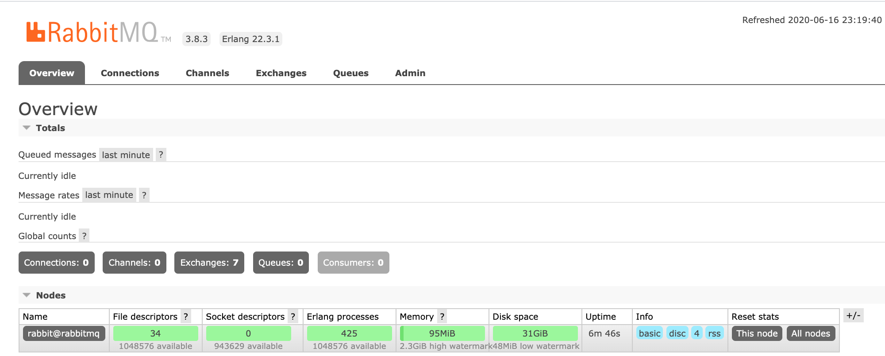
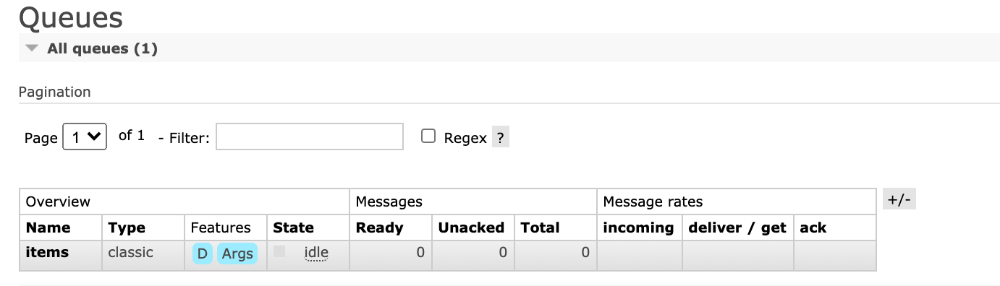

<InlineNotification kind="warning">
<strong>Updated 11/10/2020</strong> Lab completed on local computer. Instruction not completed for OpenShift deployment.
</InlineNotification>

<AnchorLinks>
<AnchorLink>Just run it!</AnchorLink>
<AnchorLink>Deploy on OpenShift</AnchorLink>
</AnchorLinks>

This hands-on lab demonstrates how to use IBM RabbitMQ Kafka source connector to inject message to Event Streams On Premise or any Kafka cluster. 
We are using the [IBM messaging github: source Kafka connector for RabbitMQ](https://github.com/ibm-messaging/kafka-connect-rabbitmq-source) open sourced component. The configuration for this connector is also done using Json config file, with a POST to the Kafka connectors URL.

The following diagram illustrates the component of this demo / lab:


The configurations used in this use case are in the `refarch-eda-tools` repository that you should clone:

```shell
git clone https://github.com/ibm-cloud-architecture/refarch-eda-tools
```

under the [labs/rabbitmq-source-lab](https://github.com/ibm-cloud-architecture/refarch-eda-tools/tree/master/labs/rabbitmq-source-lab) folder.

## Just run it!

For demonstration purpose, we have defined a docker compose file and a set of docker images ready to use. So it will be easier to demonstrate the scenario of sending messages to Rabbit MQ `items` queue, have a Kafka connector configured and a simple Kafka consumer which consumes Json doc from the `items` Kafka topic. 

To send message to RabbitMQ, we have implemented a simple store sale simulator, which sends item sale messages for a set of stores. The code is under [eda-store-simulator repository](https://github.com/ibm-cloud-architecture/refarch-eda-store-simulator) and we have also uploaded the image [into dockerhub ibmcase/eda-store-simulator](https://hub.docker.com/repository/docker/ibmcase/eda-store-simulator).

### Start backend services

To quickly start a local demonstration environment, the [github repository for this lab](https://github.com/ibm-cloud-architecture/refarch-eda-tools) includes a [docker compose file](https://github.com/ibm-cloud-architecture/refarch-eda-tools/tree/master/labs/rabbitmq-source-lab/docker-compose.yaml) under the `labs/rabbitmq-source-lab` folder.

```shell
git clone https://github.com/ibm-cloud-architecture/refarch-eda-tools
cd refarch-eda-tools/labs/rabbitmq-source-lab
docker-compose up -d
docker ps 

IMAGE                              NAMES                            PORT                  
ibmcase/kconnect:v1.0.0            rabbitmq-source-lab_kconnect_1   0.0.0.0:8083->8083/  
strimzi/kafka:latest-kafka-2.6.0   rabbitmq-source-lab_kafka_1      0.0.0.0:9092->9092/
ibmcase/eda-store-simulator        rabbitmq-source-lab_simulator_1  0.0.0.0:8080->8080/
rabbitmq:3-management              rabbitmq-source-lab_rabbitmq_1   0.0.0.0:5672->5672/tcp, 15671/tcp, 15691-15692/tcp, 25672/tcp, 0.0.0.0:15672->15672/tcp   
strimzi/kafka:latest-kafka-2.6.0   rabbitmq-source-lab_zookeeper_1 0.0.0.0:2181->2181/                                                                                      
```

### Deploy source connector

Once the different containers are started, you can deploy the RabbitMQ source connector using the following POST

```shell
# under the folder use the curl to post configuration
./sendRMQSrcConfig.sh localhost:8083

# Trace should look like
{"name":"RabbitMQSourceConnector",
"config":{"connector.class":"com.ibm.eventstreams.connect.rabbitmqsource.RabbitMQSourceConnector",
"tasks.max":"1",
"kafka.topic":"items",
"rabbitmq.host":"rabbitmq",
"rabbitmq.port":"5672",
"rabbitmq.queue":"items",
"rabbitmq.username":"rabbit-user",
"rabbitmq.password":"rabbit-pass",
"rabbitmq.prefetch.count":"500",
"rabbitmq.automatic.recovery.enabled":"true",
"rabbitmq.network.recovery.interval.ms":"10000",
"rabbitmq.topology.recovery.enabled":"true",
"name":"RabbitMQSourceConnector"},
"tasks":[],
"type":"source"}
```

* And then looking at the deployed connectors using [http://localhost:8083/connectors](http://localhost:8083/connectors) or the RabbitMQ connector with [http://localhost:8083/connectors/RabbitMQSourceConnector](http://localhost:8083/connectors/RabbitMQSourceConnector) to get the same response as the above json.

* Create `items` topic into Kafka using the script:

```shell
./createTopics.sh
```

* Send some records using the simulator at the [http://localhost:8080/#/simulator](http://localhost:8080/#/simulator) URL by first selecting RabbitMQ button and the number of message to send: 

 


* Verify the RabbitMQ settings

In a Web Browser go to [http://localhost:15672/](http://localhost:15672/) using the rabbit-user/rabbit-pass login.

You should reach this console:



Go to the Queue tab and select the `items` queue:



And then get 1 message from the queue:


* Now verify the Kafka connect-* topics are created successfully:

 ```shell
 docker run -ti --network  rabbitmq-source-lab_default strimzi/kafka:latest-kafka-2.6.0 bash -c "/opt/kafka/bin/kafka-topics.sh --bootstrap-server kafka:9092 --list"
 # you should get at least
 __consumer_offsets
 connect-configs
 connect-offsets
 connect-status
 items
 ```

* Verify the message arrived to the `items` in kafka topic:

 ```shell
 docker run -ti --network  rabbitmq-source-lab_default  strimzi/kafka:latest-kafka-2.6.0 bash -c "/opt/kafka/bin/kafka-console-consumer.sh --bootstrap-server kafka:9092 --topic items --from-beginning"

 # You may have a trace like which maps the messages sent 
 "{\"id\":0,\"price\":11.0,\"quantity\":6,\"sku\":\"Item_5\",\"storeName\":\"Store_3\",\"timestamp\":\"2020-10-23T19:11:26.395325\",\"type\":\"SALE\"}"
"{\"id\":1,\"price\":68.5,\"quantity\":0,\"sku\":\"Item_5\",\"storeName\":\"Store_1\",\"timestamp\":\"2020-10-23T19:11:26.395447\",\"type\":\"SALE\"}"
 ```

You validated the solution works end to end. Now we can try to deploy those components to OpenShift.

## Deploy on OpenShift

In this section, you will deploy the Kafka connector and Rabbit MQ on OpenShift using Event Streams on Premise as Kafka cluster.

### Pre-requisites

* To run the demonstration be sure to have the event store simulator deployed: [see instructions here.]()

_Pull in necessary pre-req from the [Realtime Inventory Pre-reqs](/scenarios/realtime-inventory/#general-pre-requisites), like for example the deployment of the store simulator._

### Deploy RabbitMQ using operators

See [the installation instructions](https://www.rabbitmq.com/kubernetes/operator/install-operator.html) to get a RabbitMQ **operator** installed, or use our manifests from the [refarch-eda-tools](https://github.com/ibm-cloud-architecture/refarch-eda-tools) repository, which will set user 1000 and 999 for OpenShift deployment. The RabbitMQ cluster operator runs as user ID `1000`. The RabbitMQ pod runs the RabbitMQ container as user ID `999` and an init container as user ID `0`.

* Create a dedicated project to run RabbitMQ operator to observe any projects, and install CRD, service account, RBAC role, deployment... 

 ```shell
 oc new-project rabbitmq-system
 # under the labs/rabbitmq-source-lab folder do
 kubectl apply -f cluster-operator.yml

 kubectl get customresourcedefinitions.apiextensions.k8s.io
 ```

* Create a second project for RabbitMQ cluster. It is recommended to have separate project for RabbitMQ cluster.
Modify the namespace to be able to deploy RabbitMQ cluster into it. So we need to get user 999 authorized. For that we specify a security constraint named: `rabbitmq-cluster`

 ```shell
  #Define a Security Context Constraint
  oc apply -f rmq-scc.yaml
 ```

* Update the name space to get openshift scc userid and groupid range. You can do that in two ways, by directly editing the namespace definition:

 ```shell
  oc edit namespace rabbitmq-cluster
  # Then add the following annotations:
  annotations:
    openshift.io/sa.scc.supplemental-groups: 999/1
    openshift.io/sa.scc.uid-range: 0-999/1
 ```

 Or by using our custom cluster definition: `oc apply -f rmq-cluster-ns.yaml`

*  For every RabbitMQ cluster assign the previously created security context constraint to the cluster's service account: ` oc adm policy add-scc-to-user rabbitmq-cluster -z rmqcluster-rabbitmq-server`

* Finally create a cluster instance: `oc apply -f rmq-cluster.yaml`.
* Define a route on the client service on port 15672
* Get the admin user and password as defined in the secrets

 ```shell
  oc describe secret rmqcluster-rabbitmq-default-user
  # Get user name
  oc get secret rmqcluster-rabbitmq-default-user  -o jsonpath='{.data.username}' | base64 --decode 
  # Get password
  oc get secret rmqcluster-rabbitmq-default-user  -o jsonpath='{.data.password}' | base64 --decode 
 ```

To validate the RabbitMQ cluster runs correctly you can use the RabbitMQ console, and add the `items` queue.

## Configure the kafka connector for Rabbitmq source

The `rabbitmq-source.json` define the connector and the RabbitMQ connection parameters:

```json
{
    "name": "RabbitMQSourceConnector",
    "config": {
        "connector.class": "com.ibm.eventstreams.connect.rabbitmqsource.RabbitMQSourceConnector",
        "tasks.max": "1",
        "kafka.topic" : "items",
        "rabbitmq.host": "rabbitmq",
        "rabbitmq.port": 5672,
        "rabbitmq.queue" : "items",
        "rabbitmq.prefetch.count" : "500",
        "rabbitmq.automatic.recovery.enabled" : "true",
        "rabbitmq.network.recovery.interval.ms" : "10000",
        "rabbitmq.topology.recovery.enabled" : "true"
    }
}
```

This file is uploaded to Kafka Connect via a PORT operation:

```shell
curl -X POST -H "Content-Type: application/json" http://localhost:8083/connectors   --data "@./rabbitmq-source.json"
```

To verify use: `curl -X GET http://localhost:8083/connectors`.

In Kafka connect trace you should see:

```shell
[Worker clientId=connect-1, groupId=eda-kconnect] Connector RabbitMQSourceConnector config updated
...
Starting connector RabbitMQSourceConnector
...
 Starting task RabbitMQSourceConnector-0

```

And Rabbitmq that get the connection from Kafka Connect.

```shell
rabbitmq_1  [info] <0.1766.0> accepting AMQP connection <0.1766.0> (172.19.0.3:33040 -> 172.19.0.2:5672)
kconnect_1  INFO Creating Channel (com.ibm.eventstreams.connect.rabbitmqsource.RabbitMQSourceTask:61)
rabbitmq_1  connection <0.1766.0> (172.19.0.3:33040 -> 172.19.0.2:5672): user 'rabbit-user' authenticated and granted access to vhost '/'
```

