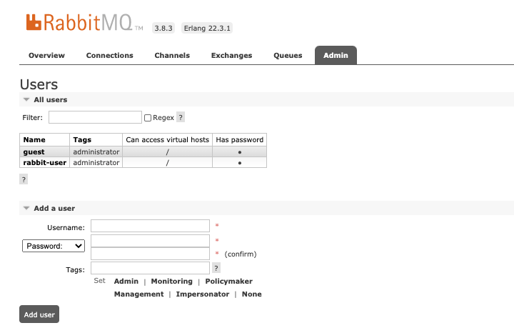
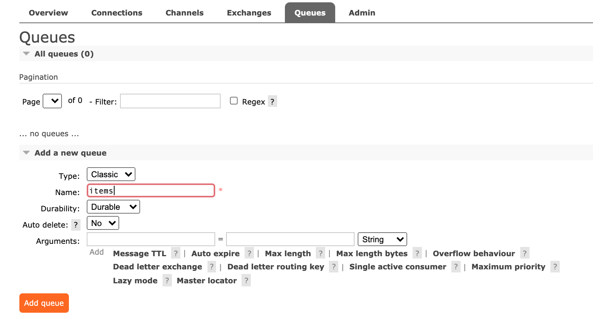
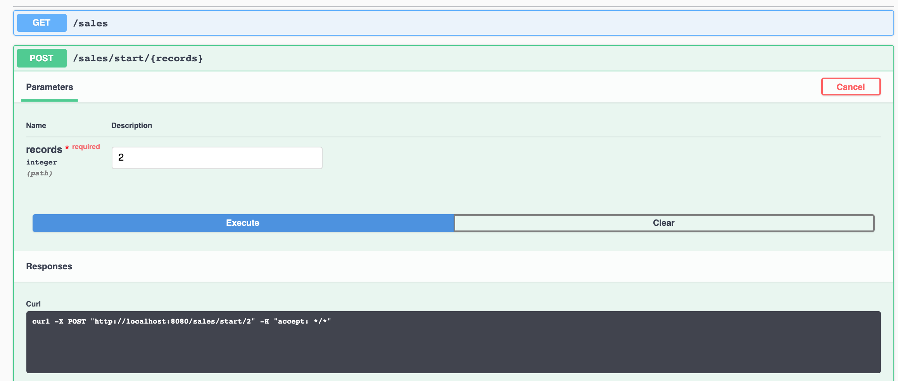
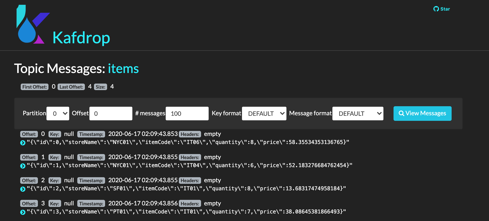

<InlineNotification kind="warning">
<strong>TODO</strong> - Work in progress
</InlineNotification>

<AnchorLinks>
<AnchorLink>Pre-requisites</AnchorLink>
<AnchorLink>Start the backend environment</AnchorLink>
<AnchorLink>Verify the RabbitMQ settings</AnchorLink>
<AnchorLink>Configure the kafka connector for Rabbitmq source</AnchorLink>
<AnchorLink>Generate sale messages</AnchorLink>
<AnchorLink>Verify messages arrived in Kafka items topic</AnchorLink>
</AnchorLinks>

This hands-on lab demonstrates how to use IBM RabbitMQ source connector to inject message to Event Streams On Premise. 
We are using the [IBM messaging github: source connector for RabbitMQ](https://github.com/ibm-messaging/kafka-connect-rabbitmq-source). The configuration for this connector is also done using Json config file, with a POST to the Kafka connectors URL.

The code, configurations and detail readme instructions are in this repository that you should clone:

```shell
git clone https://github.com/jbcodeforce/eda-kconnect-lab
```

To send message to RabbitMQ, we have implemented a simple simulator, to send item sale messages for one of the stores. The code is under [store-sale-producer](https://github.com/jbcodeforce/eda-kconnect-lab/tree/master/store-sale-producer) folder and we have also uploaded the image into dockerhub.

For quick start and demonstration the [github repository for this lab](https://github.com/jbcodeforce/eda-kconnect-lab) includes a docker compose file [RabbitMQ-Kconnect-compose.yaml](https://github.com/jbcodeforce/eda-kconnect-lab/blob/master/infrastructure/RabbitMQ-Kconnect-compose.yaml) under the `infrastructure` folder to run Rabbit MQ and Kafka Connect together on your local computer. We recommend to follow the instructions in the [store-sale-producer readme](https://github.com/jbcodeforce/eda-kconnect-lab/tree/master/store-sale-producer) file.

But we want to also run and deploy this solution on OpenShift and Event Streams on Premise.

## Pre-requisites

<InlineNotification kind="warning"><strong>TODO</strong></InlineNotification>

_Pull in necessary pre-req context from [Realtime Inventory Pre-reqs](/scenarios/realtime-inventory/#general-pre-requisites)._

 If you need to rebuild the image the following commands may be done:

```shell
./mvnw clean package -Dquarkus.container-image.build=true -Dquarkus.container-image.group=ibmcase -Dquarkus.container-image.tag=1.0.0
```

## Start the backend environment

In this section we start RabbitMQ, Kafka Connect and the Store Item Sale generator app. This app exposes a REST api to generate items sale operations that happen in a predefined set of stores.

Under the infrastructure folder use the command: `docker-compose -f RabbitMQ-Kconnect-compose.yaml up`.

The trace includes RabbitMQ, storeSaleGenerator_1 and Kafka connect logs. Here is a small extract of important messages:

```shell
rabbitmq_1            | 2020-06-17 06:12:58.293 [info] <0.9.0> Server startup complete; 4 plugins started.
rabbitmq_1            |  * rabbitmq_management
rabbitmq_1            |  * rabbitmq_web_dispatch
rabbitmq_1            |  * rabbitmq_management_agent
rabbitmq_1            |  * rabbitmq_amqp1_0
rabbitmq_1            |  completed with 4 plugins.
....
storeSaleGenerator_1  | 2020-06-17 06:12:44,056 INFO  [io.quarkus] (main) Profile prod activated.
storeSaleGenerator_1  | 2020-06-17 06:12:44,057 INFO  [io.quarkus] (main) Installed features: [cdi, mutiny, resteasy, resteasy-jsonb, smallrye-openapi, smallrye-reactive-messaging, smallrye-reactive-messaging-amqp, vertx]
```

## Verify the RabbitMQ settings

In a Web Browser go to [http://localhost:1567/](http://localhost:1567/) using the guest/guest login.

You should reach this console:


If in the Admin tab you do not see **rabbit-user** listed do the following:

* Add a new admin user: **rabbit-user/rabbit-pass** using the Admin tab. Enable the virtual host to be '/'.




Go to the Queue tab and add `items` queue with default parameters:




With the following result


## Configure the kafka connector for Rabbitmq source

The `rabbitmq-source.json` define the connector and the RabbitMQ connection parameters:

```json
{
    "name": "RabbitMQSourceConnector",
    "config": {
        "connector.class": "com.ibm.eventstreams.connect.rabbitmqsource.RabbitMQSourceConnector",
        "tasks.max": "1",
        "kafka.topic" : "items",
        "rabbitmq.host": "rabbitmq",
        "rabbitmq.queue" : "items",
        "rabbitmq.prefetch.count" : "500",
        "rabbitmq.automatic.recovery.enabled" : "true",
        "rabbitmq.network.recovery.interval.ms" : "10000",
        "rabbitmq.topology.recovery.enabled" : "true"
    }
}
```

This file is uploaded to Kafka Connect via a PORT operation:

```shell
curl -X POST -H "Content-Type: application/json" http://localhost:8083/connectors   --data "@./rabbitmq-source.json"
```

To verify use: `curl -X GET http://localhost:8083/connectors`.

In Kafka connect trace you should see:

```shell
[Worker clientId=connect-1, groupId=eda-kconnect] Connector RabbitMQSourceConnector config updated
...
Starting connector RabbitMQSourceConnector
...
 Starting task RabbitMQSourceConnector-0

```

And Rabbitmq that get the connection from Kafka Connect.

```shell
rabbitmq_1  [info] <0.1766.0> accepting AMQP connection <0.1766.0> (172.19.0.3:33040 -> 172.19.0.2:5672)
kconnect_1  INFO Creating Channel (com.ibm.eventstreams.connect.rabbitmqsource.RabbitMQSourceTask:61)
rabbitmq_1  connection <0.1766.0> (172.19.0.3:33040 -> 172.19.0.2:5672): user 'rabbit-user' authenticated and granted access to vhost '/'
```

## Generate sale messages

The Store application has an OpenAPI [http://localhost:8080/swagger-ui/](http://localhost:8080/swagger-ui/) definition to send messages:  `/stores/start/2` api:



Or use `curl -X POST http://localhost:8080/stores/start/2`

In the trace you should see something like:

```shell
storeSaleGenerator_1  INFO  [ibm.gse.eda.sto.inf.ItemSaleGenerator] (executor-thread-1) {"id":0,"storeName":"SF02","itemCode":"IT07","quantity":7,"price":46.79320631709398}
storeSaleGenerator_1  INFO  [ibm.gse.eda.sto.inf.ItemSaleGenerator] (executor-thread-1) {"id":1,"storeName":"NYC01","itemCode":"IT00","quantity":7,"price":0.7764381649099172}
```
## Verify messages arrived in Kafka items topic

We can use the Kafdrop tool to go to the `items` topic as illustrated below. The tool can be started via the `./startKafdrop.sh` command under the `infrastructure` folder after setting a `kakfa.properties` file as:

```properties
security.protocol=SASL_SSL
ssl.protocol=TLSv1.2
ssl.enabled.protocols=TLSv1.2
ssl.endpoint.identification.algorithm=HTTPS
sasl.mechanism=PLAIN
sasl.jaas.config=org.apache.kafka.common.security.plain.PlainLoginModule required username="token" password="APIKEY";
```


