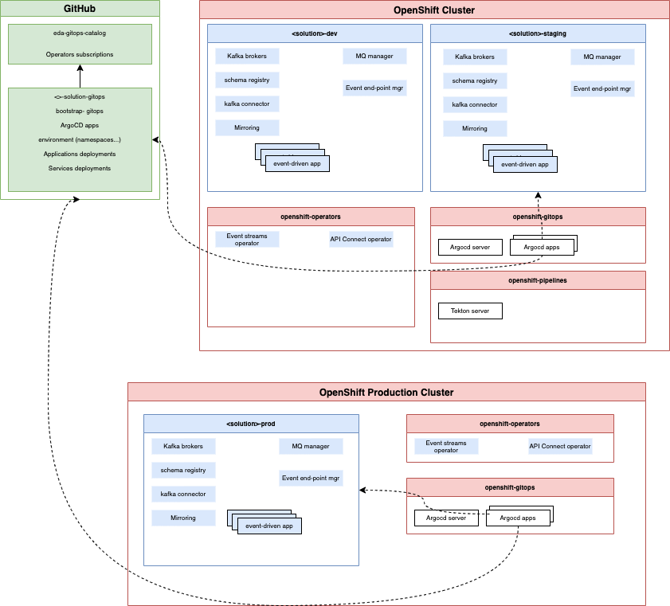

<InlineNotification kind="warning">
<strong>Updated 2/15/2022</strong>
</InlineNotification>

<AnchorLinks>
  <AnchorLink>Overview</AnchorLink>
  <AnchorLink>Components for GitOps</AnchorLink>
  <AnchorLink>High-level architecture view</AnchorLink>
  <AnchorLink>Examples of solution GitOps</AnchorLink>
</AnchorLinks>

**Audience**: Architects, Application developers, Site reliability engineers, Administrators

## Overview

The purpose of the tutorial is to teach architects, developers and operations staff how to deploy a production-ready 
event-driven solution  [OpenShift Container Platform](http://openshift.com). It makes
extensive use of the [IBM Cloud Pak for Integration
(CP4I)](https://cloud.ibm.com/docs/cloud-pak-integration) and other [cloud
native technologies]((https://landscape.cncf.io/)) such as Tekton, Kustomize,
ArgoCD, Prometheus, Grafana and Kibana.

GitOps is a declarative way to implement continuous deployment for cloud-native applications. The Red Hat® OpenShift® Container 
Platform offers the [OpenShift GitOps operator](https://docs.openshift.com/container-platform/4.7/cicd/gitops/understanding-openshift-gitops.html), 
which manages the entire lifecycle for [Argo CD](https://argoproj.github.io/argo-cd/) and its components.


Argo applications are added to the Argo CD server. An application defines the source of the Kubernetes resources and the target cluster where 
those resources should be deployed. The Argo CD server "installs" a Cloud Pak by synchronizing the applications representing the Cloud Pak into 
the target cluster.

### System context

A [system context](https://en.wikipedia.org/wiki/System_context_diagram) diagram
helps us understand how our system interacts with its different users and
other systems. For a generic event-driven solution the diagram looks like


We can see the different entities that interact with a typical event-driven solution deployment.
These include users as well as applications and messaging as a service infrastructure which includes
event backbone, queueing systems, schema registry, API management, governance platform and monitoring components.

We'll be developing the Event-driven solution deployment at the centre of the diagram. We can see
that it connects applications to systems and infrastructure. Its users are at least
developers, SREs, Kubernetes administrators, architects...

## Components for GitOps

The following diagram shows the technical components used in a typical event-driven solution production
deployment.


(*the source code of this diagram is a ``.drawio` format and is in the [diagrams folder](https://github.com/ibm-cloud-architecture/refarch-eda/edit/master/docs/src/pages/use-cases/gitops/diagrams).*)

The diagram organizes the components according to when they are introduced in system development (earlier or later) 
and whether they are a relatively high level application-oriented component, or a relatively low level system- oriented component.
For example, GitHub is a system component that is fundamental to how we structure the event-driven solution deployment. 
In contrast, streaming or event-driven applications are higher level components, and requires other components to be deployed prior to them.

The color coding illustrates that blue components are part of the solution, red are part of the GitOps on OpenShift and green components
are externals to OpenShit cluster, most likely event if they could be.
Kustomize represents way to define deployment, and Sealed secret is a service to manage secrets.

As part of the later components to deploy, we have addressed everything to monitor the solution and the infrastructure. 

Here is a brief introduction of those components:

### Event-driven applications

Those applications are supporting business logic, microservice based, and using Reactive messaging, MQ or Kafka APIs. Those applications 
provide OpenAPIs to the mobile or web applications but also AsyncAPI when they produce events to Kafka or messages to MQ. OpenAPI and AsyncAPI
definitions are managed by API manager and event end-point manager. 

Schema definitions are managed by a **Schema Registry**.

--- 

### Event-streaming applications

Those applications are also supporting business logic, but more with stateful processing using [Kafka Stream](/technology/kafka-streams/) APIs or 
different product such as [Apache Flink](/technology/flink/).

---

### Queue manager

A queue manager provides queueing services via one of the many MQ APIs. A queue
manager hosts the queues that store the messages produced and consumed by
connected applications and systems. Queue managers can be connected together via
network channels to allow messages to flow between disparate systems and
applications on different platforms including on-premise and cloud systems.

---

## OpenShift GitOps or ArgoCD

OpenShift GitOps (ArgoCD) is used for the continuous deployment of software components to the
Kubernetes cluster. OpenShift GitOps watches a Git repository for new or changed
Kubernetes resource definitions, and applies them to a cluster. In this
way, OpenShift GitOps ensures that the component configuration stored in GitHub always
reflects the state of the cluster.

OpenShift GitOps also has the added benefit of being able to monitor resources that it has
deployed to ensure that if they drift from their desired values, they will be
automatically restored to those values by OpenShift GitOps.

---

### OpenShift Pipelines or Tekton

OpenShift Pipelines (Tekton) is used to automate manual tasks using the concept of a pipeline. A
pipeline comprises a set of tasks that are executed in a specified order in
order to accomplish a specific objective.

We use pipelines as part of the continuous integration process to build, test
and deliver event-driven applications ready for deployment by OpenShift GitOps.


### Queue manager

A queue manager provides queueing services via one of the many MQ APIs. A queue
manager hosts the queues that store the messages produced and consumed by
connected applications and systems. Queue managers can be connected together via
network channels to allow messages to flow between disparate systems and
applications on different platforms including on-premise and cloud systems.

---

### Sealed secrets

Very often a component has a Kubernetes secret associated with it. Inside the
secret might be a private key to access the IBM entitled container registry, for
example.  For obvious reasons, we don't want to store the secrets in GitHub with
the rest of the configuration.

A [sealed secret](https://github.com/bitnami-labs/sealed-secrets) solves this problem by introducing a new kind of Kubernetes
resource. A sealed secret is created from a regular secret, and can be safely
stored in a Git repository. A deployment time, the sealed secret controller will
recreate the secret in its original form so that it can be access by components
with the appropriate RBAC authority.

---

### Image Registry

OpenShift contains a registry for storing container images. Images are built and stored by OpenShift Pipelines
 as part of the CICD process. Tekton pipelines and ArgoCD also retrieve
the latest best images from the image registry to ensure that what's being
tested or deployed in higher environments is the same as what's tested in
development environments.

We often refer to uploading images as *pushing* and downloading images as
*pulling*.

---

### Cert manager

Managing certificates is a difficult process; certificate creation requires a
Certificate Authority (CA), certificates expire after a period of time, and
private keys can sometimes be compromised -- requiring a certificate to be
revoked and a new one issued.

Cert manager makes all these processes relatively straightforward by introducing
new Kubernetes resources for certificate issuers and certificates. These
resource types radically simplify the management of certificates: their
creation, expiry and revocation.

Moreover, Cert manager makes it feasible to adopt mutual TLS (mTLS) as an
authorization strategy in Kafka based solution.


### Prometheus

Prometheus is used in conjunction with Grafana.  It stores the different component's metrics as a set of tuples in a time-series , which allows it to
be subsequently used to create Grafana views to assist with monitoring Kafka brokers, MQ queue managers, schema registry....

---

### Kustomize

Kubernetes resources have their operational properties defined using YAMLs. As these resources move through
environments such as dev, stage and prod, [Kustomize](https://kustomize.io/) provides a natural way to
adapt (*customize*!) these YAMLs to these environments.  For example, we might
want to change the CPU or memory available to a service in a production
environment compared to a development environment.

Because [Kustomize](https://kustomize.io/) is built into the `kubectl` and `oc`
commands via the `-k` option, it makes configuration management both easy and
natural.

---

### GitHub

This popular version control system is based on git and stores the event-driven
application source code and configuration as well as the other
Kubernetes resources. By keeping our event-driven applications and 
configurations in Git, and using that to build, test and deploy our
applications to the Kubernetes cluster, we have a **single
source of truth** -- what's in Git is running in the cluster.

Moreover, by using Git operations such as *pull*, *push* and *merge* to make
changes, we can exploit the extensive governance and change control provided by
Git when managing our event-driven solution estate.

---

### OpenShift (Kubernetes) Cluster

This is the "operating system" used to orchestrate our applications and related component containers. Kubernetes is portable across
on-premise and cloud systems and allows us to easily scale our workloads across
these environments as required.

---

## High-level architecture view

Using a GitOps approach we can design a high-level architecture view for the deployment
of all the previously listed components. 
It is important to recall that most of the RedHat and IBM products used in event-driven solution
are using Operators and Custom resources manifests to deploy operands.

**[Operator](https://github.com/operator-framework)** is a long running process that performs products (Operands) deployment and Day 2 operations, like upgrades, failover, or scaling. 
Operator is constantly watching your cluster’s desired state for the software installed. 
Helm and Operators represent two different phases in managing complex application workloads 
on Kubernetes. Helm’s primary focus is on the day-1 operation of deploying Kubernetes 
artifacts in a cluster. The ‘domain’ that it understands is that of Kubernetes YAMLs that 
are composed of available Kubernetes Resources / APIs. Operators, on the other hand, are 
primarily focused on addressing day-2 management tasks of stateful / complex workloads 
such as Postgres, Cassandra, Spark, Kafka, SSL Cert Mgmt etc. on Kubernetes.

**Operator Lifecycle Manager (OLM)** helps you to deploy, and update, and generally 
manage the lifecycle of all of the Operators (and their associated services) running 
across your clusters

The Operators deployment is part of bootstraping the GitOps process. We are using a special 
Git repository to manage a catalog of operator definitions/ subscriptions. This is the goal
of the [eda-gitops-catalog](https://github.com/ibm-cloud-architecture/eda-gitops-catalog) repository.

A solution will have a specific gitops repository that manages services (operands) and application
specifics deployment manifests.

With this base, here is a potential high-level architecture diagram:



(*the source code of this diagram is a ``.drawio` format and is in the [diagrams folder](https://github.com/ibm-cloud-architecture/refarch-eda/edit/master/docs/src/pages/use-cases/gitops/diagrams).*)
Here are the assumptions we define for any event-driven solution:

* Single admin team for OCP cluster and production projects within the cluster.
* Developers manages staging and dev environment. This is a functional team developing the solution
* For the solution one gitops will define all environments and apps/services of the solution.  
* Developers will not have access to OpenShift cluster administration
* Cloud Pak for integration operators are installed in all namespaces, and there is only one instance of
each operator. 
* Only one Platform Navigator installed per cluster (in all namespaces) and it displays instances of
 capabilities from the whole cluster.
* `ibm-common-services` is unique to the cluster. 

For real production deployment, the production OpenShift cluster will be separate from dev and staging, running in different infrastructure, but using the same
github source. The top-right cluster is for dev and staging, and each of those environment will be different namespaces per solution.
In each of those `dev`` or `staging`` namespace we can get Event Streams deployed, MQ brokers, schema registry and any other components needed.

The `openshift-operators` is for Operators that manage multiple namespaces.
The `openshift-gitops` is for ArgoCD server and apps.


### GitOps Model

[Gitops](https://www.gitops.tech/) is a way of implementing Continuous Deployment for containerized applications.

The core idea of GitOps is having a Git repository that always contains declarative descriptions 
of the infrastructure currently desired in the production environment and an automated process 
to make the production environment matches the described state in the repository.

From the diagram above, we can see two main components that are essential to a
production-ready event-driven solution deployment:

* A Kubernetes cluster containing:

    * event-driven applications per namespace / project to isolate in a multi-tenancy approach
    * Event Streams, API mangement, MQ operators per namespace / project 
    * Kafka brokers, Kafka connect, mirror maker, schema registry, End point event gateway, API manager, MQ queue managers per namespace / project 
    * OpenShit GitOps, Pipelines,...

* GitHub as a source of truth for the cluster runtime containing

    * application source with schema definitions
    * application configuration
    * Kafka Cluster configuration
    * Topic configuration
    * OpenAPI and AsyncAPI documents
    * Kafka Connnector configuration
    * Mirror maker configuration
    * Queue manager configuration

### GitHub repositories

We propose to use one GitOps Catalog to centralize the Operator subscription definitions with Kustomize overlays to control operator versioning. 
An example of such catalog is the [eda-gitops-catalog](https://github.com/ibm-cloud-architecture/eda-gitops-catalog).
Each operator is defined with the subscription manifest and then overlays to change the product version. Here is an example for Event Streams:

```sh
├── event-streams
│   │   ├── README.md
│   │   └── operator
│   │       ├── base
│   │       │   ├── kustomization.yaml
│   │       │   └── subscription.yaml
│   │       └── overlays
│   │           ├── kustomization.yaml
│   │           ├── v2.3
│   │           │   ├── kustomization.yaml
│   │           │   └── patch-channel.yaml
│   │           ├── v2.4
│   │           │   ├── kustomization.yaml
│   │           │   └── patch-channel.yaml
│   │           └── v2.5
│   │               ├── kustomization.yaml
│   │               └── patch-channel.yaml
```

The subscription.yam is classical operator definition:

```yaml
apiVersion: operators.coreos.com/v1alpha1
kind: Subscription
metadata:
  name: ibm-eventstreams
  namespace: openshift-operators
spec:
  channel: stable
  name: ibm-eventstreams
  installPlanApproval: Automatic
  source: ibm-operator-catalog
  sourceNamespace: openshift-marketplace
```

And then each overlays use this manifest as a base resource and applies patch for channel and version:

```yaml
# kustomization.yaml under an overlays
bases:
  - ../../base

patchesJson6902:
- path: patch-channel.yaml
  target:
    kind: Subscription
    name: ibm-eventstreams
```

```yaml
# patch-channel.yaml
- op: replace
  path: /metadata/namespace
  value: cp4i
- op: replace
  path: /spec/channel
  value: v2.5
- op: replace
  path: /spec/startingCSV
  value: ibm-eventstreams.v2.5.1
```

The second major GitOps will be for the solution. We can use [KAM CLI](https://github.com/redhat-developer/kam) to bootstrap its creation.
KAM's goal is to help creating a GitOps project for an existing application as 
[day 1 operations](https://github.com/redhat-developer/kam/tree/master/docs/journey/day1) 
and then add more services as part of `day 2 operation`.


## Examples of solution GitOps

The following solution GitOps repositories are illustrating the proposed approach:

* [refarch-kc-gitops](https://github.com/ibm-cloud-architecture/refarch-kc-gitops): For the shipping fresh food overseas solution we have defined. It includes
the SAGA choreography pattern implemented with Kafka
* [eda-kc-gitops](https://github.com/ibm-cloud-architecture/eda-kc-gitops): For the shipping fresh food overseas solution we have defined. It includes
the SAGA orchestration pattern implemented with MQ
* [eda-rt-inventory-gitops](https://github.com/ibm-cloud-architecture/eda-rt-inventory-gitops) to deploy the demo of real-time inventory

As a lab example, you may want to clone the real-time inventory demo and bootstrap the GitOps apps to deploy services and apps:

```sh
git clone https://github.com/ibm-cloud-architecture/eda-rt-inventory-gitops
```

All the images are in the public image registry: `quay.io/ibmcase`

### Bootstrap GitOps

* Login to the OpenShift Console, and get login token to be able to use `oc cli`

```sh
oc login --token=sha256~...a_token-that-is-secret --server=https:/to a public url.cloud.ibm.com
```

* If not done already, use the `installGitOpsOperators` script to install GitOps and Pipeline operators (running multiple times will not affect the deployent): 

  ```sh
    ./bootstrap/scripts/installGitOpsOperators.sh
  ```
    
  Once the operators are running the command: `oc get pods -n openshift-gitops` should return
a list of pods like:

  ```sh
    NAME                                                          READY   STATUS    RESTARTS   AGE
    openshift-gitops-application-controller-0                     1/1     Running   0          4h5m
    openshift-gitops-applicationset-controller-6948bcf87c-jdv2x   1/1     Running   0          4h5m
    openshift-gitops-dex-server-64cbd8d7bd-76czz                  1/1     Running   0          4h5m
    openshift-gitops-redis-7867d74fb4-dssr2                       1/1     Running   0          4h5m
    openshift-gitops-repo-server-6dc777c845-gdjhr                 1/1     Running   0          4h5m
    openshift-gitops-server-7957cc47d9-cmxvw                      1/1     Running   0          4h5m
  ```

* If not done already, install IBM product catalog subscriptions:

  ```sh
  ./bootstrap/scripts/installIBMCatalog.sh
  ```

* Obtain your [IBM license entitlement key](https://github.com/IBM/cloudpak-gitops/blob/main/docs/install.md#obtain-an-entitlement-key) 
* Update the [OCP global pull secret of the `openshift-operators` project](https://github.com/IBM/cloudpak-gitops/blob/main/docs/install.md#update-the-ocp-global-pull-secret)
with the entitlement key

    ```sh
    export KEY=<yourentitlementkey>
    oc create secret docker-registry ibm-entitlement-key \
    --docker-username=cp \
    --docker-server=cp.icr.io \
    --namespace=openshift-operators \
    --docker-password=$KEY 
    ```

* Deploy IBM product Operators (Event Streams) to monitor All Namespaces 


  ```sh
  ./bootstrap/scripts/installIBMOperators.sh
  ```

   
* Create ArgoCD project named `rt-inventory`

   ```sh
   oc apply -k bootstrap/argocd-project
   ```

* To get the `admin` user's password use the command

    ```sh
    oc extract secret/openshift-gitops-cluster -n openshift-gitops --to=-
    ```

* Get the ArgoCD User Interface URL and open a web browser

   ```sh
   chrome https://$(oc get route openshift-gitops-server -o jsonpath='{.status.ingress[].host}'  -n openshift-gitops)
   ```


* To start the CD management with ArgoCD, just executing the following should work.

   ```sh
   oc apply -k config/argocd
   ```