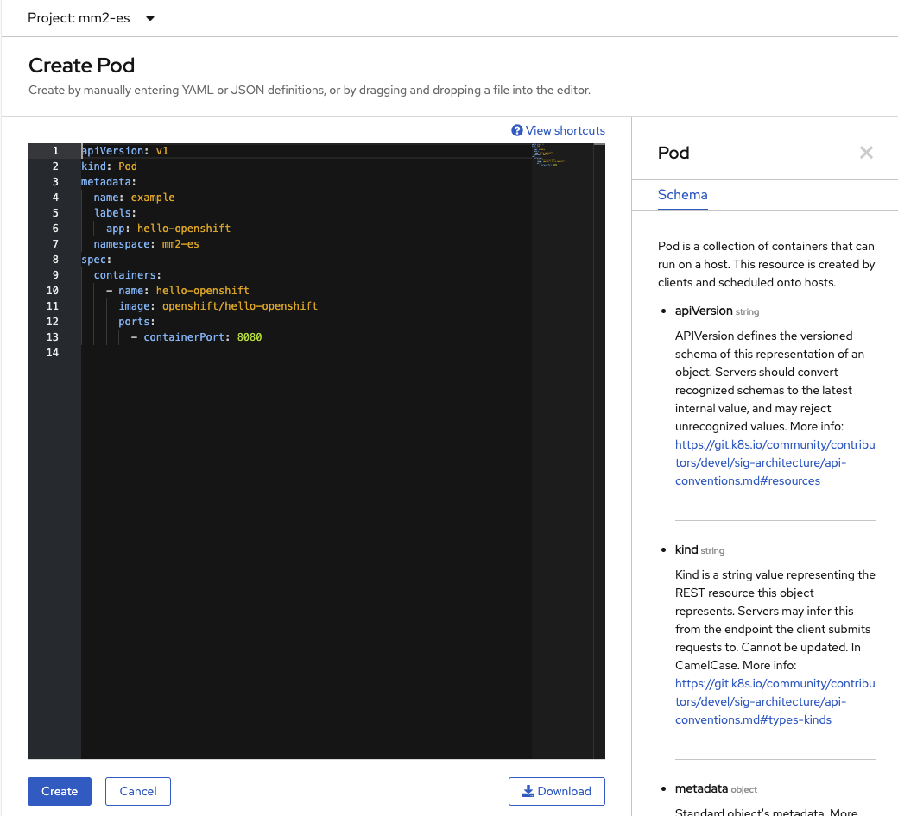

## Pre-requisites

The following steps need to be done to get the configurations for the different scenario and the docker-compose file to start a local cluster.

1. Clone the lab repository

 ```shell
 git clone https://github.com/ibm-cloud-architecture/refarch-eda-data-consistency
 ```
1. Get [Docker](https://docs.docker.com/) desktop and docker compose on your local computer.  and docker compose to run the solution locally.
1. If needed get [docker compose](https://docs.docker.com/compose/install/), which is part of Docker Desktop.

## Kafka Mirror Maker 2 Labs

These hands-on labs walk users through building and testing Kafka Mirror Maker 2 based replication.

| Scenario                           | Description         | Link        |
| --------------------------------| ------------------  |:----------- |
| Lab 1 | Replicate from Event Streams on Cloud to local Kafka. | [Kafka Mirror Maker 2 - Lab 1](/use-cases/kafka-mm2/lab-1/) |
| Lab 2 | Using Mirror Maker 2 from Event Streams on premise to Event stream on cloud | [Kafka Mirror Maker 2 - Lab 2](/use-cases/kafka-mm2/lab-2/) |

## Running docker in kubernetes pod

In one of you project, goes to the Workload > Pods menu in the OpenShift Console. Then Create a pod:

 

In the yaml editor, copy [this yaml file](https://gist.githubusercontent.com/osowski/4c9b6eb8e63b93e97ad6fecd8d9c8ff4/raw/8c2720c572458838942ccdba87271c61d4764671/dind.yaml). This operation will download the docker image from ibmcase account on docker hub.

You can also download the yaml and do an `oc apply -f dind.yaml`.

Then remote exec a shell within the pod: `oc exec -it dind bash`. You should be able to run another docker image in this pod, like for example our python environment.
