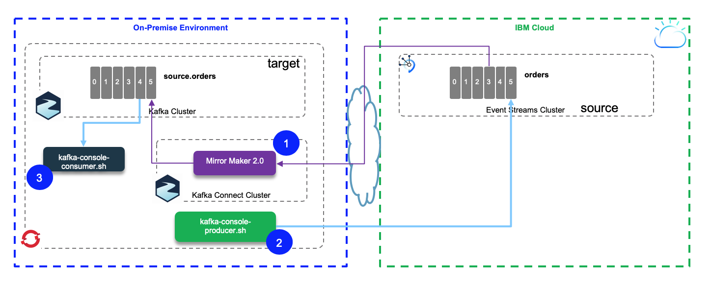
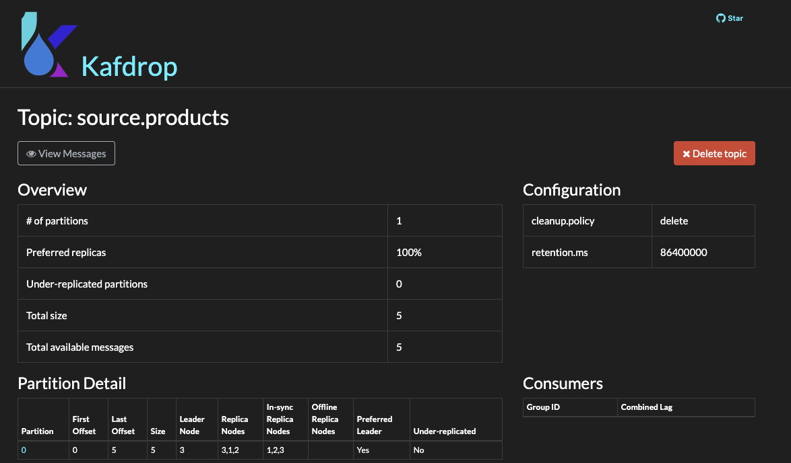
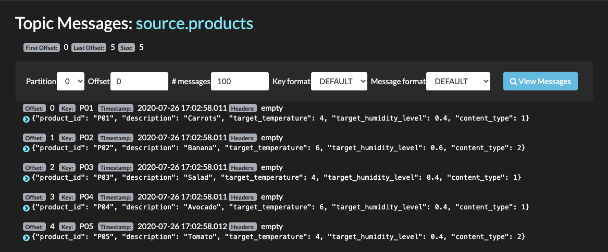

<AnchorLinks>
  <AnchorLink>Overview</AnchorLink>
  <AnchorLink>Start Kafka Connect</AnchorLink>
  <AnchorLink>Start Consumer from target cluster</AnchorLink>
  <AnchorLink>Start Producer to source cluster</AnchorLink>

</AnchorLinks>

## Overview

For this scenario the source cluster is an Event Streams on IBM Cloud cluster instance, and the target is a local Kafka cluster running with docker compose.



As a pre-requisite you need to run your local cluster by using the docker compose as introduced in [this note](/use-cases/kafka-mm2/#pre-requisites).

## Start local kafka cluster

If for security reason you are not able to install docker on your local workstation, but you have access to a kubernetes cluster, like OpenShift, see the [next section](#running-docker-in-kubernetes-pod).

In this project main folder there is a [docker compose file](https://raw.githubusercontent.com/ibm-cloud-architecture/refarch-eda-data-consistency/master/docker-compose.yml) to start a local two brokers cluster with one Zookeeper node.

1. In one Terminal window, start the local cluster using `docker-compose up &` command. The data are persisted on the local disk within this folder.

Your local environment is up and running.

## Start Kafka Connect

1. If this is the first time you start this local Kafka cluster, you need to create the `products` topic. Start a Kafka container to access the Kafka tools with the command:

  ```shell
  docker run -ti -v $(pwd):/home --network kafkanet strimzi/kafka:latest-kafka-2.5.0 bash -c "/home/scripts/createProductsTopic.sh"
  ```
1. Verify the topic is created:

 ```shell
 docker exec -ti refarch-eda-data-consistency_kafka1_1 /bin/bash -c "/opt/kafka/bin/kafka-topics.sh --bootstrap-server kafka1:9092 --list"
 ```

1. Modify .env file to set environment variables for Source Event Streams cluster brokers address and APIKEY.

 ```shell
 export KAFKA_SOURCE_BROKERS=broker-...:9093
 export KAFKA_SOURCE_PASSWORD="<replace with apikey from event streams service credentials>"
 ```
 
 The configuration file (mirror-maker-2/es-to-local/mm2.properties) is for standalone configuration, and looks like:

    ```properties
    clusters=source, target
    source.bootstrap.servers=broker-3...:9093
    source.security.protocol=SASL_SSL
    source.ssl.protocol=TLSv1.2
    source.sasl.mechanism=PLAIN
    source.sasl.jaas.config=org.apache.kafka.common.security.plain.PlainLoginModule required username="token" password="985...";
    target.bootstrap.servers=kafka1:9092,kafka2:9093
    # enable and configure individual replication flows
    source->target.enabled=true
    source->target.topics=products
    ```
  A lot of these properties are for the security settings. The `clusters` property defines the alias name for the source to target, and then `source->target.*` properties define the topic to replicate...

1. Start Mirror Maker2.0, by using a new container to start another kakfa 2.5 docker container, connected to the  brokers via the `kafkanet` network, and mounting the configuration in the `/home`. We have done a script to modify the properties file from a template file then call mirror maker 2:

    ```shell
    ./scripts/launchMM2.sh
    ```

    The command update the properties file from the environment variables and starts the container with a command very similar as:

    ```shell
     docker run -ti --network kafkanet -v $(pwd):/home -v $(pwd)/mirror-maker-2/logs:/opt/kafka/logs strimzi/kafka:latest-kafka-2.5.0 /bin/bash -c "/opt/kafka/bin/connect-mirror-maker.sh /home/mirror-maker-2/es-to-local/mm2.properties"
    ```

    The `mm2.properties` file defines the source and target clusters and the topics to replicate.

## Start consumer from target cluster

We will use a simple and useful tool, called [Kafdrop](https://github.com/obsidiandynamics/kafdrop) to see messages in topics.

We also have done a simple script to start or stop Kafdrop.

```
./scripts/startKafdrop.sh
```

## Start Producer to source cluster

We are reusing the python environment as defined in the integration tests for the 'kcontainer' solution. [https://hub.docker.com/r/ibmcase/kcontainer-python](https://hub.docker.com/r/ibmcase/kcontainer-python).

This time the script is producing products data. Here are the steps to send 5 records.

```shell
cd mirror-maker-2
# 1- if not done set environment variables to reach the remote kafka cluster, source of the replication
source ../.env
# 2- Execute the script using docker
docker run -ti -v $(pwd):/home --rm -e  KAFKA_BROKERS=$KAFKA_SOURCE_BROKERS -e KAFKA_SOURCE_PASSWORD=$KAFKA_SOURCE_PASSWORD -e KAFKA_USER=$KAFKA_SOURCE_USER ibmcase/kcontainer-python:itgtests python /home/SendProductToKafka.py --file /home/data/products.json
```

The traces should look like:

```
[KafkaProducer] - {'bootstrap.servers': 'broker-0-qnprtqnp7hnkssdz.kafka.svc01.us-east.eventstreams.cloud.ibm.com:9093,broker-1-qnprtqnp7hnkssdz.kafka.svc01.us-east.eventstreams.cloud.ibm.com:9093,broker-2-qnprtqnp7hnkssdz.kafka.svc01.us-east.eventstreams.cloud.ibm.com:9093,broker-3-qnprtqnp7hnkssdz.kafka.svc01.us-east.eventstreams.cloud.ibm.com:9093,broker-4-qnprtqnp7hnkssdz.kafka.svc01.us-east.eventstreams.cloud.ibm.com:9093,broker-5-qnprtqnp7hnkssdz.kafka.svc01.us-east.eventstreams.cloud.ibm.com:9093', 'group.id': 'ProductsProducer', 'delivery.timeout.ms': 15000, 'request.timeout.ms': 15000, 'security.protocol': 'SASL_SSL', 'sasl.mechanisms': 'PLAIN', 'sasl.username': 'token', 'sasl.password': '..hidden...'}
{'product_id': 'P01', 'description': 'Carrots', 'target_temperature': 4, 'target_humidity_level': 0.4, 'content_type': 1}
{'product_id': 'P02', 'description': 'Banana', 'target_temperature': 6, 'target_humidity_level': 0.6, 'content_type': 2}
{'product_id': 'P03', 'description': 'Salad', 'target_temperature': 4, 'target_humidity_level': 0.4, 'content_type': 1}
{'product_id': 'P04', 'description': 'Avocado', 'target_temperature': 6, 'target_humidity_level': 0.4, 'content_type': 1}
{'product_id': 'P05', 'description': 'Tomato', 'target_temperature': 4, 'target_humidity_level': 0.4, 'content_type': 2}
[KafkaProducer] - Message delivered to products [0]
[KafkaProducer] - Message delivered to products [0]
[KafkaProducer] - Message delivered to products [0]
[KafkaProducer] - Message delivered to products [0]
[KafkaProducer] - Message delivered to products [0]
```

Validate the replication is done, using Kafdrop connected to the target cluster you can select the `source.products` topic. The last offset should have increased by 5,

 

Going to view messages you can see the last 5 messages match the one sent to the topic on the source cluster.

 


Another way to validate the target `source.products` topic has records, is to use a Kafka console tool, delivered with Apache kafka open source.

  ```shell
  docker run -ti --network kafkanet --rm=true strimzi/kafka:latest-kafka-2.5.0  /bin/bash -c "bin/kafka-console-consumer.sh --bootstrap-server  kafka1:9092 --topic source.products --from-beginning"

  { "product_id": "P01", "description": "Carrots", "target_temperature": 4,"target_humidity_level": 0.4,"content_type": 1}
  { "product_id": "P02", "description": "Banana", "target_temperature": 6,"target_humidity_level": 0.6,"content_type": 2}
  { "product_id": "P03", "description": "Salad", "target_temperature": 4,"target_humidity_level": 0.4,"content_type": 1}
  ```
Stop with Ctrl C.
