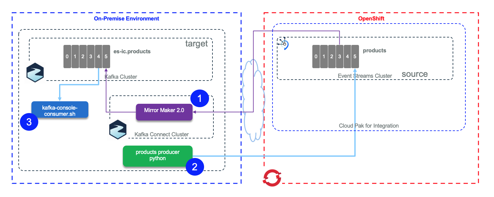
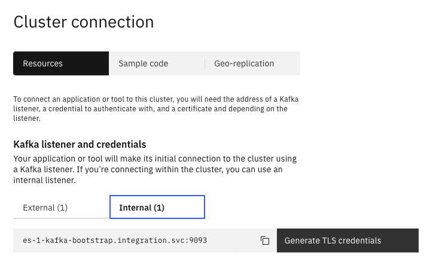
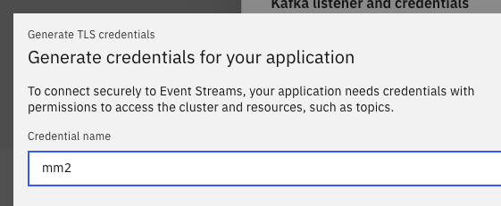
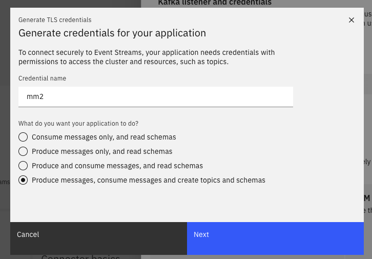
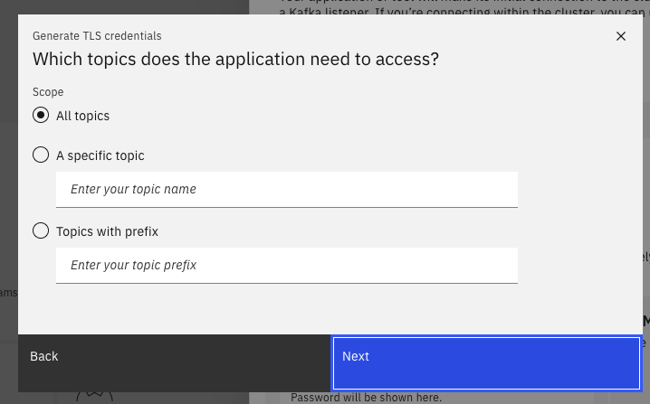
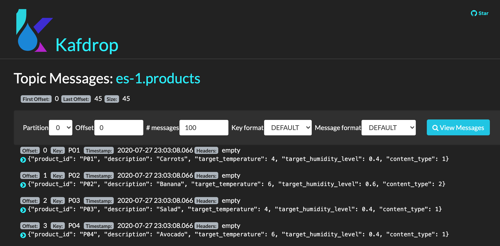

<AnchorLinks>
  <AnchorLink>Overview</AnchorLink>
  <AnchorLink>Pre-requisites</AnchorLink>
  <AnchorLink>Start Mirror Maker 2</AnchorLink>
  <AnchorLink>Start Consumer from target cluster</AnchorLink>
  <AnchorLink>Start Producer to source cluster</AnchorLink>
</AnchorLinks>

## Overview

For this scenario the source cluster is an Event Streams on premise on OpenShift, and the target cluster is an Event Stream on Cloud. Mirror Maker 2 runs on OpenShift.

 

## Pre-requisites

* We will use the Cloud shell tool, so connect and create the environment for this shell using the same instructions as in [the schema registry lab](https://ibm-cloud-architecture.github.io/refarch-eda/technology/event-streams/schema-registry-cp4i-v10#ibm-cloud-shell).

* Login to the OpenShift cluster using the console and get the API token

 ```shell
 oc login --token=L0.... --server=https://api.eda-solutions.gse-ocp.net:6443
 ```

* Clone the github to get access to the Mirror Maker 2 manifests we are using:

 ```shell
 git clone https://github.com/ibm-cloud-architecture/refarch-eda-data-consistency
 ```

* As Event Streams on the Cloud does not authorize to create topic with the Kafka Admin API, we need to create the following topics with scripts or GUI. The naming convention respects the name of the source cluster as defined in the MirrorMaker2 manifest we will detail later.

  * es-1.checkpoints.internal  use one partition
  * es-1.heartbeats  use one partition
  * es-1.products   matches the partition allocated to the source topic
  * mirrormaker2-cluster-configs one partition
  * mirrormaker2-cluster-offsets 25 partitions
  * mirrormaker2-cluster-status 5 partitions.

Use the default replication factor of 3.

## Start Mirror Maker 2

In this lab, Mirror Maker 2 will run on the same cluster as Event Streams within the same namespace (e.g. integration). 

* Create a secret for the API KEY of the Event Streams target cluster:

 ```shell
  oc create secret generic es-oc-api-secret --from-literal=password=<replace-with-event-streams-on-cloud-apikey>
 ```

* Verify the Event Streams on OpenShift service end point URL. This URL will be used to configure Mirror Maker 2. 

 ```shell
 # Go to the project where Event Streams is installed
 oc project integration
 # Use the bootstrap internal URL
 oc describe svc es-1-kafka-bootstrap  -o=jsonpath='{.status.ingress[0].host}{"\n"}'
 # result:
    es-1-kafka-bootstrap.integration.svc:9093
 ```

* Verify the CA certificate secrets:

 ```shell
  oc describe secret es-1-cluster-ca -n integration
 ```

* Get a user with write access to topic, transactions. You can use the User Interface to do so with the Create TLS credential on the intern URL panel.

 

 

 This user needs to be able to create topic on target cluster.
 o
 

 You can specify a specific set of topics, with Java regexp.

 

 and all the transactions.

* Define source and target cluster properties in a Mirror Maker 2 `es-ocp-to-es-oc.yml` descriptor file. There is a file for the replication between Event Streams OCP to Event Streams on cloud [es-ocp-to-es-oc.yml](https://github.com/ibm-cloud-architecture/refarch-eda-data-consistency/blob/master/mirror-maker-2/es-ocp/es-ocp-to-es-oc.yml). We strongly recommend to study the schema definition of this [custom resource from this page](https://github.com/strimzi/strimzi-kafka-operator/blob/2d35bfcd99295bef8ee98de9d8b3c86cb33e5842/install/cluster-operator/048-Crd-kafkamirrormaker2.yaml#L648-L663). 

Here are some important parameters: The namespace needs to match the newly created project:

```yaml
apiVersion: eventstreams.ibm.com/v1alpha1
kind: KafkaMirrorMaker2
metadata:
  name: mm2
  namespace: integration
spec:
  template:
    pod:
      metadata:
        annotations:
          eventstreams.production.type: CloudPakForIntegrationNonProduction
  version: 2.5.0
  replicas: 1
  connectCluster: "event-streams-wdc"
```

The version matches the Kafka version we use. The number of replicas can be set to 1 to start. The eventstreams.production.type is needed for Event Streams.

Then the yaml defines the connection configuration for each clusters: Event Streams on cloud, so you need to define the bootstrap servers (This could come from a config map too) and the API key coming from the previously defined secret. The user is always 'token'

```yaml
clusters:
  - alias: "event-streams-wdc"
    bootstrapServers: broker-0-qnprtqnp7hnkssdz.kafka.svc01.us-east.eventstreams.cloud.ibm.com:9093,broker-1-qnprtqnp7hnkssdz.kafka.svc01.us-east.eventstreams.cloud.ibm.com:9093,broker-2-qnprtqnp7hnkssdz.kafka.svc01.us-east.eventstreams.cloud.ibm.com:9093,broker-3-qnprtqnp7hnkssdz.kafka.svc01.us-east.eventstreams.cloud.ibm.com:9093,broker-4-qnprtqnp7hnkssdz.kafka.svc01.us-east.eventstreams.cloud.ibm.com:9093,broker-5-qnprtqnp7hnkssdz.kafka.svc01.us-east.eventstreams.cloud.ibm.com:9093
    config:
      config.storage.replication.factor: 3
      offset.storage.replication.factor: 3
      status.storage.replication.factor: 3
    tls: {}
    authentication:
      passwordSecret:
          secretName: es-oc-api-secret  
          password: password 
      username: token
      type: plain
```

For Event Streams on premise running within OpenShift, the connection uses TLS, certificates and Sram credentials. As we run in a separate namespace the URL is the 'external' one.

```yaml
- alias: "es-1-cluster"
    bootstrapServers: es-1-kafka-bootstrap.integration.svc:9093
    config:
      config.storage.replication.factor: 3
      offset.storage.replication.factor: 3
      status.storage.replication.factor: 3
      ssl.endpoint.identification.algorithm: https
    tls: 
      trustedCertificates:
        - secretName: es-1-cluster-ca-cert
          certificate: ca.crt
    authentication:
      type: tls
      certificateAndKey:
        certificate: user.crt
        key: user.key
        secretName: mm2
          
```

Finally the `connectCluster` attribute defines the cluster alias used by MirrorMaker2 to define its hidden topics, it must match the target cluster of the replication in the list at `spec.clusters`.
    
 
 ```shell
 oc apply -f mirror-maker-2/es-ocp/es-ocp-to-es-oc.yml
 ```

* Verify the chareacteristics of the Mirror Maker 2 instance using the CLI

 ```shell
 oc describe kafkamirrormaker2 mm2
 ```
* As Mirror Maker 2 is set to  be connected to the `event-streams-wdc` which is the event streams on cloud. 

## Start Producer to source cluster

As seen in lab 1, we will use the same python script to create products records. This time the script is producing products data to Event Streams on OpenShift. So we need the URL, pem, and user to access this cluster.
The credentials can be accessed and defined using the GUI. [This section in the schema registry](https://ibm-cloud-architecture.github.io/refarch-eda/technology/event-streams/schema-registry-cp4i-v10#gui) lab goes into the details on how to get the external URL and Scram password. 

* If not done before download the pem file using the following CLI commands:

 ```shell
 cloudctl login -a https://cp-console.apps.eda-solutions.gse-ocp.net --skip-ssl-validation
 cloudctl es init
 cloudctl es certificates --format pem
 ```
* Get userid, password and information of one of the kafka user defined. The namespace used below is the one where event streams is installed.

 ```shell
 oc get kafkausers--namespace integration
 oc get kafkauser my-user1 --namespace integration -o jsonpath='{"username: "}{.status.username}{"\nsecret-name: "}{.status.secret}{"\n"}'
 ```
* Set the following environment variables:

 ```shell
 export KAFKA_BROKERS=es-1-kafka-bootstrap-integration.apps.eda-solutions.gse-ocp.net:443
 export KAFKA_USER=my-user1
 export KAFKA_PWD=$(oc get secret $KAFKA_USER --namespace integration -o jsonpath='{.data.password}' | base64 --decode)
 export KAFKA_CERT=/home/es-cert.pem
 ```

 ```shell
 cd mirror-maker-2
 # Execute the script using docker
 docker run -ti -v $(pwd):/home --rm -e  KAFKA_BROKERS=$KAFKA_SOURCE_BROKERS -e KAFKA_USER=$KAFKA_USER -e KAFKA_PWD=$KAFKA_PWD -e KAFKA_CERT=$KAFKA_CERT ibmcase/kcontainer-python:itgtests python /home/SendProductToKafka.py --file /home/data/products.json
 ```

## Start Consumer from target cluster

Specifying the target cluster as Event Streams on cloud, we can also use Kafdrop to see the replicated topic.

```
./scripts/startKafdrop.sh es-cloud.properties
```

Go to the es-1.products topic to see the replicated messages:

 

 ## Understanding MirrorMaker 2 trace 

A lot of configuration validation at the beginning of the trace to get the connection to both clusters. Any configuration issue to define the connection is generally well reported. URL, TLS certificate, secrets are the common cause of connection issues.

If some message arrive with NO_LEADER for one of the topic, is that MM2 is not able to create the topic on the target cluster and so it is needed to create the topic with command or User Interface.

 * WorkerSourceTask{id=es-1->event-streams-wdc.MirrorHeartbeatConnector-0} is the connector - task for the internal HeartBeat.
 * WorkerSourceTask{id=es-1->event-streams-wdc.MirrorSourceConnector-0} for the topic to replicate