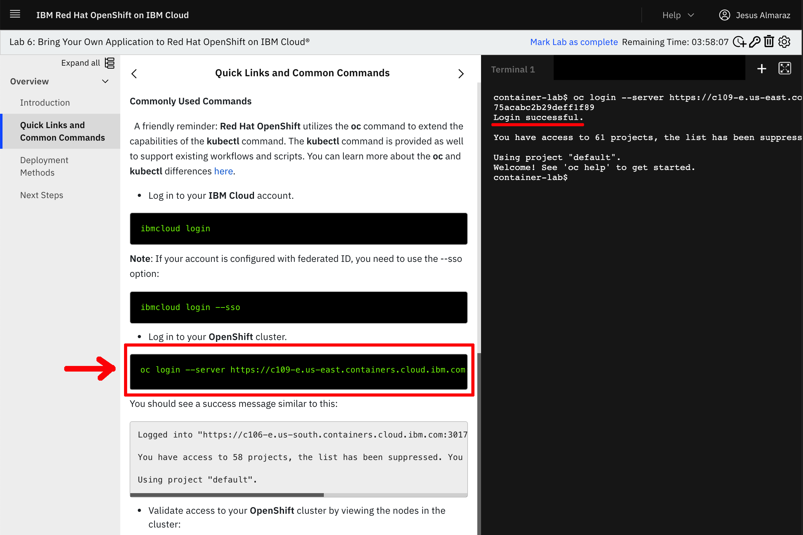
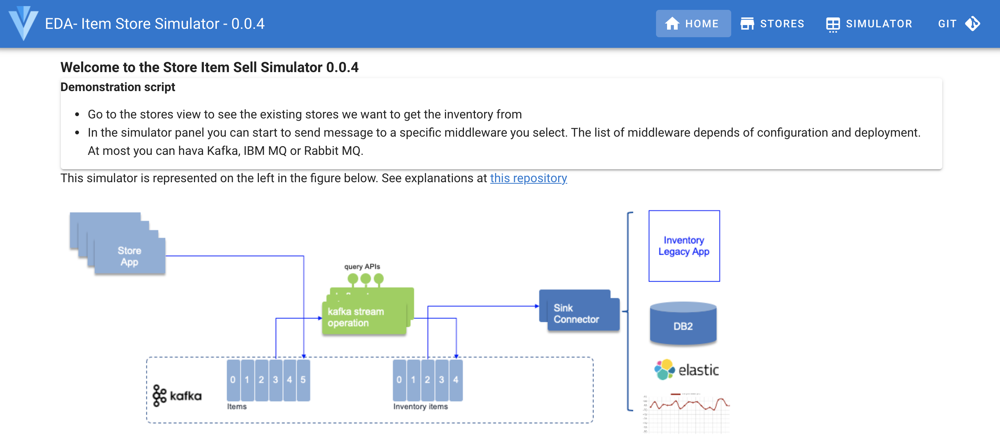
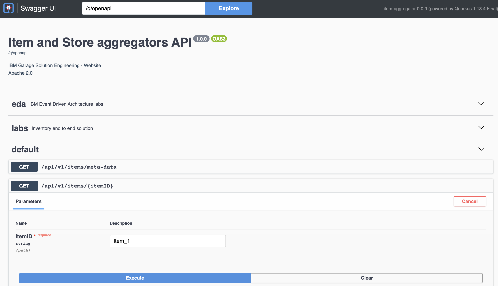

<InlineNotification kind="warning">
<strong>Work in progress</strong> Updated 06/09/2021
</InlineNotification>

<AnchorLinks>
    <AnchorLink>Overview</AnchorLink>
    <AnchorLink>Pre-requisites</AnchorLink>
    <AnchorLink>One Click Deploy to OpenShift</AnchorLink>
    <AnchorLink>Testing the solution</AnchorLink>
    <AnchorLink>Understanding the Kafka Streams implementation</AnchorLink>
    <AnchorLink>Interactive queries</AnchorLink>
    <AnchorLink>Event Streams on Cloud as Kafka provider</AnchorLink>
</AnchorLinks>


## Overview

In this lab, we're going to use [Quarkus](https://quarkus.io) to develop the real-time inventory logic using Kafka Streams APIs and microprofile reactive messaging.

The requirements to address are:

- consume item sold events from the `items` topic. Item has SKU as unique key. Item event has store ID reference
- the Kafka record in the `items` topic, uses the Store unique ID as key
- compute for each item its current stock cross stores
- compute the store's stock for each item
- generate inventory event for store - item - stock
- expose APIs to get stock for a store or for an item


The solution is using Kafka Streams and it includes two services. The components used are:

 

The goal of this lab, is to develop the green components which expose APIs to support Kafka Streams interactive query on top of the aggregates to keep
the inventory views and saved in state store (light blue storage/per service deployed and persisted in Kafka as topic).

We will be unit testing the stream logic using [Apache Kafka Streams](https://kafka.apache.org/documentation/streams/) TopologyTestDriver class. 

This solution is deployed to OpenShift cluster with Strimzi running in the same cluster and namespace.

This application needs the [Item Store sell simulator](https://github.com/ibm-cloud-architecture/refarch-eda-store-simulator) to perform the end to end 
testing and to demonstrate the end to end scenario.

## Pre-requisites

* Access to an **OpenShift Container Platform** v4.6.x
* **Kafka**: The lab can use Event Streams on Cloud or Kafka Strimzi deployed on OpenShift.
* **Code Source**: from the git repositories: 
  
    * [https://github.com/ibm-cloud-architecture/refarch-eda-item-inventory](https://github.com/ibm-cloud-architecture/refarch-eda-item-inventory) to compute item inventory cross store
    * [https://github.com/ibm-cloud-architecture/refarch-eda-store-inventory](https://github.com/ibm-cloud-architecture/refarch-eda-store-inventory) to compute store inventory.
    * [https://github.com/ibm-cloud-architecture/eda-lab-inventory](https://github.com/ibm-cloud-architecture/eda-lab-inventory) to get access to deployment configuration to deploy on OpenShift.

  ```sh 
  git clone https://github.com/ibm-cloud-architecture/refarch-eda-item-inventory
  git clone https://github.com/ibm-cloud-architecture/refarch-eda-store-inventory
  git clone https://github.com/ibm-cloud-architecture/eda-lab-inventory
  ```
* OC CLI
* As in previous labs, be connected to your Openshift cluster.

We have automated the deployment of all the pieces making up this use case. We are using the open source Strimzi operator to get a Kafka cluster deployed

### IBM OpenLabs

In this section, we are going to see use the [IBM OpenLabs](https://developer.ibm.com/openlabs/openshift) hosted environment.

1. Go to [IBM OpenLabs](https://developer.ibm.com/openlabs/openshift) in a browser and click on `Launch Lab` button for **Bring Your Own Application**.

  

1. Sign in with your IBM Cloud account or register for an IBM Cloud account.

  

1. You will be presented with a dialog asking you whether you have an **Opportunity Id** or not. 
If you don't have it or don't no, just select **No** and click on **Launch Lab**.

1. You should now see your IBM OpenLabs environment.

  

1. On the left hand side navigation menu, click on the **Quick Links and Common Commands** section. 
Now, if you scroll down on the instructions shown on your screen, you should reach the **Commonly Used Commands** 
section of these and in there you should see an `oc login ...` command to get your terminal associated to this
 IBM OpenLabs logged into the OpenShift cluster that you will be working with for this quickstart tutorial. 
Click on the `oc login...` command and you should see a `Login successful` message on the terminal.

  


## One Click Deploy to OpenShift

The different components are deployed in the same namespace as the Kafka cluster, and use internal route to access Kafka bootstrap URL.

The images for each of the components used are in the [quay.io ibmcase](https://quay.io/organization/ibmcase) repository:


1. Under the `eda-lab-inventory` folder open the `scripts/env-strimzi.sh` file to provide your own values or use our defined values:
  
  * **KAFKA_CLUSTER_NAME** which is the name you want to give to the Kafka cluster that will get deployed. It defaults to my-kafka and we highly recommend you to leave the default. Otherwise, you would need to modify some yaml deployment scripts…
  * **YOUR_PROJECT_NAME** which is the name of the OpenShift project the one-click-deployment script will create for you to get all the components of this solution deployed into. It defaults to rt-inventory. 

1. Execute the `deployInventoryWithStrimzi.sh` one-click-deployment script:

   ```sh
   ./scripts/deployInventoryWithStrimzi.sh --skip-login
   ```

  This script can be run multiple times, in case of failure, it should continue creating the needed resources and apps.

1. After some time (can easily take up to more than 10 min) you should see the following message:


  ```sh
  ********************
  ** CONGRATULATIONS!! You have successfully deployed the realtime inventory use case. 
  ********************
  ```
1. Verify the running pods

  ```sh
  NAME                                        READY   STATUS    RESTARTS   AGE
  item-aggregator-557db4c9c6-xds24            1/1     Running   0          8m47s
  my-kafka-cruise-control-69dd479bf6-bmnt6    2/2     Running   0          10m
  my-kafka-entity-operator-7d5f948d84-9knnn   3/3     Running   0          11m
  my-kafka-kafka-0                            1/1     Running   0          12m
  my-kafka-kafka-1                            1/1     Running   0          12m
  my-kafka-kafka-2                            1/1     Running   0          12m
  my-kafka-zookeeper-0                        1/1     Running   0          13m
  my-kafka-zookeeper-1                        1/1     Running   0          13m
  my-kafka-zookeeper-2                        1/1     Running   0          12m
  store-aggregator-7df98556ff-rdhcw           1/1     Running   0          4m59s
  store-simulator-56f8958498-44q9q            1/1     Running   0          9m30s
  ```

1. Get the different service endpoints:

  ```sh
  oc get routes

  item-aggregator            item-aggregator-rt-inventory.dte-ocp46-73awfj-915b3b336cabec458a7c7ec2aa7c625f-0000.us-east.containers.appdomain.cloud            
  my-kafka-kafka-bootstrap   my-kafka-kafka-bootstrap-rt-inventory.dte-ocp46-73awfj-915b3b336cabec458a7c7ec2aa7c625f-0000.us-east.containers.appdomain.cloud   
  store-aggregator           store-aggregator-rt-inventory.dte-ocp46-73awfj-915b3b336cabec458a7c7ec2aa7c625f-0000.us-east.containers.appdomain.cloud           
  store-simulator            store-simulator-rt-inventory.dte-ocp46-73awfj-915b3b336cabec458a7c7ec2aa7c625f-0000.us-east.containers.appdomain.cloud 
  ```

1. You can also access the OpenShift Console and go to the installed Operators and select Strimzi. In this operators you can use the cluster, the users and the topics:

  

### Some explanations of this deployment script

The script performs the following steps:

* Create a project if it does not exist
* Create a service account for the solution and a role binding to cluster role views
* Create Strimzi operator if it is not already there
* Create a kafka cluster in the project with 3 brokers and zookeeper
* Create scram and tls user
* Create the topics for solution
* Create one config map to define topics and broker boostrap shareable between apps
* Deploy each microservices

## Testing the solution

We will first go over the demonstration using the store simulator then using and end to end test script

1. Go to the Simulator user interface using the route like: `https://store-simulator-rt-inventory.dte-ocp46-73awfj-915b3b336cabec458a7c7ec2aa7c625f-0000.us-east.containers.appdomain.cloud`

  

  The simulator will send random sell events for the stores as listed in the Stores table (the content may change in future release):

  

1. Send some events by selecting the toggle Kafka and then the number of records to send:

  

  once started a table should be displayed to present the records sent. 

1. Let assess if we can see the stock cross store: use the item-aggregator route, something like ` item-aggregator-rt-inventory.dte-ocp46-73awfj-915b3b336cabec458a7c7ec2aa7c625f-0000.us-east.containers.appdomain.cloud ` but completed with '/q/swagger-ui' as we want to access the API
  
   Select the get `/api/v1/items/{itemID}` operation:

  

  Use one of the following item id: [Item_1, Item_2, Item_3, Item_4, Item_5, Item_6, Item_7]. You should get 
  the current stock cross stores

  

1. Let assess a store stock with all the items, for that we access the store aggregator URL: `store-aggregator-rt-inventory.dte-ocp46-73awfj-915b3b336cabec458a7c7ec2aa7c625f-0000.us-east.containers.appdomain.cloud ` with the `/q/swagger-ui` suffix.

  Then use the GET on the `api/v1/stores/inventory/{storeID}`, and enter one of the available store: `[Store_1, Store_2, Store_3, Store_4, Store_5]`

  

  The response should look like:

  


## Understanding the Kafka Streams implementation

The item and store aggregator code are based on the same code structure, reflecting the DDD onion architecture:

```
└── ibm
    └── gse
        └── eda
            └── inventory
                ├── app
                │   └── ItemAggregatorApplication.java
                ├── domain
                │   ├── ItemInventory.java
                │   ├── ItemProcessingAgent.java
                │   └── ItemTransaction.java
                └── infra
                    ├── ItemTransactionDeserializer.java
                    ├── ItemTransactionStream.java
                    └── api
                        ├── InventoryResource.java
                        ├── ItemCountQueries.java
                        └── dto
                            ├── ItemCountQueryResult.java
                            └── PipelineMetadata.java
```

The interesting class that supports the business logic is in [ItemProcessingAgent.java](https://github.com/ibm-cloud-architecture/refarch-eda-item-inventory/blob/master/src/main/java/ibm/gse/eda/inventory/domain/ItemProcessingAgent.java). 

Basically the logic to compute the different stocks are in the `processItemTransaction` method, which builds a Kafla Stream topology

For the stock of items cross store computation the code looks like:

```java
@Produces
public Topology processItemTransaction(){
    KStream<String,ItemTransaction> items = inItemsAsStream.getItemStreams();     
    // process items and aggregate at the store level 
    KTable<String,ItemInventory> itemItemInventory = items
        // use store name as key, which is what the item event is also using
        .map((k,transaction) -> {
            ItemInventory newRecord = new ItemInventory();
            newRecord.updateStockQuantityFromTransaction(transaction.sku, transaction);
            return  new KeyValue<String,ItemInventory>(newRecord.itemID,newRecord);
        })
        .groupByKey( Grouped.with(Serdes.String(),ItemInventory.itemInventorySerde)).
        aggregate( () -> new ItemInventory(),
            (itemID,newValue,currentValue) -> currentValue.updateStockQuantity(itemID,newValue.currentStock),
            materializeAsStoreInventoryKafkaStore());
    produceStoreInventoryToOutputStream(itemItemInventory);
    return inItemsAsStream.run();
}
```

while for the store the code is also in [ItemProcessingAgent](https://github.com/ibm-cloud-architecture/refarch-eda-store-inventory/blob/main/src/main/java/ibm/gse/eda/stores/domain/ItemProcessingAgent.java)

```java
public Topology processItemTransaction(){
    KStream<String,ItemTransaction> items = inItemsAsStream.getItemStreams();     
    // process items and aggregate at the store level 
    KTable<String,StoreInventory> storeItemInventory = items
        // use store name as key, which is what the item event is also using
        .groupByKey(ItemStream.buildGroupDefinitionType())
        // update the current stock for this <store,item> pair
        // change the value type
        .aggregate(
            () ->  new StoreInventory(), // initializer when there was no store in the table
            (store , newItem, existingStoreInventory) 
                -> existingStoreInventory.updateStockQuantity(store,newItem), 
                materializeAsStoreInventoryKafkaStore());       
    produceStoreInventoryToInventoryOutputStream(storeItemInventory);
    return inItemsAsStream.run();

```

Each project includes a set of unit tests to validate the logic.

## Integration tests

For running the integration test, we propose to copy the e2e folder from the solution repository and follow the [readme instructions section end-to-end-testing ](https://github.com/ibm-cloud-architecture/refarch-eda-item-inventory#end-to-end-testing).

## Deploy to OpenShift

Be sure to have done [the steps described here](../../overview/pre-requisites#getting-tls-authentication-from-event-streams-on-openshift) to get user credentials and server side certificate. 

The deployment is done using Quarkus kubernetes plugin which generates DeploymentConfig and other kubernetes manifests.  
Here are the interesting properties to set environment variables from secrets 

```properties
%prod.quarkus.openshift.env-vars.KAFKA_USER.value=sandbox-rp-tls-cred
quarkus.openshift.env-vars.SECURE_PROTOCOL.value=SSL
quarkus.openshift.env-vars.SECURE_PROTOCOL.value=SASL_SSL
quarkus.openshift.env-vars.KAFKA_BROKERS.value=sandbox-rp-kafka-bootstrap.eventstreams.svc:9093
quarkus.openshift.env-vars.KAFKA_CERT_PATH.value=/deployments/certs/server/ca.p12
quarkus.openshift.env-vars.KAFKA_PASSWORD.secret=sandbox-rp-tls-cred
quarkus.openshift.env-vars.KAFKA_PASSWORD.value=user.password
quarkus.openshift.env-vars.KAFKA_CERT_PWD.secret=sandbox-rp-cluster-ca-cert
quarkus.openshift.env-vars.KAFKA_CERT_PWD.value=ca.password
quarkus.openshift.env-vars.USER_CERT_PATH.value=/deployments/certs/user/user.p12
quarkus.openshift.env-vars.USER_CERT_PWD.secret=sandbox-rp-tls-cred
quarkus.openshift.env-vars.USER_CERT_PWD.value=user.password
```

And an extract of the expected generated openshift manifests from those configurations:

```yaml
    spec:
      containers:
      - env:
        - name: KAFKA_CERT_PWD
          valueFrom:
            secretKeyRef:
              key: ca.password
              name: sandbox-rp-cluster-ca-cert
        - name: USER_CERT_PATH
          value: /deployments/certs/user/user.p12
        - name: USER_CERT_PWD
          valueFrom:
            secretKeyRef:
              key: user.password
              name: sandbox-rp-tls-cred
        - name: KAFKA_BROKERS
          value: sandbox-rp-kafka-bootstrap.eventstreams.svc:9093
        - name: KAFKA_CERT_PATH
          value: /deployments/certs/server/ca.p12
        - name: KAFKA_PASSWORD
          valueFrom:
            secretKeyRef:
              key: user.password
              name: sandbox-rp-tls-cred
        - name: SECURE_PROTOCOL
          value: SASL_SSL
```

Finally the TLS certificated are mounted to the expected locations defined in the environment variables. The properties for that are:

```
quarkus.openshift.mounts.es-cert.path=/deployments/certs/server
quarkus.openshift.secret-volumes.es-cert.secret-name=sandbox-rp-cluster-ca-cert
quarkus.openshift.mounts.user-cert.path=/deployments/certs/user
quarkus.openshift.secret-volumes.user-cert.secret-name=sandbox-rp-tls-cred
```

which generates:

```
        volumeMounts:
        - mountPath: /deployments/certs/server
          name: es-cert
          readOnly: false
          subPath: ""
        - mountPath: /deployments/certs/user
          name: user-cert
          readOnly: false
          subPath: ""
```

## Interactive queries

We already addressed the interactive queries concept in [the kafka stream technology summary article](/technology/kafka-streams/#interactive-queries). 
Each of the store and item aggregator implements those queries via two classes:

* [ItemCountQueries](https://github.com/ibm-cloud-architecture/refarch-eda-item-inventory/blob/master/src/main/java/ibm/gse/eda/inventory/infra/api/ItemCountQueries.java)
* [StoreInventoryQueries](https://github.com/ibm-cloud-architecture/refarch-eda-store-inventory/blob/main/src/main/java/ibm/gse/eda/stores/infra/api/StoreInventoryQueries.java)

The principles are the same:

* Get the metadata about each "kafka store" supporting the stateful KTables which are keeping the aggregate per item or per store.
* Get the value of the aggregate for the given key, locally or remotely.


## Event Streams on Cloud as Kafka provider

To be completed.

### Connect to Event Streams

We suppose you have created an Event Streams service instance on IBM Cloud. If not you can see some of [our getting started tutorial](/technology/event-streams/es-cloud/)

* Connect to the cluster with `ibmcloud login -a ....` than init a session to your cluster: `ibmcloud es init`
* Create the needed topics, following the instructions as described [in this note](../.. /overview/pre-requisites#creating-event-streams-topics) or using the following command:

 ```shell
 cloudctl es topic-create --name items --partitions 3 --replication-factor 3
 cloudctl es topic-create --name item.inventory --partitions 1 --replication-factor 3
 cloudctl es topic-create --name store.inventory --partitions 1 --replication-factor 3
 cloudctl es topics
 ```

* To connect from the deployed application running on OpenShift to Event Streams on cloud we need to use different security settings:
 we need to define a user with `scram-sha-512` password, as this is the mechanism for external to the cluster connection. [See product documentation](https://ibm.github.io/event-streams/getting-started/connecting/) on how to do it, or use our [quick summary here](/use-cases/overview/pre-requisites#get-shram-user).

* Get Server TLS certificate into the `certs` folder. See our [quick summary here](/use-cases/overview/pre-requisites#get-tls-server-public-certificate)

 ```shell
 ```

* Modify the `application.properties` file to define the kafka connection properties. We need two type of definitions, one for the kafka admin client so the kafka streams can create topics to backup state stores, and one for kafka streams consumer and producer tasks:

```properties
kafka.bootstrap.servers=${KAFKA_BROKERS}
kafka.security.protocol=${SECURE_PROTOCOL}
kafka.ssl.protocol=TLSv1.2
%dev.kafka.sasl.jaas.config=org.apache.kafka.common.security.scram.ScramLoginModule required username\=\"${KAFKA_USER}\" password\=\"${KAFKA_PASSWORD}\";
%dev.kafka.sasl.mechanism=SCRAM-SHA-512
kafka.ssl.truststore.location=${KAFKA_CERT_PATH}
kafka.ssl.truststore.password=${KAFKA_CERT_PWD}
kafka.ssl.truststore.type=PKCS12
%prod.kafka.ssl.keystore.location=${USER_CERT_PATH}
%prod.kafka.ssl.keystore.password=${USER_CERT_PWD}
%prod.kafka.ssl.keystore.type=PKCS12
```

The above settings take into account that when running locally (`%dev` profile) we use the `scram-sha` mechanism to authenticate, and when we deploy on openshift, the `%prod` profile is used with TLS mutual authentication  (client certificate in keystore).

The same approach applies for Kafka Stream:

```
quarkus.kafka-streams.bootstrap-servers=${KAFKA_BROKERS}
quarkus.kafka-streams.security.protocol=${SECURE_PROTOCOL}
quarkus.kafka-streams.ssl.protocol=TLSv1.2
%dev.quarkus.kafka-streams.sasl.mechanism=SCRAM-SHA-512
%dev.quarkus.kafka-streams.sasl.jaas.config=org.apache.kafka.common.security.scram.ScramLoginModule required username\=\"${KAFKA_USER}\" password\=\"${KAFKA_PASSWORD}\";
quarkus.kafka-streams.ssl.truststore.location=${KAFKA_CERT_PATH}
quarkus.kafka-streams.ssl.truststore.password=${KAFKA_CERT_PWD}
quarkus.kafka-streams.ssl.truststore.type=PKCS12
# Only if TLS is used for authentication instead of scram
%prod.quarkus.kafka-streams.ssl.keystore.location=${USER_CERT_PATH}
%prod.quarkus.kafka-streams.ssl.keystore.password=${USER_CERT_PWD}
%prod.quarkus.kafka-streams.ssl.keystore.type=PKCS12
```

* Define a file, like `.env`, to set environment variables, and modify the settings from your Event Streams configuration.

```
KAFKA_BROKERS=minimal-prod-kafka-bootstrap-eventstreams....containers.appdomain.cloud:443
KAFKA_USER=
KAFKA_PASSWORD=
KAFKA_CERT_PATH=${PWD}/certs/es-cert.p12
KAFKA_CERT_PWD=
SECURE_PROTOCOL=SASL_SSL
```
