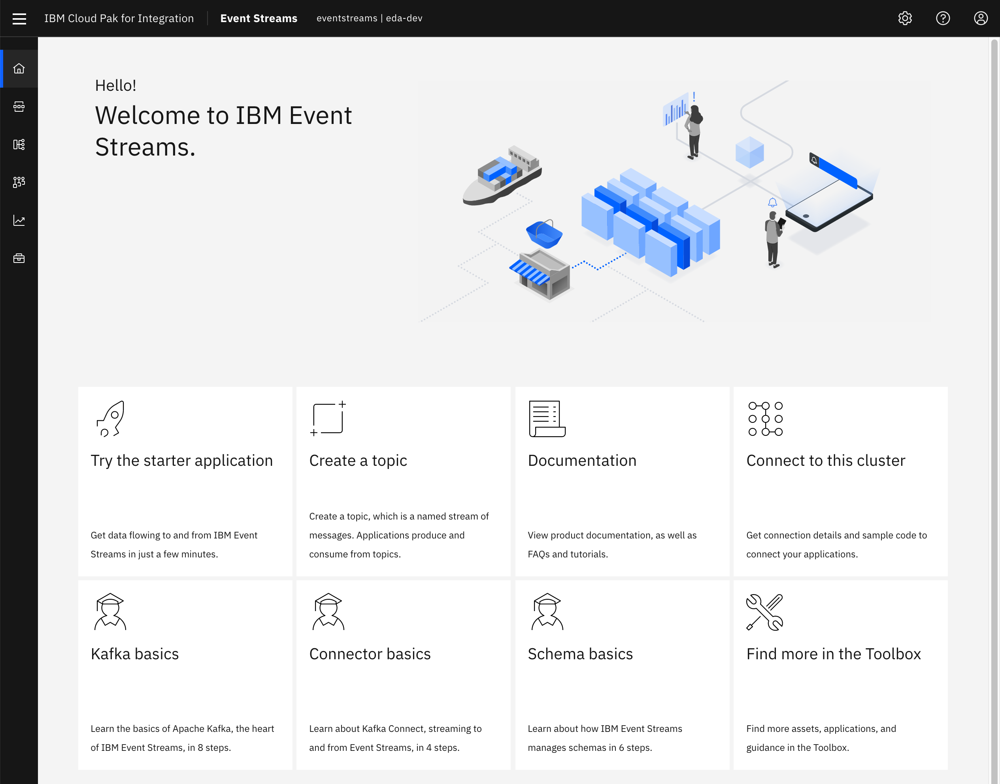

<AnchorLinks>
  <AnchorLink>Overview</AnchorLink>
  <AnchorLink>Scenario Prereqs</AnchorLink>
  <AnchorLink>Generate Event Load</AnchorLink>
  <AnchorLink>Explore the preconfigured Event Streams Dashboard</AnchorLink>
  <AnchorLink>Import Grafana Dashboards</AnchorLink>
  <AnchorLink>View Grafana Dashboards</AnchorLink>
  <AnchorLink>Create an Alert</AnchorLink>
  <AnchorLink>External Monitoring Tools</AnchorLink>
  <AnchorLink>Advanced Scenarios</AnchorLink>
  <AnchorLink>Additional Reading</AnchorLink>
</AnchorLinks>

<!--
  <AnchorLink>Import Kibana Dashboards</AnchorLink>
  <AnchorLink>View Kibana Dashboards</AnchorLink>
-->

<InlineNotification kind="info">This tutorial was developed with and validated against IBM Cloud Pak for Integration Version 2020.2.1 and IBM Event Streams Version 10.0.0. Any deviation from those versions while performing the tasks in this tutorial may produced unexpected results.</InlineNotification>

## Overview

Deploying IBM Event Streams on OpenShift Cloud Platform (OCP) as the Apache Kafka-based event backbone is a great first step in your Event-Driven Architecture implementation. However, now you must maintain that Kafka cluster and understand the intricate details of what a _"healthy"_ cluster looks like. This tutorial will walk you through some of the initial monitoring scenarios that are available for IBM Event Streams deployed on OCP.

The raw monitoring use cases and capabilities are available from the official IBM Event Streams documentation via the links below:
- [Monitoring deployment health](https://ibm.github.io/event-streams/administering/deployment-health/)
- [Monitoring Kafka cluster health](https://ibm.github.io/event-streams/administering/cluster-health/)
- [Monitoring topic health](https://ibm.github.io/event-streams/administering/topic-health/)
- [Monitoring Kafka consumer group lag](https://ibm.github.io/event-streams/administering/consumer-lag/)

This tutorial will focus on a more guided approach to understanding the foundation of Apache Kafka monitoring capabilities provided by IBM Event Streams and the IBM Cloud Pak for Integration. Upon completion of this tutorial, you can extend your own experience through the [Advanced Scenarios](#advanced-scenarios) section to adapt Kafka monitoring capabilites to your project's needs.

## Scenario Prereqs

**OpenShift Container Platform**

- This deployment scenario was developed for use on the OpenShift Container Platform, with a minimum version of `4.4`.

**Cloud Pak for Integration**

- This deployment scenario was developed for use with the 2020.2.x release of the [IBM Cloud Pak for Integration](https://www.ibm.com/support/knowledgecenter/en/SSGT7J_20.2/welcome.html), installed on OpenShift 4.4.

**IBM Event Streams**

- This deployment scenario requires a working installation of [IBM Event Streams V10.0](https://ibm.github.io/event-streams/) or greater, deployed on the Cloud Pak for Integration environment mentioned above.
- For Cloud Pak installation guidance, you can follow the [Cloud Pak Playbook](https://cloudpak8s.io/integration/cp4i-deploy-eventstreams/) installation instructions.

**Git**

- We will need to clone repositories.

**Java**

- Java Development Kit (JDK) v1.8+ (Java 8+)

**Maven**

- The scenario uses Maven v3.6.x

## Generate Event Load

This section details walking through the generation of a starter application for usage with IBM Event Streams, as documented in the [official product documentation](https://ibm.github.io/event-streams/getting-started/generating-starter-app/).

1. Log into the IBM Event Streams Dashboard.

  

1. Click the **Try the starter application** button from the _Getting Started_ page

  

1. Click **Download JAR from GitHub**. This will open a new window to <https://github.com/ibm-messaging/kafka-java-vertx-starter/releases>
  
  

   - Click the link for `demo-all.jar` from the latest release available. At the time of this writing, the latest version was `1.0.0`.
  
   

1. Return to the `Configure & run starter application` window and click **Generate properties**.

  

1. In dialog that pops up from the right-hand side of the screen, enter the following information:
   - **Starter application name:** `monitoring-lab-[your-initials]`
   - Leave **New topic** selected and enter a **Topic name** of `monitoring-lab-topic-[your-initials]`.
   - Click **Generate and download .zip**
  
   

1. In a Terminal window, unzip the generated ZIP file from the previous window and move `demo-all.jar` file into the same folder.

1. Review the extracted `kafka.properties` to understand how Event Streams has generated credentials and configuration information for this sample application to connect.

1. Run the command `java -Dproperties_path=./kafka.properties -jar demo-all.jar`.

1.  Wait until you see the string `Application started in X ms` in the output and then visit the application's user interface via `http://localhost:8080`.

  

1. Once in the User Interface, enter a message to be contained for the Kafka record value then click **Start producing**.

1. Wait a few moments until the UI updates to show some of the confirmed produced messages and offsets, then click on **Start consuming** on the right side of the application.

  

1. In the IBM Event Streams user interface, go to the topic where you send the messages to and make sure messages have actually made it.

  

1. You can leave the application running for the rest of the lab or you can do the following actions on the application
   - If you would like to stop the application from producing, you can click **Stop producing**.
   - If you would like to stop the application from consuming, you can click **Stop consuming**.
   - If you would like to stop the application entirely, you can input `Control+C` in the Terminal session where the application is running.

An [alternative sample application](https://ibm.github.io/event-streams/getting-started/testing-loads/) can be leveraged from the official documentation to generate higher amounts of load.

## Explore the preconfigured Event Streams Dashboard

This section will walk through the default dashboard and user interface available on every IBM Event Streams deployment.

1. Log into the Event Streams Dashboard.

1. Click the **Monitoring** tab from the primary navigation menu on the left hand side.

1. From here, you can view information on messages, partitions, and replicas for the past hour, day, week, or month.

  

1. Click the **Topics** tab from the primary navigation menu on the left hand side.

1. Click the name of your topic that you previously created in the [Generate Event Load](#generate-event-load) section. This should be in the format of `monitoring-lab-topic-[your-initials]`.
   
   - You are presented with a **Producers** page showing the number of active producers, as well as the average message size produced per second and average number of messages produced per second. You can modify the time window by changing the values in the _View producers by time_ box.
   
   - Click the **Messages** tab to view all the data and metadata for events stored in the topic. You can view messages across partitions or on specific partitions, as well as jump to specific offsets or timestamps.
   
   - Click **Consumer Groups** to be shown the number of consumer groups that have previously registered or are currently registered as consuming from the topic.
   
   - You are able to see how many active members a consumer group has, as well as have many unconsumed partitions a topic has inside of a consumer group (also known as _consumer group lag_)- a key metric for driving parallelism in event-driven microservices!
   

## Import Grafana Dashboards

This section will walk through the Grafana Dashboard capabilities documented in the [official IBM Event Streams documentation](https://ibm.github.io/event-streams/administering/cluster-health/#grafana).

1. Apply the Grafana Dashboard for overall Kafka Health via a `MonitoringDashboard` custom resource:

  ```bash
  oc apply -f https://raw.githubusercontent.com/ibm-messaging/event-streams-operator-resources/master/grafana-dashboards/ibm-eventstreams-kafka-health-dashboard.yaml
  ```

## View Grafana Dashboards

To view the newly imported Event Streams Grafana dashboard for overall Kafka Health, follow these steps:

1. Navigate to the IBM Cloud Platform Common Services console homepage via `https://cp-console.[cluster-name]`, click the hamburger icon in the top left and click the **Monitoring** in the expanded menu to open the Grafana homepage.

  

1. Click the user icon in the bottom left corner to open the user profile page.

  

1. In the **Organizations** table, find the namespace where you installed the Event Streams `monitoringdashboard` custom resource (most likely the `eventstreams`), and switch the user profile to that namespace.

  

1. Hover over the _Dashboards_ square on the left and click **Manage**.

1. Click on **IBM Event Streams Kafka** dashboard in the Dashboard table to view the newly imported resource.

  

1. Using the drop-down selectors at the top, select the following:
   - **Namespace** which has the running instance of your Event Streams deployment,
   - **Cluster Name** for the desired Event Streams cluster
   - **Topic** that matches desired topics for viewing _(only topics that have been published to will appear in this list)_
   - **Broker** to select individual or multiple brokers in the cluster.

   

**Note:** Not all of the metrics that Kafka uses are published to Prometheus by default. The metrics that are published are controlled by a ConfigMap. You can publish metrics by adding them to the ConfigMap.

<!--
## Import Kibana Dashboards

<InlineNotification kind="info"><strong>TODO PREREQ</strong> - https://docs.openshift.com/container-platform/4.4/logging/cluster-logging-deploying.html</InlineNotification>

- https://ibm.github.io/event-streams/administering/cluster-health/#kibana

## View Kibana Dashboards

TBD
-->

## Create an Alert

A monitoring system is only as good as the alerts it can send out, since you're not going to be watching that Grafana dashboard all day and night! This section will walk through the creation of a quick alert rule which will automatically trigger, as well as how to view and silence that alert in the provided Alertmanager interface.

The official [Event Streams documentation](https://ibm.github.io/event-streams/tutorials/monitoring-alerts/#selecting-the-metric-to-monitor) provides a walkthrough of selecting the desired metrics to monitor, but for our example, we will leverage the `kafka_server_replicamanager_partitioncount_value` metric as an indicator of topic creation _(as the overall partition count will increase when a topic is first created)_.

1. On the command line, create this sample rule which will fire whenever the partition count is over 50 _(which is the baseline number of partitions the Event Streams system uses for its internal topic partitions)_. In order to do this, create `prom-rule-partitions.yaml` file with the following content in it:

  ```yaml
  apiVersion: monitoring.coreos.com/v1
  kind: PrometheusRule
  metadata:
      labels:
          component: icp-prometheus
      name: demo-partition-count
  spec:
      groups:
        - name: PartitionCount
          rules:
            - alert: PartitionCount
              expr: kafka_server_replicamanager_partitioncount_value > 50
              for: 10s
              labels:
                severity: critical
              annotations:
                identifier: 'Partition count'
                description: 'There are {{ $value }} partition(s) reported by broker {{ $labels.kafka }}'
  ```

1. Create the alert rule via the OpenShift CLI:

  ```bash
  oc apply -f prom-rule-partitions.yaml
  ```

1. You can view the creation and status of your alert via the OpenShift CLI:

  ```bash
  oc get PrometheusRule demo-partition-count
  oc describe PrometheusRule demo-partition-count
  ```
1. Access the Prometheus monitoring backend that is provided in the IBM Cloud Pak Common Services via `https://cp-console.[cluster-name]/prometheus`.

  

1. Click the **Alerts** button in the header.
1. You should see your new **PartitionCount** rule firing and highlighted in red.
   - _**NOTE:**_ If you do not see your PrometheusRule, you may need to create it in the `ibm-common-services` namespace depending upon your OpenShift cluster and Cloud Pak operator configuration. This can be done by supplying the `-n ibm-common-services` flag to the `oc apply -f prom-rule-partitions.yaml` command.
1. Click on the **PartitionCount** alert to expand the details and see which components are triggering the alert.

  

Now that we have created alerts from the monitoring system, you will want a way to manage those alerts. The default _Alertmanager_ component provides a way to manage firing alerts, notifications, and silences. Prometheus is capable of integrating with many notification systems - from Slack to PagerDuty to HipChat to common HTTP webhooks. For further information on the extensibility of Prometheus, you can view the [Alerting configuration section](https://prometheus.io/docs/alerting/latest/configuration/) of the official docs. For configuring the IBM Cloud Pak Common Services deployed instance of Prometheus, you can view the [Configuring Alertmanager section](https://www.ibm.com/support/knowledgecenter/SSHKN6/monitoring/1.x.x/monitoring_service.html#configuring-alertmanager) of the official docs.

In this section of the tutorial, you will walk through the Alertmanager interface and silence the previously created alerts.

1. Access the default Alertmanager instance via `https://cp-console.apps.[cluster-name]/alertmanager/`.
   - You should see the newly created `PartitionCount` alerts listed as firing.
  
  

1. Click on the **Info** button for the first alert to see the additional context provided by the alert definition _(ie there are more than 50 partitions)_

  

1. As alerts fire and become acknowledged, you can silence them to mark them as known, acknowledged, or resolved. To do this, you create a Silence. Click the **Silence** button for one of the alerts in the list.

1. You will see a start time, a duration, and an end time by default. This gives you initial control over what you are silencing and for how long.

1. Next, you will see a list of _Name_ and _Value_ pairs that are filled with the information from the alert instance you clicked on.

  

1. Delete the elements in the **Matchers** list until only the following items are left. This will allow for a robust capture of all the _PartitionCount_ alerts for the same Event Streams cluster.
   - `alertname`
   - `app_kubernetes_io_instance`
   - `app_kubernetes_io_part_of`
   - `kubernetes_namespace`
   

1. Your username should already be filled in for the **Creator**, so enter a **Comment** of _"Silencing demo alerts"_ and click **Preview Alerts**.

  

1. Once the affected number of alerts matches the same number of _PartitionCount_ alerts that were listed as firing in Prometheus, click **Create**.

1. Clicking on the **Alerts** tab in the header, you will now see those alerts are silenced - meaning you acknowledged them.
  
  

1. To make them visible again prior to the expiration of the created Silence, click on the **Silences** tab from the header. This page lists all the Active, Pending, and Expired silences in the system. You can view, edit, and expire any active Silence to again have the alerts show up in Alertmanager or anywhere else Prometheus is sending notifications.

  

## Next Steps

### External Monitoring Tools

IBM Event Streams supports additional monitoring capabilities with third-party monitoring tools via a connection to the clusters JMX port on the Kafka brokers.

You must first [configure](https://ibm.github.io/event-streams/installing/configuring/#configuring-external-monitoring-through-jmx) your IBM Event Streams instance for specific access by these external monitoring tools.

You can then follow along with the [tutorials](https://ibm.github.io/event-streams/tutorials/) defined in the official IBM Event Streams documentation to monitor Event Streams with tools such as Datadog and Splunk.

### Advanced Scenarios

As shown in this tutorial, IBM Event Streams provides a robust default set of monitoring metrics which are available to use right out of the box. However, you will most likely need to define custom metrics or extend existing metrics for use in custom dashboards or reporting processes. The following links _(in order of recommended usage)_ discuss additional monitoring capabilities, technologies, and endpoints that are supported with IBM Event Streams to extend your custom monitoring solution as needed:

- [**Kafka Exporter**](https://ibm.github.io/event-streams/installing/configuring/#configuring-the-kafka-exporter) - You can use Event Streams to export metrics to Prometheus. These metrics are otherwise only accessible through the Kafka command line tools and allow per-topic metrics, such as consumer group lag, to be colleced.

- [**JMX Exporter**](https://ibm.github.io/event-streams/installing/configuring#configuring-the-jmx-exporter) - You can use Event Streams to collect JMX metrics from Kafka brokers, ZooKeeper nodes, and Kafka Connect nodes, and export them to Prometheus via the [Prometheus JMX Exporter](https://github.com/prometheus/jmx_exporter).

- [**JmxTrans**](https://ibm.github.io/event-streams/security/secure-jmx-connections/#configuring-a-jmxtrans-deployment) - JmxTrans can be used to push JMX metrics from Kafka brokers to external applications or databases.

### Additional Reading

- [Monitoring Kafka](https://kafka.apache.org/documentation/#monitoring) via official Apache Kafka documentation
- [Monitoring Kafka performance metrics](https://www.datadoghq.com/blog/monitoring-kafka-performance-metrics/) via **Datadog**
- [How to Monitor Kafka](https://blog.serverdensity.com/how-to-monitor-kafka/) via **Server Density**
- [OpenShift Day 2 Monitoring](https://cloudpak8s.io/day2/Monitoring/) via **IBM Cloud Paks Playbook**
- [Monitoring Kafka cluster health](https://ibm.github.io/event-streams/administering/cluster-health/) via **IBM Event Streams documentation**
- [Configuring the monitoring stack](https://docs.openshift.com/container-platform/4.3/monitoring/cluster_monitoring/configuring-the-monitoring-stack.html) via **Red Hat OpenShift** documentation
- [Examining cluster metrics](https://docs.openshift.com/container-platform/4.3/monitoring/cluster_monitoring/examining-cluster-metrics.html) via **Red Hat OpenShift** documentation
