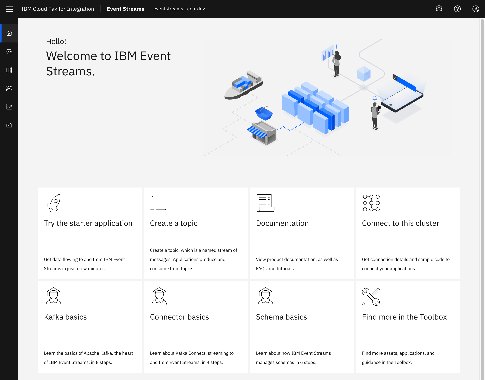
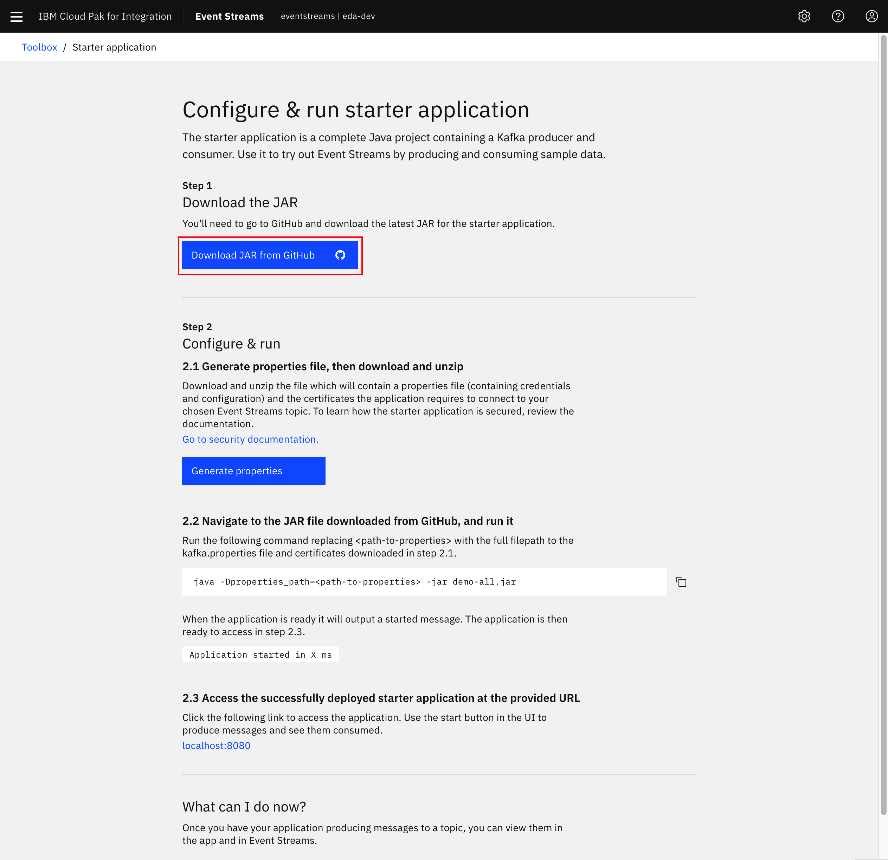
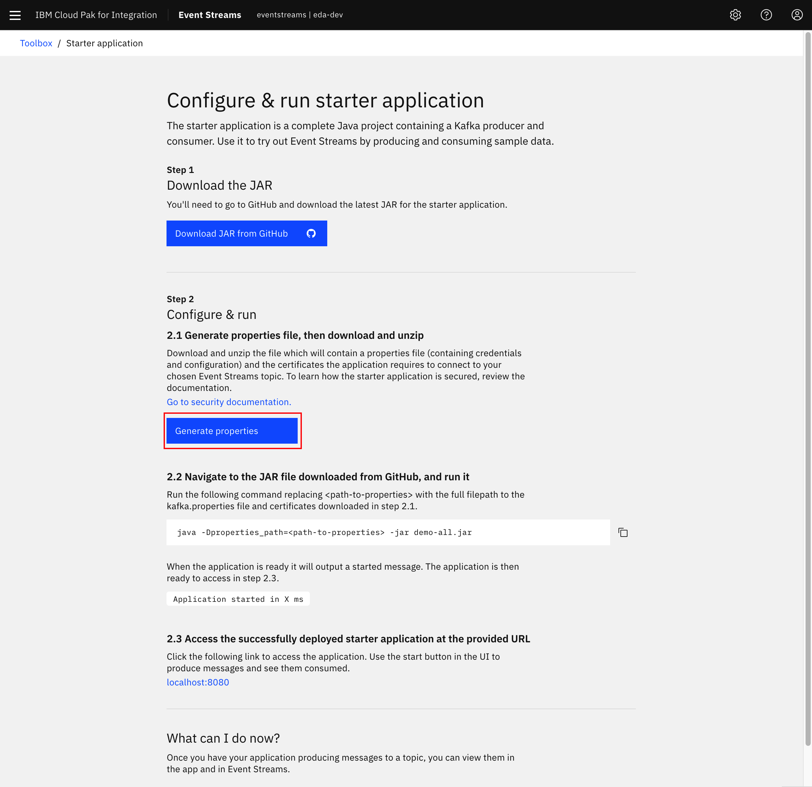
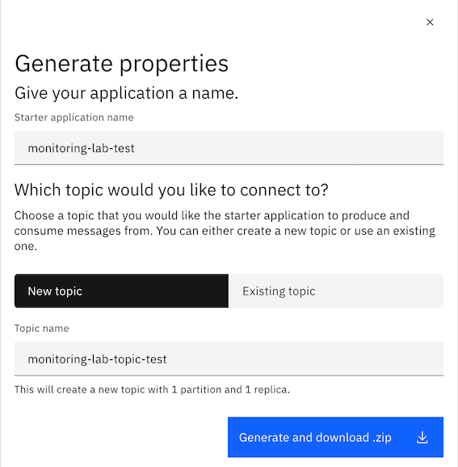
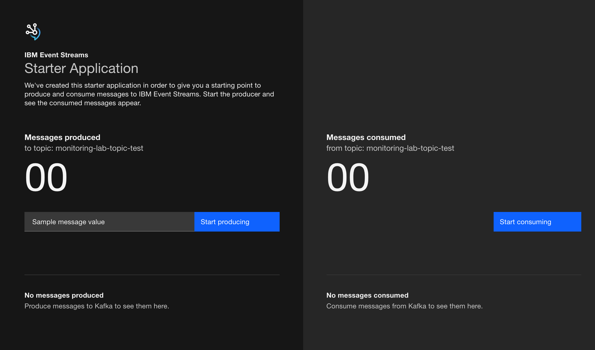

<AnchorLinks>
  <AnchorLink>IBM Cloud Shell</AnchorLink>
  <AnchorLink>Install Event Streams using operators</AnchorLink>
  <AnchorLink>Log into Event Streams</AnchorLink>
  <AnchorLink>Create Event Streams Topics</AnchorLink>
  <AnchorLink>Get Kafka Bootstrap Url</AnchorLink>
  <AnchorLink>Generate SCRAM Service Credentials</AnchorLink>
  <AnchorLink>Get Event Streams TLS Certificates</AnchorLink>
  <AnchorLink>Run the Starter Application</AnchorLink>
  <AnchorLink>Using Kafdrop</AnchorLink>
  <AnchorLink>Running docker in kubernetes pod</AnchorLink>
</AnchorLinks>

## IBM Cloud Shell

Here we are going to set up our IBM Cloud Shell with all the tools required to carry out this lab.

Start your IBM Cloud Shell by pointing your browser to <https://cloud.ibm.com/shell>


#### IBM Cloud Pak CLI

Cloudctl is a command line tool to manage Container Application Software for Enterprises (CASEs). This CLI will allow us to manage Cloud Pak related components as well as software, like IBM Event Streams, installed through any IBM Cloud Pak.

In order to install it, execute the following commands in your IBM Cloud Shell:

1. Download the IBM Cloud Pak CLI - `curl -L https://github.com/IBM/cloud-pak-cli/releases/latest/download/cloudctl-linux-amd64.tar.gz -o cloudctl-linux-amd64.tar.gz`
1. Untar it - `tar -xvf cloudctl-linux-amd64.tar.gz`
1. Rename it for ease of use - `mv cloudctl-linux-amd64 cloudctl`
1. Include it to the PATH environment variable - `export PATH=$PATH:$PWD`
1. Make sure your IBM Cloud Pak CLI is in the path- `which cloudctl`
1. Make sure your IBM Cloud Pak CLI works - `cloudctl help`


#### Event Streams plugin for IBM Cloud Pak CLI

This plugin will allow us to manage IBM Event Streams.

In order to install it, execute the following commands in your IBM Cloud Shell:

1. Download the Event Streams plugin for IBM Cloud Pak CLI - `curl -L http://ibm.biz/es-cli-linux -o es-plugin`
1. Install it - `cloudctl plugin install es-plugin`
1. Make sure it works - `cloudctl es help`


#### Git

IBM Cloud Shell comes with Git already installed out of the box.

#### Vi

IBM Cloud Shell comes with Vi already installed out of the box.

#### Python 3

IBM Cloud Shell comes with Python 3 already installed out of the box. However, we need to install the following modules that will be used later on in this tutorial when we run a Python application to work with Avro, Schemas and messages. These modules are `confluent_kafka` and `avro-python3`

In order to install these modules, execute the following command in your IBM Cloud Shell:

1. Install the modules - `python3 -mpip install avro-python3 confluent_kafka`


**Congrats!** you have now your IBM Cloud Shell ready to start working.


## Run the Starter Application

This section details walking through the generation of a starter application for usage with IBM Event Streams, as documented in the [official product documentation](https://ibm.github.io/event-streams/getting-started/generating-starter-app/).

1. Log into the IBM Event Streams Dashboard.

  

1. Click the **Try the starter application** button from the _Getting Started_ page

  

1. Click **Download JAR from GitHub**. This will open a new window to <https://github.com/ibm-messaging/kafka-java-vertx-starter/releases>
  
  

   - Click the link for `demo-all.jar` from the latest release available. At the time of this writing, the latest version was `1.0.0`.
  
   

1. Return to the `Configure & run starter application` window and click **Generate properties**.

  

1. In dialog that pops up from the right-hand side of the screen, enter the following information:
   - **Starter application name:** `monitoring-lab-[your-initials]`
   - Leave **New topic** selected and enter a **Topic name** of `monitoring-lab-topic-[your-initials]`.
   - Click **Generate and download .zip**
  
   

1. In a Terminal window, unzip the generated ZIP file from the previous window and move `demo-all.jar` file into the same folder.

1. Review the extracted `kafka.properties` to understand how Event Streams has generated credentials and configuration information for this sample application to connect.

1. Run the command `java -Dproperties_path=./kafka.properties -jar demo-all.jar`.

1.  Wait until you see the string `Application started in X ms` in the output and then visit the application's user interface via `http://localhost:8080`.

  

1. Once in the User Interface, enter a message to be contained for the Kafka record value then click **Start producing**.

1. Wait a few moments until the UI updates to show some of the confirmed produced messages and offsets, then click on **Start consuming** on the right side of the application.

  

1. In the IBM Event Streams user interface, go to the topic where you send the messages to and make sure messages have actually made it.

  

1. You can do the following actions on the application
   - If you would like to stop the application from producing, you can click **Stop producing**.
   - If you would like to stop the application from consuming, you can click **Stop consuming**.
   - If you would like to stop the application entirely, you can input `Control+C` in the Terminal session where the application is running.

An [alternative sample application](https://ibm.github.io/event-streams/getting-started/testing-loads/) can be leveraged from the official documentation to generate higher amounts of load.

## Using Kafdrop

[Kafdrop](https://github.com/obsidiandynamics/kafdrop) is a web UI for viewing Kafka topics and browsing consumer groups. It is very helpful for development purpose. 

Here are scripts that can be useful to start a local Kafdrop webserver.

```shell
source .env
sed 's/KAFKA_USER/'$KAFKA_USER'/g' ./scripts/kafka.properties > ./scripts/output.properties
sed -i '' 's/KAFKA_PASSWORD/'$KAFKA_PASSWORD'/g' ./scripts/output.properties
sed -i '' 's/KAFKA_CERT_PWD/'$KAFKA_CERT_PWD'/g' ./scripts/output.properties
docker run -d --rm -p 9000:9000 \
    --name kafdrop \
    -v $(pwd)/certs:/home/certs \
    -e KAFKA_BROKERCONNECT=$KAFKA_BROKERS \
    -e KAFKA_PROPERTIES=$(cat ./scripts/output.properties | base64) \
    -e JVM_OPTS="-Xms32M -Xmx64M" \
    -e SERVER_SERVLET_CONTEXTPATH="/" \
    obsidiandynamics/kafdrop
```

[See also those scripts: startKafdrop](https://raw.githubusercontent.com/ibm-cloud-architecture/refarch-eda-item-inventory/master/scripts/startKafdrop.sh)

and [to stop kafdrop](https://raw.githubusercontent.com/ibm-cloud-architecture/refarch-eda-item-inventory/master/scripts/stopKafdrop.sh)

```shell
docker stop $(docker stop kafdrop)
```

The Web console is at [http://localhost:9000/](http://localhost:9000/)

## Running docker in kubernetes pod

If you need to run some of the lab within a shell session with docker, you can create a pod, using OpenShift console under one of your project:

 

In the yaml editor, copy [this yaml file](https://gist.githubusercontent.com/osowski/4c9b6eb8e63b93e97ad6fecd8d9c8ff4/raw/8c2720c572458838942ccdba87271c61d4764671/dind.yaml). This operation will download the docker image from dockerhub ibmcase account.

You can also download the yaml and do an `oc apply -f dind.yaml`.

Then remote exec a shell within the pod: `oc exec -it dind bash`. You should be able to run another docker image in this pod, like for example our python environment.
