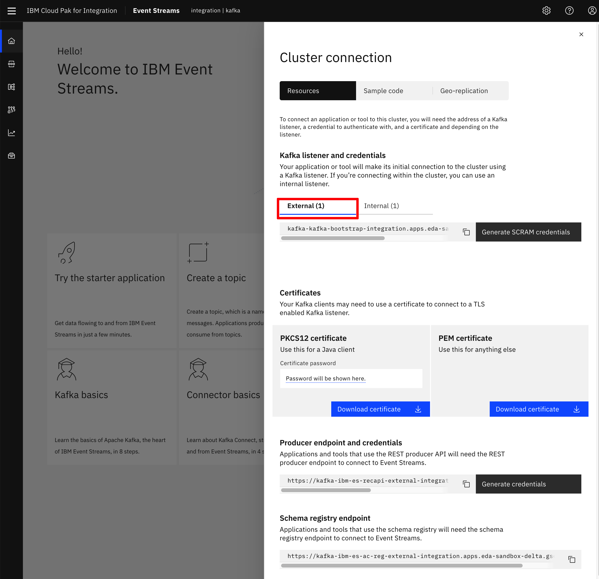
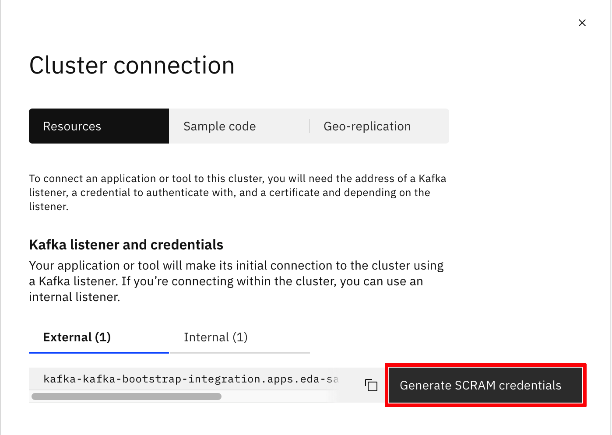

<AnchorLinks>
  <AnchorLink>IBM Cloud Shell</AnchorLink>
  <AnchorLink>Install Event Streams using operators</AnchorLink>
  <AnchorLink>Log into Event Streams</AnchorLink>
  <AnchorLink>Create Event Streams Topics</AnchorLink>
  <AnchorLink>Generate SCRAM Service Credentials</AnchorLink>
  <AnchorLink>Get Event Streams TLS Certificates</AnchorLink>
  <AnchorLink>Using Kafdrop</AnchorLink>
  <AnchorLink>Running docker in kubernetes pod</AnchorLink>
</AnchorLinks>

## IBM Cloud Shell

Here we are going to set up our IBM Cloud Shell with all the tools required to carry out this lab.

Start your IBM Cloud Shell by pointing your browser to <https://cloud.ibm.com/shell>


#### IBM Cloud Pak CLI

Cloudctl is a command line tool to manage Container Application Software for Enterprises (CASEs). This CLI will allow us to manage Cloud Pak related components as well as software, like IBM Event Streams, installed through any IBM Cloud Pak.

In order to install it, execute the following commands in your IBM Cloud Shell:

1. Download the IBM Cloud Pak CLI - `curl -L https://github.com/IBM/cloud-pak-cli/releases/latest/download/cloudctl-linux-amd64.tar.gz -o cloudctl-linux-amd64.tar.gz`
1. Untar it - `tar -xvf cloudctl-linux-amd64.tar.gz`
1. Rename it for ease of use - `mv cloudctl-linux-amd64 cloudctl`
1. Include it to the PATH environment variable - `export PATH=$PATH:$PWD`
1. Make sure your IBM Cloud Pak CLI is in the path- `which cloudctl`
1. Make sure your IBM Cloud Pak CLI works - `cloudctl help`


#### Event Streams plugin for IBM Cloud Pak CLI

This plugin will allow us to manage IBM Event Streams.

In order to install it, execute the following commands in your IBM Cloud Shell:

1. Download the Event Streams plugin for IBM Cloud Pak CLI - `curl -L http://ibm.biz/es-cli-linux -o es-plugin`
1. Install it - `cloudctl plugin install es-plugin`
1. Make sure it works - `cloudctl es help`


#### Git

IBM Cloud Shell comes with Git already installed out of the box.

#### Vi

IBM Cloud Shell comes with Vi already installed out of the box.

#### Python 3

IBM Cloud Shell comes with Python 3 already installed out of the box. However, we need to install the following modules that will be used later on in this tutorial when we run a Python application to work with Avro, Schemas and messages. These modules are `confluent_kafka` and `avro-python3`

In order to install these modules, execute the following command in your IBM Cloud Shell:

1. Install the modules - `python3 -mpip install avro-python3 confluent_kafka`


**Congrats!** you have now your IBM Cloud Shell ready to start working.

## Install Event Streams using operators

See the [product instructions](https://ibm.github.io/event-streams/installing/installing/) to deploy using IBM operators. Here is a summary of the steps using the CLI
  
* Verify operators are visibles in OpenShift market place 

 ```
 oc get catalogsource -n openshift-marketplace
 NAME                   DISPLAY                TYPE      PUBLISHER   AGE
 certified-operators    Certified Operators    grpc      Red Hat     15d
 community-operators    Community Operators    grpc      Red Hat     15d
 ibm-operator-catalog   IBM Operator Catalog   grpc      IBM         6s
 opencloud-operators    IBMCS Operators        grpc      IBM         23h
 redhat-marketplace     Red Hat Marketplace    grpc      Red Hat     15d
 redhat-operators       Red Hat Operators      grpc      Red Hat     15d
 ```

* If the IBM catalogs are not displayed add the following:

 ```shell
 oc apply -f 
https://raw.githubusercontent.com/ibm-cloud-architecture/refarch-eda-tools/master/evenstreams-config/ibm-catalog.yaml
 # 
 oc apply -f 
 https://raw.githubusercontent.com/ibm-cloud-architecture/refarch-eda-tools/master/evenstreams-config/ibm-cs-catalog.yaml
 ```

* Create a project to host eventstreams cluster:

  ```shell
  oc new-project eventstreams
  ```
* Use Openshift console -> Operators > OperatorHub to search for event streams, then install the operator. (The last test done was on 2.1.0 version). We define the kafka cluster operator to manage instances on any projects, which means the operator will be deployed to `openshift-operators`, to use channel version `2.1`. It takes some time before the operator pod is scheduled.
* Get your license entitlement key from this web site: [https://myibm.ibm.com/products-services/containerlibrary](https://myibm.ibm.com/products-services/containerlibrary), and save it in a file named `key`.
* Create a secret to access the IBM docker registry to get access to the product image:

  ```shell
  oc create secret docker-registry ibm-entitlement-key --docker-username=cp --docker-password=$(cat key) --docker-server="cp.icr.io" -n eventstreams
  ```
* Install an Event Streams instance: Instances of Event Streams can be created after the Event Streams operator is installed. You can use te OpenShift console or our predefined cluster defintion:

 ```shell
 oc apply -f 
https://raw.githubusercontent.com/ibm-cloud-architecture/refarch-eda-tools/master/evenstreams-config/eventstreams-light-insecure.yaml
 ```

## Log into Event Streams

In this section we are going to see how to log into our IBM Event Streams console both through the UI and CLI.

#### UI

In order to log into the IBM Event Streams console:

1. go to your OpenShift console and click on `Operators --> Installed Operators` in the left hand side bar menu. Then select the project where your IBM Event Streams instance was installed into.

  

1. Click on the IBM Event Streams Operator and then on the `Event Streams` option listed at the top bar

  

1. Click on the IBM Event Streams instance you want to access to its console and scroll down until you see the `Admin UI` attribute that displays the route to this IBM Event Streams instance's console.

  

1. Click on the route link and enter your IBM Event Streams credentials.

#### CLI

In order to log into IBM Event Streams console through the CLI, we are going to use the `oc` OpenShift CLI, the `clouctl` Cloud Pak CLI and the `es` Cloud Pak CLI plugin. You can check above in this readme how to get these installed. We assume you are already logged into your OpenShift cluster through the `oc` Openshift CLI (If not, log into your OpenShift cluster console using the user interface and click on `Copy Login Command` option displayed when you click on your user avatar on the top right corner).

1. Get your Cloud Pak console route (you may need cluster wide admin permissions to do so as the Cloud Pak is usually installed in the `ibm-common-services` namespace by the cluster admins)

  ```shell
  $ oc get routes -n ibm-common-services | grep console
  cp-console                       cp-console.apps.eda-sandbox-delta.gse-ocp.net                                                  icp-management-ingress           https      reencrypt/Redirect     None
  ```

1. Log into IBM Event Streams using the Cloud Pak console route from the previous step:

  ```shell
	$ cloudctl login -a https://cp-console.apps.eda-sandbox-delta.gse-ocp.net --skip-ssl-validation

	Username> user50

	Password>
	Authenticating...
	OK

	Targeted account mycluster Account

	Enter a namespace > integration
	Targeted namespace integration

	Configuring kubectl ...
	Property "clusters.mycluster" unset.
	Property "users.mycluster-user" unset.
	Property "contexts.mycluster-context" unset.
	Cluster "mycluster" set.
	User "mycluster-user" set.
	Context "mycluster-context" created.
	Switched to context "mycluster-context".
	OK

	Configuring helm: /Users/user/.helm
	OK
	```

1. Initialize the Event Streams CLI plugin (make sure you provide the namespace where your IBM Event Streams instance is installed on as the command will fail if you dont have cluster wide admin permissions)

	```shell
	$ cloudctl es init -n integration
                                                  
  IBM Cloud Platform Common Services endpoint:   https://cp-console.apps.eda-sandbox-delta.gse-ocp.net   
  Namespace:                                     integration   
  Name:                                          kafka   
  IBM Cloud Pak for Integration UI address:      https://integration-navigator-pn-integration.apps.eda-sandbox-delta.gse-ocp.net   
  Event Streams API endpoint:                    https://kafka-ibm-es-admapi-external-integration.apps.eda-sandbox-delta.gse-ocp.net   
  Event Streams API status:                      OK   
  Event Streams UI address:                      https://kafka-ibm-es-ui-integration.apps.eda-sandbox-delta.gse-ocp.net   
  Apicurio Registry endpoint:                    https://kafka-ibm-es-ac-reg-external-integration.apps.eda-sandbox-delta.gse-ocp.net   
  Event Streams bootstrap address:               kafka-kafka-bootstrap-integration.apps.eda-sandbox-delta.gse-ocp.net:443   
  OK
	``` 

## Create Event Streams Topics

This section is a generic example of the steps to proceed to define a topic with Event Streams on OpenShift. The example is to define a topic named INBOUND with 1 partition and a replica set to 3.

#### UI

1. Log into your IBM Event Streams instance through the UI as explained in the previous section.

1. Click the Topics option on the navigation bar on the left. Create the INBOUND topic.

  

  

1. Leave Partitions at 1.

  

1. Depending on how long you want messages to persist you can change this.

  

1. You can leave Replication Factor at the default 3.

  

1. Click Create.

1. Make sure the topic has been created by navigating to the topics section on the IBM Event Streams user inteface you can find an option for in the left hand side menu bar. 

#### CLI

1. Log into your IBM Event Streams instance using the CLI as explained in the previous section.
1. Create the topic with the desirec specification.

   ```shell
   cloudctl es topic-create --name INBOUND --partitions 1 --replication-factor 3
   ```

1. Make sure the topic has been created by listing the topics.

  ```shell
  $ cloudctl es topics
  Topic name   
  INBOUND   
  OK
  ```

## Generate SCRAM Service Credentials

For an application to connect to an Event Streams instance through the secured external listener, it needs SCRAM credentials to act as service credentials (as well as the TLS certificate we will talk about in the next section of this readme). 

#### UI

1. Log into the IBM Event Streams user interface as explained previously in this readme and click on the `Connect to this cluster` option displayed on the dashboard. This will display a menu. Make sure that you are on the **External Connection**.

  

1. Click on the `Generate SCRAM credentials` button.

  

1. Introduce a name for your credentials and choose the option that better suits the needs of your applications (this will create RBAC permissions for you credentials so that a service credentials can do only what it needs to do). For this demo, select `Produce messages, consume messages and create topics and schemas` last option.

  

1. Decide whether your service credentials need to have the ability to access all topics or certain topics only. For this demo, select `All Topics` and then click Next.

  

1. Decide whether your service credentials need to have the ability to access all consumer groups or certain specific consumer groups only. For this demo, select `All Consumer Groups` and click Next.

  

1. Decide whether your service credentials need to have the ability to access all transactional IDs or certain specific transactional IDs only. For this demo, select `All transaction IDs` and click on `Generate credentials`.

  

1. **Take note** of the set of credentials displayed on screen. You will need to provide your applications with these in order to get authenticated and authorized with your IBM Event Streams instance.

  

1. If you did not take note of your SCRAM credentials or you forgot these, the above will create a `KafkaUser` object in OpenShift that is interpreted by the IBM Event Streams Operator. You can see this `KafkaUser` if you go to the OpenShift console, click on `Operators --> Installed Operators` on the right hand side menu, then click on the `IBM Event Streams` operator and finally click on `Kafka Users` at the top bar menu.

  

1. If you click on your `Kafka User`, you will see what is the Kubernetes secret behind holding your SCRAM credentials details.

  

1. Click on that secret and you will be able to see again your `SCRAM password` (your `SCRAM username` is the same name as the `Kafka User` created or the secret holding your `SCRAM password`) 

  


#### CLI

1. Log into your IBM Event Streams instance through the CLI as already explained before in this readme.

1. Create your SCRAM service credentials with the following command (adjust the topics, consumer groups, transaction IDs, etc permissions your SCRAM service credentials should have in order to satisfy your application requirements):

  ```shell
  $ cloudctl es kafka-user-create --name test-credentials-cli --consumer --producer --schema-topic-create --all-topics --all-groups --all-txnids --auth-type scram-sha-512
  
  KafkaUser name         Authentication   Authorization   Username                                                Secret   
  test-credentials-cli   scram-sha-512    simple          EntityOperator has not created corresponding username   EntityOperator has not created corresponding secret   
  
  Resource type     Name        Pattern type   Host   Operation   
  topic             *           literal        *      Read   
  topic             __schema_   prefix         *      Read   
  topic             *           literal        *      Write   
  topic             *           literal        *      Create   
  topic             __schema_   prefix         *      Alter   
  group             *           literal        *      Read   
  transactionalId   *           literal        *      Write   
  
  Created KafkaUser test-credentials-cli.
  OK
  ```

1. List the `KafkaUser` objects to make sure yours has been created:

  ```shell
  $ cloudctl es kafka-users
  KafkaUser name                    Authentication   Authorization   
  test-credentials                  scram-sha-512    simple   
  test-credentials-cli              scram-sha-512    simple   
  OK
  ```

1. To retrieve your credentials execute the following command:

  ```shell
  $ cloudctl es kafka-user test-credentials-cli 
  KafkaUser name         Authentication   Authorization   Username               Secret   
  test-credentials-cli   scram-sha-512    simple          test-credentials-cli   test-credentials-cli   

  Resource type     Name        Pattern type   Host   Operation   
  topic             *           literal        *      Read   
  topic             __schema_   prefix         *      Read   
  topic             *           literal        *      Write   
  topic             *           literal        *      Create   
  topic             __schema_   prefix         *      Alter   
  group             *           literal        *      Read   
  transactionalId   *           literal        *      Write   
  OK
  ```

1. Above you can see your `SCRAM username` under `Username` and the secret holding your `SCRAM password` under `Secret`. In order to retrieve the password, execute the following command:

  ```shell
  $ oc get secret test-credentials-cli -o jsonpath='{.data.password}' | base64 --decode 
  
  *******
  ```

**NEXT:** For more information about how to connect to your cluste, read the [IBM Event Streams product documentation](https://ibm.github.io/event-streams/getting-started/connecting/)

## Get Event Streams TLS Certificates

In this section we are going to see how to download the TLS certificats to securely connect to our IBM Event Streams instance.

#### UI

1. Log into the IBM Event Streams console user interface as explained before in this readme.
1. Click on the `Connect to this cluster` option displayed on the dashboard. This will display a menu where you will see a `Certificates` section:

  

1. Depending on what language your application is written into, you will need a `PKCS12 certificate` or a `PEM certificate`. Click on `Download certificate` for any of the options you need. If it is the `PKCS12 certificate` bear in mind it comes with a password for the truststore. You don't need to write this down as it will display any time you click on `Download certificate` button.

#### CLI

1. Log into IBM Event Streams through the CLI as already explained before in this readme.
1. To retrieve the `PKCS12 certificate` execute the following command:

  ```shell
  $ cloudctl es certificates --format p12
  Trustore password is ********
  Certificate successfully written to /Users/testUser/Downloads/es-cert.p12.
  OK
  ```

1. To retrieve the `PEM certificate` execute the following command:

  ```shell
  $ cloudctl es certificates --format pem
  Certificate successfully written to /Users/testUser/Downloads/es-cert.pem.
  OK
  ```

**NEXT:** For more information about how to connect to your cluste, read the [IBM Event Streams product documentation](https://ibm.github.io/event-streams/getting-started/connecting/)

## Using Kafdrop

[Kafdrop](https://github.com/obsidiandynamics/kafdrop) is a web UI for viewing Kafka topics and browsing consumer groups. It is very helpful for development purpose. 

Here are scripts that can be useful to start a local Kafdrop webserver.

```shell
source .env
sed 's/KAFKA_USER/'$KAFKA_USER'/g' ./scripts/kafka.properties > ./scripts/output.properties
sed -i '' 's/KAFKA_PASSWORD/'$KAFKA_PASSWORD'/g' ./scripts/output.properties
sed -i '' 's/KAFKA_CERT_PWD/'$KAFKA_CERT_PWD'/g' ./scripts/output.properties
docker run -d --rm -p 9000:9000 \
    --name kafdrop \
    -v $(pwd)/certs:/home/certs \
    -e KAFKA_BROKERCONNECT=$KAFKA_BROKERS \
    -e KAFKA_PROPERTIES=$(cat ./scripts/output.properties | base64) \
    -e JVM_OPTS="-Xms32M -Xmx64M" \
    -e SERVER_SERVLET_CONTEXTPATH="/" \
    obsidiandynamics/kafdrop
```

[See also those scripts: startKafdrop](https://raw.githubusercontent.com/ibm-cloud-architecture/refarch-eda-item-inventory/master/scripts/startKafdrop.sh)

and [to stop kafdrop](https://raw.githubusercontent.com/ibm-cloud-architecture/refarch-eda-item-inventory/master/scripts/stopKafdrop.sh)

```shell
docker stop $(docker stop kafdrop)
```

The Web console is at [http://localhost:9000/](http://localhost:9000/)

## Running docker in kubernetes pod

If you need to run some of the lab within a shell session with docker, you can create a pod, using OpenShift console under one of your project:

 

In the yaml editor, copy [this yaml file](https://gist.githubusercontent.com/osowski/4c9b6eb8e63b93e97ad6fecd8d9c8ff4/raw/8c2720c572458838942ccdba87271c61d4764671/dind.yaml). This operation will download the docker image from dockerhub ibmcase account.

You can also download the yaml and do an `oc apply -f dind.yaml`.

Then remote exec a shell within the pod: `oc exec -it dind bash`. You should be able to run another docker image in this pod, like for example our python environment.
