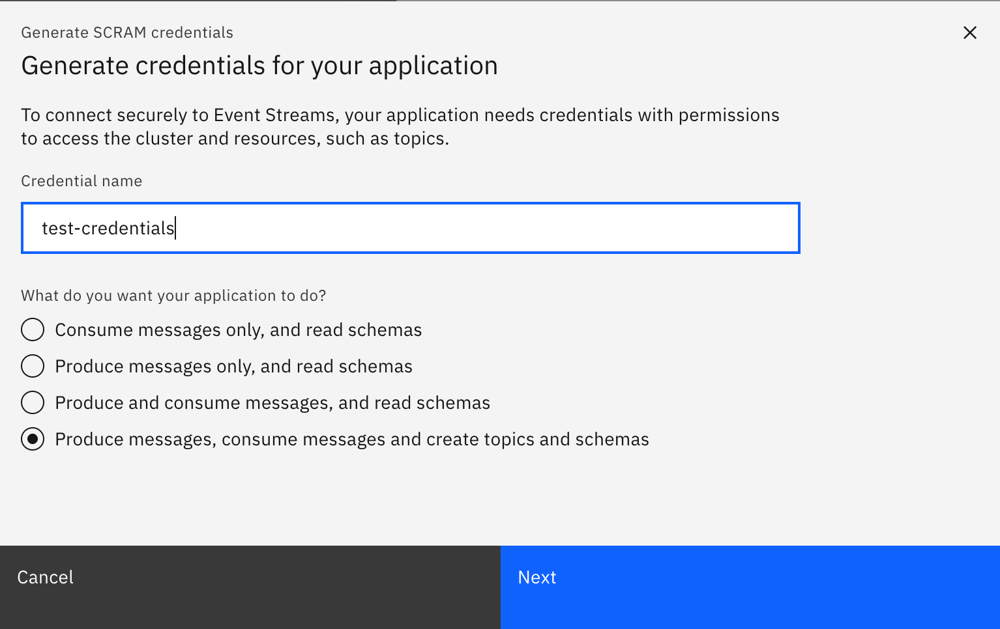

<AnchorLinks>
  <AnchorLink>IBM Cloud Shell</AnchorLink>
  <AnchorLink>Creating Event Streams Topics</AnchorLink>
  <AnchorLink>Getting scram authentication from Event Streams on OpenShift</AnchorLink>
  <AnchorLink>Getting TLS authentication from Event Streams on OpenShift</AnchorLink>
  <AnchorLink>Using Kafdrop</AnchorLink>
</AnchorLinks>

## IBM Cloud Shell

Here we are going to set up our IBM Cloud Shell with all the tools required to carry out this lab.

Start your IBM Cloud Shell by pointing your browser to <https://cloud.ibm.com/shell>


#### IBM Cloud Pak CLI

Cloudctl is a command line tool to manage Container Application Software for Enterprises (CASEs). This CLI will allow us to manage Cloud Pak related components as well as software, like IBM Event Streams, installed through any IBM Cloud Pak.

In order to install it, execute the following commands in your IBM Cloud Shell:

1. Download the IBM Cloud Pak CLI - `curl -L https://github.com/IBM/cloud-pak-cli/releases/latest/download/cloudctl-linux-amd64.tar.gz -o cloudctl-linux-amd64.tar.gz`
1. Untar it - `tar -xvf cloudctl-linux-amd64.tar.gz`
1. Rename it for ease of use - `mv cloudctl-linux-amd64 cloudctl`
1. Include it to the PATH environment variable - `export PATH=$PATH:$PWD`
1. Make sure your IBM Cloud Pak CLI is in the path- `which cloudctl`
1. Make sure your IBM Cloud Pak CLI works - `cloudctl help`


#### Event Streams plugin for IBM Cloud Pak CLI

This plugin will allow us to manage IBM Event Streams.

In order to install it, execute the following commands in your IBM Cloud Shell:

1. Download the Event Streams plugin for IBM Cloud Pak CLI - `curl -L http://ibm.biz/es-cli-linux -o es-plugin`
1. Install it - `cloudctl plugin install es-plugin`
1. Make sure it works - `cloudctl es help`


#### Git

IBM Cloud Shell comes with Git already installed out of the box.

#### Vi

IBM Cloud Shell comes with Vi already installed out of the box.

#### Python 3

IBM Cloud Shell comes with Python 3 already installed out of the box. However, we need to install the following modules that will be used later on in this tutorial when we run a Python application to work with Avro, Schemas and messages. These modules are `confluent_kafka` and `avro-python3`

In order to install these modules, execute the following command in your IBM Cloud Shell:

1. Install the modules - `python3 -mpip install avro-python3 confluent_kafka`


**Congrats!** you have now your IBM Cloud Shell ready to start working.

## Creating Event Streams Topics

This section is a generic example of the steps to proceed to define a topic with Event Streams on OpenShift using the User Interface. The example is to define a topic named INBOUND with 1 partition and a replica set to 3. Change to any other topic you want to create.

- Get the route for event streams. We assume the namespace is `eventstreams`
 
 ```shell
  oc get routes -n eventstreams | grep ui
  ```

- Navigate to the Event Streams Console using the exposed route URL.

- Click the Topics option on the navigation bar on the left. Create the INBOUND topic.


- Leave Partitions at 1.


- Depending on how long you want messages to persist you can change this.


- You can leave Replication Factor at the default 3.


- Click Create.

### Create topic using CLI

You can do the samething using CLI, [see the product documentation](https://ibm.github.io/event-streams/getting-started/creating-topics/).

 ```shell
 cloudctl es topic-create --name INBOUND --partitions 1 --replication-factor 3
 ```

## Getting scram authentication from Event Streams on OpenShift

- To connect to an Event Streams Instance from an application running out side of the OpenShift cluster, we need to get external access credential. This is done by getting a scram user and TLS server certificate. 

- While viewing our Event Streams Instance, navigate to the 'Connect to this cluster' menu from the left. Click Connect to this Cluster - 

- Make sure that you're on **External Connection** as we will need to test/connect from an application not running on OCP cluster. Keep note of your **Bootstrap Server Address**. Save this somewhere as we will need this later to configure our application's connection to the Event Streams instance.


- Generate your **SCRAM Credentials**. Click the `Generate SCRAM Credentials` button.


- Select a name for your secret and make sure you remember it as this also represents the user identifier for the connection. Also choose the Produce, Consume, Create Topics and Schema Option.



- Select `All Topics` and then click Next.


- Leave it with `All Consumer Groups` and click Next.


- Select all transaction IDs and then generate your **API Key**. Click the Generate API Key button.


- Select a name for your application. It doesn't really matter too much what you name it. 

- If the following error occurs, log into your OpenShift cluster and go to the project/namespace that your Event Streams v10 instance is installed in. If you run these commands you will see your user created.

`oc get kafkauser`

`oc get secrets`

- Your `SCRAM Username` that we will need for later is the name of your secret. The `SCRAM Password` can be either obtained by going to your OpenShift Console Web UI and revealing the password through the secrets menu or through the CLI. Run the following commands to see the value of the password.

`oc get secret your-secret -jsonpath '{.data.password}' -n eventstreams | base64 --decode `

- This will return you a base64 encoded value. Decode this like so

`echo "dWpPN3ZSSEF1clRK" | base64 -d`


- Lastly download the PKCS12 truststore .pkcs12 certificate. Once you hit the Download button the password to the truststore will be revealed. **Copy this down** as we will need it.


**Summary** 

We now have the bootstrap server address, SCRAM Username (also the name of the KafkaUser/Secret CRs) and Password, .pcks12 truststore certificate, and the truststore password associated with that certificate to allow us the ability to connect to our Event Streams instance.


## Getting TLS authentication from Event Streams on OpenShift

### Get TLS server public certificate

The cluster public certificate is required for all external connections and is available to download from the Cluster connection panel under the Certificates heading. Upon downloading the PKCS12 certificate, the certificate password will also be displayed. We can also get those certificate and password via CLI:

See [product documentation for detail](https://ibm.github.io/event-streams/getting-started/connecting/). A quick set of commands:

 ```shell
 oc get secret -n eventstreams | grep cluster-ca-cert
 # use the ca-cert for the instance you target 
 oc get secret minimal-prod-cluster-ca-cert  -n eventstreams -o jsonpath='{.data.ca\.p12}' | base64 --decode > es-cert.p12
 # or the command:
 oc extract secret/minimal-prod-cluster-ca-cert --keys=ca.p12 -n eventstreams
 # and password
 oc get secret minimal-prod-cluster-ca-cert -n eventstreams -o jsonpath='{.data.ca\.password}' | base64 --decode
 # or the command
 oc extract secret/minimal-prod-cluster-ca-cert --keys=ca.password -n eventstreams
 ```

Copy the server certificate into your OpenShift project where consumer and producer code will be deployed:

```shell
 oc get secret minimal-prod-cluster-ca-cert  -n eventstreams --export -o yaml | oc apply -f - 
```

### Get Scram-sha-512 user 

Select one of the Kafka users with Scram authentication defined or create a new one with the produce, consume messages and create topic and schemas authorizations, on all topics or topic with a specific prefix, on all consumer groups or again with a specific prefix, all transaction IDs.

  ```shell
  # if not logged yes to your openshift cluster where the docker private registry resides do:
  oc login --token=... --server=https://c...
  oc get kafkausers -n eventstreams

  NAME                                     AUTHENTICATION   AUTHORIZATION
  demo-app                                 scram-sha-512    simple
  ```

  We use a user with scram-sha-512 authentication named: `demo-app`

* Copy user's secret to the current project where the application will run

 ```shell
 oc get secret  demo-app -n eventstreams --export -o yaml | oc apply -f -
 ```

* Get the user password:

 ```shell
 oc get secret demo-app -n eventstreams -o jsonpath='{.data.password}' | base64 --decode
 ```

* Set the KAFKA_USER and KAFKA_PASSWORD, and SECURE_PROTOCOL=SASL_SSL environment variables for your application.

### Get TLS user 

If you want to use mutual authentication with client certificate, you need a tls user. And use the same commands as in previous section to get user name and user's password. The differences are in the password access and that you need to download client certificate as keystore to be integrated in the Java app.

 ```shell
 # password is in another key
 oc get secret tls-user -n eventstreams -o jsonpath='{.data.user\.password}' | base64 --decode  
 ```

* Get the user client certificate and password

  ```shell
  cd certs
  oc get secret tls-user -n eventstreams -o jsonpath='{.data.user\.p12}' | base64 --decode > user.p12
  ```

Modify USER_CERT_PWD and USER_CERT_PATH=${PWD}/certs/user.p12 in the `.env` file
While starting your application if you get an exception with message like: `Caused by: java.io.IOException: toDerInputStream rejects tag type 77`, this is due to keystore p12 file was not decoded with base64.  

Also set the env variable as SECURE_PROTOCOL=SSL

## Using Kafdrop

[Kafdrop](https://github.com/obsidiandynamics/kafdrop) is a web UI for viewing Kafka topics and browsing consumer groups. It is very helpful for development purpose. 

Here are scripts that can be useful to start a local Kafdrop webserver.

```shell
source .env
sed 's/KAFKA_USER/'$KAFKA_USER'/g' ./scripts/kafka.properties > ./scripts/output.properties
sed -i '' 's/KAFKA_PASSWORD/'$KAFKA_PASSWORD'/g' ./scripts/output.properties
sed -i '' 's/KAFKA_CERT_PWD/'$KAFKA_CERT_PWD'/g' ./scripts/output.properties
docker run -d --rm -p 9000:9000 \
    --name kafdrop \
    -v $(pwd)/certs:/home/certs \
    -e KAFKA_BROKERCONNECT=$KAFKA_BROKERS \
    -e KAFKA_PROPERTIES=$(cat ./scripts/output.properties | base64) \
    -e JVM_OPTS="-Xms32M -Xmx64M" \
    -e SERVER_SERVLET_CONTEXTPATH="/" \
    obsidiandynamics/kafdrop
```

[See also those scripts: startKafdrop](https://raw.githubusercontent.com/ibm-cloud-architecture/refarch-eda-item-inventory/master/scripts/startKafdrop.sh)

and [to stop kafdrop](https://raw.githubusercontent.com/ibm-cloud-architecture/refarch-eda-item-inventory/master/scripts/stopKafdrop.sh)

```shell
docker stop $(docker stop kafdrop)
```

The Web console is at [http://localhost:9000/](http://localhost:9000/)