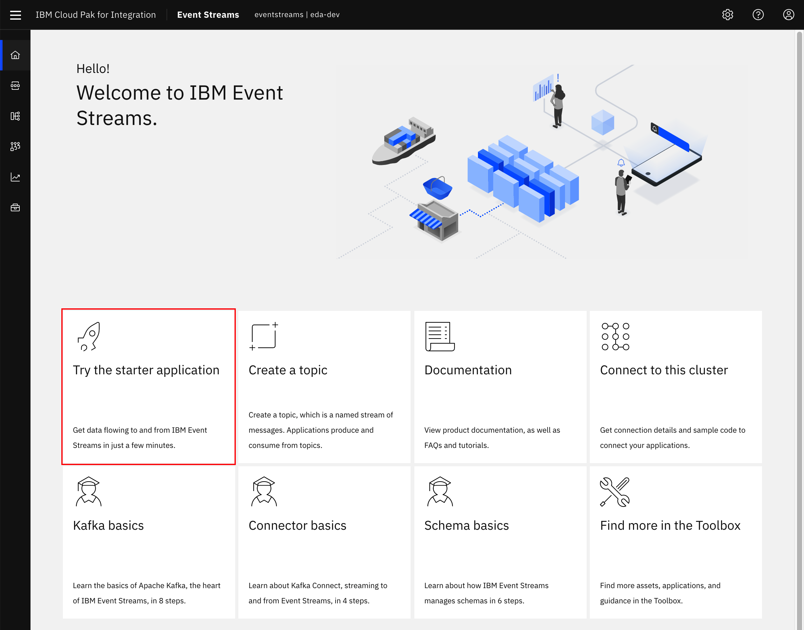
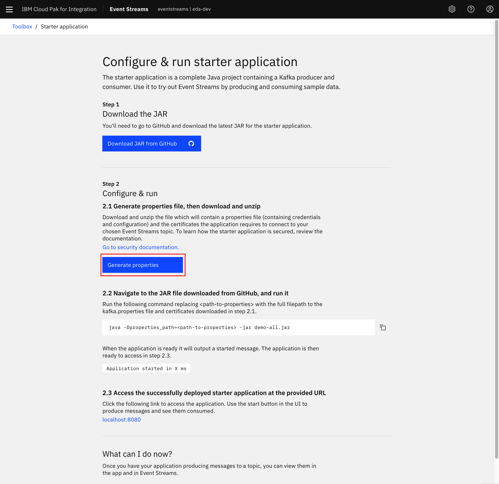
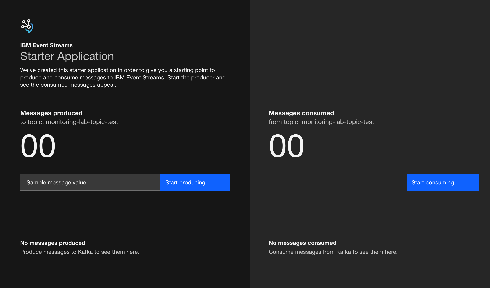
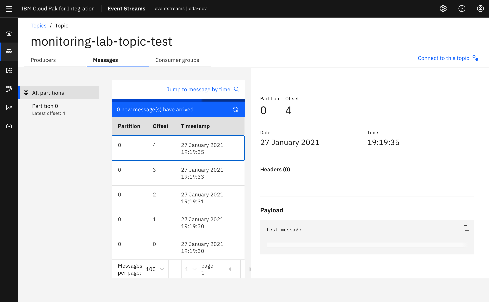

This section details walking through the generation of a starter application for usage with IBM Event Streams, as documented in the [official product documentation](https://ibm.github.io/event-streams/getting-started/generating-starter-app/).

The Starter application is an excellent way to demonstrate sending and consuming messages. 


## Prepare the starter app configuration

1. Log into the IBM Event Streams Dashboard, and from the home page, click the **Try the starter application** button from the _Getting Started_ page

  

1. Click **Download JAR from GitHub**. This will open a new window to <https://github.com/ibm-messaging/kafka-java-vertx-starter/releases>
  
  

   - Click the link for `demo-all.jar` from the latest release available. At the time of this writing, the latest version was `1.0.0`.
  
   

1. Return to the `Configure & run starter application` window and click **Generate properties**.

  

1. In dialog that pops up from the right-hand side of the screen, enter the following information:
   - **Starter application name:** `starter-app-[your-initials]`
   - Leave **New topic** selected and enter a **Topic name** of `starter-app-[your-initials]`.
   - Click **Generate and download .zip**
  
   

    The figure above illustrates that you can download a zip file containing the properties of the application according to the Event-Streams cluster configuration, and a `p12` TLS certificate to be added to a local folder.

1. In a Terminal window, unzip the generated ZIP file from the previous window and move `demo-all.jar` file into the same folder.

1. Review the extracted `kafka.properties` to understand how Event Streams has generated credentials and configuration information for this sample application to connect.

## Run starter application

1. This Starter application will run locally to the user's laptop with the command:

    ```sh
    java -jar target/demo-all.jar -Dproperties_path=./kafka.properties 
    ```
1. As an alternate method, we have packaged this app in a docker image: `quay.io/ibmcase/es-demo`

    ```sh
    docker run -ti -p 8080:8080 -v  $(pwd)/kafka.properties:/deployments/kafka.properties -v  $(pwd)/truststore.p12:/deployments/truststore.p12  quay.io/ibmcase/es-demo
    ```

1.  Wait until you see the string `Application started in X ms` in the output and then visit the application's user interface via `http://localhost:8080`.

  

1. Once in the User Interface, enter a message to be contained for the Kafka record value then click **Start producing**.

1. Wait a few moments until the UI updates to show some of the confirmed produced messages and offsets, then click on **Start consuming** on the right side of the application.

  

1. In the IBM Event Streams user interface, go to the topic where you send the messages to and make sure messages have actually made it.

  

1. You can leave the application running for the rest of the lab or you can do the following actions on the application
   - If you would like to stop the application from producing, you can click **Stop producing**.
   - If you would like to stop the application from consuming, you can click **Stop consuming**.
   - If you would like to stop the application entirely, you can input `Control+C` in the Terminal session where the application is running.

An [alternative sample application](https://ibm.github.io/event-streams/getting-started/testing-loads/) can be leveraged from the official documentation to generate higher amounts of load.
 
## Deploy to OpenShift

This application can also be deployed to OpenShift. Here are the steps:

1. Use the same `kafka.properties` and `truststore.p12` files you have downloaded with the starter 
application to create two kubernetes secrets holding these files in your OpenShift cluster

    ```sh
    oc create secret generic demo-app-secret --from-file=./kafka.properties
    oc create secret generic truststore-cert --from-file=./truststore.p12
    ```

1. Clone the following GitHub repo that contains the Kubernetes artifacts that will run the starter application.

    ```sh
    git clone https://github.com/ibm-cloud-architecture/eda-quickstarts.git
    ```

1. Change directory to where those Kubernetes artefacts are.

    ```sh
    cd eda-quickstarts/kafka-java-vertz-starter
    ```

1. Deploy the Kubernetes artefacts.

    ```sh
    oc apply -k app-deployment
    ```

1. Get the route to the starter application running on your OpenShift cluster.

    ```sh
    oc get route es-demo -o=jsonpath='{.status.ingress[].host}'
    ```

1. Point your browser to that url to work with the IBM Event Streams Starter Application.

The source code for this application is in this git repo: [ibm-messaging/kafka-java-vertx-starter](https://github.com/ibm-messaging/kafka-java-vertx-starter/).

Even though the application is running internally in OpenShift, it uses the external kafka listener as that is how the `kafka.properties` are provided by IBM Event Streams by default. In an attempt to not overcomplicate this task, it is used what IBM Event Streams provides out of the box.
