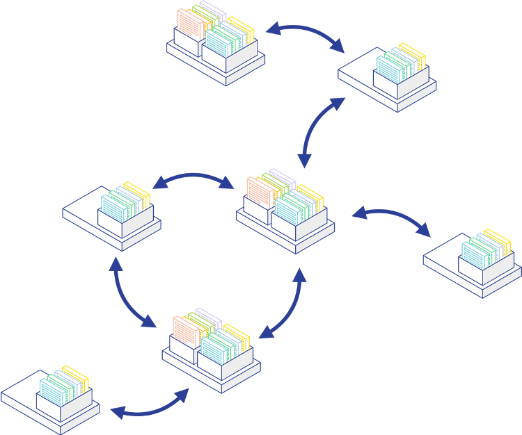
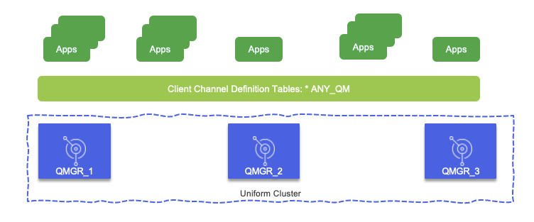
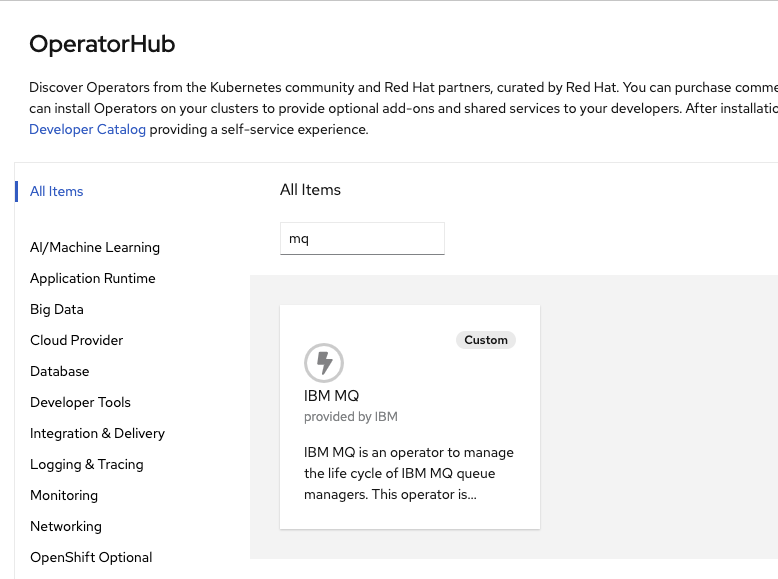
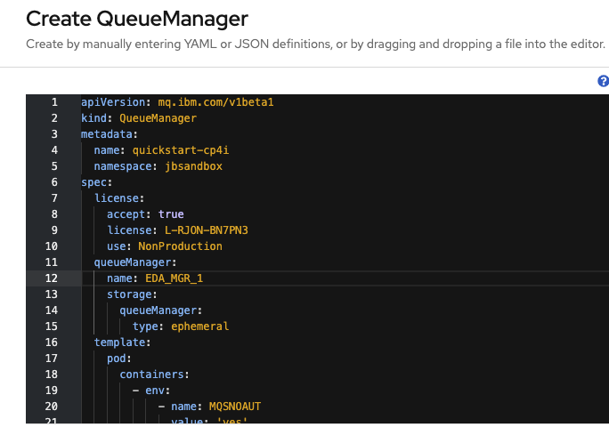

!!! warning
    Updated 7/13/2022- Work in progress

[IBM MQ](https://www.ibm.com/docs/en/ibm-mq/9.3) is the enterprise solution to exchange message over queues. 
As it supports loosely coupling communication between applications, via asynchronous protocol, and message exchange, it has to be part of any modern digital, responsive solutions, and
so it makes sense to write about it in the context of EDA. 

This note is to summarize, for architects, the technology as it fits into EDA and gives pointers to important documentations, articles, and code repositories for using MQ.

We already addressed the [difference between event and messaging](../../concepts/events-versus-messages) systems, and we can affirm that real production plaform needs to include both. 

This site includes a lot of content around Kafka as the backbone to support EDA, but EDA is not just Kafka.
I will prefer to mention that EDA is about modern asynchronous microservice based solution, that need to exchange messages. 
Messages can be sent to MQ or Kafka or both. 
IBM MQ delivers different features than Kafka and it is important to assess the fit for purpose. 

MQ queue managers are the main component to define queues and where applications connect to. 
They can be organized in network to deliver messages between applications and locations. 
Queue Managers can be organized in cluster to increase high availability and scaling.

 


## Concepts to keep in mind 

We encourage to read the [article from Richard Coppen's: 'IBM MQ fundamentals'](https://developer.ibm.com/articles/mq-fundamentals).


* **Queues** are addressable locations to deliver messages to and store them reliably until they need to be consumed. 
We can have many queues and topics on one queue manager
* **Queue managers** are the MQ servers that host the queues. They can be interconnected via MQ network.
* **Channels** are the way queue managers communicate with each other and with the applications.
* **MQ networks** are loose collections of interconnected queue managers, all working together to deliver messages between applications and locations.
* **MQ clusters** are tight couplings of queue managers, enabling higher levels of scaling and availability
* **Point to point** for a single consumer. Senders produce messages to a queue, and receivers asynchronously consume messages from that queue. With multiple receivers, each message is only consumed by one receiver, distributing the workload across them all.
* **Publish/subscribe** is supported via topic and subscription, and MQ sends copies of the message to those subscribing applications

## Major MQ benefits in EDA

* **MQ provides assured delivery of data**: No data loss and no duplication, strong support of exactly once.
* **MQ is horizontally scalable**: As the workload for a single queue manager increases, it is easy to add more queue managers to share tasks and distribute the messages across them. 
* **Highly available** (See [section below](#high-availability)) with scalable architecture with different topologies
* Integrate well with Mainframe to propagate transaction to the eventual consistent world of cloud native distributed applications. Writing to database and MQ queue is part of the same transaction, which simplifies the injection into event backbone like Kafka, via Kafka MQ connector.
* Containerized to run on modern kubernetes platform.

### Decentralized architecture

The figure below illustrates the different ways to organize the MQ brokers according to the applications' needs.

{ width = "1000" }

* On the top row, applications have decoupled queue managers, with independent availability / scalability. The ownership 
is decentralized, as each application owner also owns the broker configuration and deployment. 
Such cloud native application may adopt the [Command Query Responsability Seggregation](../../patterns/cqrs/) pattern and use queues to propagage 
information between the microservices. The deployment of both broker and microservices follows the same CI/CD pipeline, 
with a `kustomize`, for example, to describe the broker configuration. 
See the [CQRS with MQ implementation](https://github.com/ibm-cloud-architecture/vaccine-reefer-mgr-cmd), we did for the Reefer manager service in the vaccine solution.  
* A central MQ broker can still be part of the architecture to support legacy applications integrations and federated queues. 


This type of deployment supports heterogenous operational procedures across technologies. 

### High availability

As introduced in multiple blogs and product documentation, we use the high availability definition of a capability of a system to be operational for a greater proportion of time than other available apps. In term of measurement, we are talking about 99.999% which is less than 5 minutes a year (99.99% is 1 hour/yr). 

Important to always revisit the requirements, in term of availability measurement for any application modernization projects. 

For a messaging system it is important to consider three characteristics:

* **Redundancy** so applications can connect in case of broker failure. Applications locally bound to a queue manager will limit availability. Recommended to use remote MQ client connection, and considering `automatic client reconnection`.
* **Message routing**: always deliver message even with failures. 
* **Message availability**: not loosing messages and always readable.

With IBM MQ on multiplatforms, a message is stored on exactly one queue manager. To achieve high message availability, you need to be able to recover a queue manager as quickly as possible. You can achieve service availability by having multiple instances of queue manager for client applications to use, for example by using an IBM MQ uniform cluster.

A set of MQ topology can be defined to support HA:

{ width = "1000" }

1. **Single resilient** queue manager: MQ broker runs in a VM or a single container, and if it stops the VM or pod scheduler will restart it. This is using the platform resynch capability combined with **HA storage**. IP Address is kept between the instances. The queue content is saved to a storage supporting HA. In the case of container, new restarted pod will connect to existing storage, and the IP gateway routes traffic to the active instance via service and app selector.
1. **Multi-instance** queue manager: active - standby topology - Failover is triggered on failure of the active instance. IP Address is also kept. When using k8s, the stand-by broker is on a separate node, ready to be activated. The pods use persistence volumes with ReadWriteMany settings. 
1. **Replicated data** queue manager: this is an extension of the previous pattern where data saved locally is replicated to other sites.

The deployed MQ broker is defined in k8s as a `StatefulSet` which may not restart automatically in case of node failure. So there is a time to fail over, which is not the case with the full replication mechanism of Kafka.
A service will provide consistent network identity to the MQ broker.

On kubernetes, MQ relies on the availability of the data on the persistent volumes. The availability of the storage providing the persistent volumes, defines IBM MQ availability.

For multi-instance deployment, the shared file system must support write through to disk on flush operation, to keep transaction integrity (ensure writes have been safely committed before acknowledging the transaction), must support exclusive access to files so the queue managers write access is synchronized. Also it needs to support releasing locks in case of failure.

See [product documentation for testing message integrity](https://www.ibm.com/docs/en/ibm-mq/9.3?topic=multiplatforms-running-amqsfhac-test-message-integrity) on file systems.


### Active-active with uniform cluster

With [Uniform Cluster](https://www.ibm.com/docs/en/ibm-mq/9.3?topic=clusters-uniform) and  Client Channel Definition Tables it will be possible to achieve high availability with at least three brokers and multiple application instances accessing brokers group via the CCDT. The queue managers are configured almost identically, and application interacts with the group.

{ width = "1000" }

You can have as many application instances as there are queue managers in the cluster. 

Here are the main benefits of Uniform Cluster:

* A directory of all clustering resources, discoverable by any member in a cluster
* Automatic channel creation and connectivity
* Horizontal scaling across multiple matching queues, using message workload balancing
* Dynamic message routing, based on availability

The brokers are communicating their states between each others, and connection rebalancing can be done behind the scene without application knowledge. In case of a Queue manager failure, the connections are rebalanced to the active ones. Those applications do not need strong ordering. 

With the same approach, we can add new Queue manager
See [this video from David Ware abour active - active with Uniform cluster](https://www.youtube.com/watch?v=LWELgaEDGs0) to see how this rebalancing works between queue managers as part of a Uniform queue manager.

See [the 'MQ Uniform Cluster' related repository](https://github.com/ibm-messaging/mq-uniform-clusters).

### Native HA

[Native HA](https://www.ibm.com/docs/en/ibm-mq/9.3?topic=operator-native-ha) queue managers involve an active and two replica Kubernetes `Pods`, which run as part of a 
Kubernetes `StatefulSet` with exactly three replicas each with their own set of Kubernetes Persistent Volumes.

Native HA provides built in replication of messages and state across multiple sets of storage, removing the 
dependency of replication and locking from the file system.

Each replica writes to its own recovery log, acknowledges the data, and then updates its own queue data from the replicated recovery log.


A Kubernetes Service is used to route TCP/IP client connections to the current active instance. 

Set the availability in the queueManager configuration.

```yaml
  queueManager:
    availability:
      type: NativeHA
```

### Disaster recovery

For always on deployment we need three data center and active-active on the three data center. So how is it supported with MQ?


## Installation with Cloud Pak for Integration

Starting with release 2020.2, MQ can be installed via Kubernetes Operator on Openshift platform. From the operator catalog search for MQ. See the [product documentation installation guide](https://www.ibm.com/docs/en/ibm-mq/9.3?topic=iumorho-installing-mq-operator-using-red-hat-openshift-web-console) for up to date details.

You can verify your installation with the following CLI, and get the IBM catalogs accessible:

```shell
oc project openshift-marketplace
oc get CatalogSource
NAME                   DISPLAY                TYPE      PUBLISHER     AGE
certified-operators    Certified Operators    grpc      Red Hat       42d
community-operators    Community Operators    grpc      Red Hat       42d
ibm-operator-catalog   ibm-operator-catalog   grpc      IBM Content   39d
opencloud-operators    IBMCS Operators        grpc      IBM           39d
redhat-marketplace     Red Hat Marketplace    grpc      Red Hat       42d
redhat-operators       Red Hat Operators      grpc      Red Hat       42d
```

Once everything is set up, create an operator. The IBM MQ operator can be installed scoped to a single namespace or to monitor `All namespaces`.  
 
 { width= "800" }


Verify your environment fits the deployment. [Prepare your Red Hat OpenShift Container Platform for MQ](https://www.ibm.com/docs/en/ibm-mq/9.3?topic=miccpi-using-mq-in-cloud-pak-integration-red-hat-openshift)
Then once the operator is installed (it could take up to a minute), go to the operator page and create a MQ Manager instance. For example be sure to have defined an ibm-entitlement-key in the project you are planning to use to deploy MQ manager.

{ width= "800" }

Then update the Yaml file for name, license and persistence.

{ width= "800" }

As an alternate, define a QueueManager manifest yaml file as:

 ```yaml
apiVersion: mq.ibm.com/v1beta1
kind: QueueManager
metadata:
  name: eda-mq-lab
spec:
  version: 9.2.5.0-r3
  license:
    accept: true
    license: <your license number>
    use: NonProduction
  web:
    enabled: true
  queueManager:
    name: "EDAQMGR1"
    storage:
      queueManager:
        type: ephemeral
  template:
    pod:
      containers:
       - name: qmgr
         env:
         - name: MQSNOAUT
           value: "yes"
 ```

 Then create the QueueManager resource with `oc or kubectl cli`: 

 ```shell
 oc apply -f mq-manager.yaml 
 oc get queuemanager
 # Get the UI route 
 oc describe queuemanager eda-mq-lab
 ```

 You should get the console from this URL: https://eda-mq-lab-ibm-mq-web-....containers.appdomain.cloud/ibmmq/console/#/
 
 

To access to the `mqsc` CLI and run configuration remote connect via `oc exec -it <podname> bash`.

We need route to access MQ from outside of OpenShift. The connection uses TLS1.2. 

you can customize the environment using config map:

```yaml
  queueManager:
    name: QM1
    mqsc:
      - configMap:
          name: mq-mqsc-config
          items:
            -  example.mqsc
# ...
  template:
    pod:
      containers:
        - name: qmgr
          env:
            - name: MQSNOAUT
              value: 'yes' 
          envFrom:
          - configMapRef:
              name: mq-config
```

And

```yaml 
apiVersion: v1
kind: ConfigMap
metadata:
  name: mq-config
data:
  LICENSE: accept
  MQ_APP_PASSWORD: passw0rd
  MQ_ENABLE_METRICS: "true"
  MQ_QMGR_NAME: QM1

---
apiVersion: v1
kind: ConfigMap
metadata:
  name: mq-mqsc-config
data:
  example.mqsc: |
    DEFINE QLOCAL('ITEMS') REPLACE
    DEFINE CHANNEL('DEV.ADMIN.SVRCONN') CHLTYPE(SVRCONN) REPLACE
    DEFINE QLOCAL('DEV.DEAD.LETTER.QUEUE') REPLACE
    ALTER QMGR DEADQ('DEV.DEAD.LETTER.QUEUE')
    DEFINE CHANNEL(DEV.APP.SVRCONN) CHLTYPE(SVRCONN) 
    ALTER QMGR CHLAUTH (DISABLED)
    REFRESH SECURITY TYPE(CONNAUTH)
```
## Running MQ in docker

The [following recent article](https://developer.ibm.com/tutorials/mq-connect-app-queue-manager-containers/) from Richard J. Coppen presents such deployment, and can be summarized as:

```shell
# Use Docker to create a volume:
docker volume create qm1data
# Start queue manager: QM1
docker run --env LICENSE=accept --env MQ_QMGR_NAME=QM1 --volume qm1data:/mnt/mqm --name mq --rm --publish 1414:1414 --publish 9443:9443 --detach --env MQ_APP_PASSWORD=passw0rd ibmcom/mq:latest
# The queue manager’s listener listens on port 1414 for incoming connections and port 9443 is used by MQ console
```

One queue is created DEV.QUEUE.1 and a channel: DEV.APP.SRVCONN. 

Then `docker exec` on the docker container and use the `mqsc` CLI.

The [ibm-messaging/mq-container](https://github.com/ibm-messaging/mq-container) github repository describes properties and different configurations.

You can also run it via docker compose. We have different flavor in [the real time inventory gitops repository](https://github.com/ibm-cloud-architecture/eda-rt-inventory-gitops.git) under `local-demo` folder. Here is an example of such compose file:

```yaml
version: '3.7'
services:
  ibmmq:
    image: ibmcom/mq
    ports:
        - '1414:1414'
        - '9443:9443'
        - '9157:9157'
    volumes:
        - qm1data:/mnt/mqm
    stdin_open: true
    tty: true
    restart: always
    environment:
        LICENSE: accept
        MQ_QMGR_NAME: QM1
        MQ_APP_PASSWORD: passw0rd
        MQ_ENABLE_METRICS: "true"
```

### Getting access to the MQ Console

The MQ Console is a web browser based interface for interacting with MQ objects. It comes pre-configured inside the 
developer version of MQ in a container. On localhost deployment the URL is [ https://localhost:9443/ibmmq/console/]( https://localhost:9443/ibmmq/console/) (user admin) while on OpenShift it depends of the Route created.

See [this article](https://developer.ibm.com/tutorials/mq-setting-up-using-ibm-mq-console/) for a very good overview for using the console.

From the console we can define access and configuration:

* A new channel called MQ.QUICKSTART.SVRCONN. This new channel will be configured with NO MCA user. An MCA user is the identity that is used for all communication on that channel. As we are setting no MCA user this means that the identity used to connect to the queue manager will be used for MQ authorization.
* A channel authority record set to block no-one. We will do this so that any authority records you add in the following security step will be automatically configured to allow access the queue manager and resources below.

When an application connects to a queue manager it will present an identity. That identity needs two permissions; one to connect to the queue manager and one to put/get messages from the queue.

### Some useful CLI

Those commands can be run inside the docker container: `oc exec -ti mq1-cp4i-ibm-mq-0 -n cp4i-mq1 bash`
```shell
# Display MQ version
dspmqver
# Display your running queue managers 
dspmq
```

To access to log errors

```shell
oc rsh <to-mq-broker-pod>
# use you QM manager name instead of BIGGSQMGR
cd /var/mqm/qmgrs/BIGGSQMGR/errors
cat AMQERR01.LOG
```

## Connecting your application

JMS should be your first choice to integrate a Java application to MQ. The [mq-dev-patterns](https://github.com/ibm-messaging/mq-dev-patterns/tree/master/JMS) includes JMS code samples for inspiration. 
See also [this IBM developer tutorial](https://developer.ibm.com/tutorials/mq-develop-mq-jms/) 
and [our code example from the store simulator](https://github.com/ibm-cloud-architecture/refarch-eda-store-simulator/blob/master/backend/src/main/java/ibm/gse/eda/stores/infra/mq/MQItemGenerator.java) used in different MQ to Kafka labs.

*The article seems to have issue in links and syntax, below is the updated steps:*

```shell
# get the file
mkdir -p com/ibm/mq/samples/jms && cd com/ibm/mq/samples/jms
curl -o JmsPuGet.java https://raw.githubusercontent.com/ibm-messaging/mq-dev-samples/master/gettingStarted/jms/com/ibm/mq/samples/jms/JmsPutGet.java
cd ../../../../..
# Modify the connection setting in the code
# Compile
javac -cp com.ibm.mq.allclient-9.2.1.0.jar:javax.jms-api-2.0.1.jar com/ibm/mq/samples/jms/JmsPutGet.java
# Run it
java -cp com.ibm.mq.allclient-9.2.1.0.jar:javax.jms-api-2.0.1.jar:. com.ibm.mq.samples.jms.JmsPutGet
```

To connect to MQ server, you need to get the hostname for the Queue manager, the port number, the channel and the queue name to access.

For Quarkus and Maven use the following dependencies:

```xml
<dependency>
  <groupId>javax.jms</groupId>
  <artifactId>javax.jms-api</artifactId>
  <version>2.0.1</version>
</dependency>
<dependency>
  <groupId>com.ibm.mq</groupId>
  <artifactId>com.ibm.mq.allclient</artifactId>
  <version>9.2.1.0</version>
</dependency>

```

For automatic client reconnection, use the JMS connection factory configuration.

### Client Channel  Definition Tables

CCDT provides encapsulation and abstraction of connection information for applications, hiding the MQ architecture and configuration from the application. CCDT defines which real queue managers the application will connect to. Which could be a single queue manager or a group of queue managers.

```json
  "channel": [
    {
      "name": "STORE.CHANNEL",
      "clientConnection": {
        "connection": [
          {
            "host": "mq1-cp4i-ibm-mq-qm-cp4i-mq1........com",
            "port": "443"
          }
        ],
        "queueManager": "BIGGSQMGR"
      },
      "type": "clientConnection"
    }
  ]
}
```

???- "Important readings"
    * [MQ family page](https://www.ibm.com/support/knowledgecenter/en/SSFKSJ/com.ibm.mq.helphome.doc/product_welcome_wmq.htm)
    * [MQ 9.3 product documentation](https://www.ibm.com/docs/en/ibm-mq/9.3)
    * [Article for developer from Richard Coppen's: 'IBM MQ fundamentals'](https://developer.ibm.com/articles/mq-fundamentals)
    * [MQ on Container](https://developer.ibm.com/tutorials/mq-connect-app-queue-manager-containers/)
    * [Learning path: IBM MQ Developer](https://developer.ibm.com/components/ibm-mq/series/badge-ibm-mq-developer-essentials)
    * [Developer cheat sheet](https://developer.ibm.com/articles/mq-dev-cheat-sheet/)

## Code repositories

* [Store simulator - JMS producer to MQ](https://github.com/ibm-cloud-architecture/refarch-eda-store-simulator)
* [AMQP and reactive messaging](https://github.com/jbcodeforce/life-insurance-demo/tree/main/lf-tx-simulator)