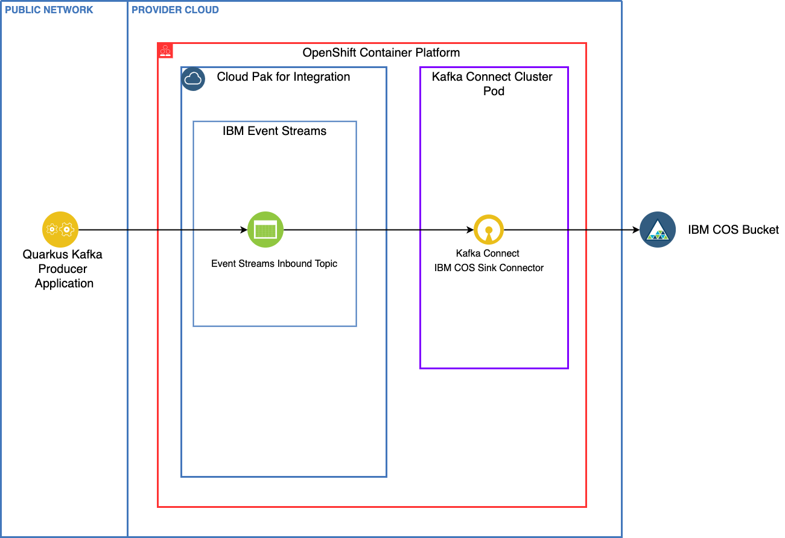

# Kafka Connect to IBM COS

!!! info
    Updated 02/22/2022

## Introduction

One of the classical use case for event driven solution based on Kafka is to keep the message for a longer time
period than the retention time of the Kafka topic. This demonstration illustrates how to do so using IBM Event Streams
and IBM Cloud Object Storage as a service.

We have created a very simple Quarkus (a super sonic and sub-atomic Kubernetes native framework for Java) application that 
uses MicroProfile Reactive Messaging in order to send a stream of data to our Event Streams/Kafka topic. 

The Kafka Connect cluster includes a IBM Cloud Object Storage Connector to grab messages fomr the topoc and 
place into an IBM COS Bucket.



### Skill level

The skill level of this learning path is for a beginner.

### Estimated time to complete

It will take you approximately 15 minuttes to complete this entire demonstration.

### Scenario Prerequisites

**OpenShift Container Platform Cluster**
  - This scenario will assume you have a 4.7+ Cluster as we will make use of Operators.

**Cloud Pak for Integration**
  - Updated with 2021.0.3 release of the Cloud Pak for Integration installed on OpenShift. 
This story will also assume you have followed the installation instructions for Event Streams
 outlined in [the 2021-3 product documentation](https://ibm.github.io/event-streams/installing/installing/) or used one of our [GitOps repository](https://github.com/ibm-cloud-architecture/eda-gitops-catalog) approach
 to deploy Event Streams Operator.

**Git**
  - We will need to clone repositories.

**An IBM Cloud Account (free)**
  - A free (Lite) IBM Cloud Object Storage trial Service account [IBM Cloud Object Storage](https://cloud.ibm.com/catalog/services/cloud-object-storage)

__If you want to modify the code then you need:__

**Java**
  - Java Development Kit (JDK) v1.11+ (Java 11+)

**Maven**
  - The scenario uses Maven v3.6.3

**Gradle**
  - Ideally v4.0+ (Note - the gradle shadowJar command might not work on Java versions newer to Java 8)

**An IDE of your choice**
  - Visual Studio Code is used in this scenario.

---

## Use Case Guided Tour

The use case is quite simple, but very common. Topic has configuration to keep messages in the kafka broker disks for a certain time perior or until the log reach a certain size.
Which means records will be removed from the brokers over time. Some companies put retention time to a value to keep data foreever. This is possible when the amount
of data in such topic is not reasonable. But most of the time we need to design solution to move data to longer persistence. S3 buckets is one of such
long term persistence as it will bring elasticity, transparent replication and geolocalization. 

An infrastructure engineer needs to prepare the Cloud Object Storage service and organize the bucket strategy to keep data. Then on the OpenShift production
cluster, Event Streams is deployed and Kafka connector cluster defined. The connector configuration will stipulate the COS connection credentials and
the Event Streams connection URL and credentials.

Once the connector is started all messages in the designated topics will go to the COS bucket. 

IBM Event Streams team has explanation of the Cloud Object Storage Sink Kafka connector configuration in [this repository](https://github.com/ibm-messaging/kafka-connect-ibmcos-sink).

---

## Full Demo Narration

### 1- Create an IBM COS Service and COS Bucket

In this section, we are going to see how to create an IBM Cloud Obeject Storage (IBM COS) Service in your IBM Cloud account and a bucket within your 
IBM COS Service. We assume you already have an IBM Cloud account and, if not, you can sign up for one here at [IBM Cloud](https://cloud.ibm.com).

1. Once you are inside your IBM Cloud account, traverse to the `Catalog` section. In the search type in `IBM Cloud Object Storage`

    

1. Name your IBM COS Service with something unique. Since this is a free account, we can stick with the `Lite Plan`.


    

1.  Now that the IBM Cloud Object Storage Service is created, create a new bucket. On the `Create Bucket` screen pick `Custom Bucket`.

    

1. When selecting options for the bucket, name your bucket something unique. For `Resiliency` let's select `Regional`. 
For location select an area from the drop-down that you want. Use `Standard` for `Storage Class`. 
Leave everything else as-is and hit `Create Bucket`.

    

### 2- Create IBM COS Service Credentials

Now that we have created our IBM Cloud Object Storage Service and bucket, we need to create the Service Credential so that Kafka connector can connect to it.

1. Inside your IBM COS Service, select `Service Credentials` and then click the `New Credential` button.

    

1. Name your credential and select `Manager` from the `Role:` drop-down menu and click `Add`.

    

1. Expand your newly created Service Credential and write down the values for `"apikey"` and `"resource_instance_id"`. 
You will need this later in the [Build and Apply IBM COS Sink Connector](#build-and-apply-ibm-cos-sink-connector) section.

    

### 3- Create a demo project


To isolate the demonstration in the OpenShift Cluster, we will deploy the demo code, event streams cluster and Kafka Connect in one project.

1. Clone the tutorial project

    ```sh
    git clone https://github.com/ibm-cloud-architecture/eda-quickstarts
    ```

1. Create an OpenShift project (k8s namespace) named: `eda-cos`

    ```sh
    oc apply -k gitOps/env/base
    ```

### 4- Deploy Event Streams Cluster

If you do not have a Event Stream cluster already deployed on OpenShift, we propose to deploy one in a demo project, using Event Streams Operator monitoring All Namespaces

1. Using [IBM entitled registry entitlement key](https://www.ibm.com/docs/en/cloud-paks/cp-integration/2020.2?topic=installation-entitled-registry-entitlement-keys) 
 define your a secret so deployment process can download IBM Event Streams images:

    ```sh
    KEY=<yourentitlementkey>
    oc create secret docker-registry ibm-entitlement-key \
        --docker-username=cp \
        --docker-password=$KEY \
        --docker-server=cp.icr.io \
        --namespace=eda-cos
    ```

1. Deploy Event Streams Cluster.
  
    ```sh
    oc apply -k gitOps/services/es 
    # --> Results
    eventstreams.eventstreams.ibm.com/dev created
    kafkatopic.eventstreams.ibm.com/edademo-orders created
    ```

    It will take sometime to get the cluster created. Monitor with `oc get pod -w`. You should get:

    ```
    dev-entity-operator-6d7d94f68f-6lk86   3/3    
    dev-ibm-es-admapi-ffd89fdf-x99lq       1/1    
    dev-ibm-es-ui-74bf84dc67-qx9kk         2/2    
    dev-kafka-0                            1/1    
    dev-zookeeper-0                        1/1
    ```

    With this deployment there is no external route, only on bootstrap URL: `dev-kafka-bootstrap.eda-cos.svc:9092`. The Kafka listener is using PLAINTEXT connection. So no SSL encryption and no authentication.

1. Deploy the existing application (the image we built is in quay.io/ibmcase) using:

    ```sh
    oc apply -k gitOps/apps/eda-cos-demo/base/
    ```

1. Test the deployed app by accessing its route and GET API: 

    ```sh
    HOST=$(oc get routes eda-cos-demo  -o jsonpath='{.spec.host}')
    curl -X GET http://$HOST/api/v1/version
    ```

### 5- Deploy Kafka Connector

We have already built a kafka connect image with the Cloud Object Storage jar and push it as image to quay.io.

1. Deploy the connector cluster by using the KafkaConnect custom resource: 

  ```sh
  oc apply -f gitOps/services/kconnect/kafka-connect.yaml
  # Verify cluster is ready
  oc get kafkaconnect
  ```

### 6- Deploy the COS sink connector

1. Create a new file named `kafka-cos-sink-connector.yaml` and past the following code in it.

    ```yaml
    apiVersion: eventstreams.ibm.com/v1alpha1
    kind: KafkaConnector
    metadata:
      name: cos-sink-connector
      labels:
        eventstreams.ibm.com/cluster: YOUR_KAFKA_CONNECT_CLUSTER_NAME
    spec:
      class: com.ibm.eventstreams.connect.cossink.COSSinkConnector
      tasksMax: 1
      config:
        key.converter: org.apache.kafka.connect.storage.StringConverter
        value.converter: org.apache.kafka.connect.storage.StringConverter
        topics: TOPIC_NAME
        cos.api.key: IBM_COS_API_KEY
        cos.bucket.location: IBM_COS_BUCKET_LOCATION
        cos.bucket.name: IBM_COS_BUCKET_NAME
        cos.bucket.resiliency: IBM_COS_RESILIENCY
        cos.service.crn: "IBM_COS_CRM"
        cos.object.records: 5
        cos.object.deadline.seconds: 5
        cos.object.interval.seconds: 5
    ```

    where:

    * `YOUR_KAFKA_CONNECT_CLUSTER_NAME`: is the name you gave previously to your Kakfa Connect cluster.
    * `TOPIC_NAME`: is the name of the topic you created in IBM Event Streams at the beginning of this lab.
    * `IBM_COS_API_KEY`: is your IBM Cloud Object Storage service credentials `apikey` value. Review first sections of this lab if you don't remember where and how to find this value.
    * `IBM_COS_BUCKET_LOCATION`: is your IBM Cloud Object Storage bucket location. Review first sections of this lab if you don't remember where and how to find this value (it usually is in the form of something like `us-east` or `eu-gb` for example).
    * `IBM_COS_RESILIENCY`: is your IBM Cloud Object Storage resiliency option. Review first sections of this lab if you don't remember where and how to find this value (it should be `regional`).
    * `IBM_COS_CRM`: is your IBM Cloud Object Storage CRN. Review first sections of this lab if you don't remember where and how to find this value. It usually ends with a double `::` at the end of it. **IMPORTANT:** you might need to retain the double quotation marks here as the CRN has colons in it and may collide with yaml syntax.

1. Apply the yaml which will create a `KafkaConnnector` custom resource behind the scenes and register/set up the IBM COS Sink Connector in your Kafka Connect cluster.

    ```shell
    oc apply -f kafka-cos-sink-connector.yaml
    ```

1. The initialization of the connector can take a minute or two. You can check the status of the connector to see if everything connected succesfully.

    ```shell
    oc describe kafkaconnector cos-sink-connector
    ```

1. When the IBM COS Sink connector is successfully up and running you should see something similar to the below.

    

1. You should also see a new connector being registered if you exec into the Kafka Connect cluster pod and query for the existing connectors again:

    ```shell
    oc exec -it YOUR_KAFKA_CONNECT_CLUSTER_NAME-connect-2-xxxxx bash
    bash-4.4$ curl localhost:8083/connectors
    ["cos-sink-connector"]
    ```
    
### 7- Test by sending some records

1. Post 10 orders:

    ```sh
    curl -X POST  'http://$HOST/api/v1/start'   -H 'accept: application/json' -H 'Content-Type: application/json' -d '10'
  ```

1. Verify whether the messages from the IBM Event Streams topic are getting propagated to your IBM Cloud Object Storage bucket. 
If you go to your IBM COS bucket, you should find some files in it. The name of the file inside the bucket has starting offset and ending offset. 
You can download one of these object files to make sure that the value inside matches the value inside your `INBOUND` topic.

    


## Developer Corner

The https://github.com/ibm-cloud-architecture/eda-quickstarts.git cos-tutorial folder includes a microprofile reactive messaging producer app
basd on quarkus runtime.

You have two choices for this application, reuse the existing code as-is or start by using quarkus CLI.

* Clone the `eda-quickstarts` repository.

  ```bash
  git clone  https://github.com/ibm-cloud-architecture/eda-quickstarts.git
  cd cos-tutorial
  quarkus dev
  ```

* If you want to start on your own, then create the Quarkus project.

  ```bash
  quarkus create app cos-tutorial 
  cd cos-tutorial 
  quarkus ext add  reactive-messaging-kafka, mutiny, openshift
  ```

  and get inspiration from the [DemoController.java](https://github.com/ibm-cloud-architecture/eda-quickstarts/blob/main/cos-tutorial/src/main/java/ibm/eda/demo/kafka/producer/DemoController.java).

* Review the `DemoController.java` file.

    * The `@Channel` annotation indicates that we're sending to a channel defined with reactive messaging in the application.properties.
    * The `startDemo()` function generate n orders and send to the channel.

* The reactive messaging is defined in the `application.properties`. The setting are using
the a kafka cluster named `dev`, we encourage to keep this name or you need to modify a lot of
yaml files.
* See the [COS tutorial README](https://github.com/ibm-cloud-architecture/eda-quickstarts/tree/main/cos-tutorial#readme) 
to run the producer application locally with docker compose or quarkus dev.
