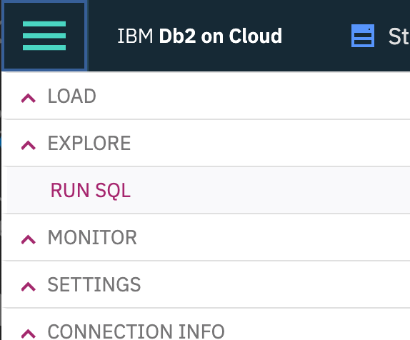
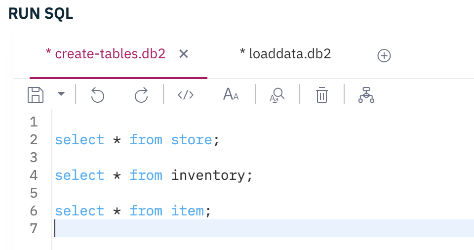
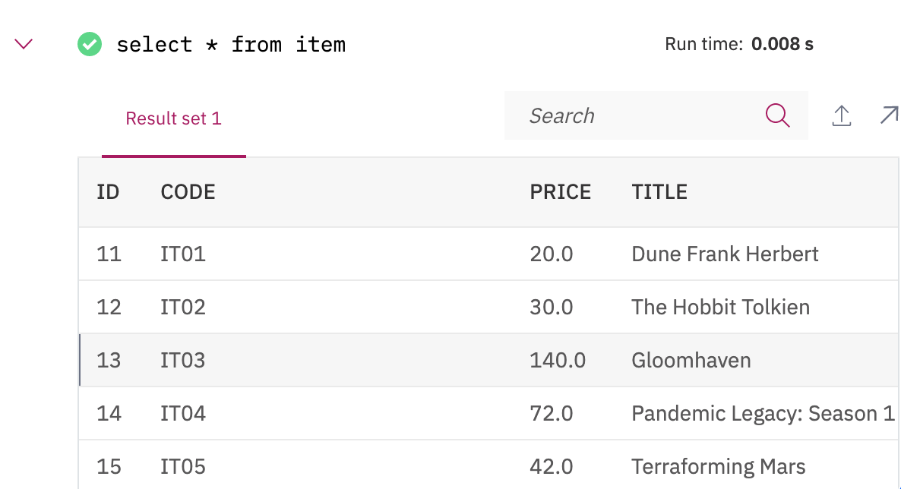
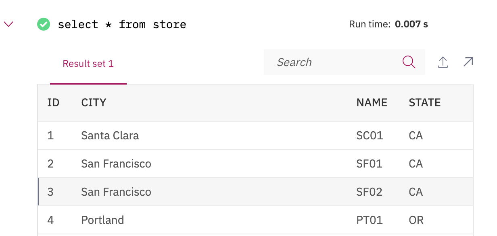

!!! info
    Updated 11/03/2020. Lab works with one small issue needs to be fixed in test or jdbc connector.


This scenario is using the [IBM Kafka Connect sink connector for JDBC](https://github.com/ibm-messaging/kafka-connect-jdbc-sink) to get data from a kafka topic and write records to the `inventory` table in DB2. This lab explain the definition of the connector and how to run an integration test that sends data to the inventory topic.

## Pre-requisites

_Pull in necessary pre-req context from [Realtime Inventory Pre-reqs](https://ibm-cloud-architecture.github.io/eda-rt-inventory-gitops/)._

As a pre-requisite you need to have a [DB2 instance on cloud](https://cloud.ibm.com/docs/Db2onCloud?topic=Db2onCloud-getting-started) up and running with defined credentials. From the credentials you need the username, password and the `ssljdbcurl` parameter. Something like "jdbc:db2://dashdb-tx....net:50001/BLUDB:sslConnection=true;".

1. Build and deploy the `inventory-app`. This application is a simple Java microprofile 3.3 app exposing a set of end points for CRUD operations on stores, items and inventory. It is based on [Quarkus](https:quarkus.io). The instructions to build, and deploy this app is in the [README](https://github.com/ibm-cloud-architecture/refarch-eda-inventory-app/). At the application starts, stores and items records are uploaded to the database.

1. Verify the stores and items records are loaded

  * If you deploy the `inventory-app` from previous step, then you will have the database created and populated with some stores and items automatically. If you want to drop the data use [the drop sql script](https://raw.githubusercontent.com/ibm-cloud-architecture/refarch-eda-inventory-app/master/src/main/resources/drop.sql) and then reload them the [insert sql script](https://raw.githubusercontent.com/ibm-cloud-architecture/refarch-eda-inventory-app/master/src/main/resources/import.sql) from `src/main/resources` folder. For that you can use the `Run sql` menu in the DB2 console:

  

  Select the database schema matching the username used as credential, and then open the SQL editor:

  

  Verify the items with `select * from items;`

   

  Verify the stores with `select * from stores;`

  

  The inventory has one record to illustrate the relationship between store, item and inventory.

## Run the Kafka Connector in distributed mode

In the [refarch-eda-tools repository](https://github.com/ibm-cloud-architecture/refarch-eda-tools) the `labs/jdbc-sink-lab` folder includes a docker compose file to run the lab with kafka broker, zookeeper, the kafka connector running in distrbuted mode and an inventory app to get records from DB.

```shell
# 
docker-compose up -d
```

## Upload the DB2 sink definition

Update the file `db2-sink-config.json` with the DB2 server URL, DB2 username and password. The DB schema matches the user name, so update this setting for the `table.name.format` with the username.

```json
  "name": "jdbc-sink-connector",
  "config": {
    "connector.class": "com.ibm.eventstreams.connect.jdbcsink.JDBCSinkConnector",
    "tasks.max": "1",
    "topics": "inventory",
    "connection.url": "jdbc:db2://....services.dal.bluemix.net:50001/BLUDB:sslConnection=true;",
    "connection.user": "<username>",
    "connection.password": "<password>",
    "connection.ds.pool.size": "1",
    "insert.mode.databaselevel": "true",
    "table.name.format": "<username>.INVENTORY"
  }
```

Once done, you can run the `./sendJdbcSinkConfig.sh <url-kafka-connect>` to upload the above definition to the Kafka connect controller. When running locally the command is `./sendJdbcSinkConfig.sh localhost:8083`. This script delete previously define connector with the same name, and then perform a POST operation on the `/connectors` end point.

The connector trace should have something like:

```logs
connector.class = com.ibm.eventstreams.connect.jdbcsink.JDBCSinkConnector
 	errors.log.enable = false
 	errors.log.include.messages = false
 	errors.retry.delay.max.ms = 60000
 	errors.retry.timeout = 0
 	errors.tolerance = none
 	header.converter = null
 	key.converter = null
 	name = jdbc-sink-connector
 	tasks.max = 1
 	transforms = []
 	value.converter = null

```

## Generate some records

The `integration-tests` folder includes a set of python code to load some records to the expected topic.

1. Start a python environment with `./startPython.sh`
1. Within the bash, start python to execute the  `ProduceInventoryEvent.py` script, and specify the number of records to send via the --size argument.

    ```sh
    python ProduceInventoryEvent.py --size 2  
    ```

1. The trace should have something like

    ```shell
    Produce to the topic inventory

    ending -> {'schema': {'type': 'struct', 'fields': [{'type': 'string', 'optional': False, 'field': 'storeName'}, {'type': 'string', 'optional': False, 'field': 'sku'}, {'type': 'decimal', 'optional': False, 'field': 'id'}, {'type': 'decimal', 'optional': True, 'field': 'quantity'}, {'type': 'decimal', 'optional': True, 'field': 'price'}, {'type': 'string', 'optional': True, 'field': 'timestamp'}], 'optional': False, 'name': 'Inventory'}, 'payload': {'storeName': 'Store_1', 'sku': 'Item_1', 'quantity': 16, 'price': 128, 'id': 0, 'timestamp': '05-Nov-2020 22:31:11'}}
    sending -> {'schema': {'type': 'struct', 'fields': [{'type': 'string', 'optional': False, 'field': 'storeName'}, {'type': 'string', 'optional': False, 'field': 'sku'}, {'type': 'decimal', 'optional': False, 'field': 'id'}, {'type': 'decimal', 'optional': True, 'field': 'quantity'}, {'type': 'decimal', 'optional': True, 'field': 'price'}, {'type': 'string', 'optional': True, 'field': 'timestamp'}], 'optional': False, 'name': 'Inventory'}, 'payload': {'storeName': 'Store_1', 'sku': 'Item_8', 'quantity': 13, 'price': 38, 'id': 1, 'timestamp': '05-Nov-2020 22:31:11'}}
    ```

## Verify records are uploaded into the Inventory database

You can use two approaches to get the database, by using the inventory app or using the DB2 console, use the `select * from inventory;` SQL query to get the last records.

The swagger is visible at the address [http://localhost:8080/swagger-ui](http://localhost:8080/swagger-ui) and get to the URL [http://localhost:8080/inventory](http://localhost:8080/inventory)
