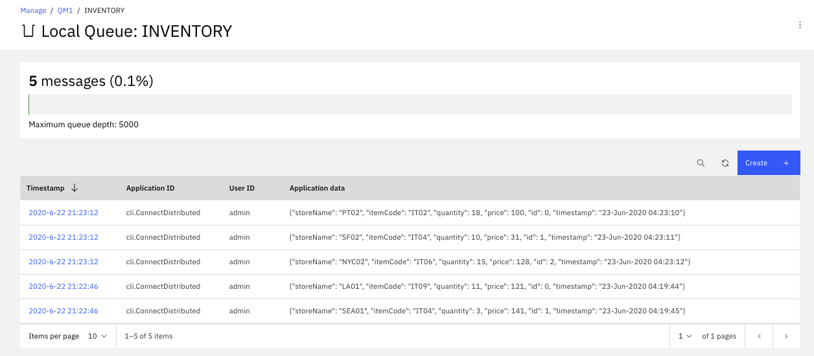

In this example we are using IBM Event Streams running on Openshift as 
the Kafka data source and different MQ deployment as the destination.

## Deploying MQ Sink Connector on virtual or baremetal server

We are using our own laptop for the baremetal dedployment, but this chapter will work the same on virtual server.

### Pre-requisites

<InlineNotification kind="warning"><strong>TODO</strong></InlineNotification>

_Pull in necessary pre-req context from [Realtime Inventory Pre-reqs](/scenarios/realtime-inventory/#general-pre-requisites)._

We assume that you have an instance of Event Streams already running on IBM Cloud with at least on manager-level credentials created.  The credentials will come in the form of a JSON document as seen in the previous section.
You will need the `kafka_brokers_sasl` and `password` atribute to configure the sink connector.

This scenario uses the `inventory` topic created in the Scenario Setup in previous section.

### Create Local IBM MQ Instance

Here we will use Docker to create a local MQ instance.  First create a data directory to mount in the container.

`mkdir qm1data`

Then create the container.

```shell
docker run                     \
  --name mq                    \
  --detach                     \
  --publish 1414:1414          \
  --publish 9443:9443          \
  --publish 9157:9157          \
  --volume qm1data:/mnt/mqm    \
  --env LICENSE=accept         \
  --env MQ_QMGR_NAME=QM1       \
  --env MQ_APP_PASSWORD=admin  \
  --env MQ_ENABLE_METRICS=true \
  ibmcom/mq
```

You should be able to log into the MQ server on port 9443 with default user `admin` and password `passw0rd`.

Connect to the running MQ instance to create a Channel and Queue as described on the [Using IBM MQ with Kafka Connect](https://github.com/ibm-messaging/kafka-connect-mq-sink/blob/master/UsingMQwithKafkaConnect.md) page.

```shell
docker exec -ti mq bash
strmqm QM1
runmqsc QM1
DEFINE CHANNEL(KAFKA.CHANNEL) CHLTYPE(SVRCONN)
SET CHLAUTH(KAFKA.CHANNEL) TYPE(BLOCKUSER) USERLIST('nobody')
SET CHLAUTH('*') TYPE(ADDRESSMAP) ADDRESS('*') USERSRC(NOACCESS)
SET CHLAUTH(KAFKA.CHANNEL) TYPE(ADDRESSMAP) ADDRESS('*') USERSRC(CHANNEL) CHCKCLNT(REQUIRED)
ALTER AUTHINFO(SYSTEM.DEFAULT.AUTHINFO.IDPWOS) AUTHTYPE(IDPWOS) ADOPTCTX(YES)
REFRESH SECURITY TYPE(CONNAUTH)
DEFINE QLOCAL(INVENTORY)
SET AUTHREC OBJTYPE(QMGR) PRINCIPAL('admin') AUTHADD(CONNECT,INQ)
SET AUTHREC PROFILE(INVENTORY) OBJTYPE(QUEUE) PRINCIPAL('admin') AUTHADD(ALLMQI)
END
```

Exit the session and continue on to create the MQ Connector Sink.

### Create MQ Kafka Connector Sink

The MQ Connector Sink can be downloaded from [Github](https://github.com/ibm-messaging/kafka-connect-mq-sink).  The Github site includes exhaustive instructions and an abridged version follows.

Clone the repository with the following command:

`git clone https://github.com/ibm-messaging/kafka-connect-mq-sink.git`

Change directory into the kafka-connect-mq-sink directory:

`cd kafka-connect-mq-sink`

Build the connector using Maven:

`mvn clean package`

Next, create a directory to contain the Kafka Connector configuration.

`mkdir config && cd config`

Create a configuration file called `connect-distributed.properties` for Kafka Connect based on the template below.

```properties
# A list of host/port pairs to use for establishing the initial connection to the Kafka cluster.
bootstrap.servers=broker-1- ... kafka.svc01.us-east.eventstreams.cloud.ibm.com:9093,broker-0- ... kafka.svc01.us-east.eventstreams.cloud.ibm.com:9093,broker-4- ... kafka.svc01.us-east.eventstreams.cloud.ibm.com:9093,broker-2- ... kafka.svc01.us-east.eventstreams.cloud.ibm.com:9093,broker-5- ... kafka.svc01.us-east.eventstreams.cloud.ibm.com:9093,broker-3- ... kafka.svc01.us-east.eventstreams.cloud.ibm.com:9093
ssl.enabled.protocols=TLSv1.2
ssl.protocol=TLS
security.protocol=SASL_SSL
sasl.mechanism=PLAIN
sasl.jaas.config=org.apache.kafka.common.security.plain.PlainLoginModule required username="token" password="bA ... Qp";

# Consumer side configuration
consumer.bootstrap.servers=broker-1- ... kafka.svc01.us-east.eventstreams.cloud.ibm.com:9093,broker-0- ... kafka.svc01.us-east.eventstreams.cloud.ibm.com:9093,broker-4- ... kafka.svc01.us-east.eventstreams.cloud.ibm.com:9093,broker-2- ... kafka.svc01.us-east.eventstreams.cloud.ibm.com:9093,broker-5- ... kafka.svc01.us-east.eventstreams.cloud.ibm.com:9093,broker-3- ... kafka.svc01.us-east.eventstreams.cloud.ibm.com:9093
consumer.security.protocol=SASL_SSL
consumer.ssl.protocol=TLSv1.2
consumer.sasl.mechanism=PLAIN
consumer.sasl.jaas.config=org.apache.kafka.common.security.plain.PlainLoginModule required username="token" password="bA ... Qp";

# Producer Side
producer.security.protocol=SASL_SSL
producer.ssl.protocol=TLSv1.2
producer.sasl.mechanism=PLAIN
producer.sasl.jaas.config=org.apache.kafka.common.security.plain.PlainLoginModule required username="token" password="bA ... Qp";
producer.bootstrap.servers=broker-1- ... kafka.svc01.us-east.eventstreams.cloud.ibm.com:9093,broker-0- ... kafka.svc01.us-east.eventstreams.cloud.ibm.com:9093,broker-4- ... kafka.svc01.us-east.eventstreams.cloud.ibm.com:9093,broker-2- ... kafka.svc01.us-east.eventstreams.cloud.ibm.com:9093,broker-5- ... kafka.svc01.us-east.eventstreams.cloud.ibm.com:9093,broker-3- ... kafka.svc01.us-east.eventstreams.cloud.ibm.com:9093


plugin.path=/opt/kafka/libs

# unique name for the cluster, used in forming the Connect cluster group. Note that this must not conflict with consumer group IDs
group.id=mq-sink-cluster

# The converters specify the format of data in Kafka and how to translate it into Connect data. Every Connect user will
# need to configure these based on the format they want their data in when loaded from or stored into Kafka
key.converter=org.apache.kafka.connect.json.JsonConverter
value.converter=org.apache.kafka.connect.json.JsonConverter
# Converter-specific settings can be passed in by prefixing the Converter's setting with the converter we want to apply
# it to
key.converter.schemas.enable=true
value.converter.schemas.enable=true

# Topic to use for storing offsets. T
offset.storage.topic=connect-offsets
offset.storage.replication.factor=3
#offset.storage.partitions=25

# Topic to use for storing connector and task configurations; note that this should be a single partition, highly replicated, and compacted topic.
config.storage.topic=connect-configs
config.storage.replication.factor=3

# Topic to use for storing statuses. This topic can have multiple partitions and should be replicated and compacted.
status.storage.topic=connect-status
status.storage.replication.factor=3
status.storage.partitions=5

# Flush much faster than normal, which is useful for testing/debugging
offset.flush.interval.ms=10000
```

Save this file in the `config` directory.

Next, create a log4j configuration file named `connect-log4j.properties` based on the template below.

```properties
log4j.rootLogger=DEBUG, stdout

log4j.appender.stdout=org.apache.log4j.ConsoleAppender
log4j.appender.stdout.layout=org.apache.log4j.PatternLayout
log4j.appender.stdout.layout.ConversionPattern=[%d] %p %m (%c:%L)%n

log4j.logger.org.apache.kafka=INFO
```

Save this file to the `config` directory as well.

Finally, create a JSON configuraiton file for the MQ sink.  This can be stored anywhere but it can be conveniently created in the `config` directory.  We name this file `mq-sink.json`.

```json
{
    "name": "mq-sink",
    "config":
    {
        "connector.class": "com.ibm.eventstreams.connect.mqsink.MQSinkConnector",
        "tasks.max": "1",
        "topics": "inventory",

        "key.converter": "org.apache.kafka.connect.storage.StringConverter",
        "value.converter": "org.apache.kafka.connect.storage.StringConverter",

        "mq.queue.manager": "QM1",
        "mq.connection.name.list": "mq(1414)",
        "mq.user.name": "admin",
        "mq.password": "passw0rd",
        "mq.user.authentication.mqcsp": true,
        "mq.channel.name": "KAFKA.CHANNEL",
        "mq.queue": "INVENTORY",
        "mq.message.builder": "com.ibm.eventstreams.connect.mqsink.builders.DefaultMessageBuilder"
    }
}
```

Back out one directory to the `kafka-connect-mq-sink` directory.

`cd ..`

Build docker image
`docker build -t kafkaconnect-with-mq-sink:1.3.0 .`

Finally, run the Kafka Connect MQ Sink container.

```
docker run                                 \
  --name mq-sink                           \
  --detach                                 \
  --volume $(pwd)/config:/opt/kafka/config \
  --publish 8083:8083                      \
  --link mq:mq                             \
  kafkaconnect-with-mq-sink:1.3.0
```

You should now have a working MQ sink.

As an alternate approach, when you have a Kafka Connect isntance up and running, with the dependant jar files, it is possible to configure the connector with a POST operation like:

```Shell
curl -X POST -H "Content-Type: application/json" http://localhost:8083/connectors   --data "@./mq-sink.json"

# The response returns the metadata about the connector
{"name":"mq-sink","config":{"connector.class":"com.ibm.eventstreams.connect.mqsink.MQSinkConnector","tasks.max":"1","topics":"inventory","key.converter":"org.apache.kafka.connect.storage.StringConverter","value.converter":"org.apache.kafka.connect.storage.StringConverter","mq.queue.manager":"QM1","mq.connection.name.list":"ibmmq(1414)","mq.user.name":"admin","mq.password":"passw0rd","mq.user.authentication.mqcsp":"true","mq.channel.name":"KAFKA.CHANNEL","mq.queue":"INVENTORY","mq.message.builder":"com.ibm.eventstreams.connect.mqsink.builders.DefaultMessageBuilder","name":"mq-sink"},"tasks":[{"connector":"mq-sink","task":0}],"type":"sink"}
```

Once the connector is up and running, we can use some tool to send inventory message. In the `integration-tests` folder we have some python code to produce message. If you have a python environment with kafka api you can use yours, or we have also provided a Dockerfile to prepare a local python environment, which will not impact yours.

```shell
# if you change the name of the image
docker build -t ibmcase/python37 .
# ... then update the script ./startPython.sh
./startPython.sh
# Now in the new bash session you should see ProduceInventoryEvent.py,... start it by sending 2 events
python ProduceInventoryEvent.py --size 2
# Events are random but use stores and items known by the database downstream.
 sending -> {'storeName': 'NYC01', 'itemCode': 'IT06', 'quantity': 15, 'price': 163, 'id': 1, 'timestamp': '23-Jun-2020 04:32:38'}
# the following trace demonstrates Kafka received the message
[KafkaProducer] - Message delivered to inventory [0]
sending -> {'storeName': 'SC01', 'itemCode': 'IT06', 'quantity': 15, 'price': 178, 'id': 2, 'timestamp': '23-Jun-2020 04:32:38'}
[KafkaProducer] - Message delivered to inventory [0]
```

In the Kafka Connect trace we can see:

```shell
kconnect_1  | [2020-06-23 04:23:16,270] INFO WorkerSinkTask{id=mq-sink-0} Committing offsets asynchronously using sequence number 26: {inventory-0=OffsetAndMetadata{offset=44, leaderEpoch=null, metadata=''}} (org.apache.kafka.connect.runtime.WorkerSinkTask:349)
kconnect_1  | [2020-06-23 04:32:46,382] INFO WorkerSinkTask{id=mq-sink-0} Committing offsets asynchronously using sequence number 83: {inventory-0=OffsetAndMetadata{offset=48, leaderEpoch=null, metadata=''}} (org.apache.kafka.connect.runtime.WorkerSinkTask:349)
```

And in the IBM MQ Console, under the Local Queue: Inventory we can see the messages:



To remove the connector do the following command. Do this specially if you go to scenario 2 next.

```shell
curl -X DELETE http://localhost:8083/connectors/mq-sink
```

## Deploying MQ Sink Connector to OpenShift
 We could have used MQ broker as part of Cloud Pak for integration or [as a service in IBM Cloud](https://cloud.ibm.com/docs/mqcloud/index.html).
### Prerequisites

We are assuming you already have an instance of IBM EventStreams running on IBM Cloud from previous scenarios.  Also, we assume you have a running instance of OpenShift with a project created to run the MQ Sink.  Finally, we assume you're familiar with OpenShift and Kubernetes and know how to work with the configuration files provided below.

### MQ on OpenShift

Strictly speaking you don't need to move the instance of MQ previously used onto OpenShift for the MQ Sink to work however the configuration to do so is provided.  Note that this is not a production configuration and is intended for POC purposes only.

Create a ConfigMap on OpenShift with the following definition:

```yaml
kind: ConfigMap
apiVersion: v1
metadata:
  name: mq-config
  namespace: mq-demo
data:
    LICENSE: accept
    MQ_QMGR_NAME: QM1
    MQ_APP_PASSWORD: admin
    MQ_ENABLE_METRICS: "true"
```

This will make it easier to update the MQ configuration if needed without editing everything in the Pod definition.

Next, create the MQ Pod with the following definition:

```yaml
apiVersion: v1
kind: Pod
metadata:
  name: ibm-mq
  labels:
    app: mq-kafka-sink-demo-app
  namespace: mq-demo
spec:
  containers:
    - name: ibm-mq
      image: ibmcom/mq
      ports:
        - containerPort: 1414
          protocol: TCP
        - containerPort: 9443
          protocol: TCP
        - containerPort: 9157
          protocol: TCP
      envFrom:
        - configMapRef:
            name: mq-config
```

Next, define a Service to point to the MQ Pod.

```yaml
apiVersion: v1
kind: Service
metadata:
  name: mq-service
  namespace: mq-demo
spec:
  selector:
    app: mq-kafka-sink-demo-app
  ports:
    - name: mq-port
      protocol: TCP
      port: 1414
      targetPort: 1414
    - name: mq-portal
      protocol: TCP
      port: 9443
      targetPort: 9443
    - name: mq-dunno
      protocol: TCP
      port: 9157
      targetPort: 9157
```

Finally, define a Route to be able to access the admin UI.

```yaml
kind: Route
apiVersion: route.openshift.io/v1
metadata:
  name: mq-route
  namespace: mq-demo
spec:
  host: ibmmq.bnpp.apps.openshift.proxmox.lab
  to:
    kind: Service
    name: mq-service
    weight: 100
  port:
    targetPort: mq-portal
  tls:
    termination: passthrough
    insecureEdgeTerminationPolicy: Redirect
  wildcardPolicy: None
```

You will want to connect to the container and run the setup commands as described in a previous scenario.  At this point, IBM MQ should be running and available on OpenShift.

To run the Kafka Connect MQ Sink on OpenShift or any container platform, you will need to build a container that has Kafka installed as well as the MQ Sink and proper configuration.  Typically we would use the Strimzi containerized Kafka solution to run on OpenShift, but in this case to illustrate all the components we are building a container from scratch.  The following is the Dockerfile:

```Dockerfile
FROM ubuntu:20.04

ADD https://mirrors.koehn.com/apache/kafka/2.5.0/kafka_2.12-2.5.0.tgz /tmp/

RUN apt update                                                                                                     && \
    apt install -y curl git maven                                                                                  && \
    tar -C /opt -xvf /tmp/kafka_2.12-2.5.0.tgz                                                                     && \
    rm -f /tmp/kafka_2.12-2.5.0.tgz                                                                                && \
    ln -s /opt/kafka_2.12-2.5.0 /opt/kafka                                                                         && \
    mv -f /opt/kafka/config/connect-distributed.properties /opt/kafka/config/connect-distributed.properties.bak    && \
    cd /opt                                                                                                        && \
    git clone https://github.com/ibm-messaging/kafka-connect-mq-sink.git                                           && \
    cd /opt/kafka-connect-mq-sink                                                                                  && \
    mvn clean package                                                                                              && \
    ln -s /opt/kafka-connect-mq-sink/target/kafka-connect-mq-sink-1.3.0-jar-with-dependencies.jar /opt/kafka/libs/ && \
    mv -f /opt/kafka-connect-mq-sink/config/mq-sink.json /opt/kafka-connect-mq-sink/config/mq-sink.json.bak

COPY connect-distributed.properties /opt/kafka/config/connect-distributed.properties
COPY mq-sink-connector-config.json /opt/kafka-connect-mq-sink/config/mq-sink.json
COPY entrypoint.sh /entrypoint.sh

ENTRYPOINT ["/entrypoint.sh"]
```

We start with a vanilla Linux container, install the binary distribution of Kafka for Linux, clone the MQ Sink repository from Github, build the MQ Sink, and finally copy in some template files.  Finally the container runs a custom entrypoint script as shown below:

```shell
#!/bin/sh

set -x

sed -i "s/KAFKA_BOOTSTRAP_SERVERS/${KAFKA_BOOTSTRAP_SERVERS}/g" /opt/kafka/config/connect-distributed.properties
sed -i "s/KAFKA_API_KEY/${KAFKA_API_KEY}/g"                     /opt/kafka/config/connect-distributed.properties


sed -i "s/KAFKA_TOPICS/${KAFKA_TOPICS}/g"         /opt/kafka-connect-mq-sink/config/mq-sink.json
sed -i "s/MQ_QUEUE_MANAGER/${MQ_QUEUE_MANAGER}/g" /opt/kafka-connect-mq-sink/config/mq-sink.json
sed -i "s/MQ_HOST/${MQ_HOST}/g"                   /opt/kafka-connect-mq-sink/config/mq-sink.json
sed -i "s/MQ_PORT/${MQ_PORT}/g"                   /opt/kafka-connect-mq-sink/config/mq-sink.json
sed -i "s/MQ_USER/${MQ_USER}/g"                   /opt/kafka-connect-mq-sink/config/mq-sink.json
sed -i "s/MQ_PASSWORD/${MQ_PASSWORD}/g"           /opt/kafka-connect-mq-sink/config/mq-sink.json
sed -i "s/MQ_CHANNEL/${MQ_CHANNEL}/g"             /opt/kafka-connect-mq-sink/config/mq-sink.json
sed -i "s/MQ_QUEUE/${MQ_QUEUE}/g"                 /opt/kafka-connect-mq-sink/config/mq-sink.json

/opt/kafka/bin/connect-distributed.sh /opt/kafka/config/connect-distributed.properties &

sleep 60
curl -X DELETE -H "Content-Type: application/json" http://localhost:8083/connectors/mq-sink-connector
curl -X POST -H "Content-Type: application/json" http://localhost:8083/connectors --data "@/opt/kafka-connect-mq-sink/config/mq-sink.json"

tail -f /dev/null
```

Again this is not a production-ready entrypoint container script; it's intended for POC purposes.  The script updates the template files copied into the container with values from the environment (either `--env` using Docker, or from a `ConfigMap` in OpenShift) and then starts Kafka Connect in distributed mode.  It pauses the script for 1 minute to let Kafka Connect start, then finally activates the MQ Sink by POSTing the MQ Sink configuration using `cURL`.

The two template configuration files that are copied into the container are shown below.

### connect-distributed.properties:

```shell
# A list of host/port pairs to use for establishing the initial connection to the Kafka cluster.
bootstrap.servers=KAFKA_BOOTSTRAP_SERVERS
ssl.enabled.protocols=TLSv1.2
ssl.protocol=TLS
security.protocol=SASL_SSL
sasl.mechanism=PLAIN
sasl.jaas.config=org.apache.kafka.common.security.plain.PlainLoginModule required username="token" password="KAFKA_API_KEY";

# Consumer side configuration
consumer.bootstrap.servers=KAFKA_BOOTSTRAP_SERVERS
consumer.security.protocol=SASL_SSL
consumer.ssl.protocol=TLSv1.2
consumer.sasl.mechanism=PLAIN
consumer.sasl.jaas.config=org.apache.kafka.common.security.plain.PlainLoginModule required username="token" password="KAFKA_API_KEY";

# Producer Side
producer.bootstrap.servers=KAFKA_BOOTSTRAP_SERVERS
producer.security.protocol=SASL_SSL
producer.ssl.protocol=TLSv1.2
producer.sasl.mechanism=PLAIN
producer.sasl.jaas.config=org.apache.kafka.common.security.plain.PlainLoginModule required username="token" password="KAFKA_API_KEY";

plugin.path=/opt/kafka/libs

# unique name for the cluster, used in forming the Connect cluster group. Note that this must not conflict with consumer group IDs
group.id=mq-sink-cluster

# The converters specify the format of data in Kafka and how to translate it into Connect data. Every Connect user will
# need to configure these based on the format they want their data in when loaded from or stored into Kafka
key.converter=org.apache.kafka.connect.json.JsonConverter
value.converter=org.apache.kafka.connect.json.JsonConverter
# Converter-specific settings can be passed in by prefixing the Converter's setting with the converter we want to apply
# it to
key.converter.schemas.enable=true
value.converter.schemas.enable=true

# Topic to use for storing offsets. This topic should have many partitions and be replicated and compacted.
# Kafka Connect will attempt to create the topic automatically when needed, but you can always manually create
# the topic before starting Kafka Connect if a specific topic configuration is needed.
# Most users will want to use the built-in default replication factor of 3 or in some cases even specify a larger value.
# Since this means there must be at least as many brokers as the maximum replication factor used, we'd like to be able
# to run this example on a single-broker cluster and so here we instead set the replication factor to 1.
offset.storage.topic=connect-offsets
offset.storage.replication.factor=3
#offset.storage.partitions=25

# Topic to use for storing connector and task configurations; note that this should be a single partition, highly replicated,
# and compacted topic. Kafka Connect will attempt to create the topic automatically when needed, but you can always manually create
# the topic before starting Kafka Connect if a specific topic configuration is needed.
# Most users will want to use the built-in default replication factor of 3 or in some cases even specify a larger value.
# Since this means there must be at least as many brokers as the maximum replication factor used, we'd like to be able
# to run this example on a single-broker cluster and so here we instead set the replication factor to 1.
config.storage.topic=connect-configs
config.storage.replication.factor=3

# Topic to use for storing statuses. This topic can have multiple partitions and should be replicated and compacted.
# Kafka Connect will attempt to create the topic automatically when needed, but you can always manually create
# the topic before starting Kafka Connect if a specific topic configuration is needed.
# Most users will want to use the built-in default replication factor of 3 or in some cases even specify a larger value.
# Since this means there must be at least as many brokers as the maximum replication factor used, we'd like to be able
# to run this example on a single-broker cluster and so here we instead set the replication factor to 1.
status.storage.topic=connect-status
status.storage.replication.factor=3

#status.storage.partitions=5

# Flush much faster than normal, which is useful for testing/debugging
offset.flush.interval.ms=10000
```

### mq-sink-connector-config.json:

```json
{
  "name": "mq-sink-connector",
  "config":
  {
      "connector.class": "com.ibm.eventstreams.connect.mqsink.MQSinkConnector",
      "tasks.max": "1",
      "topics": "KAFKA_TOPICS",

      "key.converter": "org.apache.kafka.connect.storage.StringConverter",
      "value.converter": "org.apache.kafka.connect.storage.StringConverter",

      "mq.queue.manager": "MQ_QUEUE_MANAGER",
      "mq.connection.name.list": "MQ_HOST(MQ_PORT)",
      "mq.user.name": "MQ_USER",
      "mq.password": "MQ_PASSWORD",
      "mq.user.authentication.mqcsp": true,
      "mq.channel.name": "MQ_CHANNEL",
      "mq.queue": "MQ_QUEUE",
      "mq.message.builder": "com.ibm.eventstreams.connect.mqsink.builders.DefaultMessageBuilder"
  }
}
```

Notice in these two files there are several capitalized variables which are replaced by the entrypoint.sh script at container startup.

To deploy the container on OpenShift, we create a `ConfigMap` with information about the IBM EventStreams on IBM Cloud instance as well as the local instance of MQ on OpenShift.

```yaml
kind: ConfigMap
apiVersion: v1
metadata:
  name: mq-kafka-sink-demo-config
  namespace: mq-demo
data:
  KAFKA_API_KEY: bA ... Qp
  KAFKA_BOOTSTRAP_SERVERS: >-
    broker-1- ... eventstreams.cloud.ibm.com:9093,broker-0- ... eventstreams.cloud.ibm.com:9093,broker-4- ... eventstreams.cloud.ibm.com:9093,broker-2- ... eventstreams.cloud.ibm.com:9093,broker-5- ... eventstreams.cloud.ibm.com:9093,broker-3- ... eventstreams.cloud.ibm.com:9093
  KAFKA_TOPICS: inventory
  MQ_HOST: mq-service
  MQ_PORT: "1414"
  MQ_USER: admin
  MQ_QUEUE_MANAGER: QM1
  MQ_PASSWORD: passw0rd
  MQ_CHANNEL: KAFKA.CHANNEL
  MQ_QUEUE: INVENTORY
```

Finally to deploy the MQ Sink container, we create a Pod definition on OpenShift:

```yaml
apiVersion: v1
kind: Pod
metadata:
  name: mq-kafka-sink-demo
  labels:
    app: mq-kafka-sink-demo-app
  namespace: mq-demo
spec:
  containers:
    - name: mq-kafka-sink-demo
      image: registry/mq-kafka-sink-demo:0.0.1
      envFrom:
        - configMapRef:
            name: mq-kafka-sink-demo-config
```

With the correct credentials for IBM EventStreams and IBM MQ, Kafka Connect should connect to both services and pull data from the EventStreams topic configured to the MQ Queue configured.  You will see signs of success in the container output (via oc logs, or in the UI):

```shell
+ curl -X POST -H Content-Type: application/json http://localhost:8083/connectors --data @/opt/kafka-connect-mq-sink/config/mq-sink.json
...
{"name":"mq-sink-connector","config":{"connector.class":"com.ibm.eventstreams.connect.mqsink.MQSinkConnector","tasks.max":"1","topics":"inventory","key.converter":"org.apache.kafka.connect.storage.StringConverter","value.converter":"org.apache.kafka.connect.storage.StringConverter","mq.queue.manager":"QM1","mq.connection.name.list":"mq-service(1414)","mq.user.name":"admin","mq.password":"passw0rd","mq.user.authentication.mqcsp":"true","mq.channel.name":"KAFKA.CHANNEL","mq.queue":"INVENTORY","mq.message.builder":"com.ibm.eventstreams.connect.mqsink.builders.DefaultMessageBuilder","name":"mq-sink-connector"},"tasks":[{"connector":"mq-sink-connector","task":0}],"type":"sink"}
...
[2020-06-23 04:26:26,054] INFO Creating task mq-sink-connector-0 (org.apache.kafka.connect.runtime.Worker:419)
...[2020-06-23 04:26:26,449] INFO Connection to MQ established (com.ibm.eventstreams.connect.mqsink.JMSWriter:229)
[2020-06-23 04:26:26,449] INFO WorkerSinkTask{id=mq-sink-connector-0} Sink task finished initialization and start (org.apache.kafka.connect.runtime.WorkerSinkTask:306)
```

You should now have the Kafka Connector MQ Sink running on OpenShift.
