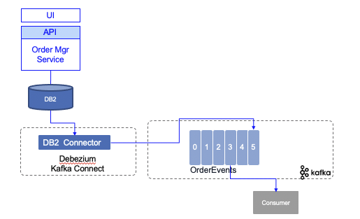
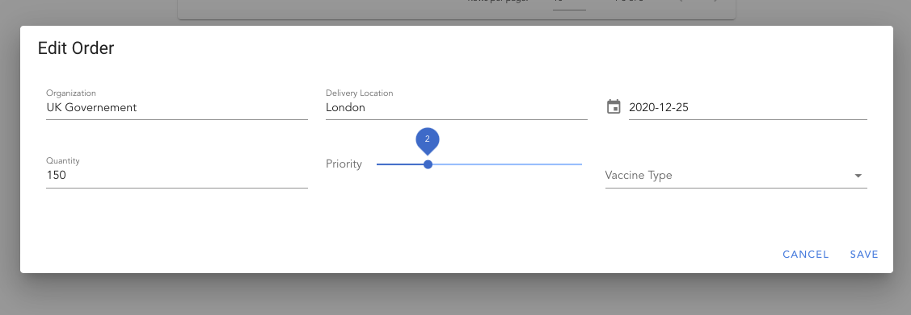

--- 
title: DB2 Change Data Capture with Debezium
description: DB2 Change Data Capture with Debezium
---

This lab goes over how to implement a change data capture on order events table created using the [outbox pattern](/patterns/intro/#transactional-outbox) with the [Debezium open source](https://debezium.io/) project.

What you will learn is:

* DB2 settings for change data capture
* Configuring Debezium DB2 connector to publish OrderEvents to Kafka topic
* Validate the Kafka topic content.

We expect existing knowledge of Kafka, and Kafka connector.

<InlineNotification kind="warning">
<strong>Updated 11/13/2020</strong> Ready for validation when running local. Need to be completed for OpenShift Deployment.
</InlineNotification>

## Quick summary of Debezium

[Debezium](https://debezium.io/) is an open source project, led by Red Hat, to support capturing changes to a database and generate those changes to Kafka. It runs in Kafka Connect so support High availability and horizontal scaling. 

To get started we recommend going into [the tutorial](https://debezium.io/documentation/reference/tutorial.html), review the [product documentation](https://debezium.io/documentation/reference/index.html) and for deeper dive you can leverage the [Debezium examples](https://github.com/debezium/debezium-examples). 


In an data pipeline architecture, Change Data Capture, helps to inject existing data from existing Database to Kafka and the event-driven microservice. It is important to note that the data generated will be close to what is in the data base, it is possible to do some data transformation to generate some 'business event' from the database updates. Or use raw data and add a Kafka Streams processing to do the data transformation. 

Debezium supports DB2 as data source as [introduced by this project](https://github.com/debezium/debezium-connector-db2). As part of the Debezium tutorial in the [Debezium examples](https://github.com/debezium/debezium-examples), you can find a docker compose to start DB2 and Debezium.

For most of development effort, we are using Docker Compose to run a basic infrastructure with Kafka and Kafka Connect. 

Once DB server and Kafka Connect are started, the approach is to register the DB connector using a json file like below. CDC uses a specific schema to keep source table update. We will detail that in next section.

 ```json
  {
    "name": "order-connector",
    "config": {
        "connector.class" : "io.debezium.connector.db2.Db2Connector",
        "tasks.max" : "1",
        "database.server.name" : "vaccine_lot_db",
        "database.hostname" : "db2",
        "database.port" : "50000",
        "database.user" : "db2inst1",
        "database.password" : "db2inst1",
        "database.dbname" : "TESTDB",
        "database.cdcschema": "ASNCDC",
        "database.history.kafka.bootstrap.servers" : "kafka:9092",
        "database.history.kafka.topic": "db_history_vaccine_orders",
        "topic.creation.default.replication.factor": 1,  
        "topic.creation.default.partitions": 1,  
        "topic.creation.default.cleanup.policy": "compact", 
        "table.include.list" : "DB2INST1.ORDEREVENTS",
        "tombstones.on.delete" : "false"
    }
  }
 ```

### DB2 connector

The  [project documentation](https://debezium.io/documentation/reference/connectors/db2.html) presents in detail this connector, but below is a quick summary of the features:

* Tables to monitor are in capture mode, so they have associated chage data table. 
* The Db2 connector reads change events from change-data tables and emits the events to Kafka topics.
* The Debezium Db2 connector is based on the [ASN Capture/Apply](https://www.ibm.com/support/pages/q-replication-and-sql-replication-product-documentation-pdf-format-version-101-linux-unix-and-windows) agents. A capture agent:
  * Generates change-data tables for tables that are in capture mode.
  * Monitors tables in capture mode and stores change events for updates to those tables in their corresponding change-data tables.
* A user defined function is needed to start or stop the ADN agent, put expected tables in capture mode, create the ASN schema abd change data tables. 
* The connector emits a change event for each row-level insert, update, and delete operation to a Kafka topic that has the same name as the changed table.
* When the Db2 connector first connects to a particular Db2 database, it starts by performing a consistent snapshot of each table that is in capture mode
* The connector keeps the log sequence number (LSN) of the change data table entry.
* Database schema is also replicated so it supports schema updates
* Each event contains the structure of its key and the payload. Or a reference for a schema registry entry.


## Use Case overview

The use case is part of a larger scenario about order vaccines management. Vaccine orders are managed by an order microservice and using the outbox pattern order created and order updated events are produced to a specific table which is captured by the Debezium connector.

 

The implementation of the outbox is done using Quarkus Debezium outbox extension and explained in [this separate note](https://ibm-cloud-architecture.github.io/vaccine-solution-main/solution/orderms/).

In this lab, you will get the component running on you computer or on OpenShift.

## Run locally

Clone the order management service:

 ```shell
 git clone https://github.com/ibm-cloud-architecture/vaccine-order-mgr
 ```

And then start the five processes (one Kafka broker, one ZooKeeper, one DB2 container for the persistence, one Kafka Connect with the Debezium code and DB2 JDBC driver and one vaccine-order-service) with Docker Compose.

 ```shell
 cd environment
 # with the option to build the db2, and debezium cdc container images
 docker-compose -f strimzi-docker-compose.yaml up -d --build
 # or with pre-existing images coming from dockerhub
 docker-compose -f strimzi-docker-compose.yaml  up -d
 ```

* Create the needed topics

```shell
  # Under environment folder
  ./createTopic.sh
  # validate topics created
  ./listTopics.sh

  __consumer_offsets
  db_history_vaccine_orders
  src_connect_configs
  src_connect_offsets
  src_connect_statuses
  vaccine_shipmentplan
```

The `db_history_vaccine_orders` is the topic used to include database schema change on the vaccine orders table. 

## Verify starting states 

To validate the DB2 settings, you can do one of the following troubleshooting commands:

```shell
# connect to DB2 server
docker exec -ti db2 bash
# Access the database 
db2 connect to TESTDB USER DB2INST1
# use db2inst1 as password
# list existing schemas
 db2 "select * from syscat.schemata"
# list tables
db2 list tables
# this is the outcomes if the order services was started
Table/View                      Schema          Type  Creation time             
------------------------------- --------------- ----- --------------------------
ORDERCREATEDEVENT               DB2INST1        T     2020-11-12-01.50.10.400490
ORDEREVENTS                     DB2INST1        T     2020-11-12-01.50.10.650172
ORDERUPDATEDEVENT               DB2INST1        T     2020-11-12-01.50.10.796566
VACCINEORDERENTITY              DB2INST1        T     2020-11-12-01.50.10.874172
# Verify the content of the current orders
db2 "select * from vaccineorderentity"
# List the table for the change data capture
db2 list tables for schema asncdc
```

The DB2 container was built to define ASNCDC schema to support table capture. The setup is described in [this note](https://debezium.io/documentation/reference/connectors/db2.html#setting-up-db2) and supported by [this script](https://github.com/ibm-cloud-architecture/vaccine-order-mgr/blob/master/environment/db2image/dbsetup.sh).

When reusing this asset, the only thing you need to configure is the [startup-cdc.sql](https://github.com/ibm-cloud-architecture/vaccine-order-mgr/blob/master/environment/db2image/startup-cdc.sql) to specify the table(s) you want to capture.

```shell
VALUES ASNCDC.ASNCDCSERVICES('status','asncdc');
CALL ASNCDC.ADDTABLE('DB2INST1', 'ORDEREVENTS' ); 
VALUES ASNCDC.ASNCDCSERVICES('reinit','asncdc');
```

and tune the content of the `register-db2.json` file to configure the Kafka Connector (see next section). 

The application may have some issue to start as DB2 may take some time to configure, so it is important to verify the containers running (if you know how to add healthcheck on DB2 container... open a PR):

```shell
docker ps 
CONTAINER ID         IMAGES                             NAMES
5ddd45b5856e        ibmcase/vaccineorderms             vaccineorderms
5bce18c820fc        ibmcase/cdc-connector              cdc-connector
7fd6951972df        strimzi/kafka:latest-kafka-2.6.0   kafka
b0f9127c874e        strimzi/kafka:latest-kafka-2.6.0   zookeeper
7f356633ea2f        ibmcase/db2orders                  db2
# Get come logs using the container name
docker logs vaccineorderms
```

If for any reason the `vaccineorderms`, doing a `docker-compose up -d` will restart the container.

You can use the User interface to get the current order loaded. At the starting time there should be only one record. [http://localhost:8080/#/Orders](http://localhost:8080/#/Orders).

 

## Define the CDC connector

Deploy and start the Debezium DB2 connector. The connector definition is in [register-db2.json](https://github.com/ibm-cloud-architecture/vaccine-order-mgr/blob/master/environment/cdc/register-db2.json). The important elements of this file are below:

```json
# the namespace for the server that will be used in the topic created
"database.server.name" : "vaccine_lot_db",
# database credentials
# The list of table to capture
  "table.include.list" : "DB2INST1.ORDEREVENTS",
# name for the topic to keep track of the database schema changes.
 "database.history.kafka.topic": "db_history_vaccine_orders",  
```

To deploy to the Kafka Connector instance, perform a POST with the previous configuration as:

 ```shell
 # under environment/cdc
 curl -i -X POST -H "Accept:application/json" -H  "Content-Type:application/json" http://localhost:8083/connectors/ -d @cdc/register-db2.json
 ```

* Get the status of the Kafka connector at:  [http://localhost:8083/connectors/orderdb-connector/](http://localhost:8083/connectors/orderdb-connector/)

* Verify the newly created topics:

```shell
  ./listTopics.sh 
  vaccine_lot_db
  vaccine_lot_db.DB2INST1.ORDEREVENTS
```

The newly created `vaccine_lot_db` topic includes definition of the database and the connector. It does not aim to be used by application. The one to be used to get business events is `vaccine_lot_db.DB2INST1.ORDEREVENTS`.

The connector is doing a snapshot of the `DB2INST1.ORDEREVENTS` table to send existing records to the topic.

## Start consumer

Start a Kafka consumer, using the console consumer tool: 

```shell
docker-compose exec kafka /opt/kafka/bin/kafka-console-consumer.sh     --bootstrap-server kafka:9092     --from-beginning     --property print.key=true     --topic db2server.DB2INST1.ORDERS
```

## Create an order

You can use the user interface to add a new order, 

 

or use the swagger operation at [http://localhost:8080/swagger-ui/#/default/post_api_v1_orders](http://localhost:8080/swagger-ui/#/default/post_api_v1_orders)

Use the following JSON:

 ```json
 {
    "deliveryDate": "2021-07-25",
    "deliveryLocation": "Milano",
    "askingOrganization": "Italy gov",
    "priority": 1,
    "quantity": 100,
    "type": "COVID-19"
 }
 ```

The expected result in the topic consumer should have the following records in the Kafka topic:

 ```json
 {"ID":"lvz4gYs/Q+aSqKmWjVGMXg=="}	
 {"before":null,"after":{"ID":"lvz4gYs/Q+aSqKmWjVGMXg==","AGGREGATETYPE":"VaccineOrderEntity","AGGREGATEID":"21","TYPE":"OrderCreated","TIMESTAMP":1605304440331350,"PAYLOAD":"{\"orderID\":21,\"deliveryLocation\":\"London\",\"quantity\":150,\"priority\":2,\"deliveryDate\":\"2020-12-25\",\"askingOrganization\":\"UK Governement\",\"vaccineType\":\"COVID-19\",\"status\":\"OPEN\",\"creationDate\":\"13-Nov-2020 21:54:00\"}"},"source":{"version":"1.3.0.Final","connector":"db2","name":"vaccine_lot_db","ts_ms":1605304806596,"snapshot":"last","db":"TESTDB","schema":"DB2INST1","table":"ORDEREVENTS","change_lsn":null,"commit_lsn":"00000000:0000150f:0000000000048fca"},"op":"r","ts_ms":1605304806600,"transaction":null}
 ```

## References

* [Outbox pattern for quarkus](https://debezium.io/documentation/reference/integrations/outbox.html)
* [Blog on the outbox pattern](https://debezium.io/blog/2019/02/19/reliable-microservices-data-exchange-with-the-outbox-pattern/)
* [Db2 Debezium connector](https://debezium.io/documentation/reference/connectors/db2.html)
