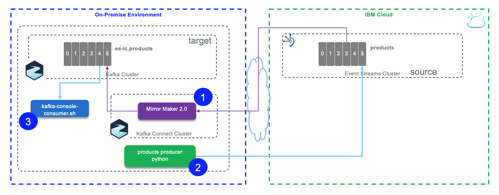

Updated 01/08/2021

## Overview

For this scenario the source cluster is an Event Streams on IBM Cloud as managed service, and the target is a local Kafka cluster running with docker compose: it simulates an on-premise deployment. The figure below presents the components used:



1. Mirror maker 2 runs in standalone mode on local server
1. A python producer write to `products` topic defined on Evenstreams on IBM Cloud 
1. A consumer using Kafka console consumer tool to validate the replicated records from the 'products' topic

As a pre-requisite you need to run your local cluster by using the docker compose as introduced in [this note](/use-cases/kafka-mm2/#pre-requisites).

## Start the local Kafka cluster

In the `refarch-eda-tools/labs/mirror-maker2/es-ic-to-local` folder there is a [docker compose file](https://raw.githubusercontent.com/refarch-eda-tools/labs/mirror-maker2/es-ic-to-local/master/docker-compose.yml) to start a local three brokers cluster with one Zookeeper node.

1. In one Terminal window, start the local cluster using the command:

```shell
docker-compose up -d
```

The data are persisted on the local disk within the folder named `kafka-data`.

Your local environment is up and running.

## Start Mirror Maker 2

1. Rename the `.env-tmpl` file to `.env`
1. From Event Streams on Cloud > Service Credentials, get the brokers address and the APIKEY. If needed read [this note](/technology/event-streams/security/#authentication-with-api-keys).
1. If not done already, create a `products` topic (with one partition) in the EventStreams on Cloud cluster using the management console. See [this note](/technology/event-streams/es-cloud/#create-topic) if needed, to see how to do it.
1. Modify this `.env` file to set environment variables for Source Event Streams cluster brokers address and APIKEY.

 ```shell
 ES_IC_BROKERS=broker-0-q.....cloud.ibm.com:9093
 ES_IC_USER=token
 ES_IC_PASSWORD="<replace with apikey from event streams service credentials>"
 ES_IC_SASL_MECHANISM=PLAIN
 ES_IC_LOGIN_MODULE=org.apache.kafka.common.security.plain.PlainLoginModule
 ```
1. To configure Mirror Maker 2 in standalone mode, we need to define a `mm2.properties` file. We have define a template file which will be used by the script that launch Mirror Maker 2. The template looks like the following declaration:
 
    ```properties
    clusters=es-ic, target
    es-ic.bootstrap.servers=KAFKA_SOURCE_BROKERS
    target.bootstrap.servers=KAFKA_TARGET_BROKERS

    es-ic.security.protocol=SASL_SSL
    es-ic.ssl.protocol=TLSv1.2
    es-ic.ssl.endpoint.identification.algorithm=https
    es-ic.sasl.mechanism=SOURCE_KAFKA_SASL_MECHANISM
    es-ic.sasl.jaas.config=SOURCE_LOGIN_MODULE required username=KAFKA_SOURCE_USER password=KAFKA_SOURCE_PASSWORD;
    sync.topic.acls.enabled=false
    replication.factor=1
    internal.topic.replication.factor=1
    es-ic.offset.storage.topic=mm2-cluster-offsets
    es-ic.configs.storage.topic=mm2-cluster-configs
    es-ic.status.storage.topic=mm2-cluster-status
    # enable and configure individual replication flows
    es-ic->target.enabled=true
    es-ic->target.topics=products
    ```
    
  A lot of those properties are for the security settings. The `clusters` property defines the alias name for the source to target, and then the `es-ic->target.*` properties define the topic to replicate...

1. Start Mirror Maker2 using the launch script:

    ```shell
    # In the  es-ic-to-local folder
    ./launchMM2.sh
    ```

    This script updates the properties file from the environment variables defined in the `.env` file and starts a Kafka container with a command very similar as:

    ```shell
     docker run -ti --network es-ic-to-local_default -v $(pwd):/home -v $(pwd)/mirror-maker-2/logs:/opt/kafka/logs strimzi/kafka:latest-kafka-2.6.0 /bin/bash -c "/opt/kafka/bin/connect-mirror-maker.sh /home/mirror-maker-2/es-to-local/mm2.properties"
    ```

    The `mm2.properties` file is mounted in the `/home` within the container. 
    *The network argument is important to get the host names resolved and the connector to connect to Kafka Brokers*

1. Verify the MM2 topics are created:

 ```shell
 docker exec -ti kafka1 /bin/bash -c "/opt/kafka/bin/kafka-topics.sh --bootstrap-server kafka1:9091 --list"

  __consumer_offsets
  es-ic.checkpoints.internal
  es-ic.products
  es-ic.source.heartbeats
  heartbeats
  mm2-configs.es-ic.internal
  mm2-offsets.es-ic.internal
  mm2-status.es-ic.internal
 ```

### Understanding MirrorMaker 2 trace 

A lot of configuration validation at the beginning of the trace to get the connection to both clusters. Any configuration issue to define the connection is generally well reported. URL, TLS certificate, secrets are the common cause of connection issues.

If some messages happen with NO_LEADER for one of the topics, this means MM2 is not able to create the topic on the target cluster and so it is needed to create the topic with command or User Interface.

Then we can observe the following:
 * It creates a producer to the target cluster for the offsets topics: ` [Producer clientId=producer-1] Cluster ID: Bj7Ui3UPQaKtJx7HOkWxPw`
 * It creates consumer for the 25 offset topic partitions: `[Consumer clientId=consumer-mirrormaker2-cluster-1, groupId=mirrormaker2-cluster] Subscribed to partition(s): mirrormaker2-cluster-offsets-0,....`
 * One Kafka connect worker is started: `Worker started ... Starting KafkaBasedLog with topic mirrormaker2-cluster-status`
 * Create a producer and consumers for the ` mirrormaker2-cluster-status` topic for 5 partitions
 * Create another producer and consumer for the `mirrormaker2-cluster-config` topic

 * Create WorkerSourceTask{id=es-1->es-ic.MirrorHeartbeatConnector-0} is the connector - task for the internal HeartBeat.
 * WorkerSourceTask{id=es-1->es-ic.MirrorSourceConnector-0} for the topic to replicate

## Start consumer from target cluster

Use Apache Kafka tool like Console consumer to trace the message received on a topic

```shell
docker exec -ti kafka2 bash -c "/opt/kafka/bin/kafka-console-consumer.sh --bootstrap-server kafka1:9091 --topic es-ic.products --from-beginning" 
```

## Start Producer to source cluster

We are reusing a python environment as defined in the integration tests for the 'kcontainer' solution. [https://hub.docker.com/r/ibmcase/kcontainer-python](https://hub.docker.com/r/ibmcase/kcontainer-python).

This time the script is producing products data. Here are the steps to send 5 records.

```shell
# in the es-ic-to-local folder
./sendProductRecords.sh
```

The traces should look like:

```
[KafkaProducer] - {'bootstrap.servers': 'broker-0-qnprtqnp7hnkssdz.kafka.svc01.us-east.eventstreams.cloud.ibm.com:9093,broker-1-qnprtqnp7hnkssdz.kafka.svc01.us-east.eventstreams.cloud.ibm.com:9093,broker-2-qnprtqnp7hnkssdz.kafka.svc01.us-east.eventstreams.cloud.ibm.com:9093,broker-3-qnprtqnp7hnkssdz.kafka.svc01.us-east.eventstreams.cloud.ibm.com:9093,broker-4-qnprtqnp7hnkssdz.kafka.svc01.us-east.eventstreams.cloud.ibm.com:9093,broker-5-qnprtqnp7hnkssdz.kafka.svc01.us-east.eventstreams.cloud.ibm.com:9093', 'group.id': 'ProductsProducer', 'delivery.timeout.ms': 15000, 'request.timeout.ms': 15000, 'security.protocol': 'SASL_SSL', 'sasl.mechanisms': 'PLAIN', 'sasl.username': 'token', 'sasl.password': '..hidden...'}
{'product_id': 'P01', 'description': 'Carrots', 'target_temperature': 4, 'target_humidity_level': 0.4, 'content_type': 1}
{'product_id': 'P02', 'description': 'Banana', 'target_temperature': 6, 'target_humidity_level': 0.6, 'content_type': 2}
{'product_id': 'P03', 'description': 'Salad', 'target_temperature': 4, 'target_humidity_level': 0.4, 'content_type': 1}
{'product_id': 'P04', 'description': 'Avocado', 'target_temperature': 6, 'target_humidity_level': 0.4, 'content_type': 1}
{'product_id': 'P05', 'description': 'Tomato', 'target_temperature': 4, 'target_humidity_level': 0.4, 'content_type': 2}
[KafkaProducer] - Message delivered to products [0]
[KafkaProducer] - Message delivered to products [0]
[KafkaProducer] - Message delivered to products [0]
[KafkaProducer] - Message delivered to products [0]
[KafkaProducer] - Message delivered to products [0]
```

Validate the replication is done from the consumer terminal

  ```shell

  { "product_id": "P01", "description": "Carrots", "target_temperature": 4,"target_humidity_level": 0.4,"content_type": 1}
  { "product_id": "P02", "description": "Banana", "target_temperature": 6,"target_humidity_level": 0.6,"content_type": 2}
  { "product_id": "P03", "description": "Salad", "target_temperature": 4,"target_humidity_level": 0.4,"content_type": 1}
  ```
Stop producer with Ctrl C.

## Clean up

You are done with the lab, to stop everything:

```shell
# stop mirror maker 2
docker stop mm2
# stop local kafka cluster
docker-compose down
rm -r logs
rm -r kafka-data/
```

Or run `cleanLab.sh`
