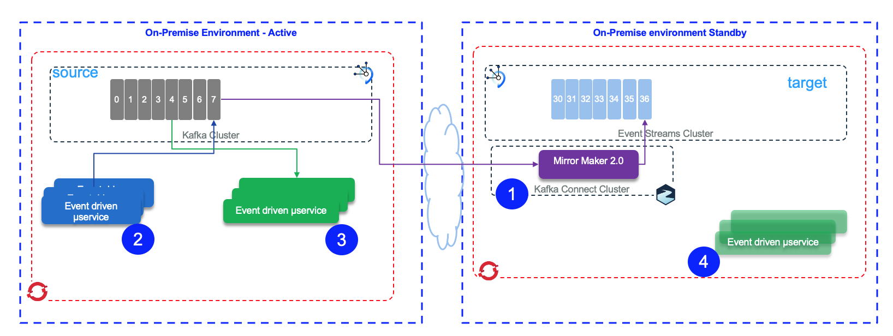
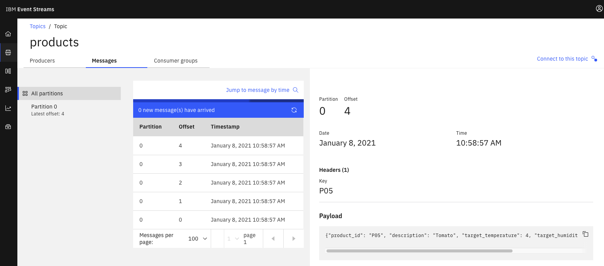
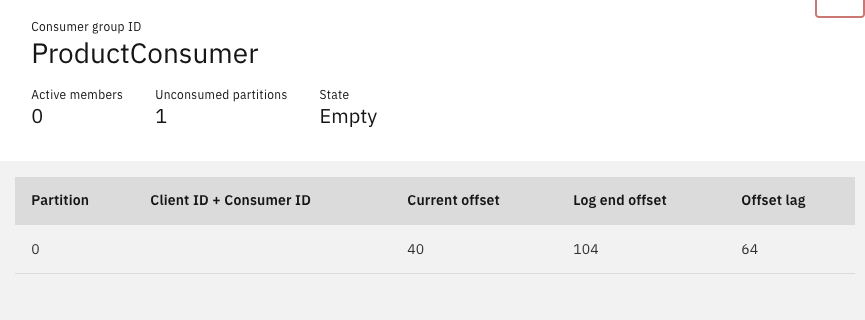

<AnchorLinks>
  <AnchorLink>Overview</AnchorLink>
  <AnchorLink>Pre-requisites</AnchorLink>
  <AnchorLink>Start Mirror Maker 2</AnchorLink>
  <AnchorLink>Start Producer to source cluster</AnchorLink>
  <AnchorLink>Consuming records on source</AnchorLink>
  <AnchorLink>Failover to target</AnchorLink>
</AnchorLinks>

Updated 01/08/2021

## Overview

This lab presents how to leverage Mirror Maker 2 between two on-premise Kafka clusters running on OpenShift, one having no consumer and producer connected to it: it is in passive mode. The cluster is still getting replicated data. The lab goes up to the failover and reconnect consumers to the newly promoted active cluster.

 

 1. Mirror Maker 2 runs on OpenShift as pod in the same namespace as Event Streams on the target cluster
 1. A producer in python to send records to `products` topic, will run locally or could be deployed on OpenShift as a **job**
 1. A consumer, also in python is consuming n records, in auto commit, so there will be a consumer lag before the failover.
 4. For the failover, we will stop the producer. We could stop event streams, but the most important is that there is no more records coming from the source cluster to the target cluster via mirroring. The goal not is to connect the consumer to the target cluster and then continue from where the consumer on the source cluster has stopped. If those consumer was writing to a database then the DB in the passive environment will receive the new records. If the database is in a 3nd environment like a managed service in the cloud with HA, then new records will be added to the original one. If the database server was also doing replication between active and passive environments then it may be possible to get a gap in the data, depending of the DB replication settings. 

In the figure above, the offset numbering does not have to match with source. This is where mirror maker 2 is keeping offset metadata on its own topics. The commit offsets for each consumer groups is also saved, so consumers restarting on the target cluster will continue for the matching offset corresponding to the last read committed offset.

## Pre-requisites

* We assume, you have access to two Kafka Clusters deployed on OpenShift. We use two Event Streams instances on the same OpensShift cluster for this lab.  
* Login to the OpenShift cluster using the console and get the API token

 ```shell
 oc login --token=L0.... --server=https://api.eda-solutions.gse-ocp.net:6443
 ```

* If not done from lab 1, clone the github to get access to the Mirror Maker 2 manifests we are using:

 ```shell
 git clone https://github.com/ibm-cloud-architecture/refarch-eda-tools
 ```
* Create the `products` topic on the source cluster.
* Under the labs/MirrorMaker2/active-passive folder, rename the `.env-tmpl` file to `.env`. 
* Get the source and target bootstrap server external URLs for the producer and consumer code using `oc get routes | grep bootstrap`. We will use to demonstrate the offset management and consumer reconnection then modify the addresses in the `.env` file
 
 ```properties
 ES_SRC_BROKERS=light-es-kafka-bootstrap-eventstreams.gse-eda-2020-10-3-0143c5dd31acd8e030a1d6e0ab1380e3-0000.us-east.containers.appdomain.cloud:443
 ES_TGT_BROKERS=gse-eda-dev-kafka-bootstrap-eventstreams.gse-eda-2020-10-3-0143c5dd31acd8e030a1d6e0ab1380e3-0000.us-east.containers.appdomain.cloud:443
 ```
* Get SCRAM users for both cluster and set their names in the `.env` file

 ```properties
 ES_SRC_USER=starter
 ES_TGT_USER=user2
 ```
* Get pem certificates from both clusters using each admin console web apps, or the CLI:

  ```shell
  cloudctl es init
  # select one of the cluster, then...
  cloudctl es certificates --format pem
  # rename the es-cert.pem to 
  mv es-cert.pem es-src-cert.pem
  # Get for the second cluster
  cloudctl es init
  cloudctl es certificates --format pem
  mv es-cert.pem es-tgt-cert.pem
  ```

* Verify the Event Streams on OpenShift service end point URLs. Those URLs will be used to configure Mirror Maker 2. 

 ```shell
 # Use the bootstrap internal URL
 oc get svc | grep bootstrap
 # Get both internal URLs
 light-es-kafka-bootstrap.evenstreams.svc:9092
 gse-eda-dev-kafka-bootstrap.evenstreams.svc:9092
 ```

## Start Mirror Maker 2

In this lab, Mirror Maker 2 will run on the same cluster as Event Streams within the same namespace (e.g. eventstreams). 

* Define source and target cluster properties in a Mirror Maker 2 `es-to-es.yml` descriptor file. We strongly recommend to study the schema definition of this [custom resource from this page](https://github.com/strimzi/strimzi-kafka-operator/blob/2d35bfcd99295bef8ee98de9d8b3c86cb33e5842/install/cluster-operator/048-Crd-kafkamirrormaker2.yaml#L648-L663). 

  Here are some important parameters you need to consider: The namespace needs to match the event streams project, and the annotations the product version and ID. The connectCluster needs to match the alias of the target cluster. The alias `es-tgt` represents the kafka cluster Mirror Maker 2 needs to connect to:

  ```yaml
  apiVersion: eventstreams.ibm.com/v1alpha1
  kind: KafkaMirrorMaker2
  metadata:
    name: mm2
    namespace: eventstreams
  spec:
    template:
      pod:
        metadata:
          annotations:
            eventstreams.production.type: CloudPakForIntegrationNonProduction
            productCloudpakRatio: "2:1"
            productChargedContainers: mm2-mirrormaker2
            productVersion: 10.1.0
            productID: 2a79e49111f44ec3acd89608e56138f5
            cloudpakName: IBM Cloud Pak for Integration
            cloudpakId: c8b82d189e7545f0892db9ef2731b90d
            productName: IBM Event Streams for Non Production
            cloudpakVersion: 2020.3.1
            productMetric: VIRTUAL_PROCESSOR_CORE
    version: 2.6.0
    replicas: 1
    connectCluster: "es-tgt"
  ```

  The version matches the Kafka version we use. The number of replicas can be set to 1 to start with or use the default of 3. The `eventstreams.production.type` is needed for Event Streams.

  Then the yaml defines the connection configuration for each clusters:

  ```yaml
  clusters:
    - alias: "es-src"
      bootstrapServers: 
      config:
        config.storage.replication.factor: 3
        offset.storage.replication.factor: 3
        status.storage.replication.factor: 3
      tls: {}
  ```

  For Event Streams on premise running within OpenShift, the connection uses TLS, certificates and SCRAM credentials. As we run in a separate namespace the URL is the 'external' one.

  ```yaml
  - alias: "es-src"
      bootstrapServers: light-es-kafka-bootstrap.integration.svc:9093
      config:
        ssl.endpoint.identification.algorithm: https
      tls: 
        trustedCertificates:
          - secretName: light-es-cluster-ca-cert
            certificate: ca.crt
      authentication:
        type: tls
        certificateAndKey:
          certificate: user.crt
          key: user.key
          secretName: es-tls-user
            
  ```

 Finally the `connectCluster` attribute defines the cluster alias used by MirrorMaker2 to define its hidden topics, it must match the target cluster of the replication in the list at `spec.clusters`.
    
 
 ```shell
 # under active-passive folder
 oc apply -f es-to-es.yml
 ```

* Verify the characteristics of the Mirror Maker 2 instance using the CLI

 ```shell
 oc describe kafkamirrormaker2 mm2
 ```
* See the logs:

  ```shell
  oc get pods | grep mm2
  oc logs mm2-mirrormaker2-...
  ```


## Start Producer to source cluster

As seen in lab 1, we will use the same python script to create products records. This time the script is producing product records to the `products` topic. 
 
 Now send 100 records:
 
 ```shell
 ./sendProductRecords.sh --random 100
 ```

The trace looks like:

 ```
 --- This is the configuration for the producer: ---
[KafkaProducer] - {'bootstrap.servers': 'light-es-kafka-bootstrap-eventstreams.gse-eda-2020-10-3-0143c5dd31acd8e030a1d6e0ab1380e3-0000.us-east.containers.appdomain.cloud:443', 'group.id': 'ProductsProducer', 'delivery.timeout.ms': 15000, 'request.timeout.ms': 15000, 'security.protocol': 'SASL_SSL', 'sasl.mechanisms': 'SCRAM-SHA-512', 'sasl.username': 'starter', 'sasl.password': 'd8zsUzhK9qUZ', 'ssl.ca.location': '/home/active-passive/es-cert.pem'}
---------------------------------------------------
{'product_id': 'T1', 'description': 'Product 1', 'target_temperature': 6.321923853806639, 'target_humidity_level': 0.4, 'content_type': 1}
{'product_id': 'T2', 'description': 'Product 2', 'target_temperature': 4.991504310455889, 'target_humidity_level': 0.4, 'content_type': 1}
{'product_id': 'T3', 'description': 'Product 3', 'target_temperature': 4.491634291119919, 'target_humidity_level': 0.4, 'content_type': 1}
{'product_id': 'T4', 'description': 'Product 4', 'target_temperature': 2.4855241432802613, 'target_humidity_level': 0.4, 'content_type': 1}
{'product_id': 'T5', 'description': 'Product 5', 'target_temperature': 4.286428275499635, 'target_humidity_level': 0.4, 'content_type': 1}
{'product_id': 'T6', 'description': 'Product 6', 'target_temperature': 1.6025770613167736, 'target_humidity_level': 0.4, 'content_type': 1}
 ```

 * Going to the Event Streams Console we can see the produced messages in the `products` topic.



## Start the Consumer to source cluster

To simulate the offset mapping between source and target, we will use a python consumer and read only n records.

```shell
 ./receiveProductSrc.sh 20
 ```

The trace may look like:

 ```
 --------- Start Consuming products --------------
[KafkaConsumer] - This is the configuration for the consumer:
[KafkaConsumer] - -------------------------------------------
[KafkaConsumer] - Bootstrap Server:      light-es-kafka-bootstrap-eventstreams.gse-eda-2020-10-3-0143c5dd31acd8e030a1d6e0ab1380e3-0000.us-east.containers.appdomain.cloud:443
[KafkaConsumer] - Topic:                 products
[KafkaConsumer] - Topic timeout:         10
[KafkaConsumer] - Security Protocol:     SASL_SSL
[KafkaConsumer] - SASL Mechanism:        SCRAM-SHA-512
[KafkaConsumer] - SASL Username:         starter
[KafkaConsumer] - SASL Password:         d*****Z
[KafkaConsumer] - SSL CA Location:       /home/active-passive/es-cert.pem
[KafkaConsumer] - Offset Reset:          earliest
[KafkaConsumer] - Autocommit:            True
[KafkaConsumer] - -------------------------------------------
[KafkaConsumer] - Next Message consumed from products partition: [0] at offset: 0
	key: P01
	value: {"product_id": "P01", "description": "Carrots", "target_temperature": 4, "target_humidity_level": 0.4, "content_type": 1}
[KafkaConsumer] - Next Message consumed from products partition: [0] at offset: 1
	key: P02
	value: {"product_id": "P02", "description": "Banana", "target_temperature": 6, "target_humidity_level": 0.6, "content_type": 2}
[KafkaConsumer] - Next Message consumed from products partition: [0] at offset: 2
	key: P03
	value: {"product_id": "P03", "description": "Salad", "target_temperature": 4, "target_humidity_level": 0.4, "content_type": 1}
[KafkaConsumer] - Next Message consumed from products partition: [0] at offset: 3
	key: P04
	value: {"product_id": "P04", "description": "Avocado", "target_temperature": 6, "target_humidity_level": 0.4, "content_type": 1}
[KafkaConsumer] - Next Message consumed from products partition: [0] at offset: 4
	key: P05
	value: {"product_id": "P05", "description": "Tomato", "target_temperature": 4, "target_humidity_level": 0.4, "content_type": 2}
[KafkaConsumer] - Next Message consumed from products partition: [0] at offset: 5
	key: T1
	value: {"product_id": "T1", "description": "Product 1", "target_temperature": 6.321923853806639, "target_humidity_level": 0.4, "content_type": 1}
[KafkaConsumer] - Next Message consumed from products partition: [0] at offset: 6

 ```

The python code is [ProductConsumer.py](https://github.com/ibm-cloud-architecture/refarch-eda-tools/blob/master/labs/mirror-maker2/consumer/ProductConsumer.py).

If we go to Event Streams consumer group monitoring user interface we can see the consumer only got 20 messages and so there is an offset lag, as illustrated in figure below:

 

## Failover to target

At this stage, the producer code is not running anymore, Mirror Maker 2 has replicated the data to the target topic named: `es-src.products`, the consumer has not read all the messages from source cluster. This simulate a crash on source cluster. So let now connect the consumer to the target cluster and continue to process the records. For that the consumer needs to get the offset mapping using the [RemoteClusterUtils class](https://downloads.apache.org/kafka/2.5.0/javadoc/org/apache/kafka/connect/mirror/RemoteClusterUtils.html) to translate the consumer group offset from the source cluster to the corresponding offset for the target cluster. 
