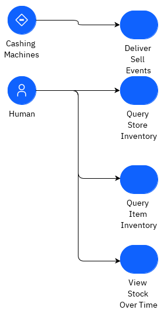
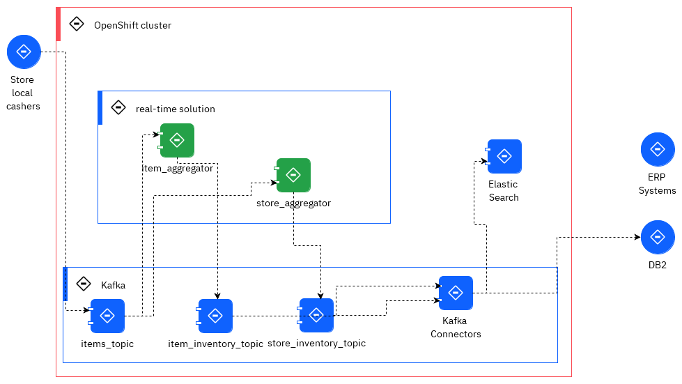
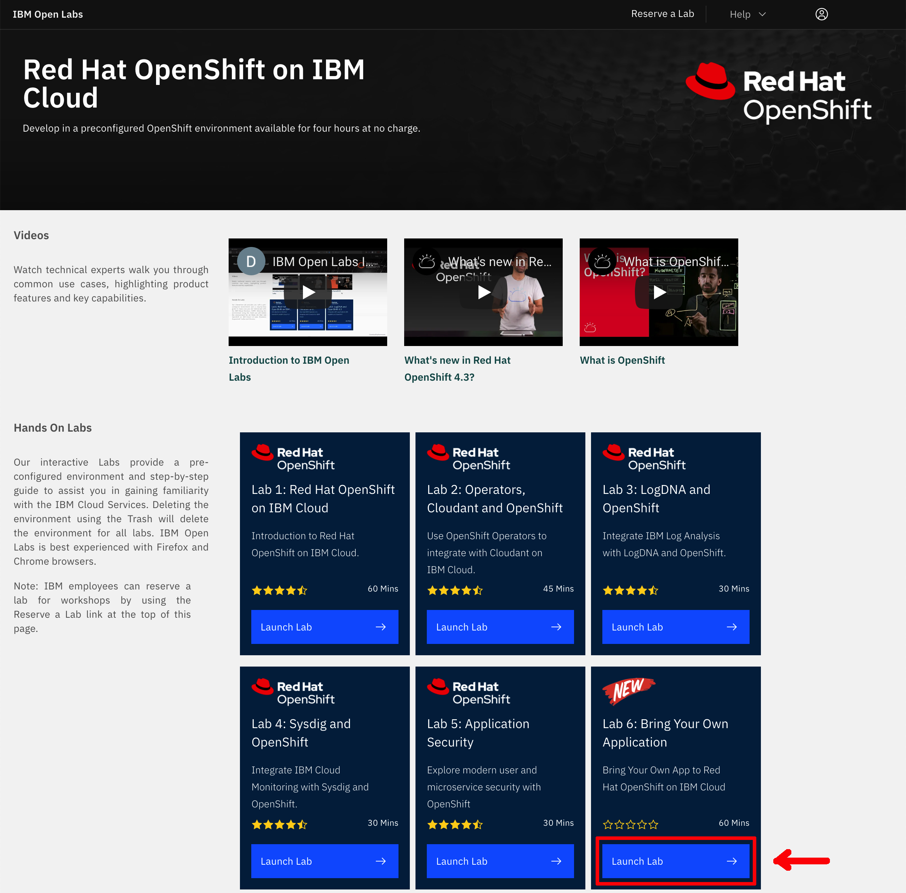
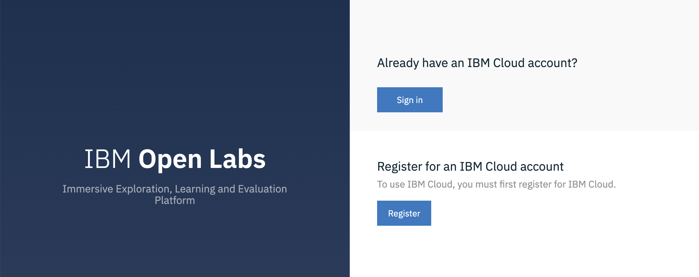
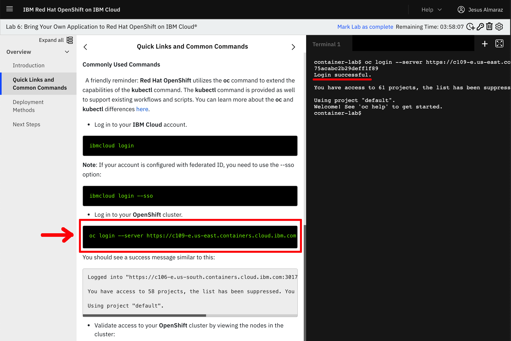
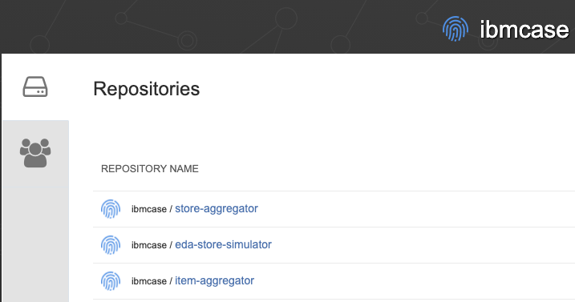

#  Kafka Streams Test Lab 3


Using Kafka Streams to compute real time inventory stock


## Overview

In this lab, we're going to use [Quarkus](https://quarkus.io) to develop the near real-time inventory logic using Kafka Streams APIs and microprofile reactive messaging.

The requirements to address are:

- consume item sold events from the `items` topic. Item has SKU as unique key. Item event has store ID reference
- the Kafka record in the `items` topic, uses the Store unique ID as key
- compute for each item its current stock cross stores
- compute the store's stock for each item
- generate inventory event for store - item - stock
- expose APIs to get stock for a store or for an item

  

The solution is using Kafka Streams and it includes two services. The components used are:

  

The goal of this lab, is to develop the green components which expose APIs to support Kafka Streams interactive query on top of the aggregates to keep
the inventory views and saved in state store (light blue storage/per service deployed and persisted in Kafka as topic).

We will be unit testing the stream logic using [Apache Kafka Streams](https://kafka.apache.org/documentation/streams/) TopologyTestDriver class. 

This solution is deployed to OpenShift cluster with Strimzi running in the same cluster and namespace.

This application needs the [Item Store sell simulator](https://github.com/ibm-cloud-architecture/refarch-eda-store-simulator) to perform the end to end 
testing and to demonstrate the end to end scenario.

## Pre-requisites

* Access to an **OpenShift Container Platform** v4.6.x
* **Kafka**: The lab can use Event Streams on Cloud or Kafka Strimzi deployed on OpenShift.
* **Code Source**: from the git repositories: 
  
    * [https://github.com/ibm-cloud-architecture/refarch-eda-item-inventory](https://github.com/ibm-cloud-architecture/refarch-eda-item-inventory) to compute item inventory cross store
    * [https://github.com/ibm-cloud-architecture/refarch-eda-store-inventory](https://github.com/ibm-cloud-architecture/refarch-eda-store-inventory) to compute store inventory.
    * [https://github.com/ibm-cloud-architecture/eda-lab-inventory](https://github.com/ibm-cloud-architecture/eda-lab-inventory) to get access to deployment configuration to deploy on OpenShift.

  ```sh 
  git clone https://github.com/ibm-cloud-architecture/refarch-eda-item-inventory
  git clone https://github.com/ibm-cloud-architecture/refarch-eda-store-inventory
  git clone https://github.com/ibm-cloud-architecture/eda-rt-inventory-gitops
  ```

* OC CLI
* As in previous labs, be connected to your Openshift cluster.

We have automated the deployment of all the pieces making up this use case. 

### IBM OpenLabs

In this section, we are going to see use the [IBM OpenLabs](https://developer.ibm.com/openlabs/openshift) hosted environment.

1. Go to [IBM OpenLabs](https://developer.ibm.com/openlabs/openshift) in a browser and click on `Launch Lab` button for **Bring Your Own Application**.

    

1. Sign in with your IBM Cloud account or register for an IBM Cloud account.
  
    

1. You will be presented with a dialog asking you whether you have an **Opportunity Id** or not. If you don't have it or don't no, just select **No** and click on **Launch Lab**.

1. You should now see your IBM OpenLabs environment.

    

1. On the left hand side navigation menu, click on the **Quick Links and Common Commands** section. 
Now, if you scroll down on the instructions shown on your screen, you should reach the **Commonly Used Commands** section of these and in there you should see an `oc login ...` command to get your terminal associated to this IBM OpenLabs logged into the OpenShift cluster that you will be working with for this quickstart tutorial. 
Click on the `oc login...` command and you should see a `Login successful` message on the terminal.

    


## One Click Deploy to OpenShift

The different components are deployed in the same namespace as the Kafka cluster, and use internal route to access Kafka bootstrap URL.

The images for each of the components used are in the [quay.io ibmcase](https://quay.io/organization/ibmcase) repository:



The Gitops repository includes a makefile to deploy to different environment types. You can use the following command to deploy Event Streams, MQ broker and the apps in the same namespace:

```sh
make deploy_rt_inventory
```


## Testing the solution

We have moved the demonstration script to the [gitop repository](https://ibm-cloud-architecture.github.io/eda-rt-inventory-gitops/demo-script/).


## Understanding the Kafka Streams implementation

The item and store aggregator code are based on the same code structure, reflecting the DDD onion architecture:

```
└── ibm
    └── gse
        └── eda
            └── inventory
                ├── app
                │   └── ItemAggregatorApplication.java
                ├── domain
                │   ├── ItemInventory.java
                │   ├── ItemProcessingAgent.java
                │   └── ItemTransaction.java
                └── infra
                    ├── ItemTransactionDeserializer.java
                    ├── ItemTransactionStream.java
                    └── api
                        ├── InventoryResource.java
                        ├── ItemCountQueries.java
                        └── dto
                            ├── ItemCountQueryResult.java
                            └── PipelineMetadata.java
```

The interesting class that supports the business logic is in [ItemProcessingAgent.java](https://github.com/ibm-cloud-architecture/refarch-eda-item-inventory/blob/master/src/main/java/ibm/gse/eda/inventory/domain/ItemProcessingAgent.java). 

Basically the logic to compute the different stocks are in the `processItemTransaction` method, which builds a Kafla Stream topology

For the stock of items cross store computation the code looks like:

```java
@Produces
public Topology processItemTransaction(){
    KStream<String,ItemTransaction> items = inItemsAsStream.getItemStreams();     
    // process items and aggregate at the store level 
    KTable<String,ItemInventory> itemItemInventory = items
        // use store name as key, which is what the item event is also using
        .map((k,transaction) -> {
            ItemInventory newRecord = new ItemInventory();
            newRecord.updateStockQuantityFromTransaction(transaction.sku, transaction);
            return  new KeyValue<String,ItemInventory>(newRecord.itemID,newRecord);
        })
        .groupByKey( Grouped.with(Serdes.String(),ItemInventory.itemInventorySerde)).
        aggregate( () -> new ItemInventory(),
            (itemID,newValue,currentValue) -> currentValue.updateStockQuantity(itemID,newValue.currentStock),
            materializeAsStoreInventoryKafkaStore());
    produceStoreInventoryToOutputStream(itemItemInventory);
    return inItemsAsStream.run();
}
```

while for the store the code is also in [ItemProcessingAgent](https://github.com/ibm-cloud-architecture/refarch-eda-store-inventory/blob/main/src/main/java/ibm/gse/eda/stores/domain/ItemProcessingAgent.java)

```java
public Topology processItemTransaction(){
    KStream<String,ItemTransaction> items = inItemsAsStream.getItemStreams();     
    // process items and aggregate at the store level 
    KTable<String,StoreInventory> storeItemInventory = items
        // use store name as key, which is what the item event is also using
        .groupByKey(ItemStream.buildGroupDefinitionType())
        // update the current stock for this <store,item> pair
        // change the value type
        .aggregate(
            () ->  new StoreInventory(), // initializer when there was no store in the table
            (store , newItem, existingStoreInventory) 
                -> existingStoreInventory.updateStockQuantity(store,newItem), 
                materializeAsStoreInventoryKafkaStore());       
    produceStoreInventoryToInventoryOutputStream(storeItemInventory);
    return inItemsAsStream.run();

```

Each project includes a set of unit tests to validate the logic.

## Integration tests

For running the integration test, we propose to copy the e2e folder from the solution repository and follow the [readme instructions section end-to-end-testing ](https://github.com/ibm-cloud-architecture/refarch-eda-item-inventory#end-to-end-testing).


## Interactive queries

!!! warning
    With Kafka 3.x release this section needs to be revisited as API changed.

We already addressed the interactive queries concept in [the kafka stream technology summary article](/technology/kafka-streams/#interactive-queries). 
Each of the store and item aggregator implements those queries via two classes:

* [ItemCountQueries](https://github.com/ibm-cloud-architecture/refarch-eda-item-inventory/blob/master/src/main/java/ibm/gse/eda/inventory/infra/api/ItemCountQueries.java)
* [StoreInventoryQueries](https://github.com/ibm-cloud-architecture/refarch-eda-store-inventory/blob/main/src/main/java/ibm/gse/eda/stores/infra/api/StoreInventoryQueries.java)

The principles are the same:

* Get the metadata about each "kafka store" supporting the stateful KTables which are keeping the aggregate per item or per store.
* Get the value of the aggregate for the given key, locally or remotely.


