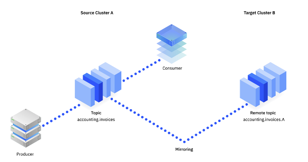
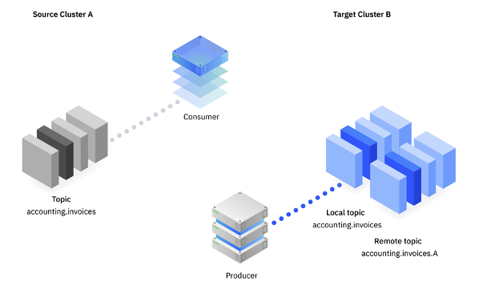
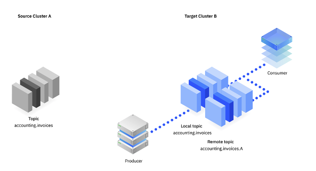

This note tries to regroup considerations and practices on how to migrate from one Kafka deployment to another: this is not version to version migration but product to product, or from on-premise VM base or bare metal to cloud, for example.

## Things to consider before migrating

The important dimensions that impact migration:

* The number of Kafka cluster to migrate: Production clusters can have different semantic like federation with other clusters or completely independent cluster. Which one to migrate first?. The following table can be populated:

| Cluster name | Location | Kafka Version | Bootstrap URL | # AZ | Type (Bare metal, VM, AWS, k8s...) |
| --- | --- | --- | --- |
| Dal04-eda-1 | Dallas-03  | 2.6  |  |  3 |  VM |
|  |  |  |
     
  * Build a list of clusters, with number of brokers, zookeepers, product version and expected cores, memory and storage characteristics.
  * Here is a table to fill for each cluster described above

**Cluster name: Dal04-eda-1**

| # Brokers | # Zookeepers |  # Cores/serv | Memory | Disk | Storage Type | Schema registry | Mirroring |
| --- | --- | --- | --- | --- | --- | --- | --- |
|   5 |  3  |  16  |   64G  |  300G   | block - NFS | Apicurio | MM2 |
|     |     |     |     |     |     |  |   |

* Assess the consequence to stop the cluster, the maintenance window (rebuild time) or full availabilty needs
* Current physical resource consumption on exiting clusters, and linked to the type of deployment: bare metal, VM based, or k8s based. Moving from Bare metal, with performance optimized cluster to a shared deploy on OpenShift will impact the sizing of the target
* New server availability to deploy the new product, or cloud instances to host the new version.
    * If the target deployment is Kubernetes based, like OpenShift, the k8s cluster needs to have new mostly dedicated worker nodes to support the new Kafka brokers. Expect 60% of the worker node allocated to Kafka Broker. So is it possible to extend the k8s cluster easily
* The type of persistence storage used for append log and if the storage is based on network filesystem so can we reuse them between clusters
* We assume no disturbance and co-existence of the existing cluster for a time period. So this means we need to list the producers for each cluster, and if they are designed to easily change broker bootstrap end points.
   * Assess how those producers support rolling out

Here a table that can be used to gather

| Producer ref | Type (native, REST proxy, Kafka connector| Avg Throughput msg/s | Message size | Message Format | # of instances |
| --- | --- | --- | --- | --- | --- | 
| order app | quarkus app - native API |  60 msg/s | 300k  | Avro | 3  |
|  MQ to Kafka   | KConnector |   30 msg/s  |  15k    |  none   |  1   |

* Topic metadata like: Retention time, and message size:

| Topic Ref | # Partition | Replica | Retention | Type (compact/log) | Replicated to Other Cluster |
| --- | --- | --- | --- | --- | --- |
| order | 3 | 3 / 2 in sync | 20 days | log | replicated via mirror maker 2 |
|  |  |  |   |   |  | 

* For schema registry, should it be possible to coexiste or should it needs to be migrated too?
  * How easy will it be possible to swap schema registry URL and credential for each producer and consumer?
* Number of users / service accounts
* Authentication security mechanism used per cluster
* RBAC policies in place
* How TLS certificates are managed now, how they are shareable between server? 
* Number of stream / stateful operator doing consumer - process - produce? How long will this processor take to process a single message? Can they be stopped and recovered? What percentage of inbound throughput will be outputted back into Apache Kafka? For each processing the following information can be gathered

| App name | Techno Type | Processing Type | Processing Time | Passthrough % |
| --- | --- | --- | --- | ---| --- |
|     | Kstreams | Stateful with Ktable | 120ms | 100% |
|     | Ksql |  |  | 
|     | Flynk |  |  |

* Consumer information, type and processing time

| App name | Techno Type | Processing Type | Processing Time |
| --- | --- | --- | --- |
|  |   |   | 

## Migration strategies

### Deploy - mirror - rollout

* Deploy new cluster with new product
* Redefine target users and security setting
* Start mirroring data to new cluster

  

* Stop consumer on source cluster, and move them to consumer from mirrored topics
* Stop producers from source, and connect to new cluster, on the new topics (not the mirrored ones)

  

* Drain data from mirrored topic via the consumers
* Connect consumers to original topic but on the new cluster.

  